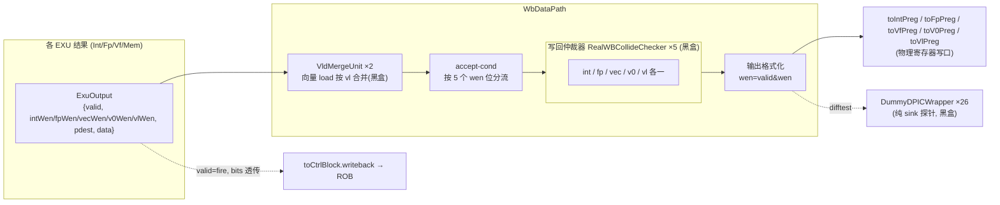

# WbDataPath —— 写回数据通路

> 可读核 `rtl/backend/WbDataPath.sv`(`xs_WbDataPath_core`) + 类型包
> `rtl/backend/wbdatapath_pkg.sv` + golden 同名 wrapper `WbDataPath_wrapper.sv`(由
> `scripts/gen_wbdatapath.py` 生成) + difftest 探针黑盒 stub `WbDataPath_dpic_stub.sv`。
> 设计源 `src/main/scala/xiangshan/backend/datapath/WbArbiter.scala`(class WbDataPath)。

## 1. 它在后端的位置

WbDataPath 是"执行 → 写回"的总枢纽。所有执行单元(EXU)算出的结果(ExuOutput)汇到这里,
按各结果要写的物理寄存器域分流, 经各域的写回仲裁器抢占有限的写回端口, 胜出者写回物理
寄存器堆(toXxxPreg), 同时所有完成的写回汇报给控制块 ROB(toCtrlBlock.writeback)按序提交。



## 2. 五个写回域与 accept-cond(写使能分流)

一条指令的结果可能要写多个物理寄存器域(如向量指令同写 vec+vl)。EXU 结果带 5 个写使能位,
WbDataPath 按位把结果"扇出"到对应域的仲裁器输入(对应 Scala `acceptCond` /
`intArbiterInputsWire` 等, 包 `wb_dom_e` 枚举 WB_INT/FP/VEC/V0/VL):

```
<dom>Write = exu.valid & exu.bits.<dom>Wen     // dom ∈ {int,fp,vec,v0,vl}
```

这一步在 golden 里被 firtool **内联进各仲裁器实例的 io_in_N_valid 引脚**(机械接线), 故它落在
结构性 wrapper 中; 可读核以 `wbdatapath_pkg::accept()` 纯函数表达这一判定的语义。

## 3. fire / ready 语义

写回端口是稀缺资源, EXU 能否"发出"结果取决于它能否抢到端口:

- **不定延迟 EXU**(`hasUncertainLatency`): `ready = (命中域仲裁器 ready & 该域 Write) | … | notWrite`。
  抢不到则 `ready=0`, 结果在 EXU 口停留重试(数据不丢)。本配置有 4 个这类 EXU
  (FpExu_0_1 / FpExu_1_1 / IntExu_3_1 / VfExu_2_0), 对应 golden 的 `fromExu_9/11/7/17_ready`。
- **确定延迟 EXU**: `ready` 恒 1。若此时抢不到端口, 结果**永久丢失** —— 故 golden 在
  SYNTHESIS 下带 `assert(arbiterInput.ready)`。可读重写无需断言(关 SYNTHESIS 比对)。

`toCtrlBlock.writeback[i].valid = exu.fire`: 不定延迟路 = `ready & valid`, 确定延迟路 = `valid`。
bits 为对应 EXU 的 robIdx/pdest/debugInfo 等直传。

## 4. VfExe 写 Int 的打拍特例

对应 Scala `if (writeIntRf && isVfExeUnit) { intWrite := RegNext(...); bits := RegEnable(...) }`:
向量执行单元若要写**整数**寄存器, 其结果晚一拍才进入 int 仲裁器(跨域写回的时序对齐)。
本配置唯一一例是 VfExu_0_1(golden 的 `intArbiterInputsWire_14` / `intWrite_REG`)。可读核用
`always_ff` 实现这对 RegNext/RegEnable, 输出 `vfe2int_reg_{write,intWen,pdest,data}` 接到 int
仲裁器的 `io_in_11`。

## 5. 输出格式化(可读核主体)

各域仲裁器胜出出口 → 物理寄存器写口。先把 `{valid,wen,pdest,data}` 聚合成
`wb_payload_t`(对应 Scala WriteBackBundle), 再统一:

```
preg.wen  = preg_wen(payload.valid, payload.wen)   // = valid & wen (出口 ready 恒 1, fire=valid)
preg.addr = payload.pdest[本域宽-1:0]               // int/fp 8b, vec 7b, v0 5b
preg.data = payload.data[本域宽-1:0]                // 标量 64b, 向量 128b
preg.<wen> = payload.wen                            // intWen/fpWen/vecWen/v0Wen/vlWen
```

五个域结构同构, 可读核用 `genvar` 分别展开本域出口数(N_INT_OUT=8 / FP=6 / VEC=6 / V0=6 /
VL=4)。**VL 域只有 wen/vlWen**: vl 寄存器极小, golden 不导出 pdest/data, 故 vlPreg 的
addr/data 端口在 golden 中悬空 —— 可读 wrapper 同样不接(保持高阻, UT 以 `!$isunknown` 跳过)。

## 6. 可读核 vs wrapper 的分工

WbDataPath 顶层是 1110 端口的巨型互联网, 内部例化 33 个黑盒子模块:

| 黑盒 | 数量 | 作用 |
|------|------|------|
| VldMergeUnit | 2 | 向量 load 结果按 vl 合并(本身有 ByteMaskTailGen 等叶子) |
| RealWBCollideChecker(_1.._4) | 5 | 五个域各一个写回仲裁器(内含 RealWBArbiter 优先级选择) |
| DummyDPICWrapper(_24/32/38/44) | 26 | difftest 探针, **纯 sink**(只有输入, 不驱动任何输出端口) |

- **可读核** `xs_WbDataPath_core` 只承载真正的微架构逻辑: accept-cond(函数化)、VfExe→Int
  打拍(always_ff)、输出格式化(struct+genvar)。
- **结构性 wrapper**(gen 脚本从 golden 变换生成): 声明内部网、逐字保留黑盒例化与 accept-cond
  内联接线 / toCtrlBlock 透传 / difftest 接线, 把仲裁出口接进核、核 preg 输出接到顶层 toPreg。
  生成时去掉 firtool 的 RANDOMIZE/SYNTHESIS 宏样板与 assert always 块(仅调试, 不影响输出)。
- **DummyDPICWrapper stub**: 因依赖 DPI-C difftest 运行时, UT/FM 中作黑盒, 给出端口对齐的空
  实现(`WbDataPath_dpic_stub.sv`)。它们对功能无影响。

## 7. 验证结果

| 项 | 结果 |
|----|------|
| 结构闸门(核+包) | `typedef struct packed` = 1(`wb_payload_t`, 核内用 6 次); `typedef enum` = 1(`wb_dom_e`, 核内引用 6 次); `function automatic` = 2(`accept`/`preg_wen`); `genvar`/`for` = 8; `always_ff` = 1; 生成痕迹 grep = 0 |
| 行数 | 核 163 + 包 57 + stub 54 行 vs golden 3002 行(其余为黑盒互联, 由 gen 脚本机械生成到 wrapper) |
| UT | golden vs `WbDataPath_xs` 双例化(共享真子模块 + DummyDPIC stub); 每拍随机驱动全部 EXU valid/wen/pdest/data + flush, 复位后逐拍比对全部 **509** 个输出; seed 1/7/42 各 **101,800,000** 输出级 checks, **errors=0**, **active_outputs=509/509**(证所有输出被真正激励, 非全 0/X 假阳) |
| FM | `make fm`: **FM_RESULT: Verification SUCCEEDED**(两侧共享真子模块使 ready 锥可判; DummyDPICWrapper 作黑盒) |

## 8. 关键坑

- **各域物理寄存器号位宽不同**: int/fp = 8b, vec = 7b, v0 = 仅 5b。统一 struct 用最宽(8b)
  承载, 各域按本域宽 `[PD_W-1:0]` 截取。若一刀切 8b, FM/编译会报 42b↔48b 端口宽度不匹配。
- **隐式 1-bit 网陷阱**: wrapper 里供仲裁器实例引脚使用的核输出网(vfe2int_reg_pdest 等)
  必须**在 body 之前声明**, 否则 VCS 在首次引用处推断成隐式 1-bit 网, 静默截断高位。
- **FM 子模块必须两侧共享为真逻辑**: 若仅 golden(ref)读 VldMergeUnit/仲裁器、impl 侧把它们
  自动黑盒(未知引脚方向, FM-230), 则 ready 锥不可判, 4 个不定延迟 EXU 的 ready + 对应
  toCtrlBlock valid 共 20 点判 FAIL。把这批真子模块同时给 impl 侧(WRAPPER_SRCS)即解决。
- **vlPreg addr/data 悬空非遗漏**: golden 不导出 vl 的 pdest/data, 这两端口本就悬空; 可读
  wrapper 不接, UT 用 `!$isunknown` 跳过。
- **DummyDPICWrapper 是纯 sink**: 不驱动任何输出, 故对功能等价无影响, 可安全黑盒/stub。
