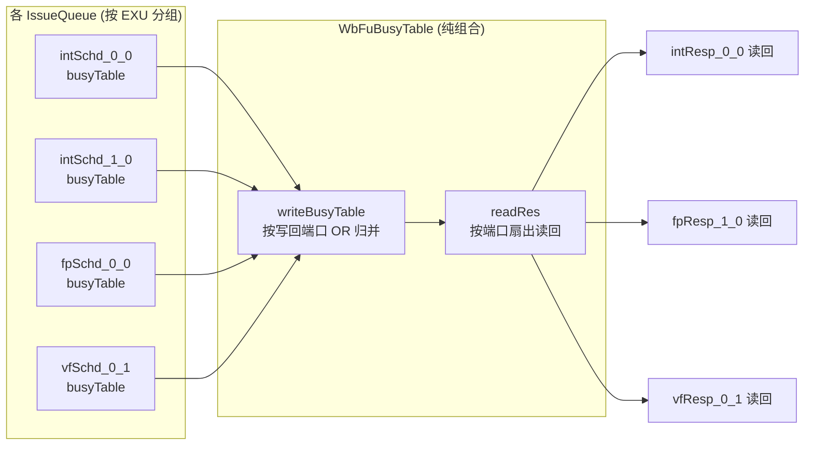

# WbFuBusyTable —— 写回 FU 忙表

> 可读核 `rtl/backend/WbFuBusyTable.sv`(`xs_WbFuBusyTable_core`) + 类型包
> `rtl/backend/wbfubusytable_pkg.sv` + golden 同名 wrapper `WbFuBusyTable_wrapper.sv`。
> 设计源 `src/main/scala/xiangshan/backend/datapath/WbFuBusyTable.scala`。

## 1. 它在后端解决什么问题

香山后端是乱序多发射, 但**物理寄存器写回端口数量远少于执行单元(EXU)数量**——写回口是
稀缺共享资源。两条指令若在同一拍都想往同一个写回口写结果, 就发生**写回冲突**。

冲突的根源在于不同 EXU 延迟不同: ALU 1 拍出结果, 乘法 2 拍, 除法多拍且不定。调度器
(IssueQueue)在**发射**一条"延迟不定"的指令前, 必须预知它将来某拍出结果时, 目标写回口
是否已被某条"延迟确定"的指令预定。否则不定延迟指令一旦完成就可能撞上别人的写回。

**WbFuBusyTable 就是这张"写回口未来占用预约表"的归并/分发中枢**:



## 2. busyTable 位的物理含义

每个写回端口的 busyTable 是一张**未来占用位图**(移位寄存器式, 在各 IssueQueue 内部产生
和移位; 本模块只读它的当前值):

- `busyTable[i] = 1` 表示"从现在起第 i 拍, 该写回端口将被一条延迟确定的指令占用"。
- 端口最大延迟越大, 位图越宽(本配置各端口宽 2~5 位, 即 `latencyValMax + 1`)。

调度器读到自己端口的 busyTable 后, 在为不定延迟指令选择发射拍时, 避开会导致结果落在
已置位拍的发射时机, 从而**从源头避免写回冲突**。

## 3. 两步纯组合逻辑

模块**无时钟、无复位、无状态**(golden 也无 clock/reset 端口), 只有两步组合:

### 3.1 writeBusyTable —— 按写回端口 OR 归并

```
busyTable[port] = OR_{src 命中 port} src.busyTable
```

"哪些源命中哪个端口"在 Chisel elaboration 期由各 EXU 的 `wbPortConfig`(IntWB/FpWB/VfWB/
V0WB/VlWB 里的 `port` 字段)静态决定, 展开后就是**固定接线**, 没有运行期判断。同一端口
若有多个源(它们之间靠调度保证不会同拍真冲突, 这里只是把各自的未来预约合并), 逐位 OR;
源位宽不同则短源**零扩展**到端口最大宽度再 OR。

本配置下各域端口与源映射(见核内 `int_p/fp_p/vf_p/v0_p/vl_port_0`):

| 域  | 端口 | 宽 | 源(OR) |
|-----|------|----|--------|
| INT | α | 3 | intSchd_0_0, fpSchd_0_0 |
| INT | β | 5 | intSchd_1_0, fpSchd_1_0, vfSchd_0_1 |
| INT | γ | 2 | fpSchd_2_0 (独占) |
| FP  | fp0 | 4 | intSchd_2_1, fpSchd_2_0 |
| FP  | fp1 | 4 | fpSchd_0_0, vfSchd_0_1 |
| FP  | fp2 | 4 | fpSchd_1_0, vfSchd_1_1 |
| VF  | vf0 | 5 | vfSchd_0_0, vfSchd_0_1 |
| VF  | vf1 | 3 | vfSchd_1_1 (独占) |
| VF  | vf2 | 5 | vfSchd_1_0 (独占) |
| V0  | v00 | 5 | vfSchd_0_0, vfSchd_0_1 |
| V0  | v01 | 3 | vfSchd_1_1 (独占) |
| V0  | v02 | 5 | vfSchd_1_0 (独占) |
| VL  | vl0 | 2 | vfSchd_0_1 (独占) |

> 注: VF 与 V0 两域端口拓扑**完全同构**(同样的源 IssueQueue、同样的端口划分), 核里用同一
> `vec_ports_t` 结构 + 一个 `genvar` 循环统一构造两域的端口 0(两源 OR), 体现这种对称性。

### 3.2 readRes —— 按端口扇出读回

```
reader.out = busyTable[reader 的 port], 截/扩到 reader 宽度
```

每个挂在某端口上的 IssueQueue 读回该端口的总占用表, 按自己的读取位宽截断(读短)或零扩展
(读长)。核里统一用 `wbfubusytable_pkg::busy_read(src, width)` 表达这一 `asTypeOf` 语义。

## 4. 为什么没有 conflict / deqRespSet 一路

Scala 源里还有 `writeConflict`/`deqRespSet` 一路, 用 `OnesMoreThan(_, 2)` 检测某拍是否有
**两个以上**源同时写同一端口(真冲突标志), 经一级寄存器送回 DataPath。但它由 `OptionWrapper(
latCertain, ...)` 包裹: **当且仅当该端口所有源延迟确定时才生成**。当前昆明湖配置下, 经
`latCertain` 过滤后所有 conflict / deqRespSet 端口均退化为 `None`, 故 golden 顶层**完全不含**
任何 `*Conflict` / `deqRespSet` 端口, 也没有寄存器。可读核与 golden 严格一致, 不实现该路。
(这也是 golden 没有 clock/reset 的原因。)

## 5. 验证结果

| 项 | 结果 |
|----|------|
| 结构闸门 | `typedef struct packed` = 3; `function automatic` = 1(pkg `busy_read`, 核内调用 28 次); `genvar`/`for` = 4; `typedef enum` = 0(纯组合无离散状态, 端口拓扑以 struct 表达); 生成痕迹 grep = 0 |
| 行数 | 核 195 + 包 38 行 vs golden 198 行(其中 ~110 行为 firtool 随机化宏样板, 实际逻辑 ~60 行); 核按"写回端口"重构, 非转写 |
| UT | golden vs `WbFuBusyTable_xs` 双例化, 每拍随机驱动 21 路源忙表、组合稳定后比对全部 26 路输出; seed 1/7/42 各 5,200,000 checks, **errors=0** |
| FM | `make fm`: **FM_RESULT: Verification SUCCEEDED**(签名分析, 无 fm_map) |

无黑盒子模块(纯叶子)。

## 6. 关键坑

- **conflict 路缺失不是遗漏**: 必须先确认 golden 端口里没有 `*Conflict`/`deqRespSet`/clock/reset,
  才能判定本配置下该路被 `OptionWrapper` 优化掉。否则会误以为可读核漏实现。
- **端口宽度不规则**: 各端口忙表宽 2~5 位、各 reader 读取宽度也各异, 来自不同 EXU 的
  `latencyValMax`。零扩展/截断必须逐端口对齐(核里 `busy_read` + 显式拼接), 不能想当然等宽直传。
- **同端口高位单源**: 如 FP fp1/fp2、VF/V0 端口0 的**最高位**只有一个宽源贡献, 低位才是两源 OR
  (窄源够不到高位)。核里用 `{宽源高位, (宽源低段 | 窄源)}` 显式表达, 与 golden 逐位一致。
