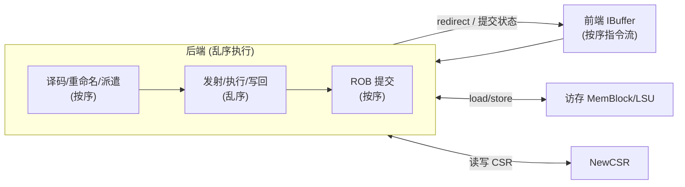
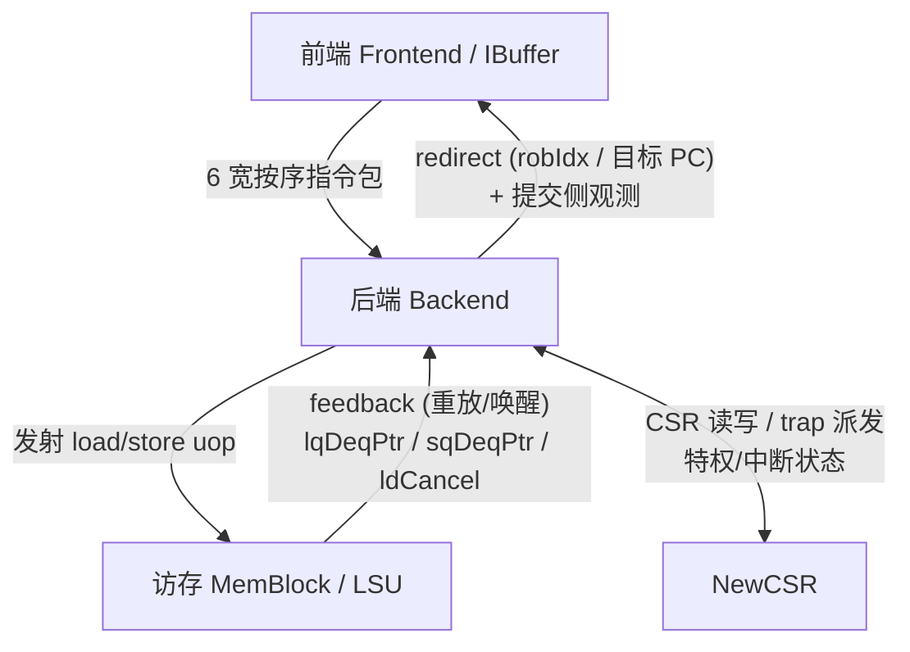

# 后端需求与设计目标

> 本文是后端架构背景系列的第一篇：讲**为什么要这样设计后端**——它在整核里的角色、
> 乱序执行必须解决的核心难题、量化目标，以及由目标推出的几个关键决策。
> 不重复逐模块的端口与实现细节（那些在 [`../<Module>.md`](../Rob.md) 里）；
> 读完本文再进各模块文档，会更有脉络。总览见 [`0-BACKEND_OVERVIEW.md`](0-BACKEND_OVERVIEW.md)。

---

## 1. 后端在整核里的角色

一颗乱序处理器可以粗分为前端、后端、访存三大块。**前端**负责取指、分支预测、
把取到的指令整理成指令包放进 IBuffer；**后端**从这里接过按序的指令流，做真正的
「乱序执行」；**访存（MemBlock/LSU）**替后端完成 load/store 的地址计算、数据搬运与
存储序维护。

后端的对外契约可以用一句话概括：

> **接前端 IBuffer 的按序指令流 → 内部乱序执行 → 对外按程序序精确提交。**

换言之，指令进出后端都是**按序**的，中间才允许乱序。这一「顺序进、顺序出、中间乱」
的结构是全部设计的出发点，也是后端能兼顾「高性能」与「体系结构可见状态永远精确」
的根本原因。后端内部的主流水依次为：

译码 Decode → 重命名 Rename → 派遣 Dispatch → 发射 Issue/Scheduler →
读寄存器/旁路 DataPath/Bypass → 执行 FU → 写回 Writeback → 提交 ROB。

---

## 2. 四类核心挑战

顺序程序一旦允许乱序执行，就要处理四类原本被程序序自动屏蔽掉的问题。

### 2.1 数据相关（WAR / WAW / RAW）
指令之间通过寄存器产生依赖，可分三种：

- **RAW（读后写，真相关）**：后一条要读前一条写的值。这是**真实**的数据流依赖，
  不能消除，只能靠「等操作数就绪再发射」+「结果尽早旁路」来缩短代价。
- **WAR（写后读）/ WAW（写后写，假相关）**：仅仅因为两条指令**复用了同一个逻辑
  寄存器号**而产生的伪依赖，本身没有数据流动。若不处理，它们会无谓地串行化本可并行
  的指令。消除假相关是放开乱序窗口的前提（见 §4 决策①）。

### 2.2 资源冲突（结构相关）
物理资源是有限的：读寄存器堆的读口、写回的写口、每个功能单元每拍能接的 uop 数、
发射队列的条目、ROB 的槽位。多条指令同时争用同一资源时必须仲裁，而仲裁又不能拖长
关键路径。资源冲突决定了后端各处的**宽度**与**仲裁策略**。

### 2.3 精确异常与中断
指令乱序、乱序写回后，异常/中断随时可能发生。体系结构规范要求：异常点之前的指令
全部完成、之后的指令一条都没生效——即「精确异常」（Smith & Pleszkun, ISCA 1985）。
后端必须让对外可见的状态（体系结构寄存器、CSR、内存序）**永远呈现按序执行的假象**，
哪怕内部早已跑到很后面。这是「顺序出」这一契约的直接来源（见 §4 决策④）。

### 2.4 推测执行与恢复
为了填满流水，后端会在分支/跳转结果尚未确定前**推测地**继续取指、重命名、发射。
一旦推测错误（分支误预测、访存违例、异常），已经进入流水的推测指令必须被干净地
撤销：ROB 里冲刷、重命名映射回滚、发射队列取消、前端重定向到正确路径。恢复要既
**彻底**（不留脏状态）又**快**（尽量少的气泡）。

---

## 3. 量化目标（默认核配置）

以下数值以本仓库 RTL 参数包为准（见 [`../../../rtl/backend/backend_pkg.sv`](../../../rtl/backend/backend_pkg.sv)、
`rename_pkg.sv`、`rob_pkg.sv`、`mefreelist_pkg.sv`、`stdfreelist_pkg.sv`）：

| 维度 | 目标值 | 出处 / 含义 |
|------|--------|-------------|
| 译码宽度 DecodeWidth | 6 | `decodestage_pkg.sv`：前端每拍最多送 6 条指令并行译码 |
| 重命名/派遣宽度 RenameWidth | 6 | `backend_pkg.sv` / `rename_pkg.sv`：每拍最多重命名并派遣 6 条 uop |
| 提交宽度 CommitWidth | 8 | `rob_pkg.sv`：每拍最多按序提交/回滚 8 条 |
| ROB 条目 RobSize | 160 | `rob_pkg.sv`：乱序窗口 = 8 bank × 20 entry/bank，robIdx.value 宽 8 位 |
| 整数物理寄存器 IntPhyRegs | 224 | `mefreelist_pkg.sv`：整数空闲池容量 = 224（32 逻辑寄存器 vs 224 物理） |
| 浮点物理寄存器 FpPhyRegs | 192 | `stdfreelist_pkg.sv`：空闲列表 = 192 − 34 逻辑 = 158 |
| 最大 uop 拆分 MaxUopSize | 65 | `rob_pkg.sv`：一条（向量）指令最多拆出 65 个 uop |

这几个数字共同刻画了后端追求的性能：**前端每拍喂进多达 6 条指令**，重命名把它们
铺进一个**160 条深的乱序窗口**里等待执行，靠**远多于逻辑寄存器的物理寄存器**（整数
224 vs 32）保证乱序窗口里能同时有大量在飞的写目标而不互相踩，多个功能单元并行执行，
最后**每拍最多退休 8 条**指令把窗口腾空。窗口越深、宽度越宽、物理寄存器越多，能挖出的
指令级并行就越多——但也越贵，这些值是性能与面积/时序折中的结果。

---

## 4. 由目标推出的五个关键决策

上面的挑战与目标，直接推导出后端的五个骨架决策。每个决策对应到后续原理篇与具体模块。

### ① 寄存器重命名，消除 WAR/WAW 假相关
给每条写寄存器的指令分配一个**全新的物理寄存器**，逻辑寄存器号只是「别名」。
不同指令写同名逻辑寄存器时拿到不同物理号，WAR/WAW 假相关随之消失，乱序窗口才敢放开。
这正是物理寄存器（224/192）远多于逻辑寄存器（32/34）的原因。
实现靠寄存器别名表 RAT + 空闲列表 FreeList，还需处理**同拍内 6 条指令之间的 RAW 旁路**
（后序指令要读前序刚算出、RAT 尚未更新的映射）与 **move elimination**（`mv` 复用源物理号）。
→ 详见 [`../Rename.md`](../Rename.md) / [`../RenameTable.md`](../RenameTable.md) /
[`../MEFreeList.md`](../MEFreeList.md) / [`../StdFreeList.md`](../StdFreeList.md)。

### ② 乱序发射 + 推测唤醒
指令进入**发射队列（IssueQueue）**后，不按程序序等待，而是**谁的操作数先就绪谁先走**。
唤醒-选择机制在每拍监听写回/在飞结果，把等待某物理寄存器的条目唤醒，再由年龄/优先级
仲裁选出本拍发射的 uop。为了不让「等结果真正写回」拖慢背靠背执行，还做**推测唤醒**：
在结果尚未落地前就提前唤醒消费者，同时保留「唤醒落空则取消（cancel）」的退路。
→ 详见 [`../Scheduler.md`](../Scheduler.md) 及各 IssueQueue 文档。

### ③ 物理寄存器堆 + 旁路网络
乱序执行的操作数来自**物理寄存器堆（PRF）**。PRF 是同步读（地址打一拍、数据延迟一拍），
读口有限需要仲裁，故 DataPath 把「发射→执行」拆成 s0（申请读口）/ s1（读回并选源）
两个流水级。但很多操作数此刻还没写回 PRF、只在某个 FU 的输出线上——**旁路网络
（BypassNetwork）**把这些「在飞结果」直接转发给正在读操作数的消费者，避免白等一圈写回。
→ 详见 [`../DataPath.md`](../DataPath.md) / [`../RegFile.md`](../RegFile.md) /
[`../BypassNetwork.md`](../BypassNetwork.md) / [`../RegCache.md`](../RegCache.md)。

### ④ ROB 保精确异常与恢复
**重排序缓冲 ROB（160 项）** 是「顺序出」的执行者：指令按序入队、乱序写回时在对应
条目标记完成，只有**队头指令完全写回**后才允许退休（commit）。异常/flushPipe 也随指令
在 ROB 里排队，到队头才触发精确重定向；提交时按序把旧物理寄存器交还 FreeList、更新
体系结构 RAT。推测错误时以 ROB 为基准冲刷、回滚映射。ROB 因此是精确异常与推测恢复的
共同支点。
→ 详见 [`../Rob.md`](../Rob.md) / [`../RenameBuffer.md`](../RenameBuffer.md) /
[`../CtrlBlock.md`](../CtrlBlock.md)。

### ⑤ int / fp / vf / mem 多调度域
不同类型的指令操作数、功能单元、写回时序差异很大，若共用一套发射/寄存器/写回通路，
仲裁与扇出会成为时序噩梦。后端因此按数据类型分成**四个调度域**，各有独立的 Scheduler、
物理寄存器堆分片与写回通路：

| 域 | Scheduler | 承担 |
|----|-----------|------|
| int（整数） | [`../Scheduler.md`](../Scheduler.md) | ALU/乘除/位操作/分支跳转/CSR/Fence |
| fp（浮点） | [`../Scheduler_Fp.md`](../Scheduler_Fp.md) | FAlu/FMA/FDivSqrt/FCVT |
| vf（向量） | [`../Scheduler_Vf.md`](../Scheduler_Vf.md) | 向量算术/定点/规约/除法等 |
| mem（访存） | [`../Scheduler_Mem.md`](../Scheduler_Mem.md) | load/store 地址与数据、向量访存（含段） |

分域后每域可独立设置发射队列数量、唤醒网络与写回宽度（Int 域内即含 4 个 IssueQueue，
Mem 域含 9 个），把复杂度局部化。
→ 各域组成详见对应 Scheduler 文档。

---

## 5. 与相邻子系统的边界

后端不是孤岛，它与三个方向有清晰契约：

- **前端（Frontend / IBuffer）**：前端每拍送最多 6 条按序指令进后端译码；
  后端反过来向前端发**重定向 redirect**（分支/跳转执行结果、ROB 提交处的异常/中断），
  携带 robIdx 与正确目标，令前端冲刷错误路径并从正确 PC 重新取指。这是推测恢复的对外出口。
  边界细节见 [`../CtrlBlock.md`](../CtrlBlock.md) 与前端子系统文档
  （[`../../frontend/`](../../frontend/arch/0-FRONTEND_OVERVIEW.md) 下对应模块）。

- **访存（MemBlock / LSU）**：后端把 load/store 的地址（sta/vsta）与数据（std/vstd）uop
  从 mem 域发射给 LSU；LSU 回送**反馈（feedback）**——发射失败需重放、load 数据就绪唤醒、
  以及队列指针 `lqDeqPtr/sqDeqPtr` 与 `ldCancel`。这些反馈端口在 Scheduler_Mem 层只做
  透传，逻辑在访存侧。见 [`../Scheduler_Mem.md`](../Scheduler_Mem.md) 与访存子系统文档
  （[`../../memblock/`](../../memblock/) 下对应模块）。

- **CSR（NewCSR）**：CSR 类指令在 int 域发射、进 CSR 功能单元执行；NewCSR 同时是特权管理、
  中断/异常派发（含 AIA-IMSIC）的中枢，与 ROB 的 trap 提交、与访存的特权检查都有边界。
  见 [`../NewCSR.md`](../NewCSR.md)。

---

## 6. 接下来读什么

本文只立了「为什么」的框架。各条决策的**原理展开**在后续架构篇里（按序号阅读）：

- 总览与全景互联：[`0-BACKEND_OVERVIEW.md`](0-BACKEND_OVERVIEW.md)
- 重命名原理（决策①）、发射调度与唤醒（决策②）、寄存器/旁路（决策③）、
  ROB 与精确恢复（决策④）、多调度域组织（决策⑤）：见 arch 目录下同系列后续各篇。

需要落到端口/时序/踩坑的实现细节时，再从上文各链接进入对应模块文档
（[`../<Module>.md`](../Backend.md)）与 RTL（[`../../../rtl/backend/`](../../../rtl/backend/)）。
