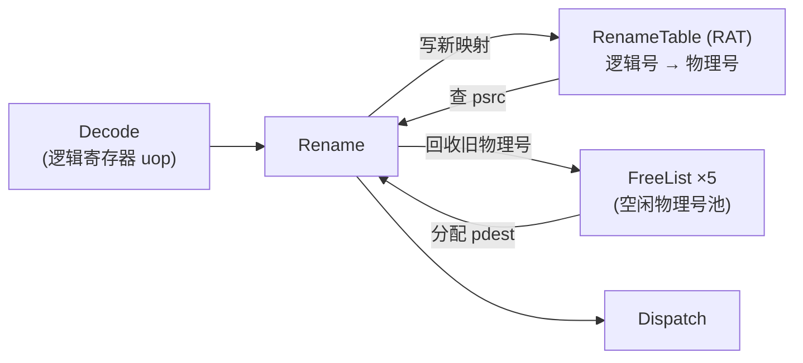
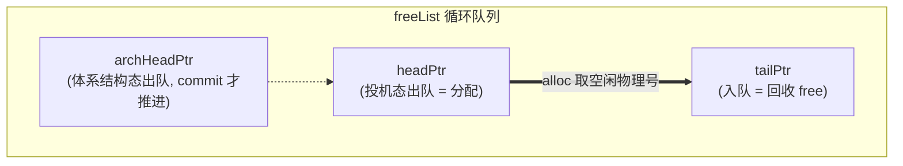
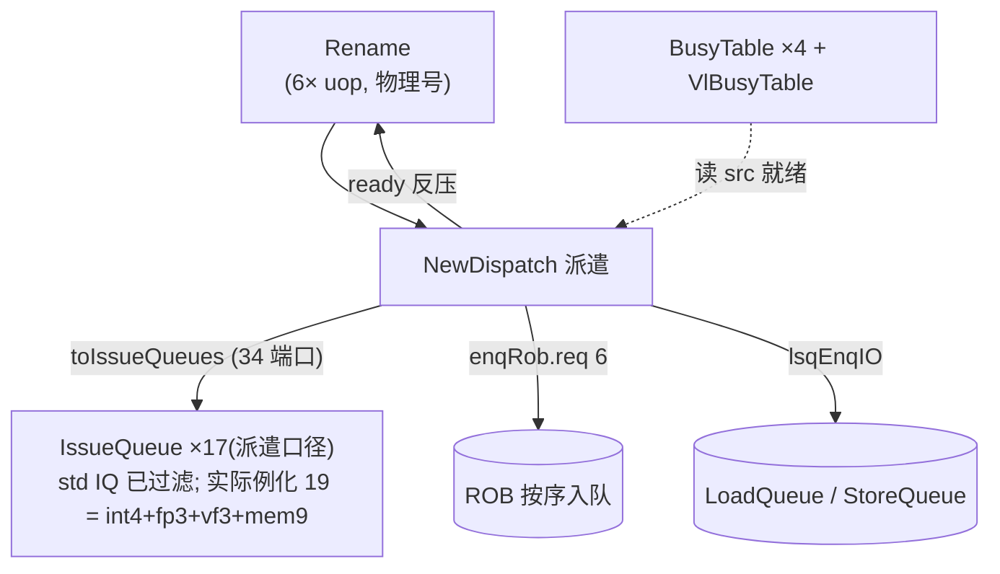

# 重命名与派遣原理（背景篇）

> 本文是**背景/原理层**文档：讲香山 V2R2（昆明湖）乱序后端里「重命名 Rename」与「派遣
> Dispatch」这一段**为什么这么设计、原理是什么、几个模块如何协同**，帮你在读逐模块设计
> 文档之前先建立整体认知。逐模块端口/实现细节请直接看对应模块文档，本文不重复。
> 上游背景见 [`0-BACKEND_OVERVIEW.md`](0-BACKEND_OVERVIEW.md)。

---

## 1. 这一段在流水里的位置与使命

```
Decode → 【Rename 重命名】 → 【Dispatch 派遣】 → Issue → RegRead/Bypass → Exec → Writeback → ROB(commit)
```

译码给出的是「按程序序、用**逻辑寄存器号**表达」的 uop。要让它们乱序执行，必须跨过两道坎：

1. **假相关**：程序里反复复用同一个逻辑寄存器（x1、x2……），会制造出并非真数据依赖的
   WAW（写后写）/ WAR（读后写）冲突。若不处理，乱序引擎会误以为两条无关指令有依赖。
2. **按序 ↔ 数据流的过渡**：发射队列/ROB 按「数据就绪」和「容量」运作，而入口是按程序序
   逐拍进来的 6 条 uop，需要有一站把它们**分发**到正确的发射队列并**按序**登记进 ROB/LSQ。

Rename 解决第一坎，Dispatch 解决第二坎。这两站也是「投机执行」的关键账本所在——一旦分支
预测错误，必须把它们改动过的状态**精确回滚**到出错点，这就是本文后半的重点。

---

## 2. 为什么要重命名：消除假相关，放开乱序

真相关（RAW，读后写）是程序语义，必须遵守；但 WAW / WAR 只是「逻辑寄存器名字被复用」造成
的**假相关**。消除办法很直接：物理寄存器远多于逻辑寄存器，**每条写寄存器的指令都拿一个全新
的物理寄存器**，于是不同指令写同名逻辑寄存器时落到不同物理号，名字冲突消失，乱序得以放开。

本工程的规模（以整数域为例）：**逻辑整数寄存器 32 个，物理整数寄存器池 224 项，物理号 8 bit**；
每拍最多重命名 **6 条**指令（RenameWidth=6）。浮点域物理寄存器池 158 项（192 物理 − 34 逻辑）。

重命名对每条 uop 做两件事：

- **源寄存器翻译（psrc）**：查「寄存器别名表 RAT」拿逻辑号当前映射到的物理号；
- **目的寄存器翻译（pdest）**：向「空闲列表 FreeList」要一个全新物理号，并把新映射写回 RAT。



模块：[`Rename`](../Rename.md)（重命名流水核）、[`RenameTable`](../RenameTable.md)（RAT）、
[`MEFreeList`](../MEFreeList.md) / [`StdFreeList`](../StdFreeList.md)（空闲列表）。

---

## 3. RAT：投机态与体系结构态两张表

香山按寄存器类型实例化 5 张 RAT（int / fp / vec / v0 / vl）。**关键原理不在「表」本身，而在
它同时维护两份映射**——见 [`RenameTable`](../RenameTable.md)：

- **spec_table（投机态）**：重命名当拍就写入的映射，代表「假设投机路径正确」的最新状态。
  发射前读寄存器映射靠它。分支预测错误时它可能是错的，需要被回退。
- **arch_table（体系结构态）**：只有指令**真正提交**时才更新，代表「已确定不会回退」的映射。
  它是回滚时的可信基准。

为什么要两张表？因为重命名是**投机地**往前跑的：它在分支结果还没确定时就已经改了 spec_table。
一旦猜错，spec_table 里就掺进了错误路径的映射，必须整表拉回到某个可信点——要么是 arch_table，
要么是更近的一个**快照（见 §6）**。arch_table 保证「最坏也能退回上一条已提交指令之后」。

RAT 还负责在提交时算出每个逻辑寄存器**被覆盖前的旧物理号（old_pdest）**，并判断这个旧物理号
是否「在 arch_table 中已无任何引用」（need_free）——为真才把它回收给 FreeList。这道引用判断
是回收正确性的关键：物理号可能被多个逻辑号共享（见 move elimination），不能提前回收。

---

## 4. FreeList：物理寄存器的分配与回收

5 类物理寄存器各有一条独立的空闲列表。原理上都是一个**循环队列**（见
[`StdFreeList`](../StdFreeList.md) / [`MEFreeList`](../MEFreeList.md)），用几个指针管理：



- **headPtr**：投机态分配指针，重命名每拍按实际分配个数前移；
- **archHeadPtr**：体系结构态分配指针，仅在提交拍前移，是 head 回滚的基准；
- **tailPtr**：回收入队指针，把提交时确认可回收的旧物理号压回池。

空闲寄存器数 = `distance(tailPtr, headPtr)`。只有空闲数 ≥ RenameWidth（=6）才允许分配
（`canAllocate`，且打一拍），这保证「本拍回收的物理号至少下一拍才会被分配」，让回收路径能安全
打拍、不与分配读出冲突。注意池容量 224/158 **不是 2 的幂**，指针加减要手动检测回绕并翻转 flag。

**为什么整数用 MEFreeList、其余用 StdFreeList？** 两者继承同一套分配/回退逻辑，唯一语义增量是
**move elimination**（见 §5）：MEFreeList 的体系结构 head 只在「提交、写整数、且**非** move」时
推进，因为被消除的 move 没有占用新物理号。

---

## 5. Move elimination：让 `mv` 不占物理寄存器

`mv rd, rs`（形式上是 `addi rd, rs, 0` 之类）只是把一个值搬个名字，没有真正的运算。重命名可以
直接**让 rd 复用 rs 的物理号**，不向 FreeList 要新寄存器：

```
pdest = isMove ? psrc0 : freelist_alloc
```

好处：省一个物理寄存器、省一次实际数据搬运，缩短依赖链。代价：一个物理号被多个逻辑号共享，
所以**回收必须靠 RAT 的引用判断**（§3 的 need_free），不能一提交就回收；且被消除的 move 在
FreeList 里**不推进体系结构 head**（§4）。带异常的指令不参与消除（`isMove &= ~有异常`）。

move elimination 处在重命名的关键路径上：pdest 依赖 psrc0，而 psrc0 又可能来自同拍前序指令
刚算出的 pdest（下面的同拍旁路），层层相扣。实现细节见 [`Rename`](../Rename.md) §3。

> **同拍 RAW 旁路**：RAT 这拍读出的是「上拍提交后」的映射，但同拍进来的 6 条指令里，前序
> 指令可能也刚写了同一逻辑寄存器、RAT 还没更新。所以重命名级必须把前序 pdest 直接转发给后序
> 的 psrc，否则后序会读到旧映射。这是把「按程序序的 6 条 uop」正确串起来的必要一环。

---

## 6. 投机与快照：出错时如何精确回滚

投机执行意味着重命名可能沿错误路径改了 spec_table 和 FreeList 的 headPtr。要恢复正确状态，有
两条互补机制，二者都由 **RAB（RenameBuffer）** 驱动。

### 6.1 快照（snapshot）：把整表状态存档

在容易出错的点（分支、跳转）上，对**整张 spec_table** 和 FreeList 的 headPtr 打一份快照
（本工程 4 个快照槽）。分支预测错误、且该错误点之前存过快照时，直接把 spec_table / headPtr
**整表恢复到那份快照**，比从头 walk 快得多。快照存储由公共子模块 SnapshotGenerator 承担。

### 6.2 RAB + walk：解耦重命名与提交，并回滚状态

**为什么需要 RAB？** 重命名是乱序流水的入口、提交是 ROB 的出口，二者吞吐与时机不同；而「旧
物理号只能等指令真正提交后才回收、映射也才能落 arch_table」。RAB 是夹在中间的一个
**256 项环形 FIFO**（见 [`RenameBuffer`](../RenameBuffer.md)），把「入队映射」与「出队回收」解耦：


RAB 是一个三态机（`S_IDLE` / `S_WALK` / `S_SPECIAL_WALK`）：

- **S_IDLE**：正常。一边入队，一边按 ROB 给的 `commitSize` 把队头若干项提交——即把这批
  `(ldest, pdest)` 送 RAT 的 arch 写口，落体系结构态并触发旧物理号回收。
- **S_WALK**：分支错且**有快照**时。spec_table / headPtr 先整表跳回快照（§6.1），RAB 再从快照点
  逐拍把投机映射**回放**写回 spec_table（`isWalk=1`），直到 walk 指针追上入队指针。
- **S_SPECIAL_WALK**：分支错但**无可用快照**的过渡态。此时本拍既提交又 walk：把「刚算出的待
  提交数」整体转成 walk 数逐条走完（同时回收 + 回放），处理完转入普通 S_WALK。

一句话：**快照负责「一步跳回」，walk 负责「逐条重放补齐」**，两者配合把投机态精确恢复到出错点。

---

## 7. 派遣（NewDispatch）：从按序到数据流的分发站

重命名完成后，uop 已是纯物理号表达，但还停在「按程序序」。派遣级
[`NewDispatch`](../NewDispatch.md) 把每拍最多 6 条 uop **分发到能执行它的发射队列**，同时完成
ROB / LSQ 的按序入队与各类容量反压。三大职责：



1. **就绪查询**：每个源操作数按 `srcType` 落到 int/fp/vec/v0/vl 五类之一，去对应
   BusyTable 查「该物理寄存器是否已写回」。立即数恒就绪。向量指令的 old_vd 在被 mask 掉时可视为
   就绪（ignoreOldVd），并把该源类型改写为「不必等」告知发射队列。
2. **路由 + 负载均衡**：单一功能的 uop 直接选唯一发射队列；对「多个同质 EXU（如 4×ALU、3×ldu）」
   的功能，按各候选发射队列**当前表项数排序**，让同拍多条同类 uop 轮流落到最空的队列，均摊负载。
3. **容量检查 / 反压**：一条 uop 真正能派遣，需同时满足——目标发射队列这拍不超容量、LSQ 流数
   够（向量访存流数用保守上界：标量=1、unit-stride=2、其他向量=16）、ROB 可接收、且满足按序
   入队约束（waitForward / blockBackward）。任一不满足即从该条起反压回重命名。

派遣把 uop 送入四条调度域——int / fp / vf（向量浮点）/ mem——分别对应各自的
Scheduler / IssueQueue（见总览 [`0-BACKEND_OVERVIEW.md`](0-BACKEND_OVERVIEW.md)）；同时把每条
写寄存器的 uop 按序登记进 ROB，为后续「按序提交、精确异常/回滚」建立账本。

---

## 8. 一句话串起来

重命名用「更多的物理寄存器」抹掉逻辑寄存器名字复用造成的假相关（RAT 记映射、FreeList 供物理号、
move elimination 省寄存器），从而放开乱序；派遣把结果按数据流分发到各发射队列并按序登记 ROB/LSQ；
而投机带来的「可能猜错」由快照（一步跳回）+ RAB/walk（逐条重放）把 RAT 与 FreeList 精确回滚到出
错点。读完本文，再去看
[`Rename`](../Rename.md)、[`RenameTable`](../RenameTable.md)、[`RenameBuffer`](../RenameBuffer.md)、
[`MEFreeList`](../MEFreeList.md)、[`StdFreeList`](../StdFreeList.md)、[`NewDispatch`](../NewDispatch.md)
的实现细节会更顺。
