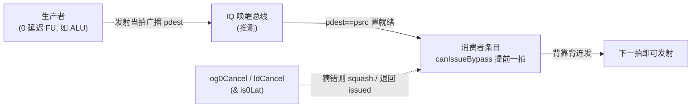
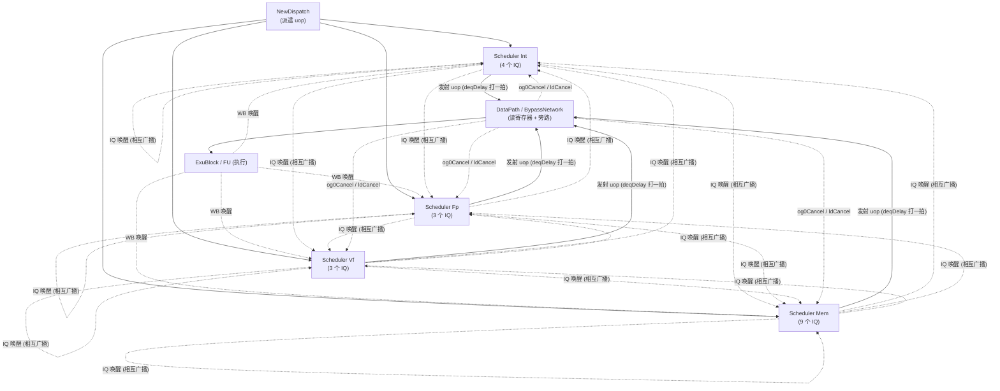
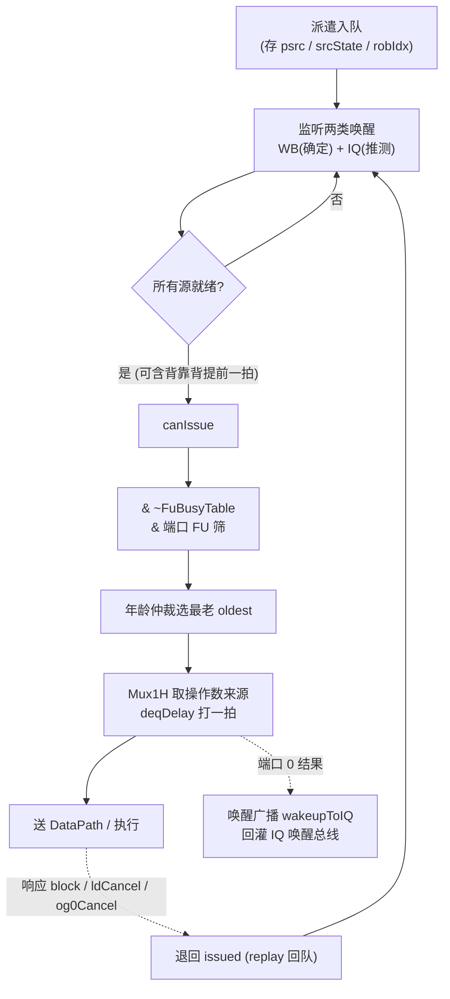

# 发射与唤醒原理

> 本文是香山 V2R2(昆明湖)乱序后端「发射(Issue)/调度(Scheduler)」子系统的**背景层**文档:讲清楚为什么要有发射队列、唤醒为什么分两类、推测唤醒/背靠背为什么必须配一套取消机制、年龄仲裁与 replay 的作用,以及四个 Scheduler 如何用不同的 IssueQueue 变体拼出整台机器。逐模块的端口/实现细节见各模块文档,本文只建立认知、点到结构为止。
>
> 上游脉络见 [`0-BACKEND_OVERVIEW.md`](0-BACKEND_OVERVIEW.md)。发射队列吃派遣送来的 uop、把发射结果交给读寄存器/旁路阶段。

## 1. 为什么需要发射队列

乱序执行的核心难题是:一条 uop 被派遣(dispatch)进来时,它的源操作数**通常还没准备好**——生产它们的指令可能还在流水里没写回。如果按序等每条指令的操作数,就退化成顺序机;要乱序,就必须把「还不能执行的 uop」先缓冲起来,谁先就绪谁先走。

**发射队列(IssueQueue,IQ)就是这个缓冲区 + 就绪判断器 + 挑选器**:

- **缓冲**:把已重命名、但源未就绪的 uop 存进条目阵列(entry array),每个条目记录 uop 的物理源寄存器号 `psrc`、每个源的就绪状态 `srcState`、以及 robIdx 等元信息。
- **就绪即发**:持续监听「唤醒总线」,一旦某条目的所有源都就绪、且未发射、未阻塞,就自报 `canIssue`。
- **乱序**:队列里任意一个 `canIssue` 的条目都可能被选中发射,不受入队顺序约束——这正是乱序的来源。

发射队列坐在**派遣(NewDispatch)与执行(ExuBlock/FU)之间**。它是整台乱序机的「调度心脏」:决定每一拍哪些 uop 离开等待、进入执行。样板机理在 [`../IssueQueueAluCsrFenceDiv.md`](../IssueQueueAluCsrFenceDiv.md) 详述,本文只讲原理。

## 2. 两类唤醒:WB 唤醒 vs IQ 唤醒

「唤醒(wakeup)」= 把某条目里 `psrc == 某个刚产生结果的物理寄存器号 pdest` 的源,标记为就绪。问题是:**什么时候广播这个 pdest?** 越晚广播越安全(结果确实产生了),越早广播吞吐越高(依赖者能更早发射)。昆明湖用两条唤醒总线并存:

| 类型 | 广播时机 | 来源 | 是否可能猜错 |
|------|----------|------|-------------|
| **WB 唤醒**(写回唤醒) | 结果已经写回、板上钉钉 | 写回数据通路 [`../WbDataPath.md`](../WbDataPath.md) | 否,带 `valid` 位,确定有效 |
| **IQ 唤醒**(队内唤醒) | 生产者刚**发射**、结果还在流水里(尚未写回) | 各 IQ 发射端口互相广播(`wakeupToIQ` → `wakeupFromIQ`) | **是**,是一种推测 |

两类唤醒在单条目里的匹配逻辑本质相同:`pdest == psrc && srcType 为整数寄存器 && rfWen`。差别在于 WB 唤醒带 `valid`(总线上有则确实有效),IQ 唤醒不带独立 valid(总线常驻,有效性隐含在 `rfWen` 里)。

为什么要冒险搞 IQ 唤醒?因为如果只等 WB 唤醒,消费者要等生产者「发射→读寄存器→执行→写回」整条流水走完才能开始就绪判断,依赖链一长就把 IPC 拖垮。IQ 唤醒让消费者在生产者**刚发射**时就提前进入就绪,把依赖延迟压到最短——这就引出下一节的背靠背。

## 3. 推测唤醒 / 背靠背,与配套的取消

### 3.1 背靠背为何存在

对 **0 延迟功能单元**(典型是 ALU:发射后下一拍就出结果)而言,理想情况是:第 N 拍发射生产者、第 N+1 拍就能发射消费者,两条依赖指令「背靠背」连发,吞吐等同无依赖。要做到这一点,唤醒不能等结果真出来,必须在生产者**发射的当拍/提前一拍**就把依赖它的源置就绪。

复杂条目(comp)因此有一条 `canIssueBypass` 路径:用**尚未去取消**的唤醒信号提前一拍宣告「我可发射」,组合口即时前递给年龄仲裁,省掉一拍。这就是「推测唤醒」——赌生产者的结果一定会如期出现。

### 3.2 猜错时必须能撤销

推测总有猜错的时候。两种典型猜错:

1. **Load 推测唤醒失败**:一条 load 发射后被当作 0/固定延迟提前唤醒了它的消费者,但 load 实际可能 cache miss / 需要 replay,结果没能如期出现。此时依赖它的推测唤醒是错的。
2. **0 延迟旁路源落空**:被 IQ 唤醒的 0 延迟源,其对应生产者在更晚的流水级被判无效。

一旦唤醒猜错,已经据此「就绪」甚至「发射」的消费者必须被拉回来(squash / 退回 issued),否则会读到错误/未产生的操作数。昆明湖用**三个取消信号**收拾残局:

| 取消信号 | 撤销什么 | 谁产生 |
|----------|----------|--------|
| **`og0Cancel`** | operand-generate 第 0 级发现的取消:某 0 延迟旁路源的唤醒作废 | DataPath 读寄存器/旁路阶段 [`../DataPath.md`](../DataPath.md) |
| **`ldCancel`** | load 推测唤醒失败:按 load 依赖移位寄存器,撤销依赖该 load 的源就绪 | 访存反馈 |
| **`is0Lat`** | 标记「本唤醒源是 0 延迟」——只有 0 延迟源的唤醒才需要被 `og0Cancel` 门控 | 唤醒源属性 |

在单条目里,取消是这样起作用的(以样板 IQ 为例,与 RTL 一致):

- IQ 唤醒源 `i` 是否被 og0 取消 = `og0Cancel[对应 EXU 号] & wk_iq[i].is0lat`。本样板变体中只有源 0/1 带 `is0Lat`、源 0..3 才可能被 og0 取消(命中位由拓扑固定为 `{0,2,4,6}`)。
- **去取消后的有效唤醒**:`wakeupByIQ = (匹配到任一 IQ 唤醒源) & ~og0取消 & ~loadTransCancel`。
- 已经据错误唤醒置位的 `issued`,在响应 block 或源被 load 取消时被**退回**,允许重发(见 §5 replay)。

**记忆点**:推测唤醒/背靠背是「提前」的吞吐优化,取消(og0Cancel/ldCancel/is0Lat)是「猜错时兜底」的安全网,两者必须成对存在。复杂条目用未取消的唤醒抢一拍、简单条目用已取消的唤醒稳妥输出——正是这对权衡的物理体现。

## 4. 年龄矩阵与 oldest 选择

一拍里可能有多个条目同时 `canIssue`,而每个发射端口每拍只能发一条。选谁?昆明湖的原则是 **oldest-first(最老优先)**:队里最早进来的就绪 uop 先走,兼顾公平与避免饿死,也让发射顺序尽量贴近程序序,减少下游冲突。

「谁更老」用**年龄矩阵/年龄检测器(AgeDetector)**表达:矩阵记录任意两个条目的先后关系,从当前可发射集合里选出没有「比它更老且也可发射」的那一个,得到最老 one-hot。为缩短关键路径,样板 IQ 把年龄检测**分三段**跑(enq / simp / comp 各一颗),各段先各选本段最老,再按**优先级 comp > simp > enq** 合成最终发射 one-hot。选出后用 one-hot 对条目阵列做 `Mux1H`,取出该 uop 的操作数来源/立即数/依赖等字段。

条目分三段(入队条目 enq、简单条目 simp、复杂条目 comp)还牵出一条**转移策略**:simp 条目被选中后把内容搬到空 comp 条目,腾出稀缺的 simp 区给新入队 uop。细节见样板文档,这里只需知道「分段是为了时序,oldest 是为了正确调度」。

## 5. replay:发射后条件不满足就回队

发射不等于成功。一条 uop 被选中、送出后,下游可能反馈「这拍收不了」——例如 FU 忙、写回口冲突、或它依赖的推测唤醒此刻才被判失败。这类情况需要 **replay(回队重发)**:不能把 uop 丢掉,得让它退回等待状态、下一个合适的拍再发。

实现上,条目有 `issued`(已发射)标志和一路**发射响应 `deqResp`(block/success)**:

- 被选中发射时置 `issued`,不再参与后续选择;
- 若收到响应 **block**,或本条目的源被 load 取消(`srcLoadCancel`),就把 `issued` **退回**,条目重新变回「可参与发射」;
- 这样一条发射后条件不满足的 uop 自动回到队列,等下次机会,而不占用一个「假装在飞」的名额。

replay 是推测执行体系的必要闭环:推测让你敢提前发,replay + 取消让你在赌错时安全回退。

## 6. 四个 Scheduler 例化了哪些 IssueQueue

Backend 例化 **4 个 Scheduler**,分别管整数(Int)/浮点(Fp)/向量(Vf)/访存(Mem)。**Scheduler 本身几乎不含算法**——它是互联(glue)模块,真正的调度逻辑全在被它例化的 IssueQueue 里。Scheduler 负责:把 Dispatch/WB/别的 Scheduler 的唤醒总线接到各 IQ、透传 dispatch-ready、做发射 perf 统计,以及唤醒总线的 **pdest 多拷贝**(同一唤醒源给每个 IQ 一份独立 pdest 拷贝,纯为缩短唤醒目的寄存器号的扇出时序)。

不同域的运算延迟/源数/唤醒拓扑差异很大,所以每个 Scheduler 例化的是**不同的 IssueQueue 变体**:

| Scheduler | 文档 | 例化的 IssueQueue 变体(代表) |
|-----------|------|------------------------------|
| **Int** | [`../Scheduler.md`](../Scheduler.md) | `IssueQueueAluMulBkuBrhJmp` ×2、`IssueQueueAluBrhJmpI2fVsetriwiVsetriwvfI2v`、[`IssueQueueAluCsrFenceDiv`](../IssueQueueAluCsrFenceDiv.md)(样板) |
| **Fp** | [`../Scheduler_Fp.md`](../Scheduler_Fp.md) | `IssueQueueFaluFcvtF2vFmacFdiv`、`IssueQueueFaluFmacFdiv`、`IssueQueueFaluFmac` |
| **Vf** | [`../Scheduler_Vf.md`](../Scheduler_Vf.md) | `IssueQueueVfmaVialuFixVimacVppuVfaluVfcvtVipuVsetrvfwvf`、`IssueQueueVfmaVialuFixVfalu`、[`IssueQueueVfdivVidiv`](../IssueQueueVfdivVidiv.md) |
| **Mem** | [`../Scheduler_Mem.md`](../Scheduler_Mem.md) | `IssueQueueStaMou` ×2、`IssueQueueLdu` ×3、`IssueQueueVlduVstuVseglduVsegstu`、`IssueQueueVlduVstu`、[`IssueQueueStdMoud`](../IssueQueueStdMoud.md) ×2(共 9 个,规模最大) |

变体名直接列出它承载的功能单元(如 `AluCsrFenceDiv` = ALU/CSR/Fence/Div)。同一 Scheduler 内,不同 IQ 的发射端口再按各自能承担的功能单元筛选发射候选。所有变体共享 §1–5 的通用机理,各变体文档只讲相对样板的增量(如访存 IQ 的 staFeedback、向量 IQ 的多源等)。

## 7. FuBusyTable:从源头防写回冲突

发射还有一个约束常被忽视:**物理寄存器写回端口的数量远少于执行单元数量**,写回口是稀缺共享资源。不同 FU 延迟不同(ALU 1 拍、乘法 2 拍、除法多拍且不定),两条指令若在同一拍都想往同一个写回口写,就发生**写回冲突**。

单纯靠事后仲裁代价太高,昆明湖选择**在发射时就避开冲突**:每个写回端口维护一张「未来占用位图」busyTable(移位寄存器式),`busyTable[i]=1` 表示「从现在起第 i 拍该写回口将被一条延迟确定的指令占用」。IQ 在为一条**延迟不定**的指令挑发射拍时,先读自己端口的 busyTable,避开会导致结果落在已置位拍的发射时机,从源头消除冲突。

- **IQ 内的 FuBusyTable**:每个 IQ 内部产生并移位自己的忙表;发射候选要 `& ~busyMask` 才算数(样板中端口 0 的 CSR 类走忙表,端口 1 不走)。
- **顶层 [`../WbFuBusyTable.md`](../WbFuBusyTable.md)**:一张纯组合的「预约表归并/分发中枢」,把各 IQ 的忙表按写回端口 OR 归并,再按端口扇出读回给各 IQ。它无时钟无状态,端口映射在 elaboration 期由 `wbPortConfig` 静态固化。

至此,一条 uop 从入队到发射的完整判据是:**所有源就绪(WB/IQ 唤醒,去取消) && 未发射未阻塞 && 目标写回口那一拍不忙 && 是本端口能承担的功能单元 && 年龄最老**。

## 8. 一图串起来:一条 uop 的发射生命周期

## 相关文档

- 总览:[`0-BACKEND_OVERVIEW.md`](0-BACKEND_OVERVIEW.md)
- 样板发射队列(通用机理):[`../IssueQueueAluCsrFenceDiv.md`](../IssueQueueAluCsrFenceDiv.md)
- 各 Scheduler:[`../Scheduler.md`](../Scheduler.md) / [`../Scheduler_Fp.md`](../Scheduler_Fp.md) / [`../Scheduler_Vf.md`](../Scheduler_Vf.md) / [`../Scheduler_Mem.md`](../Scheduler_Mem.md)
- 写回忙表:[`../WbFuBusyTable.md`](../WbFuBusyTable.md)
- 上游派遣:[`../NewDispatch.md`](../NewDispatch.md);下游读寄存器/旁路:[`../DataPath.md`](../DataPath.md) / [`../BypassNetwork.md`](../BypassNetwork.md)
- RTL:[`../../../rtl/backend/IqEntryAcfd.sv`](../../../rtl/backend/IqEntryAcfd.sv) / [`../../../rtl/backend/EntriesAluCsrFenceDiv.sv`](../../../rtl/backend/EntriesAluCsrFenceDiv.sv) / [`../../../rtl/backend/Scheduler.sv`](../../../rtl/backend/Scheduler.sv) / [`../../../rtl/backend/WbFuBusyTable.sv`](../../../rtl/backend/WbFuBusyTable.sv)
