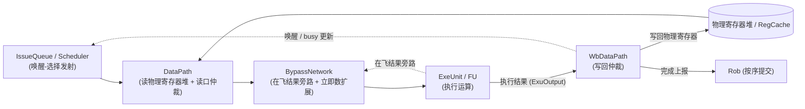
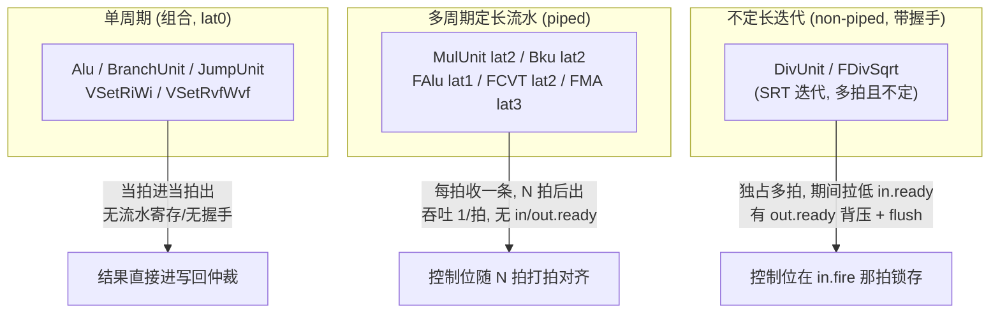
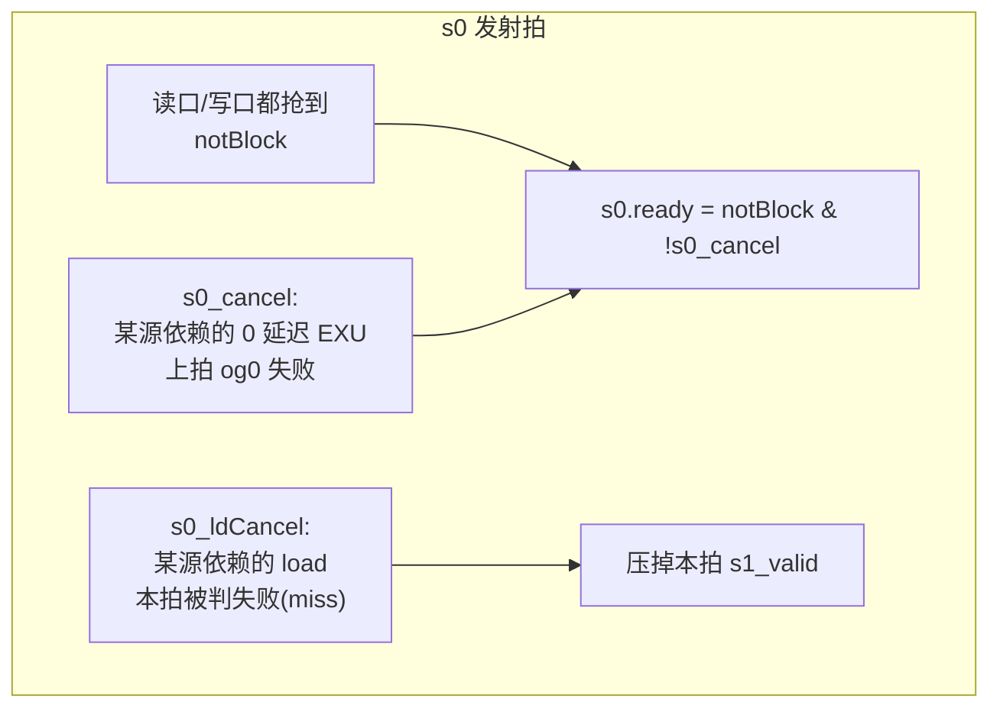
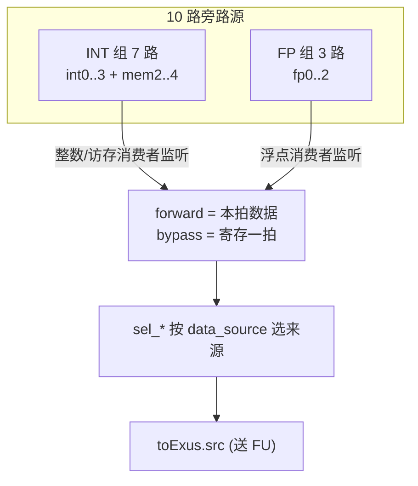
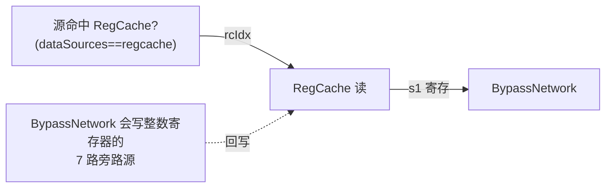
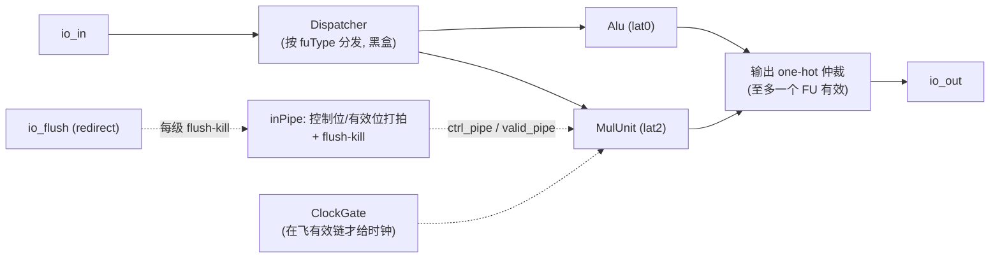

# 执行与写回原理

> 本文是香山 V2R2(昆明湖)乱序后端 **执行段(FU/DataPath/BypassNetwork)** 与 **写回段
> (WbDataPath/WbFuBusyTable)** 的**背景/原理**层文档:讲「为什么这么分、各部件如何协同」,
> 帮你在读逐模块设计文档前先建立整体认知。**不重复**各模块的端口/实现细节——具体数值、
> 编码、时序请以对应模块文档与 RTL 为准。
>
> 上游(唤醒-发射)见 [3-ISSUE_WAKEUP_PRINCIPLES.md](3-ISSUE_WAKEUP_PRINCIPLES.md),
> 下游(提交/重定向)见 [5-COMMIT_EXCEPTION_CSR_PRINCIPLES.md](5-COMMIT_EXCEPTION_CSR_PRINCIPLES.md);
> 全局脉络见 [0-BACKEND_OVERVIEW.md](0-BACKEND_OVERVIEW.md)。

## 1. 执行段在后端流水里的位置

发射队列在唤醒阶段选出一条就绪 uop 之后,它要经过三个流水部件才真正被算出来、再汇总写回:



一条数据的生命周期是:**读操作数(DataPath)→ 拿旁路/立即数(BypassNetwork)→ 执行(FU)→
抢写回口写回(WbDataPath)→ 唤醒后续相关指令**。这一段的设计目标只有两个字:**快** 与
**省**——用最短的关键路径把生产者的结果送到消费者,同时把稀缺的读口/写回口/时钟资源
省着用。下面各节都是围绕这两个目标展开的。

## 2. 功能单元(FU)的分类与时延模型

后端把各类运算拆成若干**叶子功能单元(FU)**,按「读寄存器类型」和「时延特性」分族。理解
FU 的关键不是它算什么,而是**它多久出结果、要不要握手**——因为这决定了它周围的 glue
(打拍/门控/冲刷)怎么搭,也决定了写回冲突怎么预约(见 §7)。

### 2.1 按运算域分类

| 域 | FU | 主要指令 | 文档 |
|----|----|----------|------|
| 整数 | Alu | 加减/比较/移位/逻辑,B 扩展(Zba/Zbb/Zbs),Zicond | [Alu](../Alu.md) |
| 整数 | MulUnit | `mul/mulh/mulhsu/mulhu/mulw` | [MulUnit](../MulUnit.md) |
| 整数 | DivUnit | `div/rem` 及 u/w 变体 | [DivUnit](../DivUnit.md) |
| 整数 | Bku | Zbc 无进位乘 / Zbb 计数 / Zbkx 置换 / Zknh·Zksh·Zkne·Zksed 密码 | [Bku](../Bku.md) |
| 整数 | BranchUnit | 条件分支 beq/bne/blt/... + 预测校验 | [BranchUnit](../BranchUnit.md) |
| 整数 | JumpUnit | jal / jalr / auipc + 目标校验 | [JumpUnit](../JumpUnit.md) |
| 整数 | Fence | fence / fence.i / sfence 等 | [Fence](../Fence.md) |
| 系统 | NewCSR | CSR 读写/特权/中断异常 | [NewCSR](../NewCSR.md) |
| 浮点 | FAlu | 加减/比较/最值/符号注入/分类/移动 | [FAlu](../FAlu.md) |
| 浮点 | FMA | 融合乘加 `a*b±c` + 纯乘 | [FMA](../FMA.md) |
| 浮点 | FCVT | f2i / i2f / f2f 变宽 / fround / fmv | [FCVT](../FCVT.md) |
| 浮点 | FDivSqrt | fdiv / fsqrt | [FDivSqrt](../FDivSqrt.md) |
| 向量配置 | VSetRiWi / VSetRvfWvf | `vset{i}vl{i}` 拆出的 vl/vtype uop | [VSetRiWi](../VSetRiWi.md) / [VSetRvfWvf](../VSetRvfWvf.md) |
| 向量 | VFMA / VIAluFix / VFAlu / VPPU / VFDivSqrt / VIMac … | RVV 向量整数/浮点/规约/置换 | (golden 聚合,同构于浮点变体) |

> `vset` 指令在译码阶段被**分裂成多个 uop**分派到不同单元:算出 `vl` 写回整型 rd 的那个
> uop 由 VSetRiWi 处理;保持 vl、改 vtype 并写回 vconfig 的由 VSetRvfWvf 处理。两者共用
> `vset_pkg` 的 VLMAX/vl 计算(`vl = min(AVL, VLMAX)`,乘除用取对数变加减实现)。

### 2.2 三种时延模型(最重要的一条分类线)

FU 的复杂度**几乎全部来自时延**。按「出结果要几拍、要不要背压握手」分三类:



- **单周期(lat0)**:`io.in` 进、同拍 `io.out` 出。纯组合、无时钟/复位、无握手。Alu 是典型。
  分支/跳转虽然也 0 延迟,但除算数据外还额外产生**重定向(redirect)**——BranchUnit 仅在
  预测错误时重定向,JumpUnit 则「除 auipc 外恒重定向校验」(jalr 目标依赖运行期 rs1,前端
  只能预测,后端必须用真实目标校验)。这条重定向反馈路是执行段唯一直接回灌前端的输出。
- **多周期定长流水(piped)**:延迟固定为 `latency` 拍,每拍可收一条新指令、吞吐 1 条/拍。
  MulUnit(lat2)、Bku(lat2)、FAlu(lat1)、FCVT(lat2)、FMA(lat3) 属此类。**因为延迟确定、
  下游不背压、不自管冲刷,它们没有 `in.ready`/`out.ready`/`flush` 端口**——控制位随流水
  打拍即可(见 §2.3、§6)。
- **不定长迭代(non-piped)**:DivUnit(SRT-16 整数除法)、FDivSqrt(SRT 浮点除/开方)。
  一旦接受一条指令就要**独占若干拍**才出结果,期间拉低 `in.ready` 形成背压;因此它们带
  **完整握手(in.ready/out.ready)与 flush**——迭代途中若该指令被重定向冲刷,要 kill 掉
  正在算的运算,避免冲刷后写回脏结果。

> **这条分类线贯穿全篇**:它决定了 §6 里控制位怎么对齐(打拍 vs 锁存)、§7 里写回口怎么
> 预约(确定延迟 vs 不定延迟)、以及 ExeUnit 要不要给这个 FU 配 inPipe 与时钟门控。

### 2.3 定长流水 FU 为什么「不自己搬控制位」

一个也许反直觉的设计:MulUnit/FMA 这些定长流水 FU **不在内部逐级搬运 robIdx/pdest**。
香山把**控制/数据流水**(`ctrlPipe`/`validPipe`)放在 FU **外部**——由发射队列 + 数据通路
预先打拍后送入,FU 端口里看到的是 `validPipe_N` 与 `ctrlPipe_N`。FU 内部只维护一条极短的
「本 FU 有效流水」用作阵列的寄存器使能。这样做的好处:**运算阵列是可复用的纯计算黑盒
(如 `ArrayMulDataModule`/`FloatFMA`),控制流水由外层统一组织**,阵列不必知道 robIdx
是什么。相应地,把这些 FU 接进流水的 glue(inPipe 打拍、flush-kill、时钟门控)就集中落在
ExeUnit 这层(见 §6)。

不定长 FU 相反:因为迭代跨多拍、输入端口早已变化,DivUnit/FDivSqrt 必须在 **`in.fire`
那拍把 robIdx/pdest/ctrl 锁存**(DataHoldBypass/RegEnable),迭代结束写回时取锁存值。

## 3. DataPath:读操作数 + 把资源纳入背压

[DataPath](../DataPath.md) 是**发射到执行之间的一个流水级(s0 → s1)**。它解决两个问题:
读到操作数,并把「读口/写口」这类稀缺资源纳入发射的背压环。

### 3.1 为什么必须两拍(s0/s1)

物理寄存器堆([RegFile](../RegFile.md))是**同步读**:s0 拍给地址、数据 s1 拍才出。所以
DataPath 天然是两拍——s0 接收 IQ 选出的 uop、向读口仲裁器申请读口,仲裁通过才接收
(`s0.ready`)并打入 s1 寄存器;s1 拍读出有效,按源类型选出操作数送执行单元。写口侧也打
一拍对齐写回数据到达的时序。

### 3.2 读口仲裁与发射 ready 耦合

PRF 读口是面积/时序大头,多个发射端口竞争。DataPath 里每个域各有一个读口仲裁器,某源在
**它需要的所有域**都抢到读口才算不阻塞;抢不到就**回压 IQ 并回送 og0 block**,让 IQ 保留
该 uop 重发。这把「读口资源」纳入发射背压环,从源头避免读口溢出——而不是让读口悄悄丢数据。

### 3.3 大多数源是「固定直连」,不是运行时选择

一个容易误解的点:s1 拍**不是**每个源都做「5 域 Mux1H」。哪个源读哪个域的哪个读口在
`BackendParams` 里早已定死,所以绝大多数源是**固定直连**某域某读口的读数据。全 DataPath
里唯一的运行时选择是两个 STD 类访存端口的 src0(store 数据可能来自整数或浮点寄存器,按
`srcType` 在 int/fp 两域间 **2 路选**)。**全程不比 pdest 地址**——那是旁路网络的活。

### 3.4 两条 0 延迟唤醒纠正路径:s0_cancel 与 s0_ldCancel

乱序流水为了缩短 RAW 关键路径,会做**推测唤醒**:在生产者结果真正就绪前,就提前唤醒
消费者。推测总有落空,DataPath 在 s0 拍就要能纠正:



- **`s0_cancel`(0 延迟 EXU 唤醒取消)**:某源被标注为「上一拍被某 0 延迟 EXU 唤醒并预约
  转发」,而该 EXU 恰在上拍 og0 阶段抢写回口失败(`og0_cancel_delay`)——这条 uop 的源数据
  拿不到,必须取消接收(拉低 `s0.ready`)。判定靠把 EXU 编号 one-hot 散布到 27 位全局空间
  后与失败集合相与(`is_0latency` / `wakeup_failed_int/fp`)。
- **`s0_ldCancel`(load 唤醒取消)**:某源依赖「某条 load 的第 1 拍推测唤醒」,而该 load 本拍
  被对应 LoadUnit 判失败(命中/miss 推测纠正),则拉高 `s0_ldCancel`,**压掉本拍 `s1_valid`**,
  不让这条依赖了被取消 load 的 uop 进入 s1。

> 两者互补:前者取消对「0 延迟 EXU」的依赖,后者取消对「load」的依赖。DataPath 还向 IQ 回送
> **og0resp / og1resp**(block / uncertain / success)——只有 5 个 0 延迟 EXU 端口在 og0 失败时
> 广播 `og0Cancel`,og1 失败不额外广播、只经 `og1resp = block` 回送。

## 4. BypassNetwork:把在飞结果直接转发给消费者

[BypassNetwork](../BypassNetwork.md) 紧接在 DataPath 之后。它解决的问题是:消费者要读的源,
其生产者可能**刚算完、还没写回物理寄存器堆**。死等「写回 → 读回」会拉长 RAW 关键路径;
旁路网络把生产者 EXU 的**在飞结果**直接转发过来,省掉这一往返。

### 4.1 关键认识:匹配不在这里做,退化为「按序号索引」

旁路的**匹配决策不在本网络**——发射队列在唤醒阶段就已经决定了「某源来自哪个 EXU、取本拍
直出(forward)还是寄存一拍(bypass)」,并把决策编码进两个小字段透传过来:

| 字段 | 含义 |
|------|------|
| `dataSources[s].value` | 该源取哪种来源:reg / forward / bypass / imm / regcache / v0 / zero |
| `exuSources[s].value` | 若取 forward/bypass,生产者 EXU 在唤醒源组内的**序号** |

所以 BypassNetwork 本质是个**按这两个字段选数据来源的大型多路选择器**。Chisel 里用 one-hot
`Mux1H` 表达匹配,firtool 展平成长长的 OR-mux 链;但 `exuSources.value` 就是生产者的组内序号,
**匹配退化为一次按序号的索引选择**(`value∈1..N → 选第 value-1 路`,`0 → 0`),既清晰又 X 安全。

### 4.2 旁路源拓扑

本配置 27 个 EXU 中只有 **10 路是旁路源**,分两组被监听:



forward 是本拍直出数据,bypass 是 `RegEnable(data, valid)`(只在有效时更新,省功耗)。此外
**立即数最终扩展也在这里**(经 [ImmExtractor](../ImmExtractor.md) 黑盒)——DataPath 只透传
imm/immType,把扩展延后到旁路选择同一拍,既省 IQ 面积又合并逻辑。分支单元的 immBJU/
nextPcOffset、Load 的内联 U 型立即数也在此就地展开。

## 5. RegCache:给 PRF 读口减负

[RegCache](../RegCache.md) 是 PRF 旁的一个**小容量、多读口寄存器值缓存**,缓存最近写回的
物理寄存器值。动机很直接:乱序超标量每拍要为多条指令读多个源,PRF 读口是面积/时序大头;
而「刚写回的值往往很快又被后续相关指令读用」。于是发射读源时**优先命中 RegCache**,命中即
省一次 PRF 读口。



RegCache 分两个对称半区(整数域 / 访存域,条目数不同);读地址最高位选半区、同步读出后回选。
替换目标由内部年龄逻辑(AgeTimer + AgeDetector)选**最旧条目**,写地址经流水对齐「写数据从
执行单元产出回到 RegCache」的延迟。它的写口来自 BypassNetwork(旁路 bus 打拍回写)。

## 6. ExeUnit:把 FU 接进流水的 glue 容器

[ExeUnit](../ExeUnit.md) 是「发射 → 执行 → 写回」里的**执行段容器**。它**本身不做任何运算**,
只把一个或多个 FU 包在一起,负责 FU 周围**全部 glue**。为什么一个 ExeUnit 里放多个 FU?
因为它们**共享同一个发射端口**——同一拍这条端口只发一条 uop,其 `fuType` 决定进哪个 FU,
所以多个 FU 在输入上天然互斥、输出上至多一个有效。



ExeUnit 的三件 glue 恰好对应 §2.2 的时延模型:

- **§1 inPipe(仅有延迟 FU 需要)**:有延迟 FU 在发射拍收数据、第 N 拍才出结果,写回需要的
  控制位(robIdx/pdest/rfWen)必须是**那条 uop 自己的**。inPipe 用一条纯移位寄存器把控制位
  跟着 uop 延迟到出结果拍;有效位链每一级还要 **flush-kill**——检查这条在飞 uop 是否被
  redirect 冲刷,冲刷则清 0(环形比较 `robIdx.needFlush`)。lat0 的 Alu 当拍出结果、直接用
  `io_in` 控制位,**既无 inPipe 也无门控**。
- **§2 时钟门控(仅有延迟 FU)**:每个有延迟 FU 维护一条「在飞有效链」,链上任一级有效才让
  ClockGate 放行时钟,空闲时关掉省功耗。(注:门控单元的 test-enable `TE` 接顶层 DFT 信号,
  与功能使能 `E` 是两条独立信号。)
- **§3 输出仲裁**:同一拍至多一个 FU 有效,故各输出字段做「选中取该 FU 值、否则取 0」的
  **或归约**——即 Mux1H 展开,无优先级歧义。

> 单态化后 FU 个数/延迟/控制位集合/数据宽都是定值,ExeUnit 据此参数化出多个变体(纯整数、
> 整数多 FU、浮点、向量),§1–§3 骨架逐字相同。

## 7. WbDataPath 与 WbFuBusyTable:写回口的仲裁与预约

写回口是**比 EXU 少得多的稀缺共享资源**——多个 EXU 同拍想写同一个物理寄存器域就发生
**写回冲突**。后端用两个部件配合解决:一个在写回**当拍仲裁**([WbDataPath](../WbDataPath.md)),
一个在发射前**预约避让**([WbFuBusyTable](../WbFuBusyTable.md))。

### 7.1 WbDataPath:执行 → 写回的总枢纽

所有 EXU 结果(ExuOutput,带 5 个写使能位 int/fp/vec/v0/vl)汇到这里,按要写的物理寄存器域
分流,经各域写回仲裁器抢端口,胜出者写回物理寄存器堆,同时**所有完成的写回上报 ROB** 按序提交。


**fire/ready 语义因时延而异**(又是 §2.2 那条分类线):

- **不定延迟 EXU**:抢不到端口时 `ready=0`,结果在 EXU 口**停留重试(数据不丢)**。这类 EXU
  正是 DivUnit/FDivSqrt 那族——它们本就有握手,能被回压。
- **确定延迟 EXU**:`ready` 恒 1。若此时抢不到端口,结果**永久丢失**。所以确定延迟 FU 的
  写回口**必须在发射时就预约好**、保证它出结果那拍端口空着——这正是下面 WbFuBusyTable 的职责。

> 另有跨域打拍特例:向量执行单元若要写**整数**寄存器,结果晚一拍才进 int 仲裁器(时序对齐)。

### 7.2 WbFuBusyTable:写回口「未来占用预约表」

不同 EXU 延迟不同(ALU 1 拍、乘法 2 拍、除法多拍且不定)。调度器在**发射一条不定延迟指令
前**,必须预知它将来出结果那拍、目标写回口是否已被某条确定延迟指令预定——否则不定延迟指令
一完成就可能撞上别人的写回(而它又不能被回压丢弃,见 §7.1)。

WbFuBusyTable 就是这张预约表的**归并/分发中枢**(纯组合、无状态):


busyTable 每一位的物理含义:`busyTable[i]=1` 表示「从现在起第 i 拍,该写回端口将被一条确定
延迟指令占用」。调度器读到自己端口的占用表后,**为不定延迟指令选发射拍时避开会导致结果落在
已置位拍的时机**,从源头避免冲突。「哪些源命中哪个端口」在 elaboration 期由各 EXU 的
`wbPortConfig` 静态决定,展开后是固定接线;同一端口多源逐位 OR(短源零扩展到端口最大宽度)。

## 8. 一条整数乘法的端到端时序(把各部件串起来)

以 `mul`(MulUnit lat2)为例走一遍,看各部件如何协同:

```mermaid
sequenceDiagram
    autonumber
    participant IQ as IssueQueue
    participant DP as DataPath
    participant BN as BypassNetwork
    participant EU as ExeUnit(inPipe)
    participant M as MulUnit(黑盒阵列)
    participant WB as WbDataPath
    Note over IQ,WB: 发射拍 (s0)
    IQ->>DP: 选出 mul uop + dataSources/exuSources
    DP->>DP: 读口仲裁; 若抢不到→回压+og0 block
    Note over DP: s0.ready & !s0_cancel & !s0_ldCancel
    Note over IQ,WB: s1 / 执行拍
    DP->>BN: 读出源数据 + 立即数信息
    BN->>EU: forward/bypass 选好的操作数
    EU->>M: 喂入阵列; inPipe 打入本拍控制位
    EU->>M: 时钟门控放行(在飞有效链)
    Note over IQ,WB: +2 拍(出结果)
    M->>EU: 130b 乘积
    EU->>EU: inPipe 取第 2 级控制位(robIdx/pdest);<br/>flush-kill 若已被冲刷则丢弃
    EU->>WB: io_out {valid, data, pdest, intWen}
    WB->>WB: 抢 int 写回口(已由 WbFuBusyTable 预约)
    WB->>IQ: 写回 + 唤醒后续相关指令
    WB->>WB: 上报 Rob 按序提交
```

关键点回顾:

- 读口仲裁把资源纳入发射背压(§3.2);推测唤醒落空由 s0_cancel/s0_ldCancel 在 s0 纠正(§3.4)。
- 旁路让消费者不必等生产者写回(§4);RegCache 让读源少占 PRF 读口(§5)。
- 定长流水 FU 的控制位由 ExeUnit 的 inPipe 随延迟对齐、每级 flush-kill(§6);因确定延迟不能
  被回压,它的写回口早已被 WbFuBusyTable 预约(§7.2),故 WbDataPath 里它 `ready` 恒 1(§7.1)。

## 9. 一句话小结:三条贯穿全篇的设计线

1. **同步读 PRF → 读写都两拍对齐**:DataPath 的 s0/s1、写口打拍、RegFile 读地址寄存,都是
   这一拍延迟的产物。
2. **稀缺资源纳入背压**:读口经 og0 block 回压发射,写回口经 WbFuBusyTable 预约避让 + 不定
   延迟 EXU 回压重试——都在「资源用尽前」就把压力传回上游,而不是丢数据。
3. **时延模型决定 glue**:单周期 / 定长流水 / 不定长迭代 这条分类线,决定了控制位是打拍还是
   锁存、要不要握手与 flush、写回口是预约还是回压——它是理解执行与写回段的总钥匙。

---

**相关模块文档**:
FU: [Alu](../Alu.md) · [MulUnit](../MulUnit.md) · [DivUnit](../DivUnit.md) · [Bku](../Bku.md) ·
[BranchUnit](../BranchUnit.md) · [JumpUnit](../JumpUnit.md) · [Fence](../Fence.md) ·
[FAlu](../FAlu.md) · [FMA](../FMA.md) · [FCVT](../FCVT.md) · [FDivSqrt](../FDivSqrt.md) ·
[VSetRiWi](../VSetRiWi.md) / [VSetRvfWvf](../VSetRvfWvf.md)
数据通路: [DataPath](../DataPath.md) · [BypassNetwork](../BypassNetwork.md) ·
[ImmExtractor](../ImmExtractor.md) · [RegFile](../RegFile.md) · [RegCache](../RegCache.md) ·
[ExeUnit](../ExeUnit.md)
写回: [WbDataPath](../WbDataPath.md) · [WbFuBusyTable](../WbFuBusyTable.md)
姊妹背景文档: [0-BACKEND_OVERVIEW.md](0-BACKEND_OVERVIEW.md) ·
[3-ISSUE_WAKEUP_PRINCIPLES.md](3-ISSUE_WAKEUP_PRINCIPLES.md) ·
[5-COMMIT_EXCEPTION_CSR_PRINCIPLES.md](5-COMMIT_EXCEPTION_CSR_PRINCIPLES.md)
RTL: [../../../rtl/backend/DataPath.sv](../../../rtl/backend/DataPath.sv) ·
[../../../rtl/backend/BypassNetwork.sv](../../../rtl/backend/BypassNetwork.sv) ·
[../../../rtl/backend/WbDataPath.sv](../../../rtl/backend/WbDataPath.sv) ·
[../../../rtl/backend/WbFuBusyTable.sv](../../../rtl/backend/WbFuBusyTable.sv)
