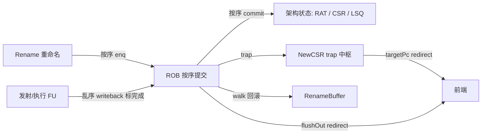
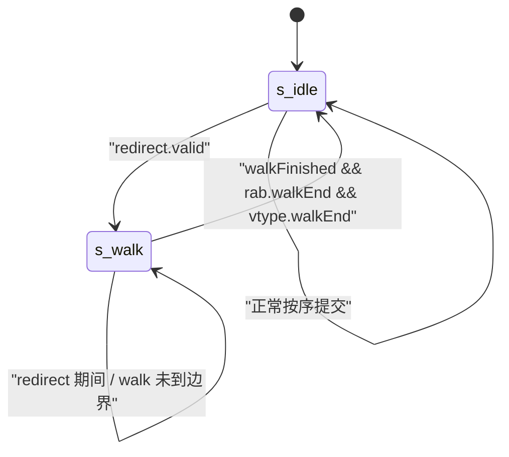
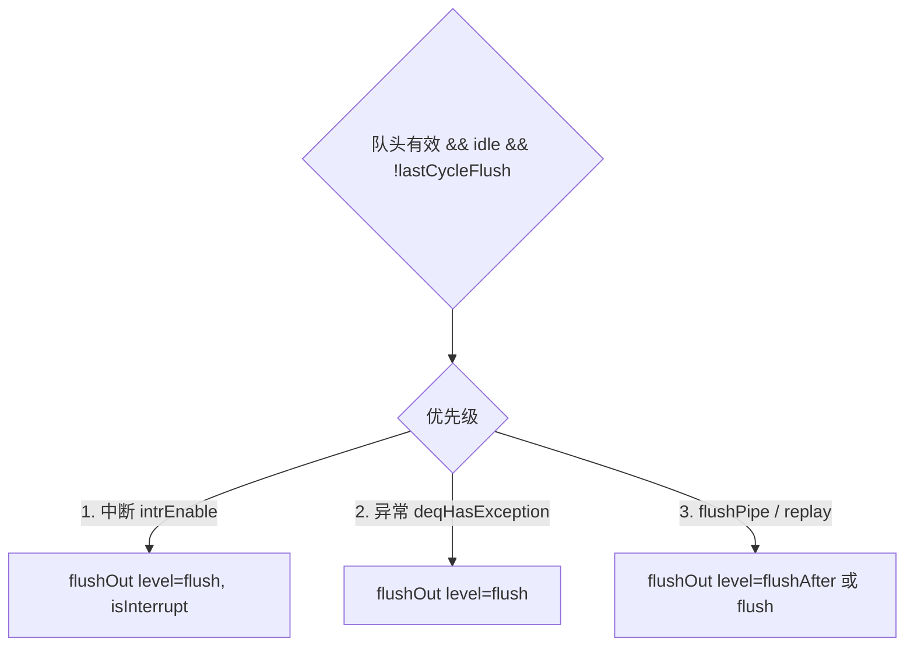
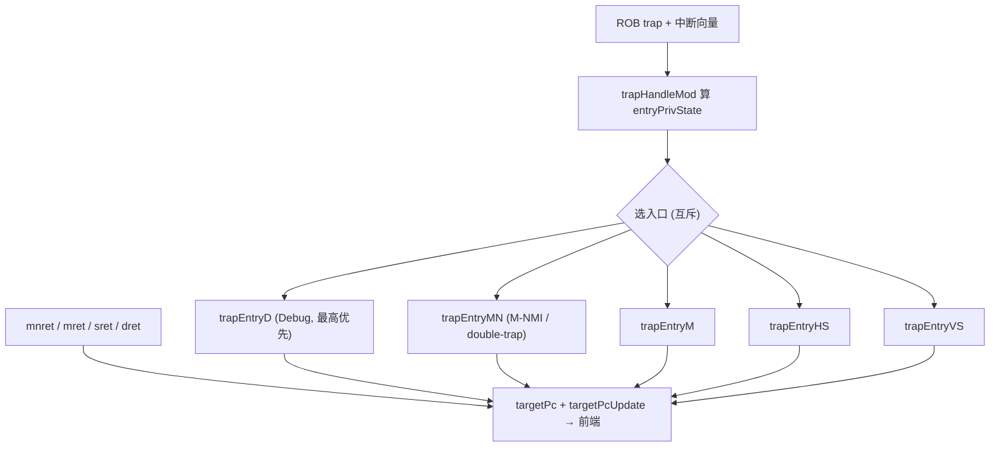
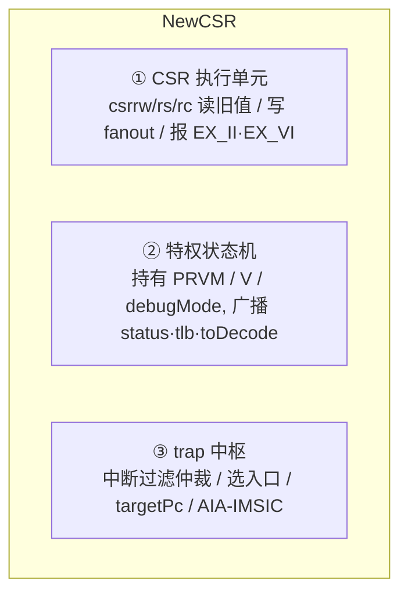
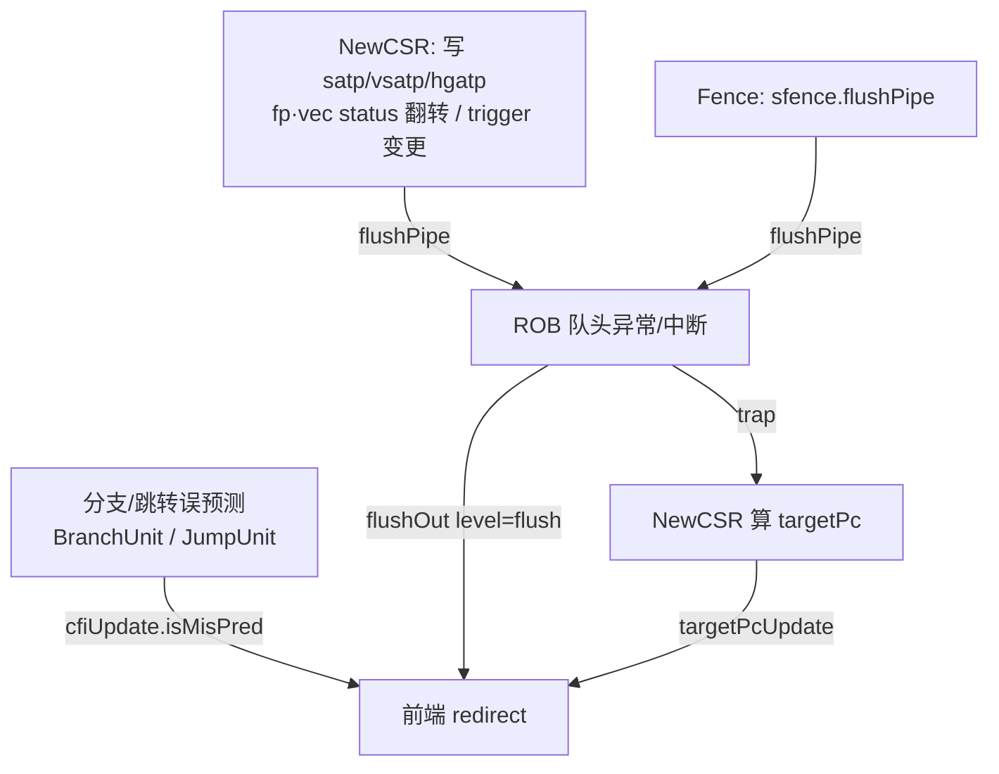
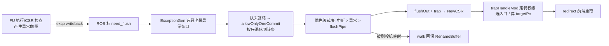

# 提交、异常与 CSR 原理

> 本文是后端 arch 背景层文档,讲**为什么这样设计**:乱序执行的处理器如何借
> ROB 顺序提交做到「精确异常」,误预测/异常后如何 walk 回滚重命名,异常与中断
> 如何触发、定优先级、派发到目标特权级,以及 NewCSR 作为「trap 中枢」怎样把这
> 一切串起来。它不重复逐模块的端口/实现细节——那些请读
> [Rob](../Rob.md) / [NewCSR](../NewCSR.md) / [Fence](../Fence.md);读本文
> 前建议先看总览 [0-BACKEND_OVERVIEW.md](0-BACKEND_OVERVIEW.md)。

---

## 1. 核心矛盾:乱序执行 vs 精确异常

后端为了性能,让指令**乱序执行、乱序写回**:一条 load miss 卡住时,后面无依赖
的 ALU 指令可以先算完。但对软件而言,处理器必须永远表现得像**严格按程序序**在
执行——尤其当一条指令触发异常/中断时,体系结构状态(架构寄存器、CSR、PC)必须
恰好停在「该指令之前全部完成、该指令及之后一条都没发生」的那个精确切面上。这
就是**精确异常**(precise exception,Smith & Pleszkun, ISCA 1985)。

调和二者的机构就是 **ROB(ReOrder Buffer,重排序缓冲)**:指令按序入队、乱序
完成、**按序退休(commit)**。只要退休是顺序的,对外呈现的架构状态就永远精确。
本文其余部分都是围绕「如何保证顺序退休精确」以及「精确点上要做什么」展开。



---

## 2. ROB 顺序提交如何保精确异常

### 2.1 完成 ≠ 退休

每条在飞指令进 ROB 时记下它要等多少个 writeback(`uopNum`)。FU 每写回一次就递减;
`uopNum==0 && stdWritebacked` 才算「可提交」(`commit_w`)。注意 store 的**特殊性**:
它要地址(sta)和数据(std)都写回才完成,所以有独立的 `stdWb` 标记。指令即便早早
算完,也只是「完成」,必须**在队头且所有更老指令都已退休**时才真正退休。这条
「队头 + 前缀就绪」的按序阻塞(`commit_block` 前缀或)是精确性的第一道保证。

香山昆明湖默认核的 ROB 关键规格(以 [rob_pkg.sv](../../../rtl/backend/rob_pkg.sv) /
[Rob.md](../Rob.md) 为准):

| 参数 | 值 | 含义 |
|------|----|------|
| RobSize | 160 | 条目数(8 bank × 20/bank) |
| CommitWidth | 8 | 每拍最多提交/回滚 8 条 |
| RenameWidth | 6 | 每拍最多入队 6 条 |

`robIdx` 是环形指针 `CircularQueuePtr{flag,value}`,`value∈[0,160)`,`flag` 翻转
用来区分绕回一圈后的新旧——所有指针比较(谁更老、walk 是否到边界)都必须按环形
语义算,不能裸拼 `{flag,value}` 比大小(这是 Rob 重写时抓到的真 bug,见
[Rob.md](../Rob.md) §12b)。

### 2.2 精确点专属操作:allowOnlyOneCommit

正常一拍可退休 8 条。但当队头组里出现带 `need_flush` 的有效条目(异常/flushPipe),
或有中断挂起时,切换到 **allowOnlyOneCommit**——每拍只许退休一条。因为异常/中断
点必须落在**唯一确定**的一条指令上;一次退休一堆就无法界定切面。

### 2.3 哪些指令不许在其上响应中断

`interrupt_safe` 标记决定一条指令处能否响应中断。load / store / fence / csr / vset
**不允许**:它们在写回前已对处理器状态产生了副作用(访存已发出、CSR 已改状态),
中断在此插进来会破坏精确性。中断只能在「干净的边界」上被接纳。

---

## 3. walk:误预测/异常后回滚重命名

### 3.1 为什么光靠 ROB 退休不够——重命名的投机映射要撤

分支误预测或队头异常触发 redirect 后,被冲刷的那些**投机指令**已经在 Rename 阶段
占用了物理寄存器、改写了 RAT 映射。ROB 退休只管「已确认」的指令;那些被撤销的
投机映射必须**逐条交还**给 freelist,并把 RAT 恢复到 redirect 边界处的状态。这个
逆向回放过程叫 **walk**,由 ROB 驱动 [RenameBuffer](../RenameBuffer.md)(rab)完成。

### 3.2 两态状态机:idle ↔ walk



- **s_idle**:正常退休。
- **s_walk**:从 redirect 边界朝 enqPtr 方向逐拍回放投机条目,每条把它的
  `realDestSize`(真正写寄存器的 uop 数)累加成 `rab.walkSize` 送 RenameBuffer 回收
  映射。追上边界(`walkFinished`)且 rab / vtype 也回放完,才回 idle。

redirect **优先级最高**:任何一拍 `redirect.valid` 都强制进 walk,即便正处在 walk 中
(新的更老 redirect 覆盖旧的)。

### 3.3 时序与「哪些不用 walk」

walk 有固定 2 拍延迟:T 拍 `redirect.valid` → T+1 用 `walkPtrVec` 读 ROB 条目 →
T+2 起真正 walk。起点按是否有快照(useSnpt)决定跳到快照行头还是 `deqPtr` 行头。
行内那些**位于 redirect 边界之前**的槽(比被刷指令更老,不在投机区间)由
`donotNeedWalk` 排除,不参与回滚。

> 与 ROB 的 commit 是同一套 8-bank 行读结构复用:commit 走 `deqPtr` 行、walk 走
> `walkPtr` 行,省读口。结构细节见 [Rob.md](../Rob.md) §4/§8。

---

## 4. 异常、中断的触发条件与优先级

队头就绪且处于 idle、非上拍刚 flush 时,ROB 按下述**严格优先级**决定是否触发
`flushOut`(精确重定向)。这是精确异常在时间轴上的落地点。



- **中断优先于异常**:`intrEnable` = 中断挂起(intrBitSetReg) && 无 waitForward
  && 队头 `interrupt_safe` && 未已刷。只要边界干净且有挂起中断,先响应中断。
- **异常** `deqHasException` = 队头 `need_flush` && 命中 ExceptionGen 选出的最老带
  异常条目 && 确为异常(`exceptionVec` 非空 / singleStep / debug-mode trigger)。
- **flushPipe / replay**:CSR 写等要求冲刷流水,或访存 replay。

`flushOut.level` 语义:replay / 中断 / 异常 → `flush`(**连被刷指令自身一起刷**,
因为它没能真正执行,要重取);否则 `flushAfter`(只刷其后,自身已生效)。这个取值
方向易错(Rob 重写时曾取反,见 [Rob.md](../Rob.md) §12b)。

> 「选哪条异常」由黑盒 `ExceptionGen` 聚合——它在所有带异常的在飞条目里挑**最老**
> 的那条,保证异常点是程序序最靠前的。ROB 只消费其结果做优先级判定。

---

## 5. trap 派发:委托、特权态与目标入口

ROB 把选定的 trap(异常向量 / 中断)送给 [NewCSR](../NewCSR.md);**落到哪个特权级、
跳到哪个 PC**,由 NewCSR 决定。这就是 NewCSR「trap 中枢」的角色。

### 5.1 委托链决定目标特权级

RISC-V 的 trap 默认全部落 M 态,再由委托寄存器逐级下放:`medeleg/mideleg` 委托给
HS,`hedeleg/hideleg`(RVH)再委托给 VS。NewCSR 不自己算委托,而是把
privState / deleg / mstatus 喂给黑盒 `trapHandleMod`,由它算出 `entryPrivState`。

### 5.2 五个互斥入口 + xret

NewCSR 据 `entryPrivState` 从 5 个 trap-entry 事件里选一个,另有 4 个 xret 返回事件,
共 9 个互斥源,每个产生一个候选 `targetPc`:



特权态更新按严格优先级(NewCSR 用 priority if/else 链,顺序照 Scala MuxCase):

```
trapEntryD > trapEntryM > trapEntryHS > trapEntryVS > trapEntryMN
          > mret > sret > dret > mnret
```

`targetPc` 选择则以 **trapEntryD 优先**、其余按 valid 守卫 OR 汇聚(事件互斥,OR 即
选择);`needTargetUpdate` = 9 个 valid 的或,它就是发给前端的重定向使能。

### 5.3 VS/S 地址别名(RVH 的用意)

为让未改动的客户机 OS 直接跑在 VS 态,RVH 规定 VS 态下软件用 S 地址(0x100 段)
访问的其实是对应 VS 寄存器(0x200 段)。NewCSR 在读出 OR-树与写 fanout 里统一按
`isModeVS` 做这条别名映射(14 对,如 satp↔vsatp)。这是「特权态机」角色的一部分,
细节见 [NewCSR.md](../NewCSR.md) §1.3/§4。

---

## 6. NewCSR 的三重角色

NewCSR 是后端最庞杂的执行单元,它同时是三样东西:



1. **CSR 执行单元**:从发射队列收一条 csrrw/csrrs/csrrc,读出旧值走 `rData`,把写
   数据 fan-out 到目标 CSRModule,并报告非法访问(见 §6.2)。
2. **特权状态机**:持有 PRVM(U/S/M)、V(虚拟态)、debugMode,复位为 M 态;向下游
   广播 privState、tlb(satp/mxr/sum…给 MMU)、toDecode(某指令是否非法/虚拟非法)。
3. **trap 中枢**:如 §5,做中断过滤/优先级仲裁与 trap 派发,并维护 AIA-IMSIC 的
   异步读写握手。

### 6.1 critical-error / NMIE / double-trap

这几条是特权/异常语义里最容易被忽略、却关乎鲁棒性的机构:

- **NMIE(NMI-Enable)**:正在处理 NMI 时 `mnstatus.NMIE=0`,此期间**屏蔽普通
  M/HS/VS/MN trap 入口**(每个 trap-entry 事件 `.valid` 都 `& NMIE`),防止 NMI
  handler 里被再次抢入;NMIE 由 `mnret` 恢复。
- **double-trap**:`trapHandleMod` 判出的 `dbltrpToMN`(陷入处理过程中又陷入)会把
  入口**从 M 抢到 M-NMI**——M 入口用 `~dbltrpToMN` 排除自己,MN 入口用 `| dbltrpToMN`
  纳入。真 NMI 也只走 MN 入口。于是 M-NMI 入口同时承接「不可屏蔽中断」与「双重
  陷入」两类最高优先级事件。
- **critical-error(致命错误)**:当 NMIE=0(正处理 NMI、不可再嵌套)时又来一次
  trap 且不是进 Debug,即认定不可恢复致命错误。它是**永久 sticky** 锁存(自身不会
  清),对外产生功能端口 `io_status_criticalErrorState`(可被 dcsr.CETRIG 屏蔽)。

### 6.2 EX_II / EX_VI 的生成

CSR 指令非法时分两类上报:

- **EX_II(illegal instruction)** 三个来源:① `permitMod` 按
  privState/counteren/stateen/envcfg 判权限不足;② 访问地址命中不了任何已实现 CSR
  (`noCSRIllegal`);③ 异步 IMSIC 回数 illegal 且当前**非** V 态。
- **EX_VI(virtual instruction)** 两个来源:① `permitMod` 判「HS 下合法、VS 下受禁」
  的虚拟非法;② IMSIC 回数 illegal 且当前 V 态。

即**同一个 IMSIC illegal 按当前 V 态分流**:V=0 报 EX_II、V=1 报 EX_VI。这两位随
读数据经 DataHoldBypass 打拍走出口,最终回到 ROB 变成一条异常在其上触发 trap。
(细节与代码位置见 [NewCSR.md](../NewCSR.md) §4 步 2。)

---

## 7. flushPipe / redirect 的来源与协同

后端的重定向(冲刷前端并重取)有多个来源,按语义大致分三类:



- **误预测重定向**来自执行阶段(分支/跳转 FU),由 CtrlBlock 收集并即时冲刷投机路径,
  同时喂 ROB 的 `misPredBlock` 让它在窗口内暂停提交。
- **flushOut** 来自 ROB 队头,是异常/中断/replay 触发的**精确重定向**——它是唯一带
  精确语义(落在确定指令上)的那条。
- **flushPipe** 不是独立重定向源,而是一条**指令带的属性**:某些 CSR 写会改变全局
  译码语义(写 satp/vsatp/hgatp、fp/vec status 在 on↔off 翻转、trigger 变更等),
  或 sfence 需要冲刷,于是把该指令标 `flushPipe`,它退休到队头时由 ROB 以
  `flushAfter`(只刷其后)触发重定向——因为该指令自身已正确执行,只需重取其后指令。

三者优先级在 ROB 里统一裁决(§4):中断/异常盖过 flushPipe,redirect(误预测)盖过
一切提交。

---

## 8. Fence:排空,再冲刷

`fence` / `fence.i` / `sfence.vma` / `hfence.*` 这类**屏障指令**语义是「此前的内存
访问对之后可见」。它落到 [Fence](../Fence.md) FU 上执行,但「执行」不是算术,而是
一个 6 态状态机:

1. 先让 **store buffer 排空**(等 `sbIsEmpty`)——保证之前的 store 已落到下游,否则
   flush icache/TLB 可能刷掉尚未生效的状态、破坏一致性。这是「先排空」的必要性。
2. 排空后按 `fuOpType` 分流:发 `fencei` 脉冲刷 icache、发 `sfence_valid` 刷 TLB、
   或普通 fence 占位。每个「干活态」严格停留一拍。
3. 完成后无数据、无异常地写回 ROB;若该 fence 带 `flushPipe`,则如 §7 由 ROB 在其
   退休时触发重定向,让后续指令用新的 TLB/icache 状态重新取译。

于是 Fence 把「内存序屏障」这件本质是**全局同步**的事,拆成「排空 → 脉冲 flush →
写回 → (可选)重定向」的多拍协议,既满足语义又利于时序。状态机与 opcode 编码见
[Fence.md](../Fence.md) §3/§4。

---

## 9. 一次异常从发生到落定(把全篇串起来)



读到这里应已建立认知:**ROB 用顺序退休把乱序执行收敛成精确切面,NewCSR 在切面上
完成特权态迁移与 trap 派发,walk 撤销投机重命名,flushPipe/redirect 负责把前端拉回
正确路径,Fence 保证内存序屏障**。再去读各模块文档看实现,就有了主干:

- [Rob](../Rob.md) —— 顺序提交 / 8-bank 行读 / walk / 异常优先级
- [NewCSR](../NewCSR.md) —— CSR 读写 / 特权态机 / trap 派发 / AIA-IMSIC
- [Fence](../Fence.md) —— 屏障状态机 / 排空与 flush
- 相关 arch 背景:[0-BACKEND_OVERVIEW.md](0-BACKEND_OVERVIEW.md)
