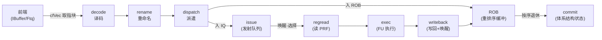
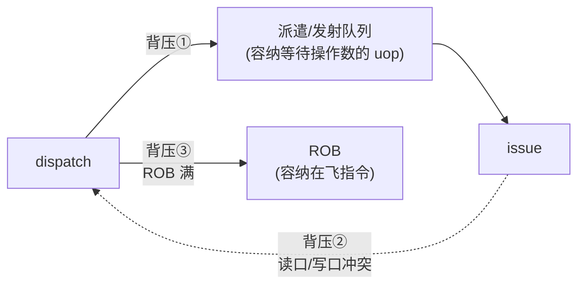
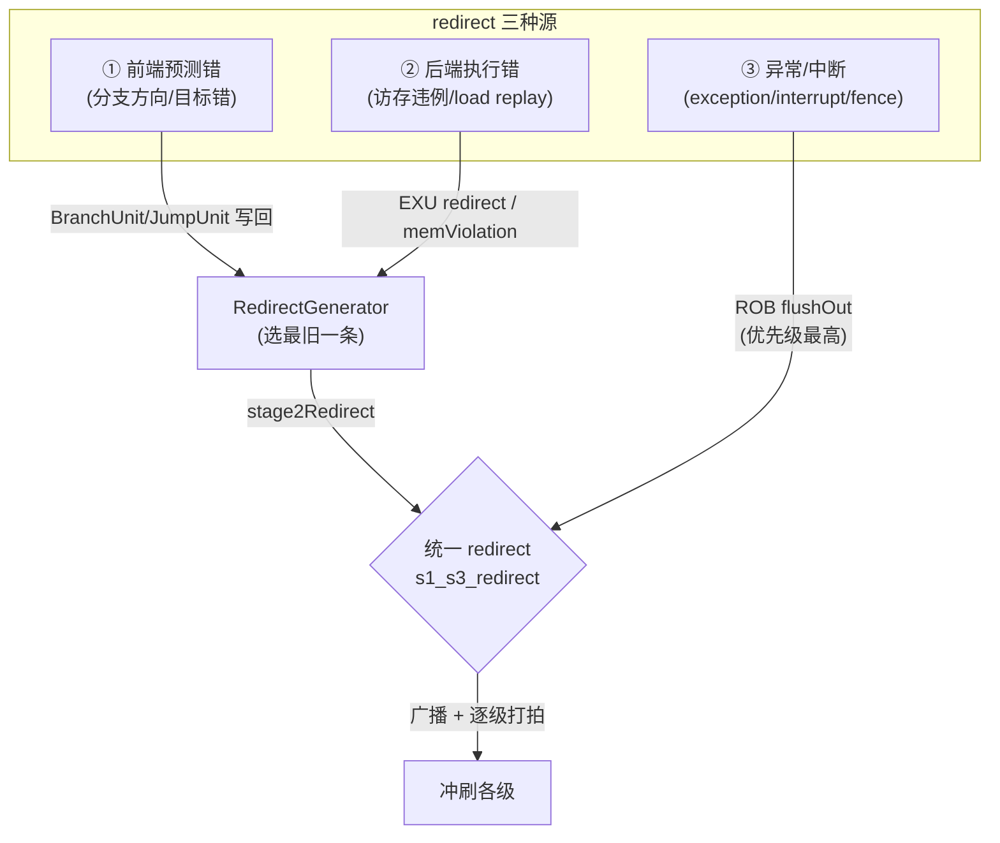
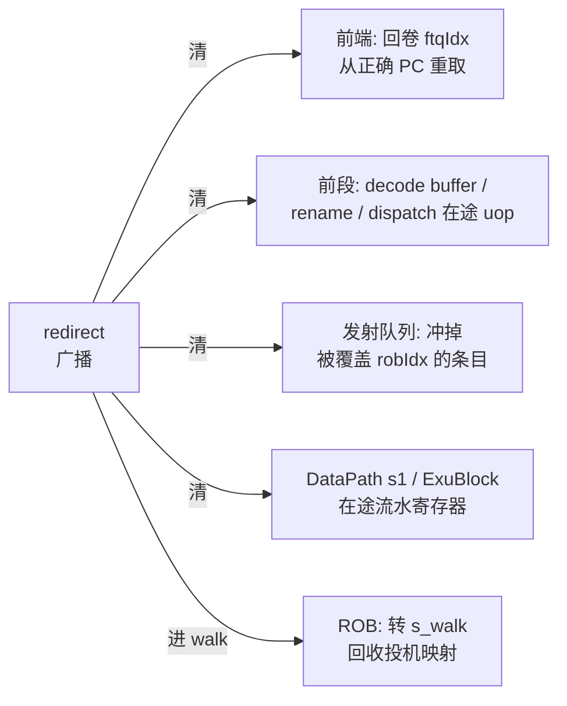
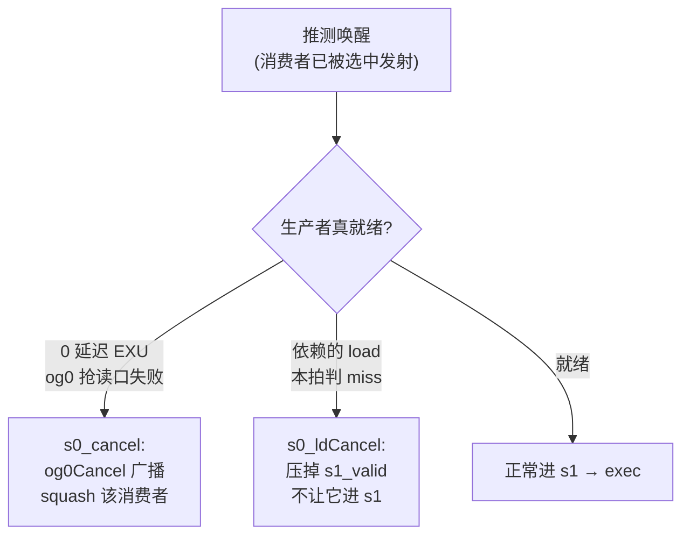
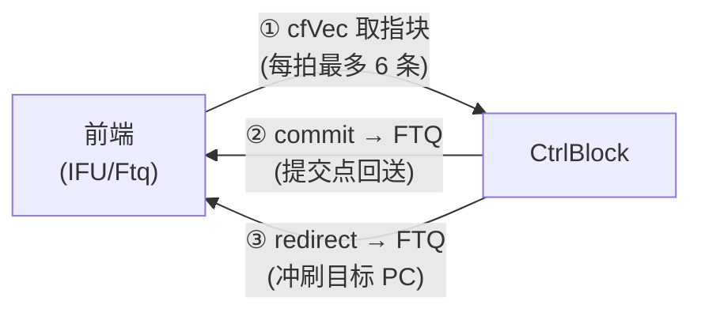
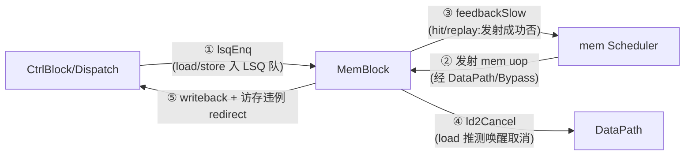
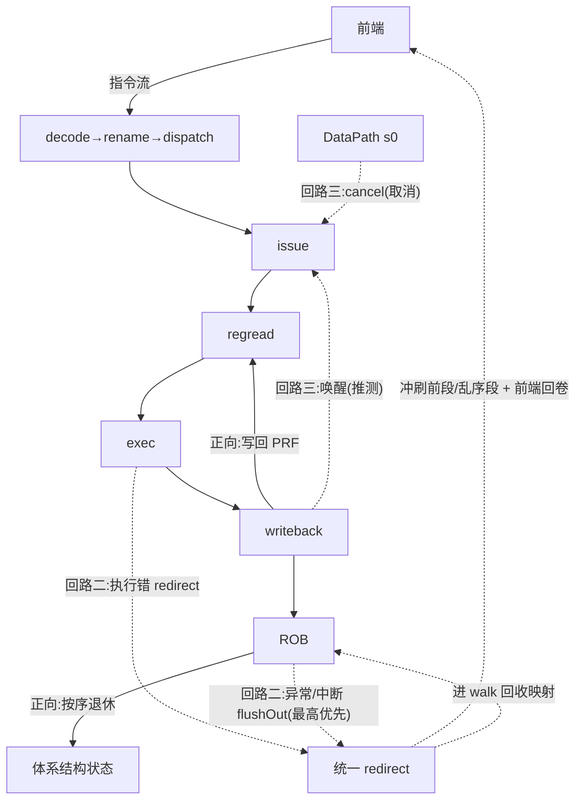

# 6 · 后端全景流水与控制流回路

> 本文是**背景/原理层**文档:把乱序后端从取指到退休的一条主流水在时间轴上串起来,
> 讲清各级为什么要用队列/缓冲解耦、三条控制回路(正向指令流、redirect 纠错、唤醒-发射推测)
> 如何互相制衡,以及与前端、访存的时序握手。**不重复逐模块的端口与实现细节**——
> 那些请看各模块文档([Backend](../Backend.md) / [CtrlBlock](../CtrlBlock.md) /
> [Rob](../Rob.md) / [Scheduler](../Scheduler.md) / [DataPath](../DataPath.md))。
> 先读本文建立全局认知,再读模块文档看实现。总览见 [0-BACKEND_OVERVIEW](0-BACKEND_OVERVIEW.md)。

---

## 1 · 一条指令的一生:全景流水

后端把「前端取好的指令包」推过一条**按序进、按序出、中间乱序**的流水。中间横着几个
**队列/缓冲**,把长流水切成若干**弹性解耦段**——上下游各自按自己的节奏跑,不必逐拍锁步。



从左到右是**按序**的前段(decode→rename→dispatch),经 dispatch 拆成两路:一路把 uop 压进
**发射队列**(进入乱序段),一路把同一批 uop 按序登记进 **ROB**。乱序段
(issue→regread→exec→writeback)里指令谁的操作数先就绪谁先走,顺序被打乱;最后 ROB
再把它们**按程序序**收拢,逐条退休(commit)。

各级职责一句话(细节见对应模块文档):

| 级 | 做什么 | 主要模块 |
|----|--------|---------|
| decode | 指令 → uop,识别 fuType/fuOpType/源宿/立即数 | [DecodeStage](../DecodeStage.md) |
| rename | 逻辑寄存器 → 物理寄存器,消除 WAR/WAW 假相关 | [Rename](../Rename.md) / [RenameTable](../RenameTable.md) |
| dispatch | uop 分发到各发射队列 + 登记 ROB + 访存入队 | [NewDispatch](../NewDispatch.md) |
| issue | 队列内等操作数就绪,按年龄/优先级唤醒-选择发射 | [Scheduler](../Scheduler.md) |
| regread | 从物理寄存器堆读操作数(同步读,占两拍) | [DataPath](../DataPath.md) / [RegFile](../RegFile.md) |
| exec | ALU/Mul/Div/Branch/浮点/向量 执行 | [ExuBlock](../ExeUnit.md) + 各 FU |
| writeback | 结果写回 PRF + 广播唤醒 | [WbDataPath](../WbDataPath.md) |
| commit | 按序退休,维护精确状态 | [Rob](../Rob.md) |

> 关键宽度(以 RTL 为准):`RenameWidth = DecodeWidth = 6`(每拍最多 6 条进出前段);
> ROB `RobSize = 160`(8 bank × 20 entry),`CommitWidth = BANK_NUM = 8`(每拍最多退休 8 条)。
> 注意退休宽度(8)略大于入队宽度(6):前段每拍最多灌 6 条,ROB 每拍能吐 8 条,
> 保证提交侧不成为长期瓶颈。

---

## 2 · 为什么要解耦:三个握手边界

如果 decode→…→commit 是一条刚性流水,任一级卡住就会一路回压到前端,吞吐会被最慢的
事件(如一次 cache miss、一条长延迟除法)拖垮。后端在三处插入**弹性缓冲**来吸收抖动,
把「产生」和「消费」在时间上解耦:



- **① 发射队列(IssueQueue)**:uop 在这里**等操作数**。前端可能连发依赖链,而操作数要等
  生产者执行完才就绪——队列把「已派遣但未就绪」的 uop 存起来,让 dispatch 不必因为某条
  没就绪而停。队列满则回压 dispatch(`enq.ready` 拉低,见 [Scheduler](../Scheduler.md) §3B)。
- **② 读口/写口资源背压**:PRF 读口是稀缺资源。issue 选中一条后,DataPath 在 s0 拍向各域
  读口仲裁器申请;抢不到就发 `og0resp = block` 让发射队列**保留并重发**,把读口资源纳入
  发射的背压环(见 [DataPath](../DataPath.md) §2.2)。这解耦了「发射决策」与「读口可用」。
- **③ ROB**:容纳所有**在飞指令**(已派遣、未退休)。它是实现精确异常的核心
  (Smith & Pleszkun, ISCA 1985):指令乱序执行/写回,但**按序退休**,对外永远呈现精确的
  体系结构状态。ROB 满(`allowEnqueue` 拉低)回压 dispatch(见 [Rob](../Rob.md) §9)。

这三个缓冲让四段流水各自「按需慢/按需快」:前端猛灌时队列吸收,long-latency FU 卡住时
只影响依赖它的消费者而非全流水。

---

## 3 · 回路一:正向指令流(按序 → 乱序 → 按序)

正向流是**弹性传送带**:每一级用 ready/valid 握手,加上前述三个缓冲吸收抖动。
两个关键的「一分为二 / 二合一」:

- **dispatch 分叉**:同一批 uop 同时(a)压进对应发射队列进入乱序段,(b)按序登记进 ROB。
  两者用**同一个 robIdx** 绑定——robIdx 是这条 uop 在 ROB 里的坐标,贯穿它的一生
  (发射、写回、退休、被冲刷都靠它定位)。ROB 登记发生在 dispatch 的下一拍
  (`enqRob` 打拍,见 [CtrlBlock](../CtrlBlock.md) §5.1)。
- **writeback 汇聚**:乱序执行完的结果从各 FU 汇进 [WbDataPath](../WbDataPath.md),分两路:
  (a)写回 PRF 供后续指令读;(b)广播**唤醒**给发射队列(见 §5);同时向 ROB 报「这条 uop
  已完成」,ROB 据此递减该条目的 `uopNum`,减到 0 且 std 也写回才算 `commit_w`(可退休)。

**decode buffer——前段内部的小缓冲**:前端一拍送 6 条(cfVec),但 DecodeStage 不一定每拍
全收。CtrlBlock 用一个 6 深的移位 FSM 缓存「本拍没被收走」的指令,下拍优先补上,避免
前端指令丢失或整块回压(见 [CtrlBlock](../CtrlBlock.md) §4)。这是正向流里最靠前的一处解耦。

---

## 4 · 回路二:redirect 纠错——三种冲刷,各冲哪些级

乱序执行是**推测执行**:前端预测分支方向、发射队列推测唤醒时机。推测错了就要
**冲刷(flush)** 已进入流水的错误指令,并把前端/后端指针回卷到正确点重取。后端把所有
纠错源收敛成**一条统一 redirect**,再逐级打拍广播——这是后端最关键的控制信号。

### 4.1 三种纠错源



- **① 前端预测错**:分支/跳转在 exec 阶段算出真实方向,与预测不符时由
  [BranchUnit](../BranchUnit.md) / [JumpUnit](../JumpUnit.md) 通过写回口带出 redirect。
- **② 后端执行错**:访存违例(store-load 顺序违反)、load replay 等,由访存/EXU 侧带出。
- **③ 异常/中断**:由 ROB 在**队头退休时**判定(精确点),触发 `flushOut`,**优先级最高**。

前两类(执行期错误)先进 `RedirectGenerator`,它在所有 EXU redirect 里按 robIdx 环形比较
**选出最旧的一条**(更旧的错误覆盖更新的,见 [CtrlBlock](../CtrlBlock.md) §3.1),产出
`stage2Redirect`。再与 ROB 的 `flushOut` 二选一(ROB 优先)合成统一的 `s1_s3_redirect`。

### 4.2 冲哪些级——两种 level

redirect 带一个 `level`(RTL 枚举 `redirect_level_e`):

| level | 值 | 语义 | 典型来源 |
|-------|----|------|---------|
| `REDIR_FLUSH_AFTER` | 0 | **只冲被冲指令之后**的指令(它自己保留) | 分支误预测(分支本身正确执行完) |
| `REDIR_FLUSH` | 1 | 冲刷**含被冲指令自身**在内 | 异常/中断/replay(自身也要重来) |

一条 uop 是否被某 redirect 冲掉,靠 robIdx 环形比较判定
(`flushItself ? redir≤this : redir<this`,见 [CtrlBlock](../CtrlBlock.md) §3 的 `ptr_gt`)。
**绝不能**用朴素 `{flag,value}` 拼接比较——环形指针绕回后会判错(这是历史上反复踩的坑)。

### 4.3 冲刷波及范围(哪些级被清)

redirect 有效那拍,**乱序段与前段的错误指令**都要被清。因为 redirect 逐级打拍
(`s1_s3 → s2_s4 → s3_s5`,见 [CtrlBlock](../CtrlBlock.md) §3),不同流水位置在不同拍看到它:



- **前端**:收到 redirect 后回卷 `ftqIdx`、从正确目标 PC 重新取指(见 §6)。
- **前段(按序)**:decode buffer 清空,rename/dispatch 在途 uop 作废。redirect「在途」期间
  (`s2_s4_pendingRedirectValid`)持续冲刷译码缓冲,直到 redirect 送达前端后清标志。
- **发射队列 / DataPath / ExuBlock**:各自用打拍后的 redirect(`s2_s4`/`s3_s5`)冲掉
  robIdx 落在被冲区间内的条目/流水寄存器。DataPath 的 s0→s1 就受 `s1_flush` 门控。
- **ROB**:进入 `s_walk` 态,用 `walkPtr` 从冲刷边界向 enqPtr 方向**逐拍回放**投机条目,
  回收它们的重命名映射(交还物理寄存器给 freelist),追上边界即回 `s_idle`
  (见 [Rob](../Rob.md) §5/§8)。为省回滚延迟,若能命中一张**重命名快照**就直接跳到快照态,
  不必逐条 walk(见 [CtrlBlock](../CtrlBlock.md) §6)。

### 4.4 恢复时序(以误预测为例)

```
T   : 分支在 exec 算出误预测 → 经写回口带出 redirect
T+1 : RedirectGenerator 选最旧 → s1_s3_redirect 有效,广播;ROB 记录、下拍进 walk
T+2 : 发射队列/DataPath/ExuBlock 用打拍 redirect 冲掉错误在途;ROB 开始 walk
...   : ROB walk 回收投机映射(命中快照则一步到位);前端从正确 PC 重取
```

异常/中断走 ROB `flushOut`,判定点在**队头退休时**(保证精确);向量 load/store 异常还需等
RenameBuffer 回收完其寄存器对、并经 2 拍延迟才 commit(见 [Rob](../Rob.md) §7/§12)。

---

## 5 · 回路三:唤醒-发射的推测回路与取消

这是乱序调度的**性能心脏**,也是最微妙的一条回路。

### 5.1 为什么要推测唤醒

若「等生产者结果真正写回 PRF、消费者再读」,背靠背的依赖链(如 `add`→`add`)每步都要
等满执行+写回延迟,吞吐极差。所以发射队列**提前唤醒**:生产者一发射,就按其固定延迟
**预测**结果何时就绪,提前唤醒消费者,让依赖链能**逐拍背靠背**发射。唤醒来自两处:

- **写回唤醒**(`wakeupFromWB`):真实结果写回时带出,确定无误。
- **在飞唤醒**(`wakeupFromIQ`):发射队列间提前广播「某 pdest 即将就绪」,是**推测**的。

为缩短 pdest 号扇出的时序,唤醒源给每个发射队列提供**不同的 pdest 拷贝**
(`pdestCopy_*`,见 [Scheduler](../Scheduler.md) §3A)。

### 5.2 唤醒-选择组合环 → 必须打拍

唤醒喂给发射队列的「选择(select)」逻辑,而选择的结果又产生新的唤醒——这构成一个组合环。
Backend 顶层用 `RegNext` 把四个调度器的 `wakeupVec` **各打一拍**回送,断开这个环
(见 [Backend](../Backend.md) §2 glue①)。这也是为什么 DataPath 的读操作数被组织成
s0/s1 两拍:唤醒-发射-读寄存器沿时间轴展开成流水,而非一拍闭环。

### 5.3 推测错了怎么办:两条取消路径

推测唤醒可能落空,必须能**取消(cancel/squash)** 那条被错误唤醒的消费者。后端有两条互补的
取消路径,都在 DataPath 的 s0 拍生效(见 [DataPath](../DataPath.md) §2.2/§2.3):



- **`s0_cancel`(0 延迟 EXU 取消)**:0 延迟 EXU(如 ALU)在 og0 阶段若抢读口失败
  (`og0Failed`),会经 `og0Cancel` 广播——只有 **5 个 0 延迟 EXU 端口**有此输出(4 个整数
  ALU + 1 个 Fp EXU 的 subport 0)。下游消费者若其某源依赖了这个被取消的 EXU,就拉低
  自身 ready,不发射。
- **`s0_ldCancel`(load 推测唤醒取消)**:load 命中/miss 要到执行后才知道。若某源被标注
  「依赖某 load 的第 1 拍推测唤醒」(`loadDependency[i][1]`),而该 load 本拍被判失败
  (访存侧送来 `ld2Cancel`,**3 路** load 各一),则 `s0_ldCancel` 拉高,**压掉本拍
  `s1_valid`**,不让这条 uop 进 s1。

两者互补:前者取消「对 0 延迟 EXU 的依赖」,后者取消「对 load 的依赖」。被取消的消费者
留在发射队列里等真正就绪后重发。这条回路让处理器**敢于**激进推测(拿背靠背吞吐),
又能在推测落空时精确回退(不出错)。

---

## 6 · 与前端、访存的时序接口

后端不是孤岛:上游从前端**收指令**、向前端**回送提交点与 redirect**;下游向访存**发 uop**、
从访存**收 feedback**。这两个边界都是**跨子系统的时序握手**,Backend 顶层在边界上补了
相位对齐打拍(见 [Backend](../Backend.md) §2)。

### 6.1 与前端(Frontend / Ftq)



- **① 收指令**:前端每拍送一个取指块 `cfVec`(≤6 条)+ `stallReason`;由 decode buffer FSM
  吸收(§3)。
- **② 回送提交点**:ROB 每退休一批,CtrlBlock 把 commit 的 `ftqIdx/ftqOffset` 打拍回送 FTQ,
  让前端释放已退休指令占用的取指资源、更新分支预测器训练点。
- **③ 回送 redirect**:统一 redirect 经延迟链(`s6_flushFromRob` 等)+ cfiUpdate 组成
  `toFtq.redirect`,携带正确目标 PC,令前端回卷 `ftqIdx` 并重取(见 [CtrlBlock](../CtrlBlock.md) §7)。

### 6.2 与访存(MemBlock)

访存指令在后端**发射、读地址/数据操作数**,但真正的访存动作在 [MemBlock](../../memblock/MemBlock.md);
两个子系统间是双向时序接口:



- **① 访存入队**:dispatch 时把 load/store 登记进 MemBlock 的 LSQ(`toMem lsqEnq`),分配
  lqIdx/sqIdx。
- **② 发 uop**:mem Scheduler 选中访存 uop,经 DataPath 读好操作数后发给 MemBlock。
- **③ 收 feedback**:MemBlock 回送 `staIqFeedback/vstuIqFeedback` 的 `feedbackSlow`
  (带 `hit` 位)——告诉发射队列这次发射是否成功命中资源;未命中(need replay)则发射队列
  **保留该 uop 重发**。Backend 顶层还有一个 mem 发射超时计数器:连续 N 拍 valid 未被 ready
  吃掉就置位通知调度器,防死锁(见 [Backend](../Backend.md) §2 glue④)。
- **④ load 取消**:load 命中/miss 结果经 `ld2Cancel`(3 路)反馈给 DataPath,驱动 §5.3 的
  `s0_ldCancel` 推测取消。
- **⑤ 写回 + 违例 redirect**:访存结果写回汇入 WbDataPath;store-load 违例等作为 EXU
  redirect 进 RedirectGenerator(§4.1 的源②)。

---

## 7 · 三条回路如何合成一个整体

把三条回路叠在一张时间轴上,就是后端稳态运转的全貌:



- **正向回路**(实线)决定吞吐:传送带 + 三个缓冲吸收抖动。
- **推测回路**(回路三,点线中的唤醒/取消)决定**背靠背性能**:激进唤醒 + 精确取消。
- **纠错回路**(回路二,redirect)决定**正确性**:统一 redirect 冲刷 + ROB 精确退休/walk。

三者的**优先级**关系是理解后端时序的钥匙:**ROB flushOut(异常/中断)> EXU redirect
(执行错)> 推测唤醒/取消 > 正向流**。任何一拍,更高优先级的事件都能覆盖/压制更低优先级
的动作——这正是「乱序执行但对外精确」的实现底座。

---

## 相关文档

- 总览:[0-BACKEND_OVERVIEW](0-BACKEND_OVERVIEW.md)
- 顶层编排 / 边界打拍:[Backend](../Backend.md)(RTL:[Backend.sv](../../../rtl/backend/Backend.sv))
- 控制平面(redirect / 前段流水 / 快照):[CtrlBlock](../CtrlBlock.md)
- 精确退休 / walk / 异常优先级:[Rob](../Rob.md)
- 发射调度 / 唤醒网络:[Scheduler](../Scheduler.md)
- 读寄存器 / 取消路径:[DataPath](../DataPath.md)
- 访存子系统接口:[MemBlock](../../memblock/MemBlock.md)
