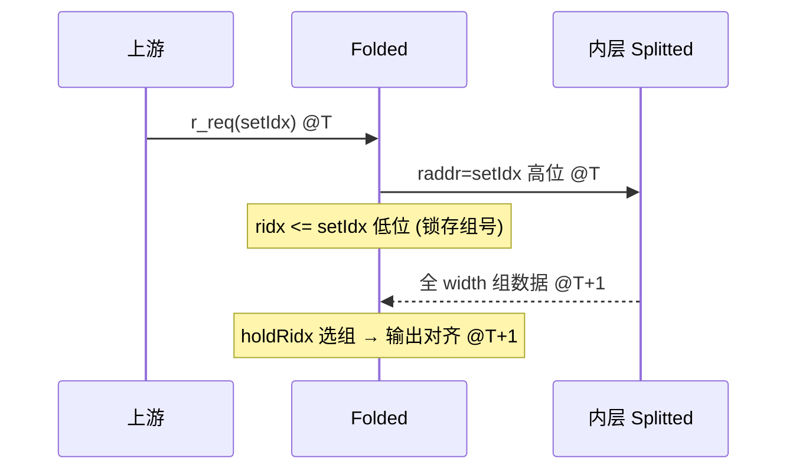

# FoldedSRAMTemplate —— 折叠式 SRAM（把"深"逻辑 SRAM 折叠成"宽"物理阵列）

| | |
|---|---|
| 手写 SV | `rtl/common/FoldedSRAMTemplate_variants.sv` |
| Scala 来源 | `utility/src/main/scala/utility/sram/SRAMTemplate.scala`（class FoldedSRAMTemplate） |
| 依赖 | [SplittedSRAMTemplate](SplittedSRAMTemplate.md)（内层，已单独验证） |
| 验证状态 | UT ✅（5 个变体各 4 万拍 0 错）/ FM ✅（内层 Splitted 当黑盒，全部 SUCCEEDED） |

## 功能与动机

逻辑上 BPU 表常常很"深"（set 数很多），但又"窄"（每个 set 只有 1～2 路、位宽小）。
深而窄的物理 SRAM 面积/时序差。**folding（折叠）** 把逻辑 set 沿"行"折叠 `width` 份：
物理阵列 set 数变为 `nRows/width`，但每个物理 set 横向多放 `width` 组，于是

```
物理 way 数  = width × 逻辑 way 数
物理 set 数  = 逻辑 set 数 / width
```

存储总量不变，但物理阵列变得"浅而宽"，更易布局。

## 地址拆分

逻辑 `setIdx` 拆成两部分：

```
        ┌───────────────────────────┬──────────────────┐
setIdx  │  高位 [.. : log2(width)]   │ 低位 [log2(width)-1:0] │
        └───────────────────────────┴──────────────────┘
              = 物理 set 地址 raddr        = 折叠组号 group
```

- **读**：用 `raddr` 一次读出物理 set 的全部 `width` 组（= width × 逻辑way 个物理路），
  再用"寄存后的组号"`holdRidx` 选出本次请求那一组的输出。
- **写**：只写"`group` 对应那一组"的逻辑路 —— 把 `waymask` 按组展开成物理 waymask
  （只有该组的位为 1），数据广播到所有组（只有被选中组真正写入）。

## 时序：ridx 寄存 + holdRidx 读保持

内层 SRAM 读延迟 1 拍，所以选组的组号必须打一拍与读数据对齐：



`holdRidx` 还要处理"本拍无新读请求"的情况（内层 holdRead 会保持上次数据）：

```
last_read           = (上一拍是否有 r_req)        // 寄存
holdRidx            = last_read ? ridx : hold_data // 有新读用新组号，否则沿用保持值
hold_data           <= ridx (当 last_read)         // 锁存保持值
```

base 变体有 2 条逻辑输出 lane，golden 为每条 lane 复制一套 ridx 保持（本重写用数组
`holdRidx[NWAY]` 表达）；单 lane 变体（`_21`/`_23`）只有一套。

## 已覆盖变体

| golden | width | 逻辑（set×way×bit） | 内层 Splitted | 看点 |
|------|------|------|------|------|
| `FoldedSRAMTemplate` | 8 | 2048×2×1（TAGE useful） | SplittedSRAMTemplate_3 | base：width=8，2 way，逐 lane holdRidx，extra_reset |
| `FoldedSRAMTemplate_1` | 1 | 512×2×12（TAGE 表） | SplittedSRAMTemplate_4 | width=1 即关闭折叠 → 纯透传 |
| `FoldedSRAMTemplate_21` | 2 | 256×1×38（ITTAGE） | SplittedSRAMTemplate_24 | width=2，单 way，holdRidx 二选一，bitmask 透传 |
| `FoldedSRAMTemplate_23` | 4 | 512×1×38（ITTAGE） | SplittedSRAMTemplate_26 | width=4，holdRidx 四选一，内层 dataSplit+双 bore |
| `FoldedSRAMTemplate_20` | 4 | 2048×2×2（TageBTable） | SplittedSRAMTemplate_23 | width=4，2 逻辑 way×4 折叠组=8 物理 way，逐 lane holdRidx；内层 setSplit=2 双 bank（2 套 bore） |

写 waymask 展开：`phys_waymask[group*NWAY+way] = (w_group==group) & waymask[way]`
（单 way 变体简化为 `waymask = (1 << w_group)`）；读 mux：`out = phys_rdata[holdRidx]`。

> 全部 5 个 FoldedSRAMTemplate 变体（含 `_20`，内层链 `SplittedSRAMTemplate_23 → SRAMTemplate_64`）
> 均已覆盖，无跳过项。

## 验证

- **UT**：golden vs `<变体>_xs`，两者均例化 golden 内层 SplittedSRAMTemplate +
  golden SRAMTemplate + 宏链（共用），随机 r/w/bore，4 万拍逐拍比对所有输出 0 错——
  验证折叠地址拆分、ridx/holdRidx 时序、waymask 按组展开、读 mux 选组。
  5 个变体均 `checks≈39604, errors=0`。
- **FM**：内层 SplittedSRAMTemplate 与最内层 SRAMTemplate 经
  `hdlin_unresolved_modules black_box` 当**已验证黑盒**，两侧都黑盒内层，只比对
  Folded 自身的折叠逻辑（组号寄存器、mask 展开、读 mux）。5 个变体均 SUCCEEDED。
