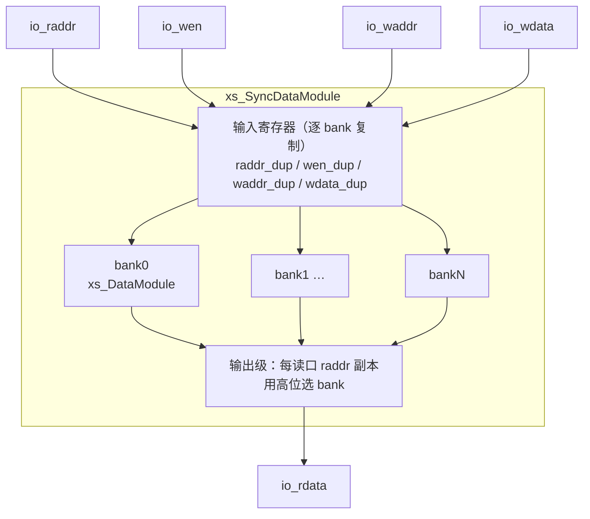

# xs_SyncDataModule / xs_DataModule —— 分 bank 同步读数据模块

| | |
|---|---|
| 手写 SV | `rtl/common/SyncDataModule.sv`（`xs_SyncDataModule`）、`rtl/common/DataModule.sv`（`xs_DataModule`） |
| 变体包装 | `rtl/common/SyncDataModule_variants.sv`、`rtl/common/DataModule_variants.sv`（脚本生成） |
| Scala 来源 | `utility/src/main/scala/utility/DataModuleTemplate.scala` |
| 生成器 | `scripts/gen_dm_wrappers.py`（解析 golden 端口 → 包装层 + UT testbench） |
| 验证状态 | UT ✅（18 变体双例化 84.6 万拍 0 错）/ FM ✅（9 内层 + 9 外层全 SUCCEEDED） |

## 1. 功能概述

香山 FTQ、后端 PC 存储等使用的多读多写寄存器堆。两层结构：

- **xs_DataModule**（内层，对应 Chisel `DataModuleTemplate`）：组合读寄存器堆，
  每读口可选写旁路（同拍写同地址直通），多写口按条目聚合。
- **xs_SyncDataModule**（外层，对应 `SyncDataModuleTemplate`）：在内层之上加一拍
  地址寄存器实现**同步读**，并按容量分 bank。读延迟 1 拍。

分 bank 的目的是限制每个寄存器堆的容量（≥128 项时每 bank 64 项，否则 16 项），
并对读地址/写使能/写数据做**逐 bank 扇出复制**降低扇出。

## 2. 参数

### xs_DataModule

| 参数 | 含义 |
|------|------|
| `NUM_ENTRIES` / `NUM_READ` / `NUM_WRITE` | 条目数 / 读口数 / 写口数 |
| `DATA_WIDTH` | 数据位宽 |
| `BYPASS_EN[NUM_READ]` | 每读口写旁路使能位向量 |

### xs_SyncDataModule

额外参数：

| 参数 | 含义 |
|------|------|
| `HAS_REN` | 1 时读地址用 `RegEnable(io_ren)` 采样，0 时恒采样（`io_ren` 接 `'1`） |
| `MAX_BANK_ENTRIES` / `NUM_BANKS` | 由 `NUM_ENTRIES` 推导（≥128→64/bank，否则 16/bank） |

## 3. 接口（xs_SyncDataModule）

时钟 `clock`，异步高有效复位 `reset`（仅复位 `wen_dup`，数据/地址寄存器不复位）。

| 信号 | 方向 | 说明 |
|------|------|------|
| `io_ren[NUM_READ]` | in | 读使能（`HAS_REN=0` 时忽略） |
| `io_raddr[NUM_READ]` | in | 读地址 |
| `io_rdata[NUM_READ]` | out | 读数据（地址后 1 拍） |
| `io_wen / io_waddr / io_wdata[NUM_WRITE]` | in | 写使能 / 写地址 / 写数据 |

## 4. 内部结构

- **逐 bank 输入寄存器复制**：每 bank 复制一整套 `raddr_dup/wen_dup/waddr_dup/wdata_dup`。
  这些副本由同一逻辑驱动、值相同，是降扇出的设计冗余（FM 需开启重复寄存器合并才能比对，
  见下）。
- **bank 写选择**：`wen_dup & (写地址高位 == bank 号)`。
- **输出级**：每读口再复制一份读地址寄存器，用其高位 `Mux1H` 选择 bank 读出。

## 5. 写旁路语义

`BYPASS_EN[p]` 为真时，读口 p 在「某写口同拍写同地址」时直通写数据。注意外层是
同步读：旁路比较的是**打拍后**的读地址与**打拍后**的写地址（即下一拍读出时与上一拍
写入对齐），由内层 `xs_DataModule` 在 bank 内实现。各变体逐读口的旁路使能由
`gen_dm_wrappers.py` 从 golden 代码探测（匹配 `io_wen_w & io_waddr_w == io_raddr_r`
比较器）。

## 6. V2R2 变体（KunminghuV2Config）

9 个外层变体，各自例化对应内层 DataModule：

| 外层 | 读×写 | bank | hasRen | 内层 |
|------|-------|------|--------|------|
| `_BackendPC_64entry` | 15×1 | 4 | 是 | `DataModule_BackendPC_16entry` |
| `_FtqPC_64entry` | 7×1 | 4 | 否 | `DataModule_FtqPC_16entry` |
| `__1024entry` | 2×2 | 16 | 是 | `DataModule__64entry` |
| `__1024entry_1` | 2×2 | 16 | 是 | `DataModule__64entry_16` |
| `__64entry` ~ `__64entry_4` | 见 status | 4 | 多数是 | `DataModule__16entry*` |

字段裁剪：firtool 会裁掉上游绑常量/下游未用的结构体字段端口，包装层对缺失字段
写口补 0、读口跳过（见生成器 `canonical_fields`）。

## 7. 验证

- **UT**（`verif/ut/SyncDataModule/`）：18 个变体 golden vs `_xs` 双例化，全随机激励
  （en 类 75% 占空），`make run` 84.6 万次比对 0 错误。
- **FM**（`make fm`）：18 变体全部 SUCCEEDED。外层变体依赖 `fm_eq.tcl` 的
  **重复寄存器合并**（`verification_merge_duplicated_registers true`）——否则逐 bank
  的同值地址寄存器两侧各 N 个，名字与签名都无法配对。
