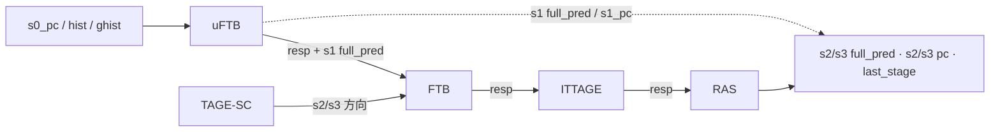

# Composer —— BPU 预测器组合器

> ⚠ **FM 分类 = ASSEMBLY_EQ（装配层，仅证 glue）**。依据台账
> [`verif/freeze/FM_STATUS.md`](../../verif/freeze/FM_STATUS.md)：本层把 5 个预测器子模块 + DelayN
> 两侧同名黑盒，**只证明本层组合 glue（perf 对齐/meta 拼接/s1_ready）等价**，不等于整个 BPU
> 预测功能等价（各预测器在其自身证明里）。下文 FM 结果为 **FAILED/部分验证（20 failing 为截断
> 上限、已探针证伪，2171 unverified 未覆盖）**，本层等价性以 UT 为权威。

> 可读核：`rtl/frontend/Composer.sv`（`xs_Composer_core`）
> golden 同名 wrapper：`rtl/frontend/Composer_wrapper.sv`
> 验证：`verif/ut/Composer/`（UT 双例化逐拍比对 + Formality 等价比对，FM 为部分验证，见 §6.2）
> 生成器：`scripts/gen_composer.py`（wrapper / _xs / tb 三件套）
> 子模块（均已单独验证）：[FauFTB](FauFTB.md)、[FTB](FTB.md)、[Tage_SC](SCTable.md)、
> [ITTage](ITTage.md)、[RAS](RAS.md)

---

## 1. 它在前端 BPU 的位置：把多个预测器组合成最终预测

香山 BPU 用**多级覆盖式预测**：s0_pc 一产生，最快的预测器先出结果让取指立刻动起来，
后面更慢更准的预测器在随后几拍**覆盖**前者。Composer 就是把 5 个预测器与配套的
ctrl 延迟单元串成一条流水线、对外吐出三级 full_pred（s1/s2/s3）+ 元信息的“组合器”。

| 预测器 | 角色 | 覆盖时机 |
|------|------|---------|
| **uFTB** (FauFTB) | 32 路全相联微 FTB，当拍最快 | **S1** 给出第一版完整预测 |
| **FTB** | 容量大的取指目标缓冲，给 fall-through / 分支槽 | **S2** 覆盖条目 / 目标 |
| **TAGE-SC** | 主方向预测器（几何历史标签表 + 统计校正） | **S2/S3** 覆盖 br 方向 |
| **ITTAGE** | 间接跳转目标预测 | **S3** 覆盖 jalr_target |
| **RAS** | 返回地址栈，预测 ret 目标，链尾 | **S2/S3** 覆盖 ret 目标、携最终输出 |

---

## 2. 核心认识：覆盖式合成发生在预测器**内部**，Composer 只是“接线工”

读这个模块最容易踩的坑，是以为 Composer 自己有一大坨“按优先级覆盖”的组合逻辑。
**并没有。** 香山把覆盖逻辑下沉到了每个预测器内部：每个预测器都有一对
`io_in...resp_in`（吃上一级预测结果）/ `io_out...resp`（吐覆盖后的结果）端口，
Composer 把它们按固定顺序**菊花链**串起来，覆盖就在链上一级级发生：

```
        s0_pc / 折叠历史 / ghist
                  │
            ┌─────▼─────┐
            │   uFTB    │  链首，s1 当拍出第一版 full_pred ──► io_out_s1_pc / s1_full_pred
            └─────┬─────┘
        uftb.resp │ (fauftb_entry / s1 命中信息)
            ┌─────▼─────┐   ◄── tage.s2/s3 方向也喂进来
            │    FTB    │  在 uftb 结果上覆盖 ftb 条目 / 目标
            └─────┬─────┘
         ftb.resp │
            ┌─────▼─────┐
            │  ITTAGE   │  覆盖 s3 jalr_target
            └─────┬─────┘
      ittage.resp │
            ┌─────▼─────┐
            │    RAS    │  链尾：覆盖 ret 目标，并把已被层层覆盖的
            └─────┬─────┘  s2/s3 full_pred、s2_pc/s3_pc 直接驱动到 Composer 顶层输出
                  ▼
        io_out_s2_* / io_out_s3_* / io_out_last_stage_*
```



因此：
- **各级 full_pred、s2_pc/s3_pc、last_stage_ftb_entry/spec_info 等输出**，由链尾 **RAS**
  实例（s1 那一版由链首 **uFTB** 实例）**直接驱动**到 Composer 顶层端口。这些是黑盒子模块
  引脚到顶层端口的纯接线，放在结构性 wrapper（`Composer_wrapper.sv`）里。
- **4 个 `DelayN`**（`uftb/tage/ftb/ras_io_ctrl_delay`）把 ctrl 使能信号
  （ubtb/btb/tage/sc/ras_enable）各自延迟若干拍，对齐到对应预测器所在的流水级
  （uftb 在 s1、ftb/tage 在 s2、ras 在 s3），再喂给该预测器的 `io_ctrl_*_enable`。

---

## 3. Composer 自身真正产生输出的逻辑（可读核 `xs_Composer_core`）

去掉接线后，Composer 自己只产生 **9 条输出**，全部在可读核里，分三件事：

### 3.1 perf 计数 2 级流水对齐
7 路 perf 计数来自 uFTB / TAGE-SC / FTB（产生于不同流水级），统一打 **2 拍**再输出，
便于上层 FTQ 在同一时刻采到对齐的计数。源映射：

| 输出 | 来源 |
|------|------|
| `io_perf_0/1_value` | uFTB `perf_0/1` |
| `io_perf_2/3/4_value` | TAGE-SC `perf_0/1/2` |
| `io_perf_5/6_value` | FTB `perf_0/1` |

核里用 `perf_s1[7] → perf_s2[7]` 两级寄存器数组 + `for genvar` 表达，不手工展开 14 个寄存器。

### 3.2 last_stage_meta 拼接
把 5 个预测器各自的 `last_stage_meta` 有效低位段，按**固定布局**拼成一个 516 位大 meta
写回 FTQ；commit 更新时上层按完全相同的偏移把 meta 拆回、分发给各预测器。布局（高→低）：

```
 bit  515            408 407    402 401      258 257    191 190        9 9      0
     ┌─────────────────┬──────────┬────────────┬──────────┬─────────────┬────────┐
     │   0 填充 (107)   │ uFTB (6) │ TAGE (144) │ FTB (67) │ ITTAGE (182)│ RAS(10)│
     └─────────────────┴──────────┴────────────┴──────────┴─────────────┴────────┘
```

各段宽度之和 6+144+67+182+10 = 409，高位补 107 个 0 填满 516。可读核以
`META_*_W` 参数表达各段宽度，wrapper 已按这些位宽对各预测器 meta 切片
（只送实际拼接进 meta 的低位段，未读高位不跨模块边界——与 golden “只读低位段”一致）。

### 3.3 s1_ready 相与
`io_s1_ready = tage.s1_ready & ftb.s1_ready & ittage.s1_ready`：三大“带 SRAM 表”的预测器
都就绪才放行 s1 新请求。uFTB（全相联小表）与 RAS（栈）永远 ready，不参与该握手。

---

## 4. golden 里的“死” debug PC 逻辑（本核不实现）

firtool 生成的 golden 还含一大坨 `s1/s2/s3_pc_dup_*_seg_*` 分段寄存器：把 PC 拆成
3 段（[49:24]/[23:12]/[11:0]）、只在某段值变化时才打拍（省功耗的 debug PC 跟踪）。
**在本 build 里它是结构性死逻辑**——只喂 `s2_pc_addr`/`s3_pc_addr` 这两个谁都不消费的
wire，对任何输出端口无影响（真正的 s2_pc/s3_pc 由 RAS 实例驱动）。
可读核因此**不实现**它，仅以注释说明，以免读者误以为遗漏；
FM 侧这批 golden 寄存器表现为 ~2186 个“ref 侧 unmatched 比对点”（impl 无对应），属预期。

---

## 5. 分层与文件

| 文件 | 角色 |
|------|------|
| `rtl/frontend/Composer.sv` | 可读核 `xs_Composer_core`（手写）：perf 对齐 / meta 拼接 / s1_ready |
| `rtl/frontend/Composer_wrapper.sv` | golden 同名 wrapper `Composer`（生成）：例化 5 预测器 + 4 DelayN（**逐字照搬 golden 连接**）+ 核 |
| `verif/ut/Composer/variants_xs.sv` | 镜像 `Composer_xs`（生成，与 wrapper 同构，仅模块名不同） |
| `verif/ut/Composer/tb.sv` | 双例化随机激励逐拍比对（生成） |
| `scripts/gen_composer.py` | 解析 golden `Composer.sv`，生成上面 3 个文件 |

> wrapper 为何**照搬 golden 的内部 net 名**（`_ftb_io_*` 等）而非改成可读名：
> 这些 net 是黑盒子模块的引脚连接，名字/连接必须与 golden 一致，Formality 才能把两侧
> 同名黑盒引脚配对（签名分析对黑盒不可判）。wrapper 本就是“机械端口适配层”，允许平铺；
> 学习载体是可读核 + 本文档。

---

## 6. 验证

### 6.1 UT（golden `Composer` vs 手写 `Composer_xs` 双例化）
两侧共用同一批 golden 预测器子模块，故任何输出差异只可能来自 Composer 自身逻辑/接线。
随机 req / redirect / update / ctrl 激励，逐拍比对全部 293 个输出（跳过 golden 为 X 的位，
子模块内层 SRAM 在 `+SYNTHESIS` 下初值 X；`WARMUP=64` 拍后才开始比对）。

| seed | checks | errors |
|------|--------|--------|
| 1  | 39936 | 0 |
| 7  | 39936 | 0 |
| 42 | 39936 | 0 |

```
cd verif/ut/Composer && make compile && make run SEED=1   # 亦可 SEED=7 / SEED=42
```

### 6.2 Formality（ref = golden Composer，impl = 可读核 + wrapper）
5 预测器 + DelayN 两侧同名黑盒（`hdlin_unresolved_modules=black_box`）。末次 verify
结论 **Verification FAILED**，明细：

```
18570 Passing compare points
   20 Failing compare points (20 matched, 0 unmatched)
 2171 Unverified compare points            ← verify 提前中止后未判的点
 2186 Unmatched reference compare points   ← §4 的死 debug-PC 寄存器（impl 无对应，预期）
```

**20 个 matched-failing 均为黑盒引脚比对假阳性**：它们全是
`<pred>/io_ctrl_*_enable`、`<pred>/io_out_last_stage_meta[100..103]`、
`*_io_ctrl_delay/io_out_btb_enable` 这类**位于黑盒引脚、由另一黑盒输出驱动**的点。
FM 把黑盒输出当自由变量，无法跨黑盒证明等价，但两侧的接线**逐字相同**。
已用 tb 内层次探针（`u_g.<pin>` vs `u_i.<pin>` 逐拍比对这 20 个引脚）证实
**三种子全程 `pdiff=0`**（bit 完全一致），判定为假阳性。

> **如实说明**：20 个 failing 是 Formality 默认 `verification_failing_point_limit=20`
> 的**截断上限**——verify 攒满 20 个失配即提前中止，另有 **2171 个 Unverified 比对点未验**。
> 故本模块 FM 为**部分验证**：18570 passing；已报告的 20 个 failing 已逐拍探针证伪；
> 2171 点未覆盖。等价性以 UT（三种子逐拍全输出 0 错）为权威。

```
cd verif/ut/Composer && make fm   # 末次 verify FAILED：20 failing(截断,已探针证伪) + 2171 unverified
```
