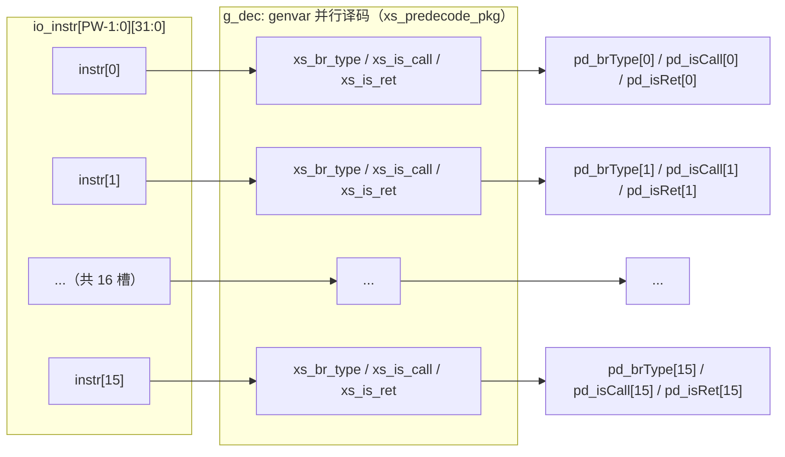

# F3Predecoder —— F3 阶段分支预译码

| | |
|---|---|
| 手写 SV | `rtl/frontend/F3Predecoder.sv`（`xs_F3Predecoder_core`）+ `rtl/frontend/F3Predecoder_wrapper.sv` |
| 共享译码 | `rtl/frontend/predecode_pkg.sv`（与 [PreDecode](PreDecode.md) 复用） |
| Scala 来源 | `src/main/scala/xiangshan/frontend/PreDecode.scala`（class F3Predecoder） |
| 验证状态 | UT ✅（20 万随机向量 0 错）/ FM ✅（SUCCEEDED） |

## 功能

IFU 的 F3 级对 `PredictWidth`(=16) 条**已对齐的 32-bit 指令**做分支信息译码，仅输出
每条的 `brType`/`isCall`/`isRet`（该模块不产出 valid/isRVC，Chisel 中为 DontCare，
firtool 未引出对应端口）。纯组合。

与 PreDecode 的区别：PreDecode 输入是未对齐的半字流、还需做 RVC 边界检测与偏移计算；
F3Predecoder 输入已是对齐指令，只取分支译码这一子集。两者的分支译码（brType/isCall/
isRet）语义完全相同，统一由 `xs_predecode_pkg` 提供（单一来源，避免分叉）。

### 结构（`PW=16` 槽并行，genvar `g_dec`）

每个槽 i 对应一条独立的 32-bit 指令，组合译出 3 个分支字段；各槽互不相干，纯并行无状态
（`rtl/frontend/F3Predecoder.sv:19-23`）。

> 图注：F3Predecoder 是 16 槽完全并行的纯组合阵列，单槽通路 `指令 → 分支译码函数 →
> brType/isCall/isRet`。译码函数与 PreDecode 共享（`predecode_pkg.sv`）。

## 接口（手写核 `xs_F3Predecoder_core` 端口，打包向量）

`PW = PredictWidth = 16`。手写核端口是**打包向量**（非 golden 的扁平 `_0.._15` 标量），
对应 `rtl/frontend/F3Predecoder.sv:14-17`：

| 信号 | 方向 | 说明 |
|------|------|------|
| `io_instr` | in `[PW-1:0][31:0]` | 16 条对齐指令（打包向量） |
| `pd_brType` | out `[PW-1:0][1:0]` | 各条分支类型（notCFI/branch/jal/jalr） |
| `pd_isCall` | out `[PW-1:0]` | 各条是否 call |
| `pd_isRet` | out `[PW-1:0]` | 各条是否 ret |

> golden 的扁平端口名（`io_in_instr_0..15` / `io_out_pd_i_brType` …）由
> `F3Predecoder_wrapper.sv` 适配，手写核内部不存在这些名字（核里 grep `io_in_instr` 0 命中）。

## 验证

- **UT**（`verif/ut/F3Predecoder/`）：golden vs `F3Predecoder_xs`，20 万随机指令向量
  逐拍比对全部 48 个输出；0 错误。
- **FM**（`make fm`）：SUCCEEDED。
