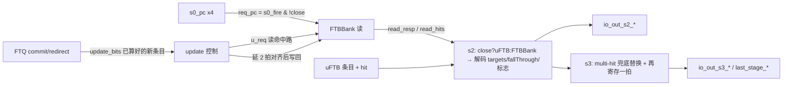

# FTB —— Fetch Target Buffer 预测器顶层（学习文档）

| | |
|---|---|
| 手写 SV | `rtl/frontend/FTB.sv`（`xs_FTB_core`）+ `rtl/frontend/FTB_wrapper.sv`（golden 同名 `FTB`） |
| 共享类型 | `rtl/frontend/ftb_pkg.sv`（`ftb_slot_t`/`ftb_entry_t` + 目标编解码，**直接复用**） |
| Scala 来源 | `src/main/scala/xiangshan/frontend/FTB.scala`（`class FTB`） |
| 子模块（黑盒） | `FTBBank`（SRAM bank，已单独重写验证）、`DelayNWithValid`/`DelayNWithValid_1`（延 2 拍）、`DelayN_1`（延 2 拍位） |
| 验证状态 | UT ✅（8 万拍随机 0 错，checks=79209）/ FM ✅（**SUCCEEDED**，5251 passing / 0 failing） |
| 重写标准 | 符合 `docs/REWRITE_STYLE.md`（struct/数组/genvar/纯函数/中文注释，0 生成痕迹） |

---

## 1. FTB 在 BPU 中的角色

香山前端用「多级覆盖式（overriding）」分支预测。FTB 是其中容量最大、命中率最高的
「取指目标缓冲」：它告诉前端**这一取指块里有没有控制流指令（CFI）、跳到哪、顺序执行
落到哪（fall-through）**。

- **预测路径**：S1 发起对 `FTBBank`（4 路 × 512 组组相联 SRAM）的读；S2 得到命中条目并
  解码出分支槽目标 / tailSlot 目标(jalr) / fall-through 地址 / 各类标志；S3 再寄存一拍输出
  「最终（last_stage）」预测，**覆盖** S1 级零气泡微型 uFTB（`xs_FauFTB`）的结果。
- **更新路径**：FTQ 在提交（commit）/重定向时，把**已经算好的**新条目经 `update` 通道写回
  `FTBBank` 的 SRAM（新条目的生成在 FTQ 的 `FTBEntryGen` 内，**不在本模块**）。



---

## 2. 三级流水（s0 → s1 → s2 → s3）

| 级 | 关键动作 | 主要寄存器（本核） |
|---|---|---|
| s0（组合） | BPU 给 `s0_pc`；`req_pc.valid = s0_fire & !s0_close` 发给 FTBBank | — |
| s1 | FTBBank 出 `read_resp`+`read_hits`；算 `s1_hit = !s1_close & hits_valid & btb_enable` | `s1_pc[4]` / `s1_close` |
| s2 | 寄存 uFTB 条目 / FTBBank 条目 / hit；`s2_entry = close?uFTB:FTBBank`；组合解码全部 s2 输出 | `s2_fauftb_entry/s2_ftbBank/s2_*_hit`、`s2_seg{0,1,2}`、`s2_pc_higher/middle(±1)`、`s2_meta` |
| s3 | multi-hit 时整条目替换为 `read_multi_entry`；再寄存一拍输出 last_stage | `s3_entry/s3_hit/s3_multi_hit/s3_ft_err`、`s3_seg*`、`s3_pc_*`、`s3_meta` |

**4 路 dup 复制**：所有流水量都按 `NDUP=4` 复制（golden 的 `_dup_0..3` / `io_*_fire_0..3`）。
这是**物理扇出复制**（同值多副本以降低长线负载），不是功能多端口。本核用 `[NDUP]` 数组 +
`genvar` 表达，与 golden 一一对应。其中 **dup0 额外承载全局状态**（`close` 流水、meta、
uFTB 一致性计数器、s3 fallThroughErr 来源），其余 dup 只复制 entry/pc/hit。

---

## 3. 目标地址解码（复用 ftb_pkg 的压缩编码思想）

FTB 条目的 slot 不存完整 50-bit 目标，只存 `lower`（低位）+ `tarStat`（高位状态
FIT/OVF/UDF，见 `xs_ftb_pkg`）。重建完整目标需要「PC 高位 ±1」。

为放松时序，golden 在**打拍时**预先算好 PC 的 `higher(29b)` / `middle(8b)` 以及各自的
`±1`，组合期只做 one-hot 选择 + 拼接。本核保留这套结构（`s2_pc_higher/middle/±1`、
`s3_pc_*`），用纯函数表达拼接：

- `sel_higher(tarStat, h, h+1, h-1)`：按 `tarStat` 三选一返回 37-bit「高段+中段」，
  用于 **brSlot 目标**与 **共享 tailSlot 目标**（lower 取低 12 位）。
- `sel_higher29(...)`：返回 29-bit 高段，用于**非共享 tailSlot（真跳转/jalr）**目标
  （lower 取 20 位）。

> 与 `ftb_pkg::get_target` 同语义（one-hot 选高位），但本核因目标 PC 已被切成
> higher/middle/各 ±1 的预算寄存器，故就地展开拼接而非调用包函数——两者数值等价。

### fall-through 地址与 fallThroughErr

- `fallThroughAddr`：正常时 = `{PC高位(carry?+1), pftAddr, 1'b0}`；非法时回退成 `pc + 0x20`。
- `fallThroughErr = ft_err(pc_off, {carry,pftAddr})`：落点早于当前 PC offset、或超出一个
  取指块（>16 半字）→ 非法。
- **注意（golden 行为）**：s3 各 dup 的 `fallThroughErr` 都取 **dup0 的 s2 计算结果**
  `real_s2_fallThroughErr`（含 multi-hit 修正），而非各自重算——本核照此实现
  （`s3_ft_err[d] <= real_s2_ft_err`）。

---

## 4. close_ftb_req（关闭 FTB 预测以省功耗）

当连续多拍发现 **FTB 与 uFTB 给出的条目完全一致**（一致计数器 `consistent_cnt > 0x1F3`），
说明 uFTB 已经足够准，便「关闭」FTB 预测读：

- `close` 时改用 uFTB 条目（`s2_entry = uFTB`），且 `req_pc.valid` 拉低、不再读 SRAM。
- `s0_close → s1_close → s2_close` 随 fire 推进。
- **重开**：遇到 `false_hit` 或 IFU 重定向时 `needReopen=1`，清零计数器、撤销关闭。

一致性判定用纯函数 `entry_eq(a,b)`——逐有意义字段比较，`brSlot.lower` 只比有效低 12 位
（高 8 位无意义/未驱动），与 golden 的逐字段比较项完全一致。

> FM 教训：一开始用整 struct `==` 比较导致 `consistent_cnt` 不等价——因为 `brSlot.lower`
> 高 8 位在硬件里不被驱动（X/任意），整体相等会把这些无意义位也算进去。改成 `entry_eq`
> 只比有效字段后即等价。

---

## 5. multi-hit 兜底

`FTBBank` 在 s2 报「一组内多路同时命中」(`read_multi_hits` / `read_multi_entry`)。多命中时
`OHToUInt` 会算错命中路号，可能用错条目。本核：

- `s2_multi_hit_en = read_multi_hits_valid & s2_fire & !close`；
- s2→s3 寄存时，若 `s2_multi_hit_en` 则把 **整条目替换为 `read_multi_entry`**，并把
  `multiHit` 标志、对应的 meta 带到 s3，让上层在 s3 触发纠正性重定向。
- dup0 的 fallThroughErr / fallThroughAddr 也据 multi 条目的 `pft/carry` 重算（`real_s2_*`）。

---

## 6. update 写回路径

```mermaid
flowchart TB
  UV[update_valid] --> UR[打一拍 update_r_entry / false_hit / old_entry / meta_r]
  UR --> DEC{meta[64] ?}
  DEC -->|1 update_now| NOWWR[立即写: 用 update_r 直接写, way=meta66:65]
  DEC -->|0 need_read| RD[向 FTBBank 发 u_req 读命中路]
  RD --> HITS[FTBBank 回 update_hits → way / alloc 打一拍]
  RD --> DLY[update_r 经 DelayNWithValid 延 2 拍对齐]
  HITS --> WR[延 2 拍后写回 FTBBank]
  DLY --> WR
```

- `u_valid = update_valid & !old_entry & !s0_close`。
- `update_now`（meta[64]=1）：直接写，写 way 取 FTQ 给的 `meta[66:65]`。
- `update_need_read`（meta[64]=0）：先向 FTBBank 发更新读查命中路，FTBBank 回
  `update_hits` → 写 way / alloc（命中路改写 or 未命中新分配）打一拍；写数据 / 写 PC 经
  `DelayNWithValid`(50b pc) / `DelayNWithValid_1`(entry 扁平字段) 延 2 拍、写有效经
  `DelayN_1` 延 2 拍，三者对齐后驱动 FTBBank 写口。
- `io_s1_ready = req_pc_ready & !need_read & !need_read_d1`：更新读占用 SRAM 单端口那拍
  压低 ready，避免与预测读冲突。

---

## 7. 接口表（核 `xs_FTB_core`，wrapper 拆成 golden 扁平端口）

| 组 | 端口 | 含义 |
|---|---|---|
| s0/s1 入 | `io_in_bits_s0_pc[4]` / `io_s{0,1,2}_fire[4]` / `io_s3_fire_0` / `io_s1_ready` | s0 PC（4 dup）+ 各级 fire + ready |
| 控制 | `io_ctrl_btb_enable` / `io_reset_vector` | btb 使能 / 上电向量 |
| 上游透传 | `io_in_s2/s3_br_taken_mask[4]` / `io_in_last_stage_sc_disagree` | br_taken_mask 取或、sc_disagree 直通 |
| uFTB | `io_fauftb_entry_in` / `io_fauftb_entry_hit_in` | S1 微 FTB 条目 + 命中（关闭判定/覆盖用） |
| s2 出 | `io_out_s2_*[4]` | 4 路 full_pred：br_taken_mask/slot_valids/targets_{0,1}/jalr_target/offsets/fallThrough{Addr,Err}/is_{jal,jalr,call,ret}/last_may_be_rvi_call/is_br_sharing/hit |
| s3 出 | `io_out_s3_*[4]` | 同上（多 `multiHit`，无 `jalr_target`） |
| s1 杂项 | `io_out_s1_{uftbHit,uftbHasIndirect,ftbCloseReq}` | 透传 uFTB 命中 / 间接跳转 / close 标志 |
| last_stage | `io_out_last_stage_{meta, sc_disagree, ftb_entry}` | s3 dup0 的 meta / spec_info / 完整条目 |
| update | `io_update_valid/_bits_{pc,ftb_entry,false_hit,old_entry,meta}` / `io_redirectFromIFU` | 写回通道 |
| perf | `io_perf_0_value` / `io_perf_1_value` | 性能计数 |
| 子模块对接 | `ftbBank_*` / `delay_pc_*` / `delay_entry_*` / `delay_wv_*` | 与黑盒 FTBBank / DelayN* 的结构化连线 |

---

## 8. 验证

### UT（`verif/ut/FTB/`）

`tb.sv` 同时例化 golden `FTB` 与可读 `FTB_xs`（均内部例化 golden 子模块 + SRAM/Mbist 链），
随机 s0_pc(4 路)、各级 fire、`ctrl_btb_enable`、uFTB 输入条目、update 通道（write entry /
false_hit / old_entry / meta / redirectFromIFU），逐拍比对**全部功能输出**：

- s1：ready / uftbHit / uftbHasIndirect / ftbCloseReq；
- s2/s3：4 路 full_pred 全字段；
- last_stage：meta / sc_disagree / ftb_entry 全字段；perf_0 / perf_1。

内层 SRAM 在 `+define+SYNTHESIS` 下初值 X，比对用 `!$isunknown(golden)` 跳过 golden 未写项。
**结果：checks=79209，errors=0，`TEST PASSED`。**

### FM（`make fm`）

参考 = golden `FTB`，实现 = `xs_FTB_core` + `FTB_wrapper`。子模块（FTBBank /
DelayNWithValid* / DelayN_1）两侧都不提供源码 → `hdlin_unresolved_modules=black_box` 当黑盒，
只比 FTB 顶层的流水 / close / 目标解码 / update 控制逻辑。
**结果：`FM_RESULT: Verification SUCCEEDED`（5251 passing / 0 failing / 0 unmatched compare points）。**

---

## 9. 关键设计决策小结

1. **复用 `xs_ftb_pkg`**：`ftb_entry_t` / `ftb_slot_t` 与目标编码常量（FIT/OVF/UDF、各 OFF_LEN）
   直接复用，未重定义条目结构。
2. **dup 用数组 + genvar**：把 golden 的 `_dup_0..3` 展平名收敛成 `[NDUP]` 数组，dup0 承载
   全局状态、其余只复制条目/pc/hit。
3. **目标解码用纯函数** `sel_higher` / `sel_higher29` / `ft_err`，与 ftb_pkg 同语义但就地展开
   预算的 higher/middle 段。
4. **一致性比较用 `entry_eq`**（只比有效字段，含 `brSlot.lower[11:0]`）——这是 FM 等价的关键。
5. **子模块全部黑盒**：新条目生成在 FTQ（不在本模块）；FTBBank / DelayN* 由 wrapper 例化
   golden 同名模块对接。
