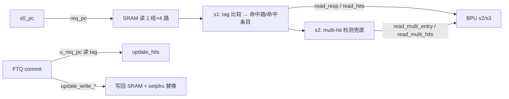
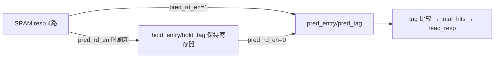

# FTBBank —— 大容量组相联 FTB 的 SRAM bank（学习文档）

| | |
|---|---|
| 手写 SV | `rtl/frontend/FTBBank.sv`（`xs_FTBBank`）+ `rtl/frontend/FTBBank_wrapper.sv`（golden 同名 `FTBBank`） |
| 共享类型 | `rtl/frontend/ftb_pkg.sv`（`ftb_slot_t`/`ftb_entry_t` + 目标编解码，**直接复用**） |
| Scala 来源 | `src/main/scala/xiangshan/frontend/FTB.scala`（`class FTB` 内部类 `FTBBank`） |
| 存储依赖 | `rtl/common/SplittedSRAMTemplate_variants.sv` 的 `SplittedSRAMTemplate_2`（4 路 × 512 组，dataSplit=8） |
| 验证状态 | UT ✅（约 6 万拍随机 0 错，checks=59407）/ FM ✅（**SUCCEEDED**） |
| 重写标准 | 符合 `docs/REWRITE_STYLE.md`（struct/数组/纯函数/中文注释，无生成痕迹） |

---

## 1. 它在前端 BPU 的位置

香山前端用「多级覆盖式」分支预测：S1 级有零气泡的微型 uFTB（`xs_FauFTB`）抢先给出预测；
S2/S3 级由容量大得多、命中率更高的 **FTB** 覆盖修正。`FTBBank` 就是大 FTB 的核心存储 +
查询/更新单元。



`FTB.scala` 的外层 `class FTB` 负责 uFTB/FTB 的级间寄存、关闭/重开 FTB（与 uFTB 一致性
计数）、s2/s3 的目标合成与 fallThroughErr 检查等；本模块 `FTBBank` 只管**存储本身**：
发地址、4 路读出、tag 比较、命中选择、替换决策、写回。

---

## 2. 组相联结构

| 参数 | 值 | 物理含义 |
|------|----|---------|
| `numEntries` | 2048 | FTB 总条目数 |
| `numWays` | 4 | 组相联路数 |
| `numSets` | 512 | 组数 = entries/ways |
| `IDX_W` | 9 | log2(numSets)，set index 位宽 |
| `TAG_W` | 20 | FtbTagLength，tag 位宽 |
| `SKEW_W` | 3 | 索引异或打散位数（skewedBits） |

每组 4 路并行存 `{ftb_entry_t entry, [19:0] tag}`。一次查询：
1. 用 PC 算 set index，从同一组读出 4 路 `{entry, tag}`（一拍后到）；
2. 下一拍用 PC 的 tag(20b) 与 4 路 tag 并行比较，且该路 `entry.valid` → 命中向量 `total_hits`；
3. `total_hits` 经 OHToUInt 得命中路号 `hit_way`，Mux1H 选命中条目作 `read_resp`。

### 索引为何要异或打散（skewed index）

set index 不是直接取 PC 低位，而是把 tag 的低位异或进 index：

```
req_idx = pc[9:1] ^ pc[12:4]        // get_idx
req_tag = pc[29:10]                  // get_tag
```

对应 Chisel `FTBTableAddr.getIdx = addr.getIdx(x) ^ getTag(x)[idxBits+skew-1 : skew]`。
异或打散让相邻/规律的 PC 更均匀地散布到各组，减少 conflict miss。

### tag 与 entry 同存一块多路 SRAM

tag 不是单独的 tag 阵列，而是和 entry 一起作为 `{entry, tag}` 写进多路 SRAM
（`SplittedSRAMTemplate_2`）。SRAM 内部用 `dataSplit=8` 把每路约 70-bit 的 `{entry, tag}`
切成 8 片以适配物理 SRAM 位宽——这层切分/拼回在 SRAM 内完成，`xs_FTBBank` 把它当黑盒，
只面向 `ftb_entry_t sram_r_entry[4]` 与 `[19:0] sram_r_tag[4]` 的结构体数组。

---

## 3. 两条读通路：预测读 vs 更新读（单端口仲裁）

SRAM 是**单端口**（`singlePort`），预测读（`req_pc`）与更新读（`u_req_pc`）共用读口，
二者不会同拍有效（外层保证，golden 有断言 `assert(!(req_pc.valid && u_req_pc.valid))`）。
读地址 **更新读优先**：

```
sram_r_req_setIdx = u_req_pc.valid ? get_idx(u_req_pc) : get_idx(req_pc)
```

### 预测读的 HoldUnless（为何 holdRead 外提到本模块）

`FTB.scala:495` 注释说明：把 holdRead 逻辑外提，是为了修「更新读覆盖预测读结果」的 bug。
实现为：

```
pred_rdata = HoldUnless(sram_resp, RegNext(req_pc.valid && !update_access))
```

即只有「上一拍确实是预测读」(`pred_rd_en`) 时才用本拍 SRAM resp 刷新保持寄存器，否则维持
旧值。这样更新读穿插进来时，不会把上次预测读的 4 路结果冲掉。手写核中：



> 保持寄存器异步复位清 0：条目 `valid` 位必须复位，避免上电用随机数据误命中。

### 更新读命中（update_hits）

FTQ commit 时先查该 PC 是否已在 FTB（决定改写命中路还是新分配）。更新读**直接用 SRAM
当拍 resp**（不经 HoldUnless）比 `u_req_tag`，且该路 `valid`，且 `RegNext(update_access)`：

```
u_total_hits[w] = (sram_r_tag[w] == u_req_tag) & sram_r_entry[w].valid & RegNext(update_access)
```

---

## 4. multi-hit 兜底（read_multi_*）

理想下一组内最多一路命中。但 SRAM 数据可能因软错误/异常写出现**两路同 tag 命中**，此时
`OHToUInt(total_hits)` 会把多个 one-hot 位 OR 在一起算出错误路号，导致用错条目算目标、地址
错、影响性能（不影响正确性，后续会纠正）。

解决：把 `total_hits` 与各路条目寄存一拍（s2），检测「≥2 路同时命中」(`multi_hit`)，并用
**PriorityMux** 选最低位命中路的条目作兜底。该兜底在 s2 检测、s3 用它触发重定向，比主命中
晚一拍以放松时序。

```
multi_hit = OR_{i<j} (total_hits_reg[i] & total_hits_reg[j])
multi_way / read_multi_entry = PriorityMux(选最低位命中路 / 其条目，默认链尾 way3)
```

> PriorityMux 无显式默认项：无命中时取链尾（way3）。手写核默认值据此设为 `NUM_WAYS-1`，
> 仅为与 golden 端口逐位等价（multi_* 仅在 `multi_hit` 有效时被上层使用）。

---

## 5. setplru 替换

每组一棵 **4 路二叉树 PLRU**，状态 `numWays-1 = 3` bit/组，共 512 组（`plru_state[512]`）。

| 操作 | 公式 | 时机 |
|------|------|------|
| 选 victim | `plru_victim4(st) = {st[2], st[2]?st[1]:st[0]}` | 分配新条目且组内全满时 |
| touch | `plru_touch4(st,way) = {~way[1], way[1]?~way[0]:st[1], way[1]?st[0]:~way[0]}` | 用过一路 → 让它远离 victim |

这两个纯函数与 `xs_FauFTB` 的 4 叶子树 PLRU 完全同源（uFTB 把 32 路拆成多层 4/8/16 叶
子树，FTB 每组就是一棵 4 叶子树）。

### 分配路选择（allocWay）

```
组内有空路(entry.valid=0) → 取最低位空路（PriorityEncoder(~valids)）
全满                      → PLRU victim
```

「各路 valid」用 `RegNext(sram_resp.entry.valid)`——即更新读那一拍读出的有效位，与分配在
同一拍可用。

### touch 的两个来源（一拍择一）

```
touch_valid = update_write_data_valid | RegNext(预测命中)
touch_set   = 写有效 ? u_idx : RegNext(req_idx)
touch_way   = 写有效 ? u_way : RegNext(hit_way)
```

读访问的 touch 延一拍（`RegNext`）放松时序——`FTB.scala:601` 注释 "Read replacer access is
postponed for 1 cycle, this helps timing"。写优先于读 touch。

---

## 6. 写回 SRAM

```
sram_w_req_setIdx = get_idx(update_pc)
u_way   = update_write_alloc ? allocWay : update_write_way   // 命中改写用上层给的命中路
waymask = UIntToOH(u_way)                                    // 4 路同条目/同 tag，按 waymask 选实际写入路
```

4 路写口都接同一个 `update_write_entry` / `update_write_tag`，由 `waymask` 决定实际写哪一路
（SRAM 的标准多路写语义）。

---

## 7. 与 FTBEntryGen / ftb_pkg / FauFTB 的关系

- **ftb_pkg**：条目类型 `ftb_entry_t`、目标压缩编解码 `get_target` 全部复用，FTBBank 存的就是
  这个标准条目。本模块自身不解码目标（那是外层 `FTB` 的 `fromFtbEntry` 做的），只负责存取。
- **FTBEntryGen**：FTQ 在 commit 时用它生成要写回的新条目，经 `update_write_data` 灌入本模块。
- **FauFTB**：uFTB 是全相联微型版（32 路、无 set、寄存器实现、自带饱和计数）；FTBBank 是组相联
  大容量版（512 组 × 4 路、SRAM、setplru）。二者条目同构（同一 `ftb_entry_t`），PLRU 同源。

---

## 8. 接口（核 `xs_FTBBank`，端口沿用 golden 扁平命名）

| 信号 | 方向 | 含义 |
|------|------|------|
| `io_req_pc_*` | in/out | 预测读请求（DecoupledIO） |
| `read_resp` | out | s1 命中条目（Mux1H） |
| `io_read_hits_{valid,bits}` | out | 命中有效 / 命中路号 |
| `read_multi_entry` | out | multi-hit 兜底条目 |
| `io_read_multi_hits_{valid,bits}` | out | multi-hit 有效 / 兜底路号 |
| `io_u_req_pc_*` | in | 更新读请求 |
| `io_update_hits_{valid,bits}` | out | 更新读命中（commit 查 PC 是否已在 FTB） |
| `io_update_access` | in | 本拍是更新读（与预测读互斥） |
| `io_update_pc` / `update_write_*` | in | 更新写：PC、条目、tag、way、alloc 标志 |
| `sram_r_*` / `sram_w_*` | in/out | 与 SplittedSRAMTemplate_2 对接的读/写口（struct 数组） |

wrapper（golden 同名 `FTBBank`）把这些 struct/数组拆成 golden 扁平端口，内部例化 golden
`SplittedSRAMTemplate_2`（SRAM）与 `MbistPipeFtb`（MBIST，黑盒）。

---

## 9. 验证

### UT（`verif/ut/FTBBank/`）

`tb.sv` 双例化 golden `FTBBank` 与可读 `FTBBank_xs`（均内部含 golden SRAM + MbistPipe），
随机交错三类访问（预测读 50% / 更新读 20% / 更新写 ~33%），逐拍比对全部功能输出：
`req_pc.ready`、`read_resp`（全字段）、`read_hits`、`read_multi_entry`/`read_multi_hits`、
`update_hits`。窄 PC 提升 tag/set 命中与多路命中概率，覆盖命中/未命中/替换/multi-hit/
HoldUnless 各路径。

```
结果：checks=59407, errors=0 → TEST PASSED
```

> 激励严格遵守单端口约束：`req_pc.valid` 与 `u_req_pc.valid` 绝不同拍有效（否则 golden 断言）。
> Makefile 在 include `ut_common.mk` 后 `+define+SYNTHESIS` 关掉 golden 的断言初始化块。

### FM（Formality 等价）

`make fm` 对 wrapper `FTBBank`（核 + golden SRAM/MbistPipe）做签名分析等价：

```
2645 matched by name + 1995 matched by signature analysis
0 unmatched compare points
FM_RESULT: Verification SUCCEEDED
```

要点：
- **SRAM/MbistPipe 作黑盒**：`FM_REF_DEPS_FTBBank` 留空 → 两侧均不提供其源码，
  `fm_eq.tcl` 的 `hdlin_unresolved_modules=black_box` 把它们当黑盒，巨大的存储阵列与 MBIST
  寄存器不进比对，只比 FTBBank 的 tag/命中/替换逻辑。
- wrapper 原样保留 golden 的 MBIST/bore 接线（`MbistPipeFtb` 实例 + 8 套 `childBd_*`），使
  两侧黑盒实例的连接一致——否则会出现大量 BBPin 不匹配。这段是纯 DFT，对 FTB 功能无影响。
- 唯一剩余的 unmatched 是 golden 侧 `ifndef SYNTHESIS` 断言相关的 unread 调试寄存器
  （如 `req_pc_reg`），无观测路径、不参与比对，属预期。
