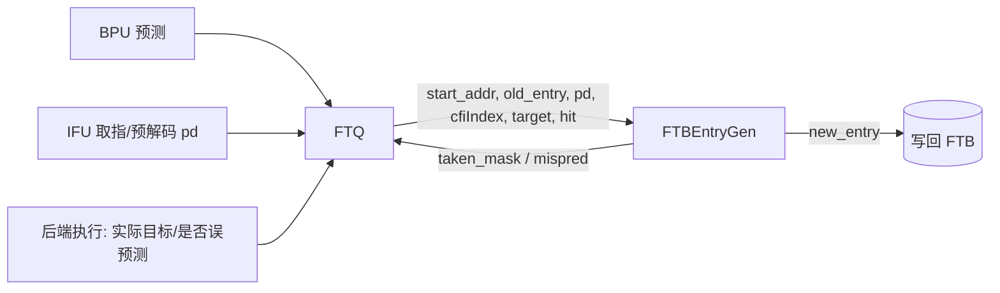

# FTBEntryGen —— FTB 条目生成（学习文档）

| | |
|---|---|
| 手写 SV | `rtl/frontend/FTBEntryGen.sv`（`xs_FTBEntryGen`）+ `rtl/frontend/FTBEntryGen_wrapper.sv` |
| 共享类型 | `rtl/frontend/ftb_pkg.sv`（`ftb_slot_t`/`ftb_entry_t` + 目标编解码） |
| Scala 来源 | `src/main/scala/xiangshan/frontend/NewFtq.scala`（class FTBEntryGen） |
| 验证状态 | UT ✅（20 万随机向量 0 错）/ FM ✅（SUCCEEDED） |
| 重写标准 | 符合 `docs/REWRITE_STYLE.md`（可读优先，struct/注释/无生成痕迹） |

## 1. 它在前端的位置

FTQ（Fetch Target Queue）在一个取指块的预测/执行结果确定后，调用 FTBEntryGen 生成要
写回 FTB 的**新条目**：把「这个块里实际命中的分支/跳转及其目标」编码进 FTB 条目格式。

## 2. FTB 条目怎么存（关键概念，见 ftb_pkg）

一个 FTB 条目描述「一个取指块（≤16 条指令）的控制流」，最多记 `numBr=2` 个分支：

| 字段 | 含义 |
|------|------|
| `brSlot`（slot0） | 第 1 个条件分支：offset（块内位置）+ 压缩目标 |
| `tailSlot`（slot1） | 块尾跳转；可被「共享(sharing)」为第 2 个条件分支 |
| `pftAddr`/`carry` | fall-through 地址（顺序执行落到的下一块起点） |
| `isCall/isRet/isJalr` | 块尾跳转类型 |
| `strong_bias[2]` | 每个分支的强偏置（高置信，影响预测器更新） |

**目标地址压缩**：slot 不存完整 50-bit 目标，只存低位 `lower`（br 12 位 / tail 20 位）
+ 2-bit `tarStat`（目标高位相对当前 PC 高位的 FIT 相等 / OVF +1 / UDF -1）。取出时由
`get_target(pc)` 用 PC 高位 ± tarStat 重建。这样省存储——同一 FTB 项服务的目标多在邻近地址。
> 注意 `tarStat` 为非法值（2'b11）时 `get_target` 高位取 0（Chisel Mux1H 全不选）。这是
> 一个 FM 抓到、随机 UT 难覆盖的角落——重建函数严格按 Mux1H one-hot 语义实现。

## 3. 生成逻辑（两条主路径）

### ① 未命中 `!hit` → 新建 init_entry
按 pd 把命中的条件分支填入 brSlot、跳转填入 tailSlot，算出 fall-through（有跳转且非
末尾 RVI 时落在跳转之后）。新建的分支默认置 `strong_bias`。

### ② 命中 `hit` → 在 old_entry 上做三选一修正（互斥优先级）
| 优先级 | 条件 | 动作 |
|------|------|------|
| a. `is_new_br` | 命中的是分支且旧条目未记录 | 按 offset 升序插入新 br slot（one-hot 选插哪个 slot 前）；若两 slot 已满则牺牲 jmp、把 fall-through 改到新边界 |
| b. `jalr_target_modified` | 命中 jalr 且旧记录目标≠实际目标 | 重算 tailSlot 目标，清 strong_bias |
| c. `strong_bias_modified` | 否则 | 据本次是否仍命中同一分支调整 strong_bias |

最终 `new_entry = hit ? (a/b/c 之一) : init_entry`。另输出 taken_mask、jmp_taken、
mispred_mask（各 slot 是否误预测）及 6 个 perf 标志。

## 4. 可读重写要点（对照学习）

- 用 `ftb_slot_t`/`ftb_entry_t` **struct**（见 ftb_pkg）替代 golden 的展平标量
  （`io_old_entry_brSlots_0_lower` 等），slot 操作一目了然；wrapper 仅做端口打包/拆包。
- 目标编解码抽成 `calc_tarstat`/`calc_lower`/`get_target` **纯函数**，复用且可读。
- 三条命中修正路径各自一个 `always_comb`（`mod_newbr`/`mod_jalr`/`mod_sb`），最后用
  优先级 mux 选择——直接对应 Scala 的 `Mux(is_new_br, ..., Mux(jalr_modified, ...))`。
- `ftb_pkg` 为 FTB/FTBBank/FTQ 共享，避免类型分叉。

## 5. 验证

- **UT**：golden vs `FTBEntryGen_xs`（均经 wrapper 暴露 golden 扁平端口），20 万随机
  向量逐拍比对全部 31 个输出，0 错。
- **FM**：SUCCEEDED。可读结构与 golden 不同，靠签名分析 + 输出等价证明，不靠抄名字。
