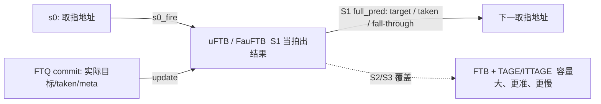
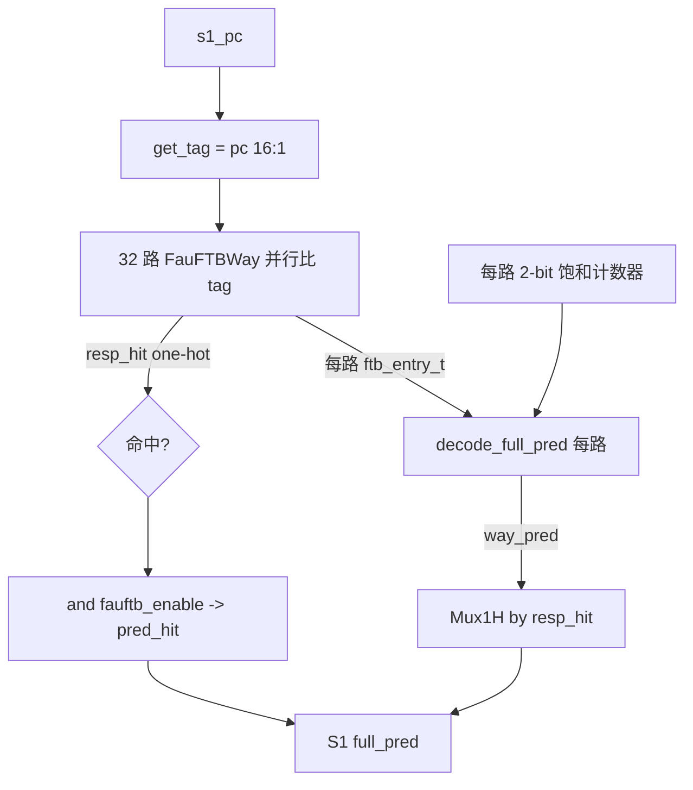
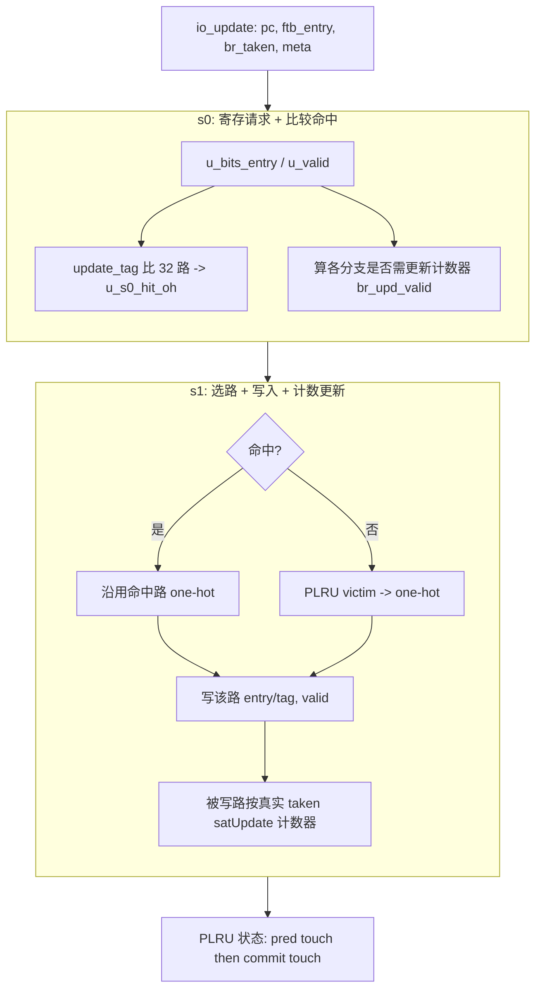

# FauFTB —— uFTB / 微型全相联取指目标缓冲（学习文档）

| | |
|---|---|
| 手写 SV | `rtl/frontend/FauFTB.sv`（`xs_FauFTB_core`）+ `rtl/frontend/FauFTB_wrapper.sv`（golden 同名 `FauFTB`） |
| 单路子模块 | `rtl/frontend/FauFTBWay.sv`（`xs_FauFTBWay`）+ `rtl/frontend/FauFTBWay_wrapper.sv`（golden 同名 `FauFTBWay`，被本核例化） |
| 共享类型 | `rtl/frontend/ftb_pkg.sv`（`ftb_entry_t`/`ftb_slot_t` + 目标编解码 `get_target`） |
| Scala 来源 | `src/main/scala/xiangshan/frontend/FauFTB.scala`（class FauFTB extends BasePredictor） |
| 验证状态 | UT ✅（40000 拍随机向量，checks=40000 errors=0）/ FM ✅（SUCCEEDED） |
| 重写标准 | 符合 `docs/REWRITE_STYLE.md`（可读优先：struct/数组/genvar/纯函数/中文注释、无生成痕迹） |

---

## 1. 它在前端 BPU 的位置

香山前端用「多级覆盖式（overriding）分支预测」：地址一产生，**最快**的预测器先给结果让取指
立刻动起来；后面更慢但更准的预测器在随后几拍把错误覆盖掉。uFTB 就是这个序列里的**第一棒**。

- **预测方向**：`s0_pc → (寄存) → s1_pc → 32 路并行查 tag → Mux1H → S1 full_pred`。结果在
  S1 当拍产生（纯寄存器存储，无 SRAM 读延迟），所以零气泡。
- **更新方向**：FTQ 在一个块 commit 时把「实际命中的条目 + 真实 taken + meta」回送，uFTB
  两级流水（s0 比较 / s1 写入）把它写进某一路并更新饱和计数器。

> 名字里的 "Fau" = Fully-Associative micro（全相联微型）。也常被叫做 uBTB/uFTB。

---

## 2. 为什么是「全相联 + 微型」

| 维度 | uFTB（本模块） | 大 FTB |
|------|----------------|--------|
| 容量 | `numWays=32` 条，**全相联** | 几千条，组相联（带 SRAM） |
| 索引 | 无 set index，16-bit tag **并行比所有 32 路** | set index 选组 + 组内比 tag |
| 延迟 | S1 当拍出结果（全寄存器） | 需读 meta/data SRAM，晚一两级 |
| 替换 | 32 路里 PLRU 选 victim | set 内替换 |
| 方向 | 每路每分支自带 2-bit 饱和计数器 | 由独立的 TAGE 等给方向 |

容量小但全相联 → 任意 PC 都能落到任意一路，小表也有高利用率；32 路并行 tag 比较在面积/时序
上仍可接受。**条目本身就是一个标准 FTBEntry**（与大 FTB 同构，见 `ftb_pkg`），所以 uFTB 命中
时能直接把条目透出给后级（`fauftb_entry_out`）复用。

---

## 3. FTB 条目怎么存（关键概念，详见 `ftb_pkg`）

一个条目描述「一个取指块（≤16 槽）的控制流」，最多记 `numBr=2` 个分支：

| 字段 | 含义 |
|------|------|
| `brSlot`（slot0） | 第 1 个条件分支：offset（块内位置）+ 压缩目标（lower 12b + tarStat） |
| `tailSlot`（slot1） | 块尾跳转；可被「共享(sharing)」当作第 2 个条件分支（此时按 12b 低位宽） |
| `pftAddr`/`carry` | fall-through 地址（顺序执行落到的下一块起点）的低位 + 进位 |
| `isCall/isRet/isJalr` | 块尾跳转类型 |
| `strong_bias[2]` | 每分支的强偏置（强 taken，高置信，直接拉高方向预测） |

**目标地址压缩**：slot 只存目标低位 `lower`（br 12 位 / tail 20 位）+ 2-bit `tarStat`（目标
高位相对当前 PC 高位：FIT 相等 / OVF +1 / UDF −1）。取出时 `get_target(pc, lower, tarStat,
off_len)` 用 PC 高位 ± tarStat 重建完整 50-bit 目标。本核**直接复用** `ftb_pkg::get_target`，
与 FTBEntryGen / 大 FTB 是同一套编解码。

---

## 4. 预测数据流（S1）

逐路 `decode_full_pred()`（纯函数，对应 Scala `fromFtbEntry`）做四件事：

1. **目标重建**：`target_br = get_target(pc, brSlot.lower, ..., 12)`；`target_tail` 按 sharing
   选 12/20 位低位宽。`jalr_target == target_tail`。
2. **fall-through**：`{carry?pc[49:5]+1:pc[49:5], pftAddr, 1'b0}`；若越界（起点 ≥ 终点，或终点超出
   "起点 + 一个取指块"）则 `fall_through_err=1`，回退到 `pc + 32`（一块 = 16×2 字节）。
3. **CFI 种类**：`is_jal/jalr/call/ret/br_sharing` 均以 `tailSlot.valid` 为前提。
4. **方向**：`br_taken_mask[i] = ctr[i] 最高位 | strong_bias[i]`——计数器弱/强 taken 或强偏置即预测跳。

命中互斥（uFTB 保证最多一路命中，golden 有断言），故 Mux1H 用「命中位 OR 各路解码值」实现。
最终 `full_pred.hit = s1_hit & fauftb_enable`（`fauftb_enable = RegNext(ctrl.ubtb_enable)`）。

---

## 5. 更新数据流（s0 → s1 两级）

几个要点：

- **写哪路**：命中 → 原路改写（`u_s1_hit_oh`）；未命中 → PLRU 选 victim 替换。
- **计数器更新有效性**：分支 slot 有效、本次 update 有效、且**非**强偏置才更新计数器（强偏置不靠
  计数器）。对第 2 分支（tail 共享）还额外要求**第 1 分支本次未 taken**——因为若 br0 taken，取指
  会从 br0 跳走，根本到不了 br1，这次 br1 的方向不可信。
- **饱和计数 satUpdate**：复位为弱 taken（2'd2）；taken 时 +1 封顶 3，否则 −1 封底 0。

---

## 6. PLRU 替换器（二叉树伪 LRU）

32 路 = 满二叉树 5 层，用 `numWays-1 = 31` 个状态位，每个内部节点 1 位指向「victim 应往哪边走」。

- **选 victim**（`plru_victim`）：从根 `state[30]` 逐层下行，拼出 5-bit way 号。
- **触摸 way**（`plru_touch`）：把根到该叶路径上每个节点翻向「远离该叶」一侧，路径外子树不动——
  刚用过的叶最不容易成为下一个 victim。本核把它拆成 `plru_touch4/8/16`（4/8/16 叶子树递归）以求可读。
- **两个 touch 源串联**：先 **pred touch**（S1 预测命中过的路，晚一拍寄存）→ 再 **commit touch**
  （本拍真正写入的路）。即「被预测命中」和「被 commit 写入」都算「用过」，都让该路远离 victim。

状态位编排与 golden 完全一致：`state[30]` 为根，高半子树 `state[29:15]`、低半 `state[14:0]` 各
为一棵 16 叶（15 位）子树。

---

## 7. meta 与 perf

- **meta**：`last_stage_meta = {0…, pred_way[4:0], hit}`，经 `s1_fire → s2_fire` 两级延迟，与最终
  预测对齐后随 last_stage 送出，commit 时回传（`pred_way` 仅用于性能统计）。
- **perf**：`perf_0 = 延两拍的 (u_valid & meta[0])`（commit 命中），`perf_1 = commit 未命中`。
  `meta[0]` 即当初预测是否命中（uFTB meta 最低位）。

---

## 8. 接口（核 `xs_FauFTB_core`）

> wrapper（golden 同名 `FauFTB`）只是把核的端口机械适配成 golden 扁平命名，并把单份 `fp_*`
> 复制到 `full_pred_0..3` 四个 dup。下表列核的功能端口（省略 4 份 pc dup 的重复项）。

| 方向 | 端口（代表） | 含义 |
|------|------|------|
| in | `io_in_bits_s0_pc_*` | s0 取指地址（4 dup，内容相同） |
| in | `io_reset_vector` | 复位向量；复位释放时灌入 s1_pc（`s1_pc_dup_*`），作冷启动首个取指地址（RTL `:66` 输入、`:333-340` `reset_pc` 在 `reset_d1` 时赋给各 dup） |
| in | `io_s0_fire/s1_fire/s2_fire_*` | 各级流水 fire |
| in | `io_ctrl_ubtb_enable` | uFTB 总开关（延一拍成 `fauftb_enable`） |
| in | `io_update_valid` + `io_update_bits_*` | FTQ commit 回送：pc / ftb_entry / br_taken_mask / meta |
| out | `io_out_s1_pc_*` | S1 透传的取指地址 |
| out | `fp_*`（→ wrapper 的 `full_pred_*`） | S1 预测：target/taken/fall-through/is_jal… / hit |
| out | `io_fauftb_entry_out_*` + `io_fauftb_entry_hit_out` | 命中路原始 FTBEntry（供后级复用） |
| out | `io_out_last_stage_meta` | {pred_way, hit}（commit 回传） |
| out | `io_perf_0/1_value` | commit 命中 / 未命中计数事件 |

---

## 9. 可读重写要点（对照学习）

| Scala 设计意图 | 本核怎么表达（vs golden 扁平 RTL） |
|------|------|
| 每路是一个 FTBEntry | `ftb_entry_t way_entry[NUM_WAYS]`（结构体数组），不再展平成几十个 `w_resp_*` 标量数组 |
| `fromFtbEntry` | 纯函数 `decode_full_pred(pc, entry, ctr_hi)` 返回 `full_pred_t` 结构体 |
| 目标压缩编码 | 复用 `ftb_pkg::get_target` / `eff_len`，与 FTBEntryGen 同源 |
| Mux1H 合成 | `for` 循环「命中位 OR 各路结构体」，命中互斥 → 等价 Mux1H |
| ReplacementPolicy "plru" | `plru_victim` / `plru_touch`（+ `plru_touch4/8/16` 递归子树），名字直述层数 |
| satUpdate | 纯函数 `sat_update(cnt, taken)` |
| OHToUInt | 纯函数 `oh_to_idx` |
| 32 路 / 2 分支 | 全部 `genvar`/`for` 展开，无手工堆叠 |

**无生成痕迹**：没有 `RANDOMIZE/SYNTHESIS` 宏样板、没有 `_GEN_/_T_n` 临时名、没有展平标量。

---

## 10. 验证

- **UT**（`verif/ut/FauFTB/`）：tb 双例化 golden `FauFTB` 与手写 `FauFTB_xs`（核 `xs_FauFTB_core`
  例化 golden `FauFTBWay`），复位后逐拍随机激励、比对**所有输出端口**。结果 **checks=40000, errors=0,
  TEST PASSED**。
  > golden 含 `ifndef SYNTHESIS 的运行时 fallThrough 断言（随机激励会误触发 $fatal），故 Makefile 在
  > include 之后 append `+define+SYNTHESIS` 关闭断言块（同时关掉 firtool 的随机初始化，使两侧均从复位态
  > 出发）。`ftb_pkg.sv` 已加入 `RTL_SRCS`（在 FauFTBWay/FauFTB 之前编译）。
- **FM**（`make fm`）：ref = golden `FauFTB`(+`FauFTBWay`)，impl = `ftb_pkg`+`FauFTBWay`+`FauFTB`+两个
  wrapper。靠**签名分析**证组合/时序等价（非抄命名）。结果 **FM_RESULT: Verification SUCCEEDED**。
  - golden 中的 s2/s3 pc 寄存器、断言块、性能 `_probe` 中间量是 unread compare point，对所有输出无影响，
    核内不实现；FM 已设 `verification_verify_unread_compare_points=false`。

无已知真 bug，无残留假阳性。
