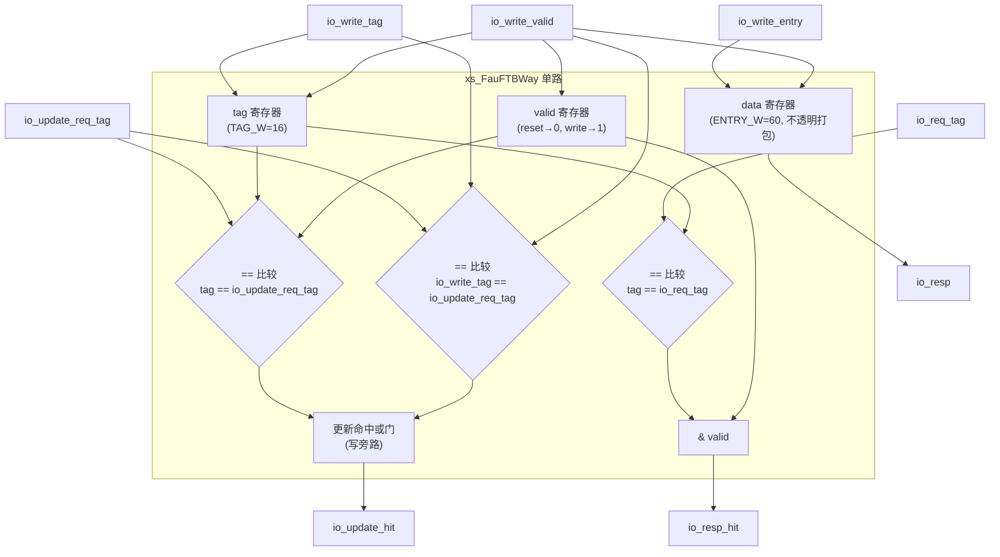

# FauFTBWay —— uFTB 单路

| | |
|---|---|
| 手写 SV | `rtl/frontend/FauFTBWay.sv`（`xs_FauFTBWay`）+ `rtl/frontend/FauFTBWay_wrapper.sv` |
| Scala 来源 | `src/main/scala/xiangshan/frontend/FauFTB.scala`（class FauFTBWay） |
| 生成器 | `scripts/gen_fauftbway.py` |
| 验证状态 | UT ✅（6 万拍 0 错）/ FM ✅（SUCCEEDED） |

## 功能

全相联微 FTB（[FauFTB](FauFTB.md)）的一路。寄存一个 FTB 条目（data，打包 60 位）+
tag（16 位）+ valid：

- **读**：`tag == io_req_tag && valid` → `io_resp_hit`；`io_resp` 原样透出存储条目
- **更新查询**：`io_update_hit = (tag命中且valid) | (本拍写同tag)`（写旁路避免重复命中）
- **写**：`io_write_valid` 时写入 tag/entry，置 valid

### 结构图

单路内部只有三个状态寄存器（`tag`/`data`/`valid`）+ 两个比较器，外加更新查询的写旁路或门。
对应 `FauFTBWay.sv:27-47`。

*图注：读路径（`io_req_tag`→比较→`io_resp_hit`/`io_resp`）与更新查询路径（含 `io_write_tag` 写旁路或门，`FauFTBWay.sv:34-35`）分别成组；写路径（`io_write_valid` 门控 tag/data，置 valid）单独成组。entry 作为打包向量整体读写。*

## 接口

> **端口命名约定**：下表列的是 **golden wrapper 的扁平字段名**（`io_resp_isCall/_brSlots_*`、
> `io_write_entry_*` 等，见 `rtl/frontend/FauFTBWay_wrapper.sv`）。**可读核 `FauFTBWay` 的对应端口
> 是单根打包向量**：`io_resp` / `io_write_entry` 均为 `[ENTRY_W-1:0]`（ENTRY_W=60，见
> `rtl/frontend/FauFTBWay.sv:18,23`），entry 作为不透明打包数据整体存取，扁平字段的拼接/拆分由
> wrapper 完成。下表用 `_*` 表示这一组被 wrapper 展开的字段。

| 信号 | 方向 | 说明 |
|------|------|------|
| `io_req_tag` | in[15:0] | 查询 tag |
| `io_resp` (核) / `io_resp_*`(golden) / `io_resp_hit` | out | 条目（核为打包向量；golden 拆成各字段）/ 命中 |
| `io_update_req_tag` / `io_update_hit` | in/out | 更新查询 |
| `io_write_valid` / `io_write_entry`(核)·`io_write_entry_*`(golden) / `io_write_tag` | in | 写入（核为打包 entry 向量；golden 拆成各字段）|

## 验证

- **UT**：golden vs `FauFTBWay_xs`，随机读/更新/写（tag 值域压缩提高命中率），6 万拍 0 错。
- **FM**：SUCCEEDED。golden 逐字段寄存器 `data_<field>` 经生成器输出的 `fm_map`
  映射到核的扁平 `data_reg` 切片（`match_packed_payload` 机制）。
