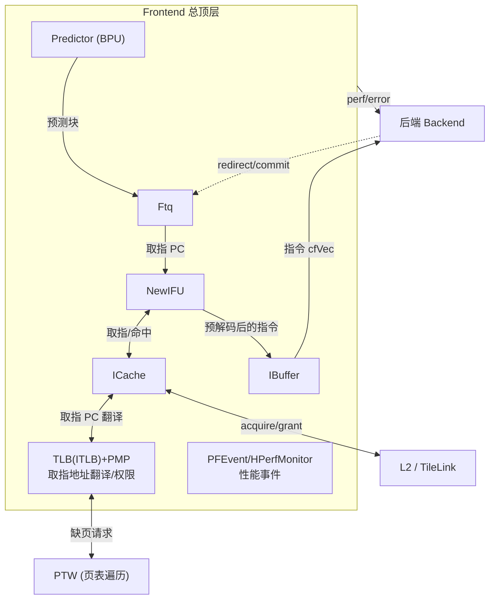
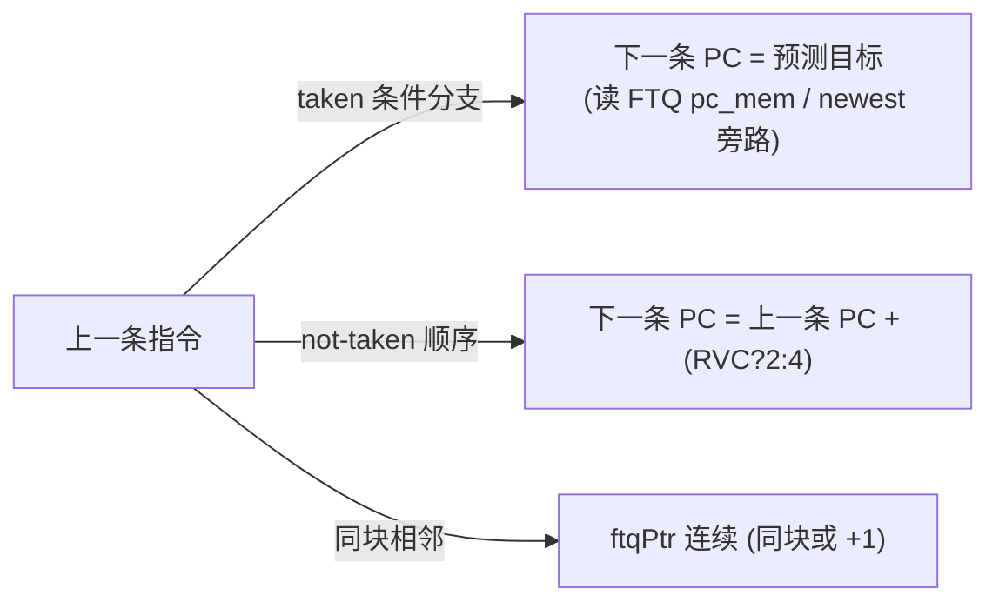
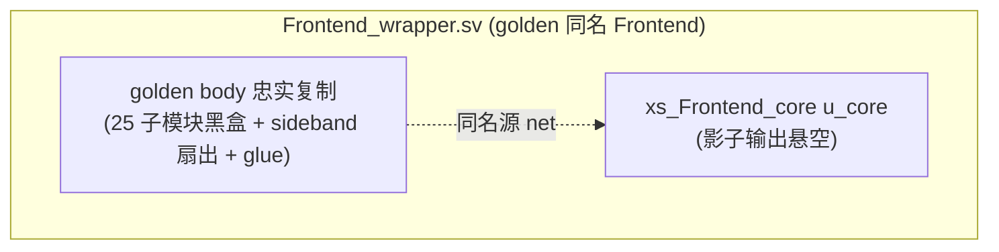

# Frontend —— 香山 V2R2（昆明湖）前端总顶层

> 学习导向文档。先读 `docs/FRONTEND_OVERVIEW.md` 建立前端全局认知，再读本文了解前端
> **总顶层 Frontend** 如何把五大子系统组装成完整取指前端、如何完成取指地址翻译、如何路由
> 后端的 redirect/commit/flush。各子模块细节见同目录下各自的 `Predictor.md`/`Ftq.md`/
> `NewIFU.md`/`ICache.md`/`IBuffer.md` 等。
>
> 对应 RTL：可读核 `rtl/frontend/Frontend.sv`（`xs_Frontend_core` + `xs_frontend_pkg`），
> golden 同名 wrapper `rtl/frontend/Frontend_wrapper.sv`，生成器 `scripts/gen_frontend.py`，
> 验证 `verif/ut/Frontend/`。对应 Chisel：`xiangshan.frontend.Frontend`（`Frontend.scala`）。

## 1. Frontend 在 SoC 里的位置

Frontend 是整个取指前端的**总顶层**。它本身 **几乎没有功能逻辑**——9749 行 golden RTL、
382 端口里约 95% 是子模块互联 + MBIST/SRAM/PTW 等物理 sideband 的机械扇出。它真正承担的
"自身逻辑"只有两类（见 §4）：几条跨级打拍的流水寄存 + 一段跨取指块 PC 连续性检查器。

## 2. 子系统清单（均当 golden 黑盒，本顶层只负责接线）

| 实例 | 模块 | 职责 | 文档 |
|------|------|------|------|
| `inner_bpu` | `Predictor` | BPU 顶层：多级覆盖式分支预测，产出预测块 | [Predictor](Predictor.md) |
| `inner_ftq` | `Ftq` | 取指目标队列：连接 BPU 与 IFU，承载 redirect/commit/update | [Ftq](Ftq.md) |
| `inner_ifu` | `NewIFU` | 取指主控：发请求、收数据、预解码、送 IBuffer | [NewIFU](NewIFU.md) |
| `inner_icache` | `ICache` | L1 指令缓存（MainPipe/MissUnit/Prefetch/…） | [ICache](ICache.md) |
| `inner_ibuffer` | `IBuffer` | 指令缓冲：解耦 IFU 与后端取指节奏 | [IBuffer](IBuffer.md) |
| `inner_itlb` | `TLB` | 取指 ITLB：虚实地址翻译 | — |
| `inner_itlbRepeater1/2` | `PTWFilter`/`PTWRepeaterNB` | ITLB ↔ PTW 的请求过滤/中继 | — |
| `inner_pmp` + `inner_PMPChecker(_1..4)` | `PMP`/`PMPChecker` | 取指物理地址权限检查（5 个检查口） | — |
| `inner_pfevent`/`inner_perfEvents_hpm` | `PFEvent`/`HPerfMonitor` | 性能事件选择/计数 | — |
| `inner_instrUncache` | `InstrUncache` | MMIO（非缓存）取指 | [InstrUncache](InstrUncache.md) |
| `inner_tlbCsr_delay`/`inner_csrCtrl_delay`/`inner_wfiReq_delay`/`inner_io_backend_wfi_wfiSafe_delay` | `DelayN_*` | CSR/WFI 控制信号延迟对齐 | — |
| `inner_mbistPl`/`inner_mbistIntf` | `MbistPipeFrontend`/`MbistIntfFrontend` | MBIST 物理可测性接口 | — |

> 这些子模块**已各自单独可读重写 + 验证**，故本顶层维持 golden 同名直接例化，**不重写**。
> 本顶层 UT/FM 把它们当黑盒，只校验"顶层 glue + 子模块互联"是否等价。

## 3. 三条主线（顶层互联视角）

- **预测→取指主线**：`Predictor` 每拍产出预测块写入 `Ftq`；`Ftq` 把块按序发给 `NewIFU` 的
  取指请求口；`NewIFU` 向 `ICache` 取指（命中返回、miss 经 MissUnit 向 L2 取行），取回后
  预解码排入 `IBuffer`，最终经 `io_backend_cfVec_0..5`（一拍最多 6 条）送后端。
- **取指地址翻译**：`NewIFU`/`ICache` 取指要把虚地址经 `TLB(ITLB)` 翻译成物理地址，再经
  `PMPChecker` 做权限检查；ITLB miss 经 `PTWFilter`/`PTWRepeater` 向 PTW 发缺页请求。
  `io_sfence`/`io_tlbCsr` 控制 ITLB 的 flush 与地址模式（见 §4 的 sfence 打拍）。
- **纠错与训练回路**：后端 `io_backend_toFtq_redirect`（误预测/异常）路由进 `Ftq` 冲刷并重取，
  同时打 1 拍送 `IBuffer` 冲刷（见 §4）；后端 `io_backend_toFtq_rob_commits`（提交）回送
  `Ftq` 训练各预测器；`Ftq` 的 `pc_mem` 写口同时镜像进顶层的 checkPcMem（见 §4.B）。

## 4. 顶层自身逻辑（可读核 `xs_Frontend_core` 的内容）

golden Frontend 里真正属于"Frontend 自身"的逻辑只有两类。它们被手写为可读核
`xs_Frontend_core`，作为 wrapper 的"校验伴随"（见 §5）。

### 4.A 跨级打拍的流水寄存（驱动真实信号）

香山在顶层把若干控制/状态信号多打几拍，目的是 **时序对齐 + 高扇出隔离**：

| glue | 级数 | 源 → 目标 | 为什么 |
|------|------|-----------|--------|
| redirect 冲刷 | 1 拍 | `io_backend_toFtq_redirect` → `IBuffer.io_flush`（+控制流/访存违例两标志） | 与 IBuffer 内部冲刷时序对齐；区分控制流/访存违例以便正确回收 RAS/统计 |
| sfence | 2 拍 | `io_sfence` → `ITLB`/`PMP` | TLB flush 要与取指流水对齐：先让在途翻译请求退出，避免用旧映射的请求与新 flush 撞车 |
| fencei / 预取使能 | 1 拍 | `io_fencei`、csrCtrl 经 DelayN 的预取使能 → `ICache` | fence.i 使 ICache 全失效；隔离扇出 |
| ICache 错误 | 2 拍 | `ICache.io_error` → `io_error`（上报 BEU） | ECC/总线错误上报对齐 |
| 性能事件 | 2 拍 | `HPerfMonitor.io_perf_*` → `io_perf_*_value` | 性能计数布线对齐 |

可读核里这些是直白的 `always_ff` 移位寄存（`sfence_s1_* → sfence_q_*` 等），命名表达含义。

### 4.B 跨取指块 PC 连续性一致性检查器

这是前端顶层 **唯一一段非平凡逻辑**，最能体现取指语义，故完整重写并作为影子探针主目标。
它是 **纯校验**性质（不驱动任何对外功能输出），对应 golden 的 `inner__probe_N` 断言。

**它在检查什么**：指令离开 IBuffer 送往后端时（lane0..5 顺序排列），验证取指语义自洽——
下一条指令的 PC 必须 = "上一条按其类型/预测推出的应有 PC"：

任一不符 → 触发断言，说明 BPU/IFU/FTQ 链路出 bug。

**为什么需要跨块状态**：一个取指块的最后一条指令，其"下一条"在 **下一拍** 才从 IBuffer
出来。所以要把"上一拍块尾那条是 taken/not-taken、它的 ftqPtr/PC/是否 RVC"latch 住
（`prevTaken*`/`prevNotTaken*`/`prevIsRVC`），等下一拍 lane0 出来再比。香山为时序把 taken
ftqPtr 复制成两份（`_1` 后缀），逻辑等价。

**checkPcMem**：FTQ `pc_mem`（每个 FTQ 项的 startAddr）的一份 64 项镜像，随 FTQ
`io_toBackend_pc_mem` 写口同步写入。检查 taken 目标时，按"目标块的 ftqPtr+1"索引读出其
startAddr 作为应有的下一 PC。

> **newest 旁路的适用范围**（易过度概括，按 RTL 订正）：`newest_entry` 旁路（`ptr==newest_ptr`
> 时用 `ftq_newest_target` 替代镜像读，规避 pc_mem 写后读冒险）**只用于块内（intra-block）
> taken 目标检查**——即经 `read_block_start()` 的那条路径（`rtl/frontend/Frontend.sv:391-395`）。
> **跨块（cross-block）的 `vio_cross_target` 不走 newest 旁路**：它直接读
> `checkPcMem[prevTakenFtqPtr_1+1]` 与本拍 lane0 PC 比对（`rtl/frontend/Frontend.sv:413-414`），
> 不经 `read_block_start`、也不替换为 newest_target。

**可读核实现要点**（相对 golden 的 `inner_`/`inner__0..31` 链）：
- 6 条 lane 聚合成 `ib_lane_t[6]` 结构数组（golden 展平为 `io_out_<i>_valid/_bits_*`）；
- 逐 lane 派生 `isCondBr/takenBr/ntCondBr/anyTaken` 用具名数组 + `for`；
- 块尾 taken/not-taken 用纯组合扫描（高位优先）直接 mux 出选中 lane 的字段，**不做动态索引
  越界**（FM 友好，见 §6 X/FM 处理）；
- 三类违例（块内 ftqPtr / 块内 taken 目标 / 块内顺序 PC）+ 跨块版本，或在一起得
  `pc_continuity_violation` 影子输出。

## 5. 验证策略：校验伴随（companion）+ 双例化

由于 golden Frontend 95% 是必须与 golden 逐字对齐（FM 才能把两侧黑盒引脚配对）的接线/
sideband，采用与 [Predictor](Predictor.md) 一致的 **"校验伴随"** 范式：

- **wrapper `Frontend`** = golden body 忠实复制（去 firtool 随机化样板、改模块名），额外例化
  可读核 `xs_Frontend_core` 作校验伴随，**影子输出悬空** → 对外功能与 golden 完全一致，
  FM 与 golden 纯等价。
- **`Frontend_xs`**（`variants_xs.sv`）= 同 wrapper，但把可读核影子输出经 `xs_dbg_*` **额外
  输出端口** 引出，供 tb 探针比对。
- **tb**：`Frontend u_g` vs `Frontend_xs u_i` 双例化，随机后端 redirect/commit/取指握手/
  sfence/TLB 响应，逐拍比对：
  1. **全部 146 个对外功能输出** `g_* === i_*`；
  2. **影子探针**：可读核 `xs_dbg_*` === golden 内部对应寄存器（`u_g.inner_needFlush`、
     `u_g.inner_sfence_bits_*`、`u_g.io_error_*`、`u_g.io_perf_*`、…）与
     `pc_continuity_violation`，证明可读核功能等价于 golden 的 glue。

UT 双例化两侧共用同一批 golden 子模块实现（197 个传递依赖文件，由 `gen_frontend.py` 自动
算出），故比对仅检验顶层 glue + 互联是否等价。

### 验证结果

- **UT**：`make compile && make run`，多种子（SEED=1/7/42）**均 `TEST PASSED`**，
  `checks=120000 errors=0 core_errors=0`（146 对外输出 + 24 影子探针逐拍全等）。
- **FM**：`make fm`，**48971 passing compare points，仅 1 failing**——且该 1 个是
  **假阳性**（见 §6）。
- **可读性**：核 RTL 内 0 处生成痕迹（`_GEN_n`/`_T_n`/`RANDOMIZE`/`SYNTHESIS` 等）；
  仅注释里引用 golden 名（`_GEN/childBd/inner__16`）作教学对照。

## 6. X 坑与 FM 假阳性处理

- **动态索引越界（FMR_ELAB-147）**：块尾 lane 选择最初用 `ib_lane[endIdx]`（`endIdx` 3 位
  0..7，数组只有 6 项），FM 报"index may take values outside array bound"而拒绝 elaborate。
  **改法**：扫描时直接 mux 出选中 lane 的字段（`endTaken_flag/value`、`endNt_pc/rvc`），
  消除动态索引。改后 UT 仍全 PASS、FM 可 elaborate。
- **FM 唯一 failing 是假阳性**：失败点
  `inner_bpu/io_bpu_to_ftq_resp_bits_s3_valid_0`——这是 **被黑盒的 BPU 的一个输入引脚**。
  golden 里该引脚由 net `inner__probe`（`Frontend.sv:496` 声明、**全文件从未赋值**，是
  firtool 在 SYNTHESIS 下剥掉的 probe 残留）驱动。wrapper 逐字复制 golden body，同样有这条
  **未驱动的 `inner__probe`**。FM 报告明确提示 *"This failure may be due to an undriven
  signal in the reference design"*。两侧黑盒引脚被同一条未驱动 net 驱动（恒 X），FM 无法
  判定 X-vs-X 等价而保守标红——属典型黑盒引脚不可达态假阳性，**非功能差异**。
  - 探针证据：`u_g.inner__probe` 与 `u_i.inner__probe` 同为未驱动同名 net（wrapper =
    golden body 复制）；UT 三种子 146 对外输出逐拍全等（`errors=0`），可读核影子全等
    （`core_errors=0`），功能等价由 UT 充分证明。

## 7. 关键文件

| 文件 | 说明 |
|------|------|
| `rtl/frontend/Frontend.sv` | 可读核 `xs_Frontend_core` + `xs_frontend_pkg`（学习载体） |
| `rtl/frontend/Frontend_wrapper.sv` | golden 同名 wrapper（golden body 复制 + 校验伴随） |
| `scripts/gen_frontend.py` | 生成 wrapper/_xs/tb/Makefile，自动算 197 个 golden 依赖 |
| `verif/ut/Frontend/{Makefile,variants_xs.sv,tb.sv}` | 双例化随机比对 + 影子探针 |
