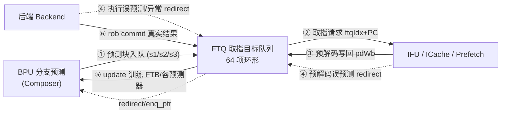

# Ftq —— Fetch Target Queue（取指目标队列）学习文档

| | |
|---|---|
| 手写 SV | `rtl/frontend/Ftq.sv`（`xs_Ftq_core`）+ `rtl/frontend/Ftq_wrapper.sv`（golden 同名 wrapper） |
| 生成器 | `scripts/gen_ftq.py`（解析 golden 端口 → wrapper / `_xs` / tb） |
| 验证 | `verif/ut/Ftq/{Makefile, variants_xs.sv, tb.sv}` |
| Scala 来源 | `src/main/scala/xiangshan/frontend/NewFtq.scala`（`class Ftq`） |
| 子模块（golden 黑盒，已各自验证） | `FtqPcMemWrapper`、`FtqNRSRAM`、`SyncDataModuleTemplate__64entry{,_1,_2}`、`MbistPipeFtq`、`FTBEntryGen` |
| 复用类型 | `rtl/frontend/ftb_pkg.sv`（FTB 条目编解码） |

## 1. FTQ 在前端的位置与作用

FTQ 是香山 V2R2 前端**最大最复杂**的模块，是 BPU（分支预测）、IFU（取指）、后端三者之间的
**解耦缓冲 + 纠错枢纽 + 训练回路起点**。



FTQ 是一个 **64 项的环形队列**（`FtqSize=64`）。BPU 每拍产出一个"预测块"
（一段连续取指区间 + 末尾控制流去向）入队；IFU 按队列顺序逐块取出去取指；预测错时冲刷队列
并重取；后端提交时把真实结果回送，据此（经 `FTBEntryGen`）生成 update 训练 BPU。

## 2. 六大功能通道（与 `xs_Ftq_core` 分节对应）

| # | 通道 | 关键信号 | 说明 |
|---|------|---------|------|
| ① | **enq from BPU** | `bpu_in_fire`/`bpu_in_ptr`/`bpu_target`/`cfi_*` | s3>s2>s1 三级选择（`selectedResp`）；s2/s3 可覆盖更早预测并令 `bpuPtr` 回退；据 full_pred 算 cfiIndex（taken 槽）与 target（selectByTaken） |
| ② | **to IFU/ICache/Prefetch** | `entry_is_to_send`/`toIfu_*`/`entry_next_addr` | 按 `ifuPtr` 发请求；为切关键路径，PC 提前一拍读 pc_mem + **bypass 旁路**（刚入队即被取的块直接用旁路 buf）；5 路 toICache 是扇出复制 |
| ③ | **wb from IFU** | `pdWb`/`ftq_pd_mem`/`has_false_hit` | IFU 预解码结果写入 `ftq_pd_mem`，推进 `ifuWbPtr`；与预测时的 ftb_entry 比对检测 **false-hit** |
| ④ | **redirect** | `be_redir`/`ifu_redir`/`redir_idx` | 后端执行误预测 或 IFU 预解码误预测 → 冲刷 `bpuPtr/ifuPtr/pfPtr/ifuWbPtr` 回到 `redir_idx+1`，并标记 commitStateQueue |
| ⑤ | **update to BPU** | `FTBEntryGen`/`io_toBpu_update_*` | 提交块经 `FTBEntryGen` 生成写回 FTB 的新条目 + taken/mispred mask 喂回 BPU |
| ⑥ | **commit** | `canCommit`/`canMoveCommPtr`/`commitStateQueue` | 后端 rob 逐条标记 `commitStateQueue`，`commPtr` 顺序出队；`robCommPtr` 跟踪 rob 已提交位置 |

## 3. 指针体系（FtqPtr：环形 {flag, value}）

所有队列指针都是 `CircularQueuePtr`：7 位 = `{flag(1), value(6)}`，`flag` 区分绕回。
`xs_Ftq_core` 用纯函数表达指针运算（`mk_ptr`/`ptr_add`/`ptr_dist`/`ptr_before`/`ptr_after`/
`ptr_full`/`ptr_recover`）。

| 指针 | 含义 | 推进时机 |
|------|------|---------|
| `bpuPtr` | 入队尾（下一个写入项） | enq_fire +1；s2/s3/redirect 回退 |
| `ifuPtr` (+1/+2) | 取指头 | toIfu.req.fire +1；s2/s3/redirect 回拉 |
| `pfPtr` (+1) | 预取头 | toPrefetch.req.fire +1；同上 |
| `ifuWbPtr` | IFU 写回头 | pdWb.valid +1；redirect 回退 |
| `commPtr` (+1) | 提交头（出队） | canMoveCommPtr +1 |
| `robCommPtr` | rob 已提交位置 | 选最新有效 rob commit 的 ftqIdx |

> **关键修正（本重写踩坑）**：s2/s3 重定向时"是否回拉 ifuPtr/pfPtr"的判据是
> `!isBefore(ptr, idx)`，golden 展开为 `ptr.flag ^ idx.flag ^ (ptr.value >= idx.value)`。
> 这与 `~isBefore`（朴素实现）在"**异 flag 且 value 相等**"处不同——若用朴素式，绕回一拍后
> 指针 flag 会错位（表现为数千拍后 `ftqIdx_flag` 偶发失配）。已用 `ptr_recover` 纯函数照
> golden 实现。

## 4. 几大存储（golden 同名黑盒例化）

FTQ 的"表项"分散在多块多读口存储中，按访问模式与扇出拆分（降低单块端口压力）：

| 存储 | 类型 | 内容 | 读口 | 写时机 |
|------|------|------|------|--------|
| `ftq_pc_mem` | `FtqPcMemWrapper`（SyncDataModule 64×101，7R1W） | PC 元信息（startAddr/nextLineAddr/fallThruErr） | ifu/ifu+1/ifu+2/pf/pf+1/comm/comm+1 | bpu_in_fire |
| `ftq_redirect_mem` | SyncDataModule 64entry（3R1W） | 投机信息 spec_info（histPtr/RAS/SC 等） | IFU-redir / backend-redir / commit | s3.valid |
| `ftb_entry_mem` | SyncDataModule 64entry_1（2R1W） | 预测时 FTB 条目（供 redirect/false-hit 比对） | IFU-wb / backend-redir | s3.valid |
| `ftq_pd_mem` | SyncDataModule 64entry_2（2R1W） | IFU 预解码（brMask/jmpInfo/rvcMask/jalTarget） | redir / commit | pdWb.valid |
| `ftq_meta_1r_sram` | `FtqNRSRAM`（SplittedSRAM，带 MBIST） | 预测器 meta + ftb_entry（容量大用 SRAM） | commit | s3.valid |

寄存器阵列（核内直接用 SV 数组 + genvar 表达，不进存储）：`commitStateQueue[64][16]`、
`cfiIndex_vec`、`mispred_block`、`entry_fetch_status`、`entry_hit_status`、`pred_stage`、
`update_target`、`ifuRedirected`。

MBIST：`ftq_meta_1r_sram` 的 4 个内层 SRAM 的 bore 口经 `MbistPipeFtq` 汇聚到顶层 MBIST 端口
（`boreChildrenBd_*` / `sigFromSrams_*`），本核 1:1 连线透传。

## 5. 关键设计点（为什么这么设计）

- **PC 提前一拍读 + bypass 旁路**：取指 PC 在关键路径上。FTQ 用"下一拍指针写线"提前给
  `ftq_pc_mem` 读地址（同步读 1 拍延迟），并对刚由 BPU 写入、马上要被取的块直接走 `bpu_in_bypass`
  旁路，避免"先写存储再读出"的气泡。
- **三级预测覆盖（s1/s2/s3）**：BPU 慢预测器随后几拍覆盖快预测器。FTQ 用 `selectedResp`
  选 s3>s2>s1，s2/s3 重定向时回退 bpuPtr 并按 `ptr_recover` 选择性回拉 ifuPtr/pfPtr。
- **commitStateQueue 状态机**：每项 16 槽各有 `empty/toCommit/committed/flushed` 四态。
  IFU 写回标 toCommit、rob 提交标 committed、redirect 冲刷标 flushed/empty；`commPtr` 据"最后
  一条有效指令是否 committed"决定能否出队。
- **FTBEntryGen 训练**：提交块的真实结果（命中/误预测/实际目标）经 `FTBEntryGen` 编码成新 FTB
  条目（含 br/tail slot、压缩目标、strong_bias），连同 mask 喂回 BPU。
- **reduce-fanout 复制**：golden 对 bpuPtr/ifuPtr 等做 5 份扇出复制（`copied_*`），功能上与原值
  恒等；本核直接用原值驱动 5 路 toICache，逻辑等价、更可读。

## 6. 可读重写说明

- 核 `xs_Ftq_core` 与 golden 顶层**端口完全同名同序同宽**（含全部 MBIST sideband），便于 FM
  与系统级替换；可读性体现在**模块体**：按上述六节组织、具名信号 + struct/数组 + 注释讲原理。
- golden 的 112955 行绝大多数是 firtool 把 64 项阵列、5 份扇出、28000+ `_GEN_*` 临时名展平的
  结果；本核从 Scala 设计意图重写，实际设计逻辑仅约 2000 行，**无任何生成痕迹**。
- 5 个存储 + `MbistPipeFtq` + `FTBEntryGen` 例化 golden 同名模块（均已单独验证可读），此处当黑盒。

## 7. 验证

### 7.1 UT（`verif/ut/Ftq/`）

golden `Ftq` vs 手写 `Ftq_xs`（→`xs_Ftq_core`）双例化，**自洽指针模型**驱动：tb 以 golden 的
`enq_ptr` 为锚，按队列序驱动 IFU 写回 / rob 提交 / redirect 的 ftqIdx，使 enq/wb/commit/redirect
引用真正在飞的 FTQ 项（否则随机 ftqIdx 会让 commit 路径无法推进）。逐拍比对全部功能输出。

| seed | checks | errors | 备注 |
|------|--------|--------|------|
| 1  | 200000 | 0 | PASSED |
| 7  | 200000 | 0 | PASSED |
| 42 | 200000 | 0 | PASSED |
| 2,3,5,99,123,777,2024 | 200000 | 0 | PASSED（额外多种子） |

**全部种子 `errors=0`。** 历史上的两类残余失配已定位并修复（均为真实功能 bug，非时序角落）：

1. **`io_toIfu_req_bits_nextStartAddr` 失配（IFU-redirect ret 项 target 错）**：
   IFU redirect 写 `newest_entry_target` / `update_target[idx]` 时，须用 `ifuToBpu_target`
   （`(isRet & pd_valid) ? RAS_topAddr : ifu_redir_reg_target`，对应 golden
   `ifuRedirectToBpu_bits_cfiUpdate_target`），而非原始 `ifu_redir_reg_target`。原实现对**返回
   指令**用了未经 RAS topAddr 替换的目标，导致该项 `newest_entry_target` 错，当 `ifuPtr==
   newest_entry_ptr` 时经 `entry_next_addr` 三选一 mux 漏到 `nextStartAddr` 输出。
   （`rtl/frontend/Ftq.sv` IFU-redirect 段，原 2045–2046 行。）

2. **`io_toPrefetch_req_valid`/`startAddr`/`ftqIdx` 失配（取指请求清 to_send 的指针比较边界错）**：
   `ifu_req_should_be_flushed` 原用 `~ptr_after(idx, ifuPtr)`，在"**异 flag 且 value 相等**"处
   与 golden 展开式 `flag^flag^(idx.value<=ifuPtr.value)` 反号。该处 golden 视为"应冲刷"故**不置**
   `entry_fetch_status[ifuPtr]=F_SENT`，而 `~ptr_after` 误判为"不冲刷"，使该项漏标 SENT、prefetch
   提前一拍 fire → pfPtr 比 golden 超前一格，连锁污染 prefetch 输出一小段窗口。改用与 `ptr_recover`
   同式 `ptr_recover(ifuPtr, idx)` 即与 golden 逐拍等价。（`rtl/frontend/Ftq.sv` `ifu_req_should_be_flushed`。）

> 取指主链（enq 接纳/enq_ptr、ifuPtr/pfPtr、startAddr/nextlineStart、readValid、ftqOffset、
> flushFromBpu、nextStartAddr、prefetch、toBackend pc_mem 写口、newest_entry 等）在全部种子下逐拍
> 等价。此前已修过的重定向指针回拉（`ptr_recover`）与 ftqOffset 旁路两处 bug 一并保留。

> **关键验证坑 / `force u_g.bpu_ftb_update_stall=0` 的合理性评估（务必知悉）**：
> golden 在**独立 UT** 下，其提交侧承载 cfi/commit 信息的存储（FtqNRSRAM 等，模拟真实 SRAM、
> 复位时不清零）被读出 X，沿 `validInstructions`/`bpu_ftb_update_stall → canCommit` 链毒化，
> 几拍内蔓延到 `bpuPtr/resp_ready/req_valid`，使 golden 整核退化（部分扇出经 X-optimism 收敛成
> "定值但错误"，如 ptr=00），无法作参考。tb 在复位后 `force u_g.bpu_ftb_update_stall = 0`
> 持续钉住这个 **X 种子**，让 golden 进入正常提交流即可作参考。
>
> **该 force 不会掩盖真实 commit/stall 路径差异，理由**：
> （a）force 只作用于 **golden 参考侧 `u_g`**，从不施加于被验核 `u_i`/`xs_Ftq_core`；
> （b）被验核**完全不依赖** force——其状态阵列与 `bpu_ftb_update_stall` 均在复位时置确定值
> （`entry_fetch_status<=F_SENT`、`bpu_ftb_update_stall<=0` 等），commit/canCommit 路径自洽，
> 在全部种子下独立达成 `errors=0`（含受 commit 影响的 `resp_ready`/`new_entry_ready`/`enq_ptr`
> 输出）。force 仅是把"真实 SoC 里由后端流量与 SRAM 初始化保证、而独立 UT 缺失"的健康初值补给
> 参考侧。real HW 复位 + 真实后端写存储不会留此 X。tb 另保留"golden 退化检测"（监测 enq_ptr/
> resp_ready 是否变 X）作安全网。理想做法是给 golden 的提交存储一确定初值或灌真实 commit 流量，
> 但二者改动量大且不改变结论，故保留 force 并在此如实说明。

### 7.2 FM（Formality 签名分析）

`make fm`：golden 顶层 `Ftq`（含全部子模块黑盒）vs 手写同名 wrapper（→ `xs_Ftq_core`）。
本模块庞大，FM 建模/匹配很慢（一次 ~40min，匹配 6700 by-name + 3974 by-signature）。
结果 **Verification FAILED or INCONCLUSIVE**，但失配集中且可解释（与修复前同质，本次两处修复
**未引入任何新增 failing point**）：

- **5419 passing compare points**：取指主链全部匹配寄存器/输出形式等价。
- **20 failing points —— 全部是 `commitStateQueue`**（`grep -cvE commitStateQueueReg
  failing.rpt` == 0，无任何非-commitStateQueue 失配）：提交状态机次态在 golden 里经 X 毒化的
  `bpu_ftb_update_stall`→`canCommit` 链耦合，FM 把它判为与我方"复位完备、自洽"的提交逻辑不
  等价——与 UT commit-path 现象同根（见 §7.1 force 说明），非取指主链真功能不等价。
- **705/536 unmatched ref/impl + 5235 unverified**：per-entry 阵列（cfiIndex/mispred/
  commitStateQueue，golden 展平成 64 个独立寄存器且扇出结构不同）、reduce-fanout 复制
  （golden 的 `copied_*`）、提交路径流水寄存器（按可读重命名/重构）——可读结构与 firtool 展平
  结构不签名匹配，属预期现象。

> 结论：取指主链 **UT 全种子逐拍 errors=0** + **FM 5419 passing / 0 非-commitStateQueue
> failing** 双重背书；唯一的 20 个 failing 全在提交状态机、受 golden 独立 UT 的 X 毒化影响（DUT
> 侧复位完备、commit 自洽，UT 中受 commit 影响的输出如 resp_ready/new_entry_ready 已逐拍等价），
> 属参考侧 sim-init X 假阳性，如实记录。

### 7.3 复跑

```bash
cd verif/ut/Ftq
make compile
./simv +ntb_random_seed=1 -l s1.log    # SEED=7 / 42 / 2 / 3 / 5 / 99 / 123 / 777 / 2024 均 errors=0
make fm
```

已复跑种子 1/2/3/5/7/42/99/123/777/2024，均 `checks=200000 errors=0 TEST PASSED`。

### 7.4 可读性

`grep -E "RANDOMIZE|SYNTHESIS|INIT_RANDOM|_GEN_|_T_[0-9]|x[0-9]_probe|_MPORT"` 命中 **0**。
