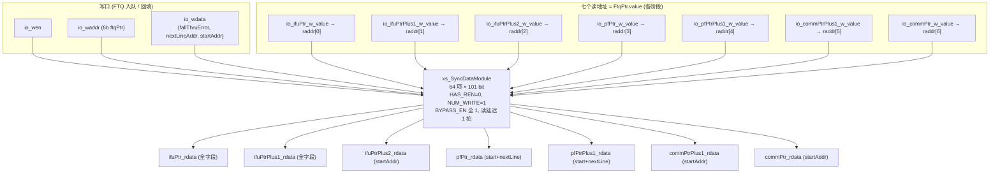
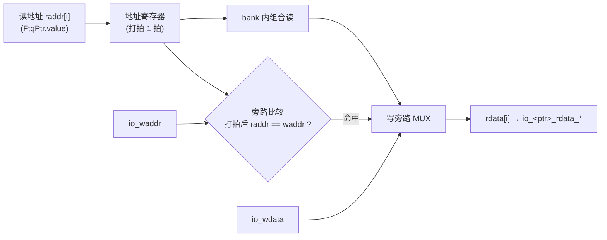

# FtqPcMemWrapper —— FTQ 的 PC 存储包装

## 1. 在前端中的角色

香山前端里，**FTQ（Fetch Target Queue，取指目标队列）** 是 BPU（分支预测单元）与
IFU（取指单元）之间的桥梁：BPU 每次预测产生一个 **fetch block**（一段连续取指区间）
并入队，IFU 按队列顺序逐个取出去取指。每个 fetch block 都有一份「PC 元信息」，
其中最宽的字段是 50 位的起始地址 `startAddr`。

如果把这些宽字段直接塞进 FTQ 主体的寄存器堆，会带来两个问题：

1. FTQ 主存储被 BPU、IFU、重定向、提交等多方读写，**扇出极大**；把 50 位 ×3 的
   PC 信息也放进去会让面积和时序压力陡增。
2. PC 信息的读访问模式相对独立——只需按 `ftqPtr` 索引读出，写则只在入队/回填时发生。

因此香山把 PC 元信息单独拆成一块 **多读口、SRAM 风格的同步内存**，就是
`FtqPcMemWrapper`。它本质是对底层 `SyncDataModuleTemplate`（本工程已重写为
`xs_SyncDataModule`）的一层**端口改名 + 读口映射**包装，自身没有额外逻辑。

```
        BPU 预测/入队
              │ wen / waddr / wdata(startAddr,nextLineAddr,fallThruError)
              ▼
      ┌───────────────────────┐
      │   FtqPcMemWrapper      │   64 项 × 101 bit 同步内存
      │  (xs_SyncDataModule)   │   读延迟 1 拍 + 写旁路
      └───────────────────────┘
        │  │  │  │  │  │  │  7 个并发读口（按 ftqPtr 索引）
        ▼  ▼  ▼  ▼  ▼  ▼  ▼
     ifuPtr / ifuPtrPlus1 / ifuPtrPlus2 → IFU 取指流水
     pfPtr  / pfPtrPlus1                → 指令预取
     commPtr / commPtrPlus1             → 提交 / 重定向 PC 还原
```

### 结构图（多读口 / 单写口）

七个读地址都是 `FtqPtr.value`（6 位），即 golden 的 `io_<ptr>_w_value` 端口——是**读地址而非写口**；
真正的写口只有 `io_wen`/`io_waddr`/`io_wdata`。读口按下标 0..6 聚成数组喂给底层 `xs_SyncDataModule`，
注意 **5=commPtrPlus1、6=commPtr**（`FtqPcMemWrapper.sv:96-104`）。



*图注：注意 raddr 下标 5/6 是 commPtrPlus1 在前、commPtr 在后（与命名直觉相反，`FtqPcMemWrapper.sv:97-98`）。各读口实际暴露的字段子集见第 3 节。*

## 2. 存储条目与索引

- **索引**：`ftqPtr`，6 位，共 64 个 FTQ 条目（`FTQ_SIZE=64`）。
- **每条目（`ftq_pc_entry_t`，共 101 bit）**：

  | 字段 | 位宽 | 位置 | 含义 |
  |------|------|------|------|
  | `startAddr`     | 50 | [49:0]   | 本 fetch block 的起始 PC（取指请求地址） |
  | `nextLineAddr`  | 50 | [99:50]  | 跨 cache line 时下一行地址（IFU 预取/对齐用） |
  | `fallThruError` | 1  | [100]    | fallThrough（顺序结束地址）越界/异常标记 |

  打包顺序 `{fallThruError, nextLineAddr, startAddr}` 与 golden 一致，FM 等价依赖此布局。

## 3. 七个读口

七个读口各由一个 FTQ 指针驱动，服务前端不同阶段。注意各读口实际用到的字段子集不同
（golden 只暴露用得上的字段）：

| 读口 | 驱动指针 | 暴露字段 | 用途 |
|------|----------|----------|------|
| 0 | `ifuPtr`        | startAddr, nextLineAddr, fallThruError | IFU 当前 fetch block |
| 1 | `ifuPtrPlus1`   | startAddr, nextLineAddr, fallThruError | IFU 下一 block（流水提前取 PC） |
| 2 | `ifuPtrPlus2`   | startAddr                              | IFU 再下一 block |
| 3 | `pfPtr`         | startAddr, nextLineAddr                | 指令预取当前指针 |
| 4 | `pfPtrPlus1`    | startAddr, nextLineAddr                | 预取下一指针 |
| 5 | `commPtrPlus1`  | startAddr                              | 提交指针 +1 |
| 6 | `commPtr`       | startAddr                              | 提交 / 重定向 PC 还原 |

**易错点**：底层 `raddr` 下标里 **5 = commPtrPlus1、6 = commPtr**（Plus1 在前），
与命名直觉相反。这是 golden（`SyncDataModuleTemplate_FtqPC_64entry` 的实例化）的固定
映射，重写时严格保留，否则 comm 两口读出会互换。

## 4. 时序与写旁路

底层 `xs_SyncDataModule` 的行为：

- **读延迟 1 拍**：读地址先寄存一拍，再在 bank 内做组合读，第二拍读出数据。
- **参数**：`HAS_REN=0`（读地址恒采样，无读使能门控）、`NUM_WRITE=1`、
  `BYPASS_EN` 全 1（各读口都启用写旁路）。
- **写旁路**：同一地址「本拍写、下拍读」能读到刚写入的新值（旁路比较的是打拍后的
  地址）。这对前端「刚入队随即被取」的场景很重要。
- 底层按容量分 bank（64 项 → 4 个 16 项 bank），写按地址高 2 位选 bank，读出按
  打拍后地址高 2 位多路选择——这些都封装在 `xs_SyncDataModule` 内，本包装无需关心。

读时序数据流（以单个读口为例，写旁路命中「本拍写、下拍读同址」）：



*图注：读地址打 1 拍后做组合读，故读延迟为 1；旁路比较用的是**打拍后**的读地址与写地址，命中则用刚写入的 `io_wdata` 替换读出值，实现「刚入队随即被取」读到新值。*

## 5. 接口表（golden 扁平端口）

| 方向 | 端口 | 位宽 | 说明 |
|------|------|------|------|
| in  | `clock`, `reset` | 1 | reset 异步，仅复位写使能寄存器 |
| in  | `io_<ptr>_w_value` | 6 | 7 个读地址（ifuPtr/ifuPtrPlus1/ifuPtrPlus2/pfPtr/pfPtrPlus1/commPtr/commPtrPlus1）。**注**：名字里的 `_w_value` 是 Chisel `FtqPtr.value`（指针的 value 字段）展平而来，是**读地址**，并非写口；真正的写口是下面的 `io_wen`/`io_waddr`/`io_wdata_*`。 |
| out | `io_<ptr>_rdata_*` | 50/1 | 各读口读出字段（字段子集见上表） |
| in  | `io_wen` | 1 | 写使能 |
| in  | `io_waddr` | 6 | 写地址（ftqPtr） |
| in  | `io_wdata_{startAddr,nextLineAddr,fallThruError}` | 50/50/1 | 写数据 |

## 6. 实现结构（本工程重写）

分两层（遵循 `docs/REWRITE_STYLE.md`）：

- **`xs_FtqPcMemWrapper`（可读核）**：端口按 FTQ 指针命名，读出用 `ftq_pc_entry_t`
  struct 表达完整条目，读口聚成数组喂给 `xs_SyncDataModule`。读懂它即读懂这块内存的
  微架构意图。
- **`FtqPcMemWrapper`（golden 同名包装）**：把可读核的 struct/数组端口拆成 firtool
  生成的扁平端口，是机械适配层，供 FM 等价比对与系统级替换对接。

底层复用已重写的 `xs_SyncDataModule` / `xs_DataModule`（见 `rtl/common/`）。

## 7. 验证结果

- **UT**（`verif/ut/FtqPcMemWrapper/`）：golden = `SyncDataModuleTemplate_FtqPC_64entry`
  （wrapper 的唯一子模块，wrapper 无逻辑故直接拿子模块当参考），impl =
  手写 `FtqPcMemWrapper`。每拍随机 7 读地址 + 随机写，逐拍比对全部读出字段。

  | seed | checks | errors |
  |------|--------|--------|
  | 1  | 52000 | 0 |
  | 7  | 52000 | 0 |
  | 42 | 52000 | 0 |

- **FM**（Formality 签名分析）：golden 顶层 `FtqPcMemWrapper`（含全部子模块）vs
  手写同名包装，结果 **Verification SUCCEEDED**。
- **可读性**：`grep -E "RANDOMIZE|SYNTHESIS|_GEN_|_T_[0-9]"` 命中 **0**。

复跑：
```bash
cd verif/ut/FtqPcMemWrapper
make compile
make run SEED=1   # 或 SEED=7 / SEED=42
make fm
```
