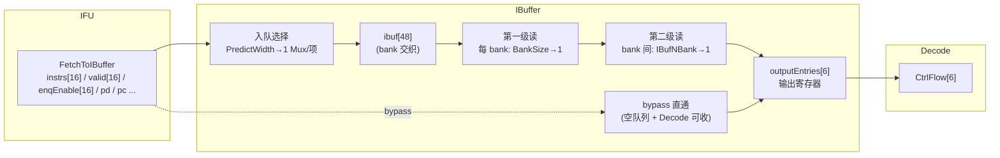

# IBuffer —— 指令缓冲（Instruction Buffer）

> ✅ **FM 分类 = REPLACEMENT_EQ（可读核真驱动 + 冻结基线原生 SUCCEEDED）**。依据台账
> [`verif/freeze/FM_STATUS.md`](../../verif/freeze/FM_STATUS.md) 与冻结基线日志
> `verif/ut/IBuffer/fm_work/IBuffer/fm_full.log`：本模块在当前冻结 golden 基线上 FM **原生
> `Verification SUCCEEDED`，7278 passing / 0 failing / 0 unverified**。下文验证节里任何
> "FAILED / 20 failing 截断 / 部分验证 / 未收敛"的表述是**冻结前的旧叙事，已作废**——以本
> banner 与台账为准。

> 香山 V2R2（KunMingHu）前端模块。手写可读 SV 重写：`rtl/frontend/IBuffer.sv`
> （可读核 `xs_IBuffer_core`）+ `rtl/frontend/IBuffer_wrapper.sv`（golden 同名扁平端口适配层）。
> golden 源：`golden/chisel-rtl/IBuffer.sv`；Chisel 源：`src/main/scala/xiangshan/frontend/IBuffer.scala`。

## 1. 在前端中的位置

```
IFU(取指) ──► IBuffer ──► Decode(译码) ──► Rename/...
```

IFU 一次最多送来一个**预测窗口**（`PredictWidth=16`）的（半）指令，但实际能入队的由
`enqEnable` 掩码决定；Decode 一次最多接收 `DecodeWidth=6` 条。两侧吞吐节奏不一致：
取指可能突发、译码可能阻塞。IBuffer 用一个**环形 FIFO**把它们解耦——取指快时把指令
暂存进队列，译码快时连续供给，从而隐藏取指延迟、平滑前端流水。

关键参数（V2R2）：

| 参数 | 值 | 含义 |
|------|----|------|
| `IBufSize` | 48 | 队列总深度 |
| `IBufNBank` | 6 | 出队交织的 bank 数 |
| `BankSize` | 8 | 每个 bank 的项数（=IBufSize/IBufNBank） |
| `DecodeWidth` | 6 | 每拍最多出队条数 / 输出寄存器数 |
| `PredictWidth` | 16 | 每拍最多入队条数（预测窗口宽度） |

## 2. 为什么用裸寄存器而不是 SRAM

IBuffer 是个很大的队列，但**读写端口数量多且时序敏感**：一拍最多写 16 条、读 6 条。
SRAM 难以提供这么多端口，故 V2R2 用**裸寄存器阵列** `ibuf[48]`，再用精心设计的
读写选择逻辑控制端口面积：

- **入队**：每个 `ibuf` 项前挂一个 `PredictWidth→1` 的 Mux —— 16 条 fetch 指令里挑一条写进本项。
- **出队**：把 48 项按 `IBufNBank=6` 个 bank **交织编址**（项 `idx` 属于 bank `idx % 6`），
  读端口组织成「分 bank 的 FIFO」。每拍每个 bank 顺序读出**不超过 1 项**，
  分两级选择：先在 bank 内 `BankSize(8)→1` 选出该 bank 队头，再在 6 个 bank 间 `6→1`
  选出。两级比单级 `48→1` 省面积，延迟相近。

## 3. 数据流



### 入队（Enqueue）

- `numFromFetch = PopCount(enqEnable)`：本拍 IFU 想入队的条数。
- `enqOffset[i] = PopCount(valid[0..i-1])`：第 i 槽相对本批入队基址的偏移（用 **valid** 掩码）。
- 入队指针向量 `enqPtrVec[k] = enqPtr + k`（共 16 个，便于一拍写多条）。
- 每个 `ibuf[idx]` 的写选择：第 i 条 fetch 命中本项当且仅当
  `valid[i] & enqEnable[i] & (enqPtrVec[enqOffset(i)].value == idx)`（OneHot）。
- `io.in.fire && !flush` 时写入；指针整体 `+= numTryEnq`。

### 出队（Dequeue）

- `numValid = distanceBetween(enqPtr, deqPtr)`：当前有效项数。
- `numOut/numDeq`：本拍计划出队条数
  - Decode 接收：尽量出 `DecodeWidth` 条（受 numValid 限制）；
  - Decode 不收但输出寄存器没满：补齐到 `DecodeWidth`（受 numValid 限制）；
  - 否则不出。
- **三组出队指针**（均为循环队列指针 `{flag, value}`）：
  - `deqPtr`：全局出队指针，用于 `distanceBetween` 与一致性断言；每拍 `+= numDeq`。
  - `deqBankPtrVec[i]`：第 i 个译码槽从第 `(deqBankPtr0 + i) mod NBank` 个 bank 读；整体 `+= numDeq`。
  - `deqInBankPtr[b]`：bank b 内部偏移；**仅当本拍 bank b 被读到**（`numOut > validIdx[b]`）才 `+1`。
  - 三者满足 `deqPtr == bank + inBank * IBufNBank`。
- 读出的 `deqEntries[i]` 打入 `outputEntries[i]` 输出寄存器后再送 Decode。

### bypass（空缓冲直通）

当 `enqPtr == deqPtr`（队列空）且 `decodeCanAccept`（Decode 可收）时，新到的 fetch 指令
不必先写 `ibuf` 再读出，而是**直接旁路**进输出寄存器，省一拍延迟。超过 `DecodeWidth`
的部分（`numTryEnq = numFromFetch - DecodeWidth`）仍照常入队。

### 输出寄存器拼接

Decode 不接收但输出寄存器未满时，把新读出的项**拼接到已有有效项之后**：
槽 `i < outputEntriesValidNum` 保留旧 bits，`i >= validNum` 填 `deqEntries[i - validNum]`，
valid 永远更新为 `deqEntries[i].valid`。

> 细节：`outputEntriesValidNum` 对齐 Chisel 的 `PriorityMuxDefault(zip(range(1,DecodeWidth)))`——
> 只把 `valid[0..DecodeWidth-2]` 映射到 `1..DecodeWidth-1`，**最高槽不参与**，故全满也返回
> `DecodeWidth-1`（=5），不是 6。

### flush / redirect

`io.flush` 一拍冲刷：所有指针复位（enqPtrVec→0,1,2..；deqBankPtrVec→0,1,2..；
deqPtr/deqInBankPtr→0），`outputEntries` 只清 valid（bits 保留），`allowEnq` 置 1。
`ibuf` 内容不清——复位后从指针 0 重新覆写。

### 异常类型编码

队列项用 3-bit `exceptionType` 合并表示取指异常（`cvtFromFetchExcpAndCrossPageAndRVCII`）：

| 条件 | 编码 | 出口解码 |
|------|------|----------|
| crossPage | `{1, fetchExcp}` | `crossPageIPFFix = type[2] & type[1:0]!=0` |
| fetchExcp≠0 | `{0, fetchExcp}` | type[1:0]: 01=PF, 10=GPF, 11=AF |
| illegalInstr | `100` | `EX_II = type==100` |
| 否则 | `000` | 无异常 |

出口映射到 `CtrlFlow.exceptionVec` 的位（端口后缀是 ExceptionVec 的 bit 下标，
对照 `rtl/frontend/IBuffer.sv:87-90` 端口注释）：`_1`=instrPageFault（指令缺页）、
`_2`=instrAccessFault（指令访问错）、`_12`=instrGuestPageFault（指令客户机缺页，H 扩展）、
`_20`=EX_II（非法指令 illegal instruction）。

### TopDown / 性能

`stallReason`：把出队浪费槽（`deqWasteCount = DecodeWidth - 有效出队数`）从最高下标往回
标记阻塞原因。`flush` 时按重定向类型（BTB/TAGE/SC/ITTAGE/RAS Miss、MemVio、Other）置
`topdown_stage` 归因位；既非全浪费又无任何原因 → 标记 `FetchFragBubble(=13)`；后端
`backReason` 覆盖一切。`perf_value[9]` 为 9 个性能事件，**寄存两拍**后输出（对齐
`HasPerfEvents` 的 `_REG/_REG_1`）。

## 4. 接口（核 `xs_IBuffer_core`）

| 方向 | 信号 | 说明 |
|------|------|------|
| in  | `in_valid/in_ready` | 入队握手（DecoupledIO，ready=allowEnq） |
| in  | `in_instrs[16] / in_valid_mask / in_enqEnable` | fetch 指令与有效/入队掩码 |
| in  | `in_pc / in_foldpc / in_pd_* / in_ftqOffset_valid / in_*Exception* / in_triggered / in_isLastInFtqEntry / in_ftqPtr_*` | 各槽 payload |
| out | `out_valid / out_instr / out_pc / ... / out_exceptionVec_* / out_pred_taken / out_ftqPtr_* / out_ftqOffset` | 6 路译码输出（CtrlFlow） |
| in  | `decodeCanAccept` | Decode 是否接收本拍输出 |
| out | `full` | 队列将满（=!allowEnq） |
| out | `stallReason_reason[6]` / in `stallReason_backReason_*` | 阻塞原因归因 |
| in  | `topdown_info_reasons[38]` / out `perf_value[9]` | TopDown / 性能事件 |

`IBuffer_wrapper.sv`（golden 同名 `IBuffer`）把上述 struct/数组端口机械拆成 golden 扁平端口
（`io_in_bits_instrs_0..15`、`io_out_0_bits_*` 等），并例化核 `u_core`。
注：golden 顶层 DCE 掉了 `io.full`（未连接），wrapper 中 `.full()` 留空。

## 5. 验证

### UT（golden vs `_xs` 双例化逐拍随机比对）

`verif/ut/IBuffer/{Makefile, variants_xs.sv, tb.sv}`：两份例化（golden `IBuffer` 与手写
`IBuffer_xs`）共享同一组随机激励（随机 enq 各 way valid/enqEnable、随机 deq via
decodeCanAccept、随机 flush/redirect/backReason），每拍比对全部 124 个输出端口。

```
cd verif/ut/IBuffer && make compile && make run
```

结果：**TEST PASSED，checks=38004，errors=0**（默认 40000 拍）。多种子（1/2/3/7/42/11）
与 200k 拍长跑（checks=198004, errors=0）均通过。

### FM（Formality 签名等价）

```
make fm
```

末次 verify 结论 **Verification FAILED**：**781 passing / 20 failing / 6427 unverified**。
20 个 failing 全部是出队指针寄存器（`deqPtr_flag` / `deqBankPtrVec_*_value` 等），在
**不可达 don't-care 状态**下编码与 golden 不同（已尽量用 golden 的 signed-diff 回绕形式对齐）。
注意 **20 是 Formality 默认 `verification_failing_point_limit=20` 的截断上限**——verify 攒满
20 个失配即提前中止，**6427 个比对点落在 Unverified 未验**（可读核 struct/数组 vs golden 展平
标量导致大量点配对/验证不收敛）。故本模块 FM 为**部分验证**，功能正确性以上述充分 UT
（多种子逐拍全输出 0 错）为权威。子模块无（golden 顶层全展平，无外部例化）。
