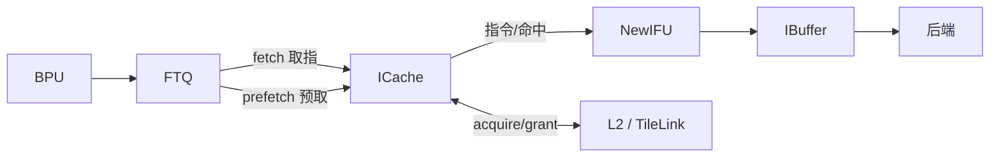
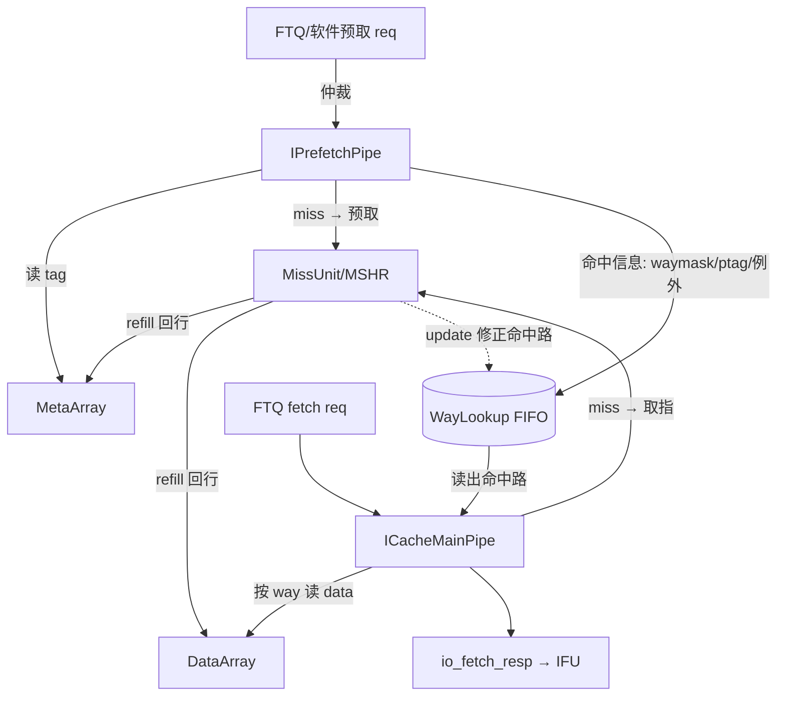

# ICache —— 香山 V2R2（昆明湖）指令缓存顶层

> 学习导向文档。先读 `docs/FRONTEND_OVERVIEW.md §3.2` 建立前端全局认知，再读本文了解
> ICache 如何把 8 个功能单元组装成一个 L1 指令缓存。各子模块细节见同目录下各自的
> `docs/frontend/ICache*.md`、`WayLookup.md`、`IPrefetchPipe.md`。
>
> 对应 RTL：可读核 `rtl/frontend/ICache.sv`（`xs_ICache_core` + `xs_icache_pkg`），
> golden 同名 wrapper `rtl/frontend/ICache_wrapper.sv`，验证 `verif/ut/ICache/`。

## 1. ICache 在前端的位置



ICache 是一个 **4 路组相联、双 bank、行宽 64B** 的 L1 指令缓存：
- 上游：FTQ 给出取指请求（`io_fetch_*`，给 IFU 用）和预取请求（`io_ftqPrefetch_*`）；
  还有软件预取（`prefetch.i` 指令，`io_softPrefetch_*`）。
- 下游：命中则把指令交给 IFU（`io_fetch_resp`）；miss 则经 MissUnit 向 L2 发 acquire 取行。
- 旁路：ITLB（虚实地址翻译）、PMP（物理内存保护检查）、CtrlUnit 的 TileLink 控制口
  （诊断 / ECC 注入）。

**顶层本身几乎没有功能逻辑**：它把 8 个子模块接到一起，再做 4 处小仲裁。真正的流水、
查表、refill、replacement 都在子模块里。

## 2. 子模块与数据流

| 子模块 | 职责 |
|--------|------|
| `IPrefetchPipe` | 预取流水（s0/s1/s2）：翻译 + 查 MetaArray 算命中路，miss 向 MissUnit 发预取，命中信息写 WayLookup |
| `WayLookup` | 命中信息 FIFO：解耦 prefetch（写）与 mainpipe（读）；refill 时就地修正在途条目命中路 |
| `ICacheMainPipe` | 取指主流水（s0/s1/s2）：从 WayLookup 读命中路，读 DataArray 取指令；miss 向 MissUnit 发取指 |
| `ICacheMissUnit` | MSHR：接 mainpipe（取指 miss）与 prefetch（预取 miss），向 L2 acquire，回行后写 Meta/DataArray |
| `ICacheMetaArray` | 4 路 tag/valid SRAM + ECC |
| `ICacheDataArray` | 4 路 × 2 bank data SRAM + ECC |
| `ICacheReplacer` | PLRU：touch 更新、victim 查询给出待替换路 |
| `ICacheCtrlUnit` | 经独立 TileLink 口接收诊断命令，注入态抢占 Meta/DataArray 读写口（ECC 可靠性测试） |

### 核心思想：prefetch 与 mainpipe 经 WayLookup 解耦



ICache 把「**查 meta 定位在哪一路**」和「**读 data 取指令**」拆成两条流水：
- `IPrefetchPipe` 跑在前面，把每个取指块查表（ITLB 翻译 + 读 MetaArray 比 tag），算出
  `waymask`/`ptag`/例外，写进 `WayLookup`（小 FIFO）；miss 的块顺手向 MissUnit 发预取。
- `ICacheMainPipe` 真正取指时从 `WayLookup` 读出这块的 `waymask`，直接拿 way 去读
  DataArray，**不必自己再查一遍 meta**。WayLookup 把两条流水在时间上解耦，互不阻塞。
- refill 完成时，MissUnit 经 `io_update` 就地修正 WayLookup 里**在途**条目的命中路
  （把某块从 miss 变 hit，或因覆盖某路把 hit 变 miss）。

## 3. 顶层真正承担的逻辑（可读核重点）

只有四块，全部在 `xs_ICache_core` 中以具名信号 + 注释表达：

### 逻辑 1：软件预取仲裁（softPrefetch FSM）
- 3 个软件预取口（`io_softPrefetch_0/1/2`）+ FTQ 硬件预取口，仲裁后送 **一个** IPrefetchPipe。
- 软件预取需**锁存**：prefetcher 当拍未必空闲，把软预取请求黏在 `softPrefetchValid` 寄存器
  里，直到被 prefetcher 接收（`pf_req_fire`）才清；新请求优先于清除。
- **优先级**：软预取一旦锁存就抢占 prefetcher 的 req 口，FTQ 硬件预取此时让位：
  `io_ftqPrefetch_req_ready = pf_req_ready & ~softPrefetchValid`。
- 3 个软预取口按 0 > 1 > 2 优先级三选一取 vaddr；下一行地址 = vaddr + 64B（一条 cacheline）。

### 逻辑 2：错误上报寄存器（io_error → BEU）
MainPipe 两个 port 可能报 ECC / 总线错误（`mp_errors_0/1`）。port0 优先，打一拍后从
`io_error_*` 输出给 BEU（Bus Error Unit）。

### 逻辑 3：Meta/Data array 读写仲裁（CtrlUnit 注入 vs 正常 refill/prefetch）
一个布尔 `cu_injecting` 选所有 Meta/DataArray 读写口的源：
- `cu_injecting = 1`：CtrlUnit 抢占（诊断 / ECC 注入测试，写入坏 ECC `poison=1` 验证纠错路径）；
  注入 data 写数据恒 0。
- `cu_injecting = 0`（常态）：Meta 写 = MissUnit refill；Meta 读 = Prefetch；Data 写 = refill；
  Data 读 = MainPipe 发起。

### 逻辑 4：输出汇聚
`io_fetch_req_ready` / `io_toIFU` = MainPipe 的 fetch_req_ready；
`io_ftqPrefetch_req_ready` = prefetcher 空闲且无软预取抢占。

## 4. 接口表（按功能分组，省略 sideband）

| 组 | 方向 | 说明 |
|----|------|------|
| `io_fetch_req` / `io_fetch_resp` | in/out | IFU 取指请求/响应（→ MainPipe）|
| `io_ftqPrefetch_*` | in | FTQ 硬件预取请求 + BPU s2/s3 冲刷（→ Prefetch）|
| `io_softPrefetch_0/1/2` | in | 软件预取（prefetch.i），3 并行口，顶层仲裁锁存 |
| `io_itlb_0/1_*` | out/in | 两条 cacheline 的 ITLB 翻译口（→ Prefetch）|
| `io_pmp_0/1` `io_pmp_2/3` | out/in | PMP 检查：0/1 给 MainPipe，2/3 给 Prefetch |
| `auto_client_out_*` | out/in | MissUnit 的 L2/TileLink client 口（acquire a / grant d）|
| `auto_ctrlUnitOpt_in_*` | in/out | CtrlUnit 诊断 TileLink 口（a/d）|
| `io_error_*` | out | ECC/总线错误上报 BEU（顶层打一拍）|
| `io_fencei` `io_flush` `io_stop` `io_wfi_*` | in/out | fence.i 全冲刷 / 重定向冲刷 / 背压 / WFI 握手 |
| `io_perfInfo_*` | out | 命中/miss/例外性能计数（MainPipe 直出）|
| `boreChildrenBd_*` `sigFromSrams_*` | in/out | **纯透传** MBIST 串 + SRAM 物理控制，路由到 Meta/DataArray |

### SRAM/MBIST sideband 透传映射（占端口数 ~70%，无功能含义）
- `boreChildrenBd_bore` → MetaArray 的 1 个 MBIST 串；`boreChildrenBd_bore_1..4` →
  DataArray 的 4 个 MBIST 串（4 路 data way 各 1，DataArray 内部命名 `bore..bore_3`）。
- `sigFromSrams_bore_0..3` → MetaArray 的 4 个 SRAM 物理控制；`sigFromSrams_bore_4..35` →
  DataArray 的 32 个（DataArray 内部 `_0.._31`）。

## 5. 可读性重写要点（相对 firtool golden）

- 8 个子模块**维持 golden 同名直接例化**（它们已各自验证可读完成），本文件只重写顶层互联与仲裁；
- 仲裁/路由用具名中间信号（`cu_injecting`、`softPrefetchValid`、`meta_write_*`/`data_write_*` 选择）
  + 注释讲「谁优先、为什么」，消除 `_GEN_n`/`_T_n` 临时名；
- 软件预取 3 选 1 用优先级三元表达；
- MBIST/`sigFromSrams` 物理 sideband（纯透传）单独分节、连续连接，不污染功能逻辑阅读；
- 端口与 golden 完全同名同序同宽，使 wrapper 成为零逻辑透传、并让 Formality 按签名/名字对齐。

## 6. 验证

### UT（golden vs `_xs` 双例化，逐拍比对全部 64 个输出）
随机激励：取指/预取/软预取/CtrlUnit/L2 grant 握手按概率发起；vSetIdx/ptag 压缩到小值域
提高命中/MSHR 合并；逐拍在时钟稳定区比对所有输出（跳过 golden 未写项 X）。

UT 双例化时 golden `ICache` 与 `ICache_xs`（核例化同名子模块）**共用同一批 golden 子模块
实现**，故比对只检验顶层互联/仲裁是否等价。

| seed | checks | errors | 结果 |
|------|--------|--------|------|
| 1  | 200000 | 0 | TEST PASSED |
| 7  | 200000 | 0 | TEST PASSED |
| 42 | 200000 | 0 | TEST PASSED |

```
cd verif/ut/ICache && make compile && make run            # seed 1
./simv +ntb_random_seed=7  ;  ./simv +ntb_random_seed=42   # 多种子
```

### FM（Formality 签名等价）
8 个子模块两侧均不读源 → `hdlin_unresolved_modules=black_box` 统一黑盒，顶层互联/仲裁
按名字 + 签名分析比对。

```
make fm   # FM_RESULT: Verification SUCCEEDED for ICache
```

结果：**8519 个 compare point 全部 Passing（equivalent），0 unmatched，0 failing**
（8468 按名 + 51 按签名分析；146 DFF / 1564 Port / 6808 BBPin）。

## 7. 关键设计决策 & X/FM 处理

- **子模块当黑盒**：8 个子模块已各自验证，顶层不重写；UT 用 golden 实现给真实行为，
  FM 用 black_box 对齐边界。InstrUncache 不在 golden ICache 顶层内（由更上层例化），故不涉及。
- **SRAM 内层 X**：UT 在 `+define+SYNTHESIS` 下关 golden 随机初始化；SRAM 未写项读出 X，
  tb 比对用 `!$isunknown(g_*)` 跳过 golden 侧 X，避免假阳性。顶层仲裁逻辑保证 `cu_injecting`
  等选择信号有确定复位值（CtrlUnit 复位后 `injecting=0`），不会把 X 传到读写使能。
- **复位脉冲足够长**：tb 复位 20 拍，让 MSHR/FIFO/SRAM 进入确定态后再比对。
- **错误上报 / 软预取寄存器**带异步复位，复位后读出确定值（不出 X）。
