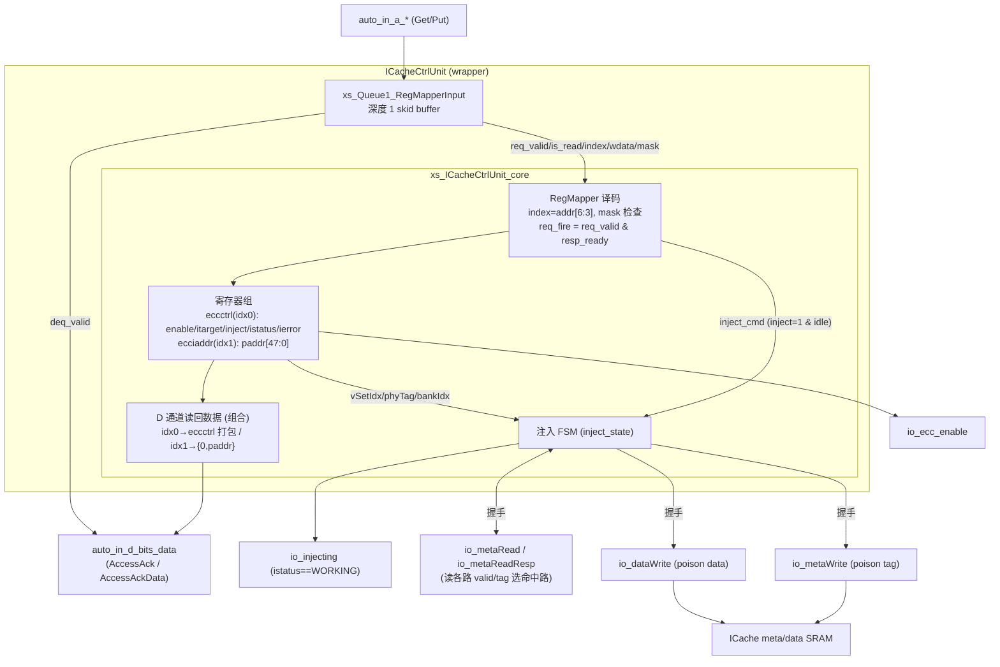
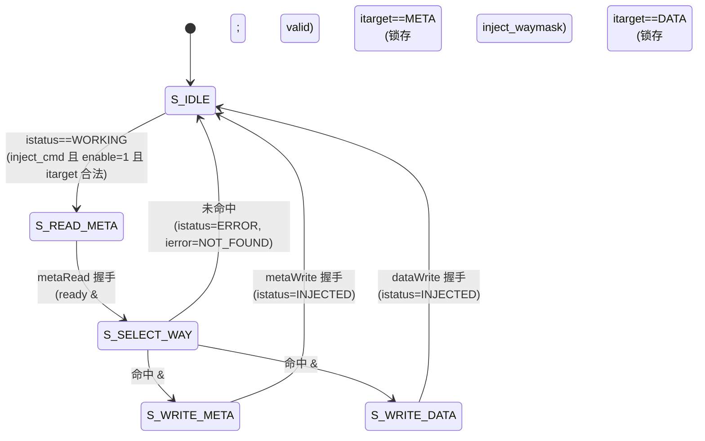

# ICacheCtrlUnit —— ICache ECC 控制 / 错误注入单元

| | |
|---|---|
| 手写 SV | `rtl/frontend/ICacheCtrlUnit.sv`（`xs_ICacheCtrlUnit_core` + `xs_Queue1_RegMapperInput`）+ `rtl/frontend/ICacheCtrlUnit_wrapper.sv`（golden 同名顶层 `ICacheCtrlUnit`）+ `rtl/frontend/Queue1_RegMapperInput_3_wrapper.sv`（golden 同名队列） |
| Scala 来源 | `src/main/scala/xiangshan/frontend/icache/ICacheCtrlUnit.scala` |
| 验证状态 | UT ✅（6 万拍 0 错，checks=60000）/ FM ✅（`Queue1_RegMapperInput_3` 与 `ICacheCtrlUnit` 均 SUCCEEDED） |

## 它是什么、为什么存在

ICache 的 meta / data SRAM 都带 ECC。为了在硅后/仿真里验证「ECC 检错-纠错-上报」整条通路，
需要能**主动往某个 cacheline 注入 ECC 错误**。ICacheCtrlUnit 就是这个旁路单元：以一条
**TileLink-UL（uncached lightweight）寄存器总线**挂在 ICache 旁，由 M 模式软件通过读写两个
MMIO 寄存器来 (1) 开关 ECC、(2) 指定注入地址、(3) 触发一次注入。

```
软件 ──TileLink A/D──▶ [ RegMapper 寄存器组 ] ──注入命令──▶ 注入 FSM
                                                              │
                      io_metaRead  ◀──── 读 meta，选命中路 ───┤
                      io_metaWrite/io_dataWrite ─ 写"中毒"项 ─▶ ICache SRAM
```

注入手段是给目标 way 的 meta 或 data 写一条 `poison=1` 的表项：SRAM 写通路会按 poison 故意
翻坏 ECC 校验位，于是下次正常读到该 line 时 ECC 就会报错。

### 结构图（TL-UL 寄存器接口 + 注入 FSM）

A 通道请求先入深度 1 队列（skid buffer，`xs_Queue1_RegMapperInput`）打一拍解耦，再由核心译码
（`index=address[6:3]`）作用到两个寄存器；`req_fire=req_valid & resp_ready`（D 通道 ready）即出队。
注入命令触发 FSM，依次驱动 metaRead/metaWrite/dataWrite 三个握手通道。对应 `ICacheCtrlUnit_wrapper.sv` + `ICacheCtrlUnit.sv`。



*图注：寄存器译码与 D 通道读回（组合产生）是「寄存器读写」块；inject_cmd 触发的 `inject_state` 是「注入 FSM」块，向 ICache SRAM 注入 poison 项。队列与核心同享 `auto_in_d_ready` 作为出队/req_fire 条件（`ICacheCtrlUnit_wrapper.sv:65,91`）。*

## 两大功能块

1. **寄存器读写**：把 TileLink A 通道（经一个深度 1 队列）解码成对 2 个寄存器的访问，并在 D 通道
   回 AccessAck / AccessAckData。
2. **注入 FSM（`inject_state`）**：软件写下注入命令后，自动「读 meta → 比 tag 选命中路 →
   写 meta 或写 data 注错」。

## 寄存器映射

A 通道地址按 8 字节对齐，`index = address[6:3]` 选寄存器。合法寄存器**写**要求字节掩码全 1
（`&mask`，字段须被完整覆盖）；**读**只要任一字节使能即可。本配置只用到 index 0 / 1
（`index[3:1]==0` 判为低寄存器区）。

| index | 寄存器 | 写语义 | 读回（D 通道 data） |
|-------|--------|--------|---------------------|
| 0(偶) | **eccctrl**  | `data[0]`→enable、`data[1]`→inject(触发)、`data[3:2]`→itarget | `{ierror[2:0], istatus[2:0], itarget[1:0], 1'b0, enable}` |
| 1(奇) | **ecciaddr** | `data[47:0]`→注入物理地址 | `{16'h0, paddr[47:0]}` |
| 其它  | —            | —      | 0 |

eccctrl 内部字段（手写 SV 里用有含义命名 + `typedef enum`，不照抄 golden 的 `eccctrl_*`）：

| 字段（SV 名） | 含义 | 编码（enum） |
|---------------|------|--------------|
| `ecc_enable`        | ECC 检查总开关（复位 1），驱动 `io_ecc_enable` | 1 bit |
| `ecc_inject_target` | 注入目标阵列 | `INJ_TARGET_META=0` / `INJ_TARGET_DATA=2`（1/3 非法） |
| `ecc_inject_status` | 注入业务状态（软件可见） | `IDLE=0` / `WORKING=1`（驱动 `io_injecting`）/ `INJECTED=2` / `ERROR=7` |
| `ecc_inject_error`  | 失败原因（istatus==ERROR 时有效） | `NOT_ENABLED=0` / `TARGET_INVAL=1` / `NOT_FOUND=2` |

注入地址字段切分（与 ICache `get_idx/get_tag` 一致）：
`vSetIdx=paddr[13:6]`、`phyTag=paddr[47:12]`、`bankIdx=paddr[6]`。

**读副作用**：读 eccctrl 且 istatus 处于完成态（INJECTED 或 ERROR）时，该读动作顺带把
istatus 清回 IDLE、ierror 清回 NOT_ENABLED（对应 Scala `RegReadFn` 的 `ready` 回调）。
`inject` 是 write-only 触发位，读恒 0。`istatus`/`ierror` 是 read-only，软件写被忽略。

## 注入 FSM（`inject_state`）

软件向 eccctrl 写「`inject=1` 且当前 istatus==IDLE」即下发命令（重复触发被忽略）：
- `enable=0` → 立即 ERROR / NOT_ENABLED（没开 ECC 不让注）；
- `itarget` 非法 → 立即 ERROR / TARGET_INVAL；
- 否则 → istatus 进 WORKING，启动 FSM。

注意 `istatus`（软件接口语义）与内部微状态机 `inject_state` 是两层：WORKING 期间 FSM 还会
走 read / select / write 几个微步。

| inject_state | 行为 |
|--------------|------|
| `S_IDLE`(0)       | istatus==WORKING 时 → `S_READ_META` |
| `S_READ_META`(1)  | 发 `io_metaRead`（vSetIdx=paddr[13:6]）；握手 → `S_SELECT_WAY` |
| `S_SELECT_WAY`(2) | 用 metaReadResp 的 `entryValid & tag==phyTag` 选命中路 `hit_waymask`，锁存到 `inject_waymask`。命中：itarget==META→`S_WRITE_META`，否则→`S_WRITE_DATA`；未命中：→`S_IDLE` 且 istatus=ERROR、ierror=NOT_FOUND |
| `S_WRITE_META`(3) | 发 `io_metaWrite`（phyTag/waymask/bankIdx，poison）；握手 → `S_IDLE`，istatus=INJECTED |
| `S_WRITE_DATA`(4) | 发 `io_dataWrite`（virIdx/waymask，poison）；握手 → `S_IDLE`，istatus=INJECTED |

状态机图（`inject_state`，对应 `ICacheCtrlUnit.sv:276-300` 转移 + 318-364 的 istatus/ierror 副作用）：



*图注：istatus 在软件下命令时由 inject_cmd 置 WORKING（enable=0 或 itarget 非法则直接 ERROR，不进 FSM）；FSM 走完在 S_IDLE 落到 INJECTED 或 ERROR，软件读 eccctrl 时清回 IDLE。FSM 未列出的不可达状态（5..7）保持原值（`default: ;`），是 FM 等价的关键。*

## 结构与可读性

- **xs_ICacheCtrlUnit_core**：从 Scala 设计意图重写——
  - 用 `typedef enum` 表达 istatus / ierror / itarget / inject_state 四组编码（带有含义状态名），
    取代 golden 的 `3'h1/3'h7` 魔数与 `_GEN_*` 临时名；
  - 寄存器/信号用领域命名（`ecc_enable` / `ecc_inject_paddr` / `inject_waymask` / `hit_waymask` /
    `inject_cmd` / `read_eccctrl_clears` 等），不照抄 golden 的 `eccctrl_*` / `out_backMask` / `keep_ierror`；
  - 用 `logic` + `always_ff` / `always_comb`，按「寄存器更新 / 注入 FSM / D 通道读数据」分节，
    每节注释讲「为什么」（RegMapper valid/ready 语义、ierror 优先级、未列状态保持等）。
- **xs_Queue1_RegMapperInput**：深度 1 skid buffer，槽内字段用 `typedef struct packed`（read/index/
  data/mask/source/size）而非裸位打包，可读地表达 RegMapper 在 A→D 间打一拍解耦的意图。
- **ICacheCtrlUnit（wrapper）**：机械端口适配——例化队列 + 核心，完成 TileLink A/D 对接：
  A 通道 `opcode==4'h4`(Get) 判读、`address[6:3]` 取 index 入队；D 通道 `valid=队列有响应`、
  `opcode={3'h0, read}`（AccessAck / AccessAckData）。

## 验证

- **UT**：golden `ICacheCtrlUnit` vs `ICacheCtrlUnit_xs` 双例化，复位后逐拍比对全部 19 个输出。
  随机激励覆盖：A 通道随机读/写请求（opcode 偏 Put/Get、index 偏 0/1 偶发越界、mask 偏全 1）、
  D 通道随机背压、meta/data 读写 ready 随机、metaReadResp 的 ptag 压缩值域以提高注入命中率。
  60000 拍、0 错。
- **FM**：`Queue1_RegMapperInput_3` 与 `ICacheCtrlUnit` 均 SUCCEEDED，全部 compare point 按
  **签名分析 / 名字**配对（158 by name + 129 by signature），0 unmatched、0 failing，无需 fm_map。

### 重写过程中暴露/规避的两个坑（均为真因，已对齐 golden 语义）

1. **D 通道读数据的 X 悲观**：队列空槽时 `req_index` 为 X，golden 用三目 `index[3:1]==0 ? … : 0`
   会把 X 透传进 `auto_in_d_bits_data`（此时 D.valid=0，数据本无意义）。最初写成 `always_comb`
   的 `if/else` 会把 X 当 false → 输出 0，与 golden 不符（UT 报 3 处假阳性）。改用连续赋值三目
   令 X 同样透传，UT 即干净。属 golden X 悲观，非真 bug。
2. **注入 FSM 未列状态须"保持"**：golden 对 istate 的 5..7（不可达）无 else 分支即保持原值。
   若手写 FSM 用 `default: <= S_IDLE`，FM 会在这些 don't-care 状态判 `inject_state_reg[2:0]`
   不等价（3 个失败点）。改成 `default: ;`（保持）后 FM 全过。UT 不暴露（这些状态不可达），
   靠 FM 兜底。

## 未改动

仅改动 ICacheCtrlUnit 相关文件（核心 / 两个 wrapper / 本文档 / verif 下的 variants/tb 端口适配）。
未修改 `scripts/fm_eq.tcl`、`scripts/ut_common.mk` 及其它模块；通用 FM 脚本即可通过。
