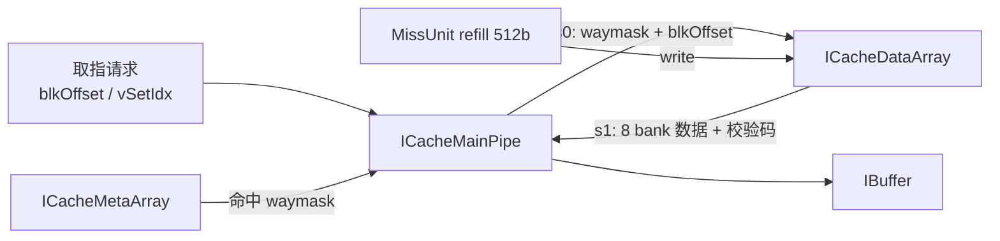
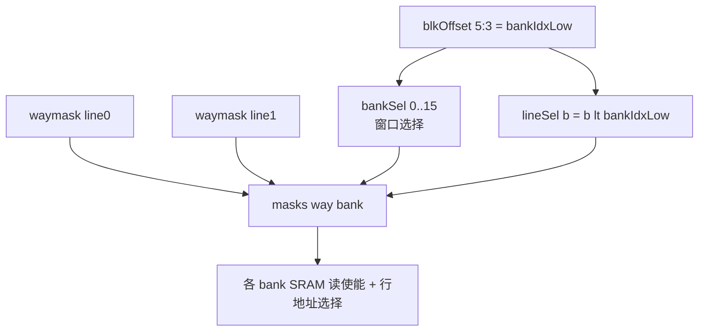

# ICacheDataArray —— 指令缓存数据阵列（学习文档）

| 项 | 说明 |
| --- | --- |
| 可读核 | `rtl/frontend/ICacheDataArray.sv`（模块 `xs_ICacheDataArray`） |
| 包装层 | `rtl/frontend/ICacheDataArray_wrapper.sv`（golden 同名 `ICacheDataArray`，机械适配 + 黑盒例化，由 `scripts/gen_icachedata.py` 生成） |
| UT | `verif/ut/ICacheDataArray/`（golden vs `_xs` 双例化，随机读/写/DFT，逐拍比对全部输出） |
| 验证状态 | UT ✅（checks=28019 / errors=0）；FM ✅（SUCCEEDED，14365 比对点全配对：13544 BBPin + 789 Port + 32 DFF，0 failing / 0 unmatched） |

---

## 1. 它在前端的位置

ICache 是 4 路组相联。每一“路 / way”里又分两块阵列：

- **ICacheMetaArray**：存 tag + valid + meta-ECC，负责**命中判定**，产出命中 way 的 one-hot `waymask`。
- **ICacheDataArray（本模块）**：只存**指令字节本身** + data-ECC，负责按命中 way **读出指令数据**。



MainPipe 先查 Meta 拿到命中 way，把 `waymask` + 取指偏移 `blkOffset` 送进本模块；本模块在下一拍吐出对应 way 的指令数据给 MainPipe，再经预译码送入 IBuffer。

---

## 2. 阵列组织：4 路 × 8 bank

| 参数 | 值 | 含义 |
| --- | --- | --- |
| `NUM_WAYS` | 4 | 路数（组相联） |
| `NUM_BANKS` | 8 | 一条 64B cacheline 横向切 8 个 bank，每 bank 8B(64bit) |
| 组数 | 256 | `setIdx` 8bit |
| 每 bank SRAM 字宽 | 65bit | 64bit 数据 + 1bit 校验码 |
| SRAM 块数 | 4×8 = 32 | 每个 (way, bank) 一块单口 SRAM |

每块 SRAM 深 256、宽 65bit。把一条 cacheline 切成 8 个 bank、各 bank 独立一块 SRAM，是为了让**一次取指能并行访问多个连续 bank**，并支持下面的“跨行读取”。

---

## 3. 跨行读取：bankSel / lineSel / masks（最核心的设计）

取指请求给出 cacheline 内字节偏移 `blkOffset`。前端一次取指要读**固定个数的连续 bank**，而这段连续 bank 可能从某条 cacheline 的中间开始，一直延伸到**下一条 cacheline**——即跨越行边界。

为此上层为“当前行 line0 / 下一行 line1”各提供一套信息：

- 组索引：`vSetIdx[0]`（line0）、`vSetIdx[1]`（line1）
- 命中掩码：`waymask[0]`（line0）、`waymask[1]`（line1）

模块据 `blkOffset` 算三组译码量：

```
bankIdxLow  = blkOffset[5:3]               // 取指起始 bank (0..7)
bankIdxHigh = bankIdxLow + WINDOW_BANKS     // 窗口末端 bank（可 ≥8 跨入下一行）
bankSel[i]  = (i >= bankIdxLow) && (i <= bankIdxHigh)   // i = 0..15 窗口选择向量
lineSel[b]  = (b < bankIdxLow)             // 物理 bank b 是否已“翻篇”取下一行
```

- `bankSel` 是一个长度 16 的窗口选择向量：**低半段 `bankSel[0..7]` 归当前行**，**高半段 `bankSel[8..15]` 归下一行**。
- `lineSel[b]` 表示物理 bank `b` 在本次取指中属于“下一行”：起始 bank 之前的那些 bank 已经被“翻篇”到下一条 cacheline。

最终每个 (way, bank) 是否真正发起读由 `masks` 决定：

```
masks[way][bank] = lineSel[bank] ? (waymask[1][way] & bankSel[8+bank])   // 取下一行
                                  : (waymask[0][way] & bankSel[bank]);    // 取当前行
```



读端口分配：bank `b` 使用读端口 `b % 4`（4 个读端口是控制扇出用的副本，关键信息全取自端口 0）。行地址 `lineSel[b] ? vSetIdx[1] : vSetIdx[0]`。

---

## 4. 读 / 写 / ECC 时序

### 读（两拍，SRAM 同步读 holdRead）
- **第 0 拍**：组合算 `masks`，使能各 bank SRAM 读、给行地址；同时把 `masks` 在 `read_valid[0]` 门控下打一拍存进 `masksReg`。
- **第 1 拍**：各 bank SRAM 吐 65bit。按 `masksReg`（命中 way 的 one-hot）对每个 bank 在 4 路间做 **Mux1H** 选出数据，拆成 `{64bit 数据, 1bit code}` 输出。

### 写（refill）
一次写入整条 cacheline（512bit）。按 bank 切 8 段 64bit，每段算 1bit 校验码拼成 65bit；`write_waymask` 选中写哪一路，8 个 bank 用同一 `setIdx = virIdx` 同拍写入。写优先：`read_ready = ~write_valid`。

### ECC（奇偶校验，code 宽 1bit）
```
code = (^data) ^ poison
```
即数据按位异或得到奇偶位，再叠加 `poison`（人为注错位，用于错误注入测试）。本阵列**只负责存/取与编码**，读出后把 `{data, code}` 原样吐给下游；真正“拿 code 重算判错”发生在 `ICacheMainPipe` 的 data-ECC 级。

---

## 5. SRAM / Mbist 黑盒与 DFT 互联

存储体与 DFT 不在可读重写范围，沿用 golden 同名模块当黑盒：

- **数据 SRAM**：`SRAMTemplateWithFixedWidth{,_4,_12,_28}`（4 个变体接口一致，仅 DFT `array` 索引宽度/物理宏不同）。
- **Mbist 流水**：`MbistPipeIcacheDataWay{0..3}`，每 way 一条，其 `toSRAM_n` 端口接本 way 的 8 个 bank。

这些黑盒的例化与 `Mbist toSRAM_n ↔ SRAM boreChildrenBd_bore` 的 DFT 互联，全部放在 wrapper（机械层）里完成；可读核只产出/接收各 (way, bank) SRAM 的读写端口数组（`sram_r_*` / `sram_w_*`），聚焦数据阵列本身的逻辑。

---

## 6. 接口（简表，详见 `xs_ICacheDataArray` 端口）

| 方向 | 信号 | 说明 |
| --- | --- | --- |
| in | `write_valid / write_virIdx / write_data[511:0] / write_waymask[3:0] / write_poison` | refill 写整条 cacheline |
| in | `read_valid[8] / read_vSetIdx[8][2] / read_waymask[2] / read_blkOffset[5:0]` | 读请求（仅端口 0..3 有效；waymask/blkOffset 取自端口 0） |
| out | `read_ready` | `= ~write_valid`（对应 golden `io_read_3_ready`） |
| out | `resp_datas[8][63:0] / resp_codes[8]` | 每 bank 数据 + 校验码 |
| io | `sram_r_* / sram_w_*` | 与 32 块 SRAM 黑盒的读写端口（wrapper 回连） |

---

## 7. 验证

- **UT**（`verif/ut/ICacheDataArray/`）：golden `ICacheDataArray` 与手写 `ICacheDataArray_xs` 双例化，两侧例化同一批 golden SRAM/Mbist 黑盒，喂完全相同的随机激励（读/写/DFT），逐拍比对 8 bank 数据、8 bank 校验码、`read_3_ready`、4 way Mbist 出数/应答。
  - `+define+SYNTHESIS` 下 SRAM 初值为 X，比对用 `!$isunknown(golden)` 跳过未写组；预热阶段偏重写入铺满各组。
  - 结果：**checks=28019 / errors=0 → TEST PASSED**。
- **FM**：`make fm`，**两侧都不提供 SRAM/Mbist RTL**，经 `hdlin_unresolved_modules=black_box` 同名当黑盒；FM 在黑盒输入引脚(BBPin)处比对，证明可读核 + wrapper 把读写/DFT 信号接到各 SRAM/Mbist 的方式与 golden 完全一致。
  - 结果：**SUCCEEDED**，14365 比对点全配对（13544 BBPin + 789 Port + 32 DFF，32 个 DFF 即 4×8 的 `masksReg`），0 failing / 0 unmatched。
  - 注意：FM_REF_DEPS 必须留空。若给 ref 侧提供真实 SRAM/Mbist RTL 而 impl 侧为黑盒，两侧不对称会令穿过黑盒的 Mbist `outdata` 等输出无法判等。
