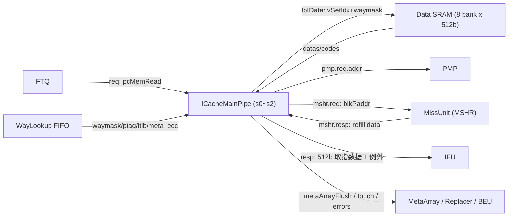

# ICacheMainPipe —— ICache 主流水（取指数据通路，学习文档）

| | |
|---|---|
| 手写 SV | `rtl/frontend/ICacheMainPipe.sv`（`xs_ICacheMainPipe` + `xs_icache_mainpipe_pkg`）+ `rtl/frontend/ICacheMainPipe_wrapper.sv`（golden 同名扁平端口适配层） |
| Scala 来源 | `src/main/scala/xiangshan/frontend/icache/ICacheMainPipe.scala`（class `ICacheMainPipe`） |
| 验证状态 | UT ✅（4 个随机种子 ×60000 拍，checks=60000 / errors=0）/ FM ✅（SUCCEEDED，2793 比对点全配对，其中 1110 点靠**签名分析**配对、0 unmatched / 0 failing） |
| 重写标准 | 符合 `docs/REWRITE_STYLE.md`（流水级 struct、way/bank/port 用数组、注释讲"为什么"、无 firtool 生成痕迹） |

## 1. 它在前端的位置

香山把「查 meta SRAM、算命中路」前移到了 **IPrefetch**，结果存进 **WayLookup FIFO**。
MainPipe 不再查 meta，而是直接拿 WayLookup 给的 `waymask` 去 **data SRAM** 取指令数据，
自己负责 PMP 检查、ECC 校验、miss 时向 MSHR 再取、最后响应 IFU。一次取指最多跨
**两条 cacheline**（`PortNumber=2`：startAddr 所在 line 与 nextline）；一条 line = 64B =
512bit，切成 `ICacheDataBanks=8` 个 64bit bank，便于跨行时把两条 line 的 bank 拼成一块。

## 2. 数据结构（见 `xs_icache_mainpipe_pkg`）

用 `struct packed` + 数组把 golden 的几百个展平标量（`s1_waymasks_0_3`、`s2_datas_7`、
`s2_bankSel_bankSel_14` 之类）重新组织为有意义的形状：

| 类型 | 形状 | 取代的 golden 展平名 |
|------|------|------|
| `way_lookup_entry_t` | `port[2]` × {waymask[4], ptag, itlb_exception, itlb_pbmt, meta_codes} | `io_wayLookupRead_bits_entry_*_0/1` |
| `data_sram_req_t` | `vSetIdx[2]`, `waymask[2][4]`, blkOffset, isDoubleLine | `io_dataArray_toIData_0_bits_*` |
| `ifu_resp_t` | doubleline, `vaddr[2]`, data[512], `paddr[2]`, `exception[2]`, `pmp_mmio[2]`, `itlb_pbmt[2]`, gpaddr … | `io_fetch_resp_bits_*` |
| `meta_flush_t` / `touch_t` / `l1_error_t` / `perf_info_t` | 各功能单元一个 struct | `io_metaArrayFlush_* / io_touch_* / io_errors_* / io_perfInfo_*` |

流水内部一律用数组：`s1_waymask[port][way]`、`s2_datas[bank]`、`s2_bankSel[16]`、
`s2_hit[port]` 等，配 `for(genvar …)` 分节展开，而非手工复制 8/16 份标量。

## 3. 三级流水

### s0 —— 取指请求 + 用 waymask 向 data SRAM 发读
- FTQ 主请求取 `pcMemRead` 的最后一个端口（`index = partWayNum`）得到 startAddr/nextlineStart；
  前 `partWayNum=4` 个端口只驱动 data SRAM 各分路读口的 `valid`。
- `doubleline = readValid & startAddr[5]`：取指块尾越过 32B 半行边界即跨入下一 line。
- 从 WayLookup 取 `waymask`（命中路 one-hot，全 0=miss）、`ptag`、`itlb_exception/pbmt`、
  `meta_codes`、`gpf`，连同 vaddr 一起送入 data SRAM 读请求并打入 s1 流水寄存器。
- 推进条件 `s0_fire = req.valid & toData.last.ready & wayLookup.valid & s1_ready & !flush`。

### s1 —— PMP / 锁存 SRAM 回读 / meta ECC / 监听 MSHR / touch
- **PMP**：用 s1 物理地址 `paddr = ptag || vaddr[11:0]` 查 PMP；`pmp_exception = instr ? af : none`。
  例外合并 `s1_exception = itlb ? itlb : pmp`（itlb 优先）。
- **meta ECC**：命中一路但 `^ptag != meta_codes` → ECC 失败；命中多路 → 必为 ECC 失败。
- **监听 MSHR**：若本拍 refill 的 line 正是要的（vSetIdx+ptag 匹配且 `!corrupt`），
  逐 bank 用 MSHR 数据旁路替换 SRAM 数据（`DataHoldBypass`），并锁存数据/code/来源标志。
- **touch**：`RegNext(s0_fire) & SRAMhit` 时把命中路更新进替换器 LRU。
- hit 用 `ValidHoldBypass`：`MSHR_hit | (RegNext(s0_fire) & SRAMhit)`，保持到 `s1_fire/flush`。

### s2 —— data ECC / miss 再取 / 监听 MSHR / 响应 IFU
- **data ECC**：每 bank 奇偶 `^datas[b] != codes[b]`；仅当该 bank 被本次取指选中
  (`bankSel`) 且非 MSHR 来源时才算损坏（refill 数据是新的，跳过校验）。
- **bankSel**：`bankIdxLow = offset>>3`，`bankIdxHigh = (offset+32)>>3`；16 项里低 8 给
  port0、高 8 给 port1，描述两条 line 各占哪些物理 bank。
- **持续监听 MSHR**：s2 同样监听 refill，命中则更新 `s2_datas/hit`、清 `meta_corrupt`、
  记 `l2_corrupt`（这里**不要求** `!corrupt`，corrupt 也要更新以放行 `s2_fire`）。
- **should_fetch / 再取**：miss 或 ECC 损坏需向 MSHR 再取；但例外/mmio/前序端口异常时不取。
  port0 无 doubleline 限制；port1 要求 doubleline 且两端口都无例外、都非 mmio。
  两端口经 **Arbiter2**（port0 优先）合并成一路 MSHR 请求，`has_send` 去重避免重复发。
- **例外汇总**：`s2_exception_out = (itlb/pmp) ? : (l2_corrupt ? af : none)`，
  注意 meta/data ECC 损坏**不**报 af，而是 `metaArrayFlush` + 再取自动恢复。
- **响应 IFU**：`resp.valid = s2_fire`；data = 8 bank 拼成 512bit；port1 字段仅
  doubleline 有效，否则 none/pma。

## 4. 关键设计点（为什么这么设计）

- **waymask 前移**：meta 查找放到 IPrefetch，MainPipe 直接用 waymask 选路，缩短主路径延迟。
- **8 bank 切分 + 跨行拼接**：取指可能从一条 line 中部开始、跨入下一 line，按 bank 粒度
  组织数据让「line0 的高 bank + line1 的低 bank」能无缝拼成连续 512bit。
- **MSHR 旁路（s1 与 s2 两处）**：refill 回来的数据可在数据还没写回 SRAM 时就被正在流水里
  的请求直接取用，省去「等写回再重读」的往返，降低 miss 惩罚。
- **ECC 损坏走 refetch 而非报异常**：单/多 bit 错误通过 flush metaArray + 向 L2 再取自动修复，
  只有 L2 也返回 corrupt（`l2_corrupt`）才升级为 access fault。

## 5. 接口（简表，详见 `xs_ICacheMainPipe` 端口）

| 方向 | 端口 | 含义 |
|------|------|------|
| in  | `fetch_req_*` | FTQ 取指请求（pcMemRead[5]、readValid[5]、backendException） |
| in  | `wayLookup_*` | WayLookup 读出的命中信息 {entry, gpf} |
| out/in | `toData_* / fromData_*` | data SRAM 读请求 / 回读数据+ECC code |
| out/in | `pmp_req_addr / pmp_resp_*` | PMP 检查 |
| out/in | `mshr_req_* / mshr_resp_*` | 向 MissUnit 再取 / refill 回填 |
| out | `fetch_resp_*` | 响应 IFU（512b 数据 + 两端口例外/属性） |
| out | `metaFlush_* / touch_* / errors_* / perfInfo` | 清表重取 / 替换器 / BEU 错误 / 性能 |

## 6. 验证

- **UT**（`verif/ut/ICacheMainPipe/`）：`tb.sv` 双例化 golden `ICacheMainPipe` 与
  `ICacheMainPipe_xs`（= wrapper 改名），约束随机激励（vSetIdx/ptag 收窄以制造 MSHR/命中
  碰撞、各 valid/ready/flush 带概率、例外/pbmt/corrupt 小范围），复位后逐拍比对**全部 75 个
  输出端口**。4 个种子各 60000 拍，checks=60000 / errors=0。
- **FM**（`make fm`）：`xs_ICacheMainPipe` + wrapper 对 golden 做等价。
  2793 个比对点全部 passing，其中 **1110 个靠签名分析**配对（证明可读重写的命名/结构与
  golden 不同也仍逻辑等价），0 unmatched compare points、0 failing。
  reference 侧 32 个 unmatched **unread** points 是 firtool 的死寄存器/性能计数器
  （如 `cntFtqFireInterval`、`*_probe` 线），不被读取、不影响等价。
