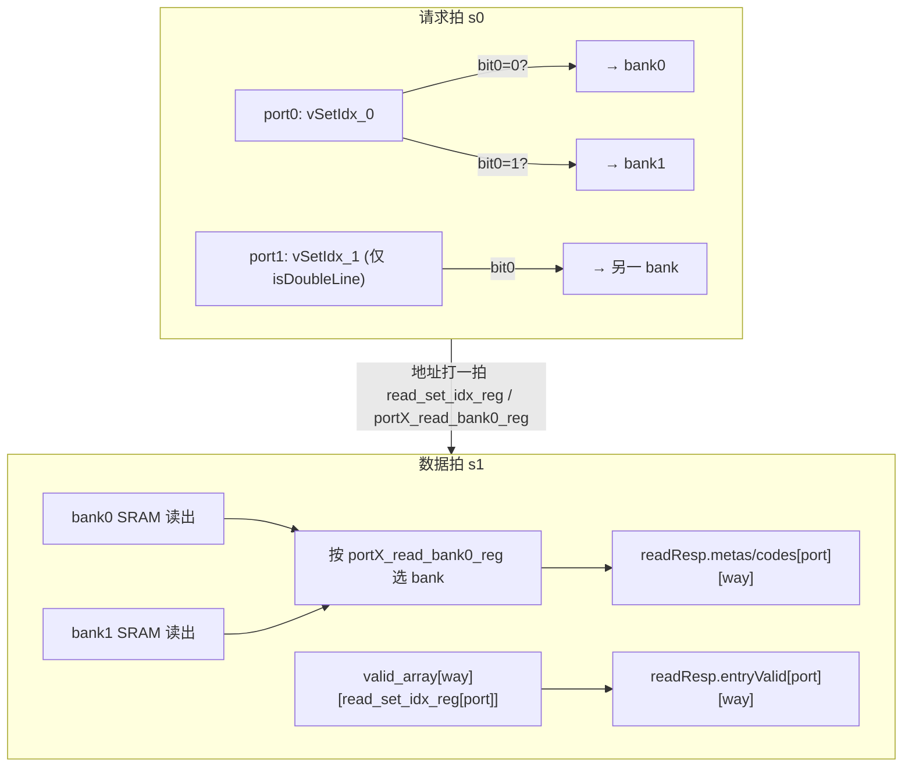

# ICacheMetaArray —— 指令缓存 meta（tag + valid）阵列（学习文档）

| | |
|---|---|
| 手写 SV | `rtl/frontend/ICacheMetaArray.sv`（`xs_ICacheMetaArray_core` + `xs_icache_meta_pkg`）+ `rtl/frontend/ICacheMetaArray_wrapper.sv`（golden 同名扁平端口适配层） |
| Scala 来源 | `src/main/scala/xiangshan/frontend/icache/ICache.scala`（class `ICacheMetaArray`） |
| 验证状态 | UT ✅（checks=59407 / errors=0；entryValid=1 观测 20747 次、非 X tag 比对 472346 次，确保非平凡）/ FM ✅（SUCCEEDED，3262 比对点全配对、0 unmatched / 0 failing，含全部 4×256 valid 触发器） |
| 重写标准 | 符合 `docs/REWRITE_STYLE.md`（meta 条目 struct、way/set/port/bank 用数组+genvar/for、注释讲"为什么"、无 firtool 生成痕迹） |

## 1. 它在前端的位置

```mermaid
flowchart LR
  IP["IPrefetch.s0 (查 meta)"] -->|read: vSetIdx_0/1, isDoubleLine| MA["ICacheMetaArray"]
  MA -->|readResp: metas/codes/entryValid (×2 port ×4 way)| IPS1["IPrefetch.s1 (比对命中路 → waymask)"]
  MU["MissUnit (refill 完成)"] -->|write: virIdx, phyTag, waymask, bankIdx, poison| MA
  BPU["重定向 / fence.i"] -->|flush(×2) / flushAll| MA
  MBIST["DFT / MBIST 控制"] -->|boreChildrenBd 总线| MA
```

ICache 是 **4 路组相联、256 组、64B line**。一次取指最多跨**两条相邻 cacheline**
（`PortNumber=2`），所以 meta 阵列设计成「**双读端口 + 按奇偶 bank 交织**」：

- `vSetIdx[0]`（最低位）决定该组落在 **bank0**（偶组）还是 **bank1**（奇组）；
- `vSetIdx[7:1]`（高 7 位）是 bank 内的行地址。

IPrefetch 在 s0 把两条 line 的 `vSetIdx` 喂进来，下一拍（s1）拿到这两组、各 4 路的
`{物理 tag, ECC code, valid}`，逐路把读出 tag 与请求 ptag 比较 + valid 为真 → 得到命中路
（`waymask`，存进 WayLookup FIFO 供 MainPipe 取数据）。MissUnit refill 完一行后写入对应路
的 tag 并置 valid；分支重定向 / `fence.i` 时按路 flush 或整体 flushAll 清 valid。

## 2. 为什么 tag/code 与 valid 分开存

| 存储 | 介质 | 原因 |
|------|------|------|
| **tag（36b）+ code（1b 奇偶）** | 编译宏 SRAM（`tagArrays_0/1` = `SplittedSRAMTemplate`） | 数据宽、量大（4 路 × 256 组 × 37b），用面积高效的 1 端口 SRAM。读有「请求拍发地址 → 下一拍出数据」**一拍延迟**。 |
| **valid（每路每组 1b）** | 触发器阵列 `valid_array[way][set]`（本模块自带） | 量小，但要支持「按位 flush 某组某路」「整体 flushAll」「随机 refill 置位」「复位清零」，用 SRAM 不灵活；用 FF 阵列可任意更新，且 reset 即清零（冷启动所有行无效）。 |

两类读出都对齐到**同一拍**：SRAM 自带一拍延迟；valid 读则把组索引打一拍
（`read_set_idx_reg`）后再去 FF 阵列取，使 valid 与 tag 在同一拍一起输出给 s1。

## 3. 数据结构与纯函数（见 `xs_icache_meta_pkg`）

```systemverilog
typedef struct packed {
  logic [TAG_BITS-1:0] tag;   // 物理 tag（36b）
  logic                code;  // 1-bit 奇偶校验
} meta_resp_t;                // 一路 meta 读出 / 写入数据
```

| 参数 | 值 | 物理含义 |
|------|----|---------|
| `PORT_NUM` | 2 | 一次取指跨 2 个 cacheline → 2 个读端口 |
| `N_WAYS` | 4 | 4 路组相联 |
| `N_SETS` | 256 | 256 组（vSetIdx 8b） |
| `TAG_BITS` | 36 | 物理 tag 宽（pTagBits） |
| `BANK_IDX_BITS` | 7 | bank 内行地址宽 = log2(256)-1 |

两个纯函数表达"为什么"：

- **`encode_meta_code(phy_tag, poison) = (^phy_tag) ^ poison`**：KunminghuV2 的 meta ECC 是
  最简单的 **1-bit 奇偶校验**——把 36 位 tag 全异或得奇偶位。`poison` 是 DFT「注错位」，
  平时为 0；置 1 时翻转 code，制造一个可被上游检出的伪 ECC 错误。上游读出后对读出 tag
  重算奇偶、与读出 code 比较即可发现单 bit 翻转。
- **`onehot_to_waynum(waymask) = {|waymask[3:2], waymask[3]|waymask[1]}`**：写请求给的是
  one-hot 的 `waymask`（选中路置 1），而 valid 触发器阵列按**路号**索引，故要把 one-hot
  压成 2b 路号。合法 one-hot 时即对应路号；非法输入按此固定优先级压缩（与 golden 位运算
  严格一致，保证等价）。

## 4. 三种访问的行为

### 4.1 读（read）—— 端口路由 + 一拍后选 bank



- 每个 bank 同一拍只服务一个端口（两 port 的 bank 位通常互补，跨相邻 line）。
  bank 的读 setIdx 取「该 bank 命中 port0 则用 `vSetIdx_0`，否则 `vSetIdx_1`」（沿用 golden）。
- **port1 仅在 `isDoubleLine` 时才真的发读请求**（单 line 取指只用 port0）。
- 数据拍：用打一拍的 `portX_read_bank0_reg` 选「这个 port 上一拍读的是 bank0 还是 bank1」。
- **valid 读不分 bank**：`valid_array` 按完整 8b `vSetIdx` 索引（4 路 × 256 组全覆盖），
  用打一拍的 `read_set_idx_reg[port]` 取对应组各路的 valid。

### 4.2 写（write）—— refill

- `way_num = onehot_to_waynum(waymask)`；把 `valid_array[way_num][virIdx]` 置 1。
- **valid 写不分 bank**：用完整 8b `io_write_bits_virIdx` 索引 `valid_array`，直接置该组该路
  为 1（RTL `:214`），不按 bankIdx 选 bank。
- **tag SRAM 写按 bankIdx 选 bank**：两 bank 共用写地址 `virIdx[7:1]` 与写数据（4 路相同
  tag/code），由 `bankIdx`（= `virIdx[0]`）决定写 bank0 还是 bank1（RTL `:223-224`
  `sram_w_valid[0]/[1]`）；SRAM 内部再按 `waymask` 选路落盘。
- code = `encode_meta_code(phyTag, poison)`。

> 这与 §4.1 一致：valid 阵列始终按完整 `vSetIdx`/`virIdx` 全覆盖 4×256，bank 交织只作用于
> tag SRAM。

### 4.3 flush / flushAll —— 清 valid（**优先级：flushAll > flush > write**）

- **flushAll**：`fence.i` 等场景，整片 `valid_array` 清零。
- **flush（2 端口）**：每个端口给 `{valid, virIdx, waymask}`；对被其 waymask 选中的每一路，
  清掉 `virIdx` 那一组的 valid。两端口可同拍各清各的。
- 三者共用 valid 阵列写端口，故任一活跃（含写）时 `io_read_ready` 拉低；再 AND 上两块 tag
  SRAM 的 `r_req_ready` 得到对外读就绪。

> golden 用 `~(~v | onehot) = v & ~onehot` 表达「清某位」，本核直接写
> `valid_array[w][idx] <= 1'b0`，二者逻辑等价（FM 已证）。

## 5. 接口表（核 `xs_ICacheMetaArray_core`）

| 方向 | 信号 | 宽度 | 含义 |
|------|------|------|------|
| in | `io_write_valid` / `io_write_bits_*` | — | refill 写：virIdx, phyTag(36), waymask(4 one-hot), bankIdx, poison |
| out | `io_read_ready` | 1 | 读就绪（无写/flush/flushAll 且两 bank SRAM 就绪） |
| in | `io_read_valid` / `io_read_bits_vSetIdx_0/1` / `_isDoubleLine` | — | 读请求：两条 line 组索引、是否双 line |
| out | `io_readResp_metas[port][way]` | 36 | 各 port 各路读出物理 tag（下一拍） |
| out | `io_readResp_codes[port][way]` | 1 | 各 port 各路读出 ECC code |
| out | `io_readResp_entryValid[port][way]` | 1 | 各 port 各路 valid |
| in | `io_flush_valid/virIdx/waymask[port]`，`io_flushAll` | — | 按路 flush ×2 / 整体清零 |
| out/in | `sram_r_*` / `sram_w_*` | — | 接两块 tag SRAM 黑盒（由 wrapper 连 golden `SplittedSRAMTemplate`/`_1`） |

wrapper（golden 同名 `ICacheMetaArray`）把上述 struct/数组端口拆成 golden 扁平端口
（`io_readResp_metas_0_0_tag` …），并例化 golden 的两块 tag SRAM（bank0/bank1）+
`MbistPipeIcacheTag`（MBIST 自测总线分发），透传 `boreChildrenBd` / `sigFromSrams` DFT 链。

## 6. 验证

### UT（`verif/ut/ICacheMetaArray/`）
golden（firtool 版 `ICacheMetaArray`）与手写 `ICacheMetaArray_xs`（= 可读核 + wrapper 逻辑）
**双例化、共用同一批 golden tag SRAM 黑盒**，逐拍随机比对：读就绪、各 port 各路
tag/code/entryValid、MBIST 旁路输出。激励覆盖单/双 line、任意奇偶组合、任意 way one-hot
（含少量非法值测路号压缩）、bankIdx、poison、两路 flush、稀疏 flushAll、随机 MBIST 总线。

- tag SRAM 在 `+define+SYNTHESIS` 下未写项读出 X，且两侧来自不同 SRAM 实例，故 tag/code
  仅在 **golden 非 X** 时比对（`!$isunknown`）；valid/ready 恒确定，严格逐拍比对。
- 非平凡性门槛：必须观测到 `entryValid=1`（>100 次）且比对过非 X tag（>100 次），
  否则判 FAIL，避免「全 X / 全 0」式假通过。

结果：`checks=59407 errors=0 entryValid1_observed=20747 tag_compared=472346` → **TEST PASSED**。

### FM（Formality 签名分析）
ref = golden `ICacheMetaArray`，impl = 可读核 + golden 同名 wrapper。tag SRAM / MBIST /
时钟门等子模块两侧均当**黑盒**（`hdlin_unresolved_modules black_box`），不参与逻辑比对。
全部 4×256 valid 触发器（golden 展平名 `valid_array_k_reg[s]` ↔ 本核 `valid_array_reg[k][s]`）
经名字 + 签名分析配对：**3262 比对点全配对、0 unmatched、0 failing → Verification SUCCEEDED**。

## 7. 关键设计决策（重写时的取舍）

1. **valid 阵列保留为模块内 FF（不外移）**：它是本模块唯一的「有状态行为」，是学习重点，
   故完整重写；tag/code SRAM 是面积宏，用 golden 黑盒例化即可，不重写 SRAM 本身。
2. **valid 用 `valid_array[way][set]` 二维 FF + for 循环**更新，取代 golden 的
   `valid_array_0..3` + `256'h1 << idx` 移位掩码风格——结构直接反映「按路按组」语义。
3. **bank 路由 / 一拍打拍 / 读响应选择**用数组 + `for(port)` 表达，取代 golden 的
   `port_0_read_0` / `port_1_read_0_reg` 等展平标量与逐项 `assign`。
4. **ECC 与路号压缩抽成纯函数**，把 golden 内联的 `^phyTag ^ poison`、
   `{|waymask[3:2], waymask[3]|waymask[1]}` 升格为有名字、有注释的可复用语义单元。
5. **wrapper / `_xs` 双份同体**：FM 需要 golden 同名顶层（`ICacheMetaArray`），UT 双例化又
   不能与 golden 顶层撞名，故 `verif/.../variants_xs.sv` 用同一份 wrapper 逻辑、仅模块名
   改为 `ICacheMetaArray_xs`。改一处需同步另一处（文件头已注明）。
