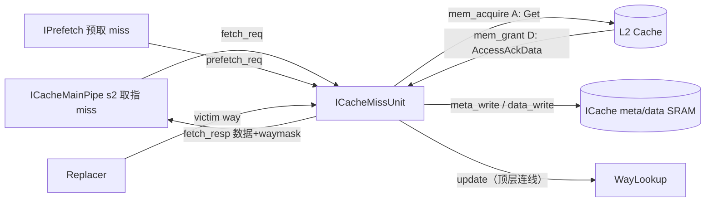
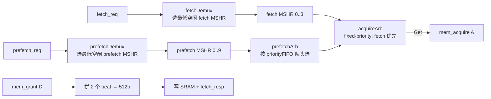

# ICacheMissUnit —— ICache Miss 处理单元（学习文档）

> ✅ **FM 分类 = REPLACEMENT_EQ（可读核真驱动 + 冻结基线原生 SUCCEEDED）**。依据台账
> [`verif/freeze/FM_STATUS.md`](../../verif/freeze/FM_STATUS.md) 与冻结基线日志
> `verif/ut/ICacheMissUnit/fm_work/ICacheMissUnit/fm_full.log`：本模块在当前冻结 golden 基线上 FM **原生
> `Verification SUCCEEDED`，2613 passing / 0 failing / 0 unverified**。下文验证节里任何
> "FAILED / 20 failing 截断 / 部分验证 / 未收敛"的表述是**冻结前的旧叙事，已作废**——以本
> banner 与台账为准。

| | |
|---|---|
| 手写 SV | `rtl/frontend/ICacheMissUnit.sv`（`xs_ICacheMissUnit` + 局部 pkg `xs_icache_miss_pkg`）+ `rtl/frontend/ICacheMissUnit_wrapper.sv` |
| Scala 来源 | `src/main/scala/xiangshan/frontend/icache/ICacheMissUnit.scala`（class ICacheMissUnit 及子类 ICacheMSHR/DeMultiplexer/MuxBundle/FIFOReg） |
| 验证状态 | UT ✅（8 万拍 × 多种子，全部输出 0 错；内部寄存器探针 0 错）/ FM ❌ FAILED，部分验证：1660 通过、20 failing（截断上限，**经证明为假阳性**）、845 unverified 未验（见 §6），以 UT 为权威 |
| 重写标准 | 符合 `docs/REWRITE_STYLE.md`：自包含可读核，MSHR 用 struct+数组+genvar，仲裁/FIFO 用清晰组合逻辑，无 firtool 痕迹 |

## 1. 它在前端的位置

L1 ICache 取指（MainPipe s2）查 meta SRAM 若 miss，把缺失 cacheline 交给本单元；IPrefetch
也会下发预取请求。本单元的职责：登记在途 miss（MSHR）、向 L2 发 TileLink 取整条 line、
收 grant 拼数据、回填 meta/data SRAM、把结果回送 MainPipe。

## 2. MSHR —— 核心数据结构

MSHR（Miss Status Holding Register）是一条**在途 miss 的状态寄存器**。本单元共
`nFetchMshr=4 + nPrefetchMshr=10 = 14` 个，其下标 0..13 直接用作 **TileLink source id**
——L2 的 grant 回来时带回 source，据此找回是哪条 MSHR、回填到哪。

可读重写用一个 struct 表达一条 MSHR（`xs_icache_miss_pkg::mshr_t`）：

| 字段 | 含义 |
|------|------|
| `valid` | 该 MSHR 占用（登记着一条在途 miss） |
| `issued` | 对应 TileLink Get 已发出，正等 L2 grant |
| `killed` | 被 flush/fencei 标记作废（见 §4）；killed 后不再 lookUp 命中、不再发 resp |
| `blkPaddr` / `vSetIdx` | miss 的块物理地址 / 虚拟组索引 |
| `way` | acquire 发射当拍从 Replacer 锁存的 victim way（回填目标路） |

14 个 MSHR 用**数组 + genvar** 表达（`mshr_t mshr[16]` + `for genvar`），fetch 区 `[0..3]`、
prefetch 区 `[4..13]`。数组开 16 槽（2 的幂）是为让 4-bit source 变量索引天然不越界
（详见 §6 的 FM 说明）。

## 3. 数据通路

### 3.1 入站去重（lookUp）
新 req 进 MSHR 前，先把它的 `{blkPaddr,vSetIdx}` 与 14 个有效 MSHR 比对（`mshr_lookup_hit`
纯函数）。若已有在途 MSHR 命中同一条 line，就**不新开 MSHR、直接吞掉该 req**
（`fetch_hit`/`prefetch_hit`，对外仍报 req.ready）。额外地，预取 req 若与本拍 fetch req
撞同一条 line（`prefetch_hits_fetch_req`），预取也算命中——让更急的 fetch 去取。

### 3.2 分发（Demux）
fetch_req 分给**编号最小的空闲 fetch MSHR**，prefetch_req 分给最小空闲 prefetch MSHR
（对应 Scala 的 `DeMultiplexer`，lower index 优先）。

### 3.3 发射顺序（两级仲裁 + priorityFIFO）
- **prefetch 按入队先后发射**：`priorityFIFO` 在 prefetch req 入 MSHR 当拍记录它落在哪个
  prefetch 槽，发射时 `prefetchArb` 按队头编号选对应 MSHR（对应 Scala `FIFOReg`+`MuxBundle`）。
  FIFO 深度 = nPrefetchMshr，保证不会满。
- **fetch 优先于 prefetch**：`acquireArb` 是 5 路 fixed-priority（in0..3=fetch MSHR，
  in4=prefetchArb 输出），最低 index 赢（对应 Scala `Arbiter`）。
  被选中的 MSHR 发出 `edge.Get`：地址 = `{blkPaddr, 6'b0}`（块对齐），source = MSHR 下标。

### 3.4 回填（TileLink D / grant）
一条 cacheline = `blockBits=512`，总线一拍 `beatBits=256`，故 `refillCycles=2` 个 beat。
`grant_has_data = opcode[0]`（AccessAckData 最低位）。两个 beat 依次写入 `resp_data[0..1]`，
`read_beat_cnt` 计数；收完最后 beat 即 `last_fire`。任一 beat 置 corrupt 则整条 `corrupt_r`。
`last_fire` 下一拍（`last_fire_r`，并打一拍 `id_r=source`）：
- 回收对应 MSHR（`mshr_invalidate[id_r]` → valid 清 0）；
- 锁存该 MSHR 的 `{blkPaddr,vSetIdx,way}` 到 `resp_*`（提前一拍锁存改善时序）；
- 输出 `fetch_resp`，并在合法时写 meta/data SRAM。

`waymask = 1 << resp_way`（victim way 转 one-hot）。meta 写 `phyTag = blkPaddr[41:6]`，
`bankIdx = vSetIdx[0]`。

## 4. flush / fencei 的差异（关键设计点）

| 信号 | 作用范围 | 语义 |
|------|---------|------|
| `io_fencei`（FENCE.I 清 I$） | **全部 14 个 MSHR** | 整体作废 |
| `io_flush`（重定向冲刷） | **仅 10 个 prefetch MSHR** | fetch MSHR 不响应 |

为什么 fetch MSHR 不响应 flush：取指 miss 已在途，结果仍要回填，否则重定向后会反复 miss。

被标记作废后（`killed`）：**未发射的 MSHR 立即失效**；**已发射的必须保留 valid 直到 L2 grant
回来才回收**——不能丢弃已发出的 TileLink 事务，否则 source 泄漏 / D 通道协议违例。

**为什么 flush/fencei 时仍发 fetch_resp**（见 Scala 注释）：让 `io_flush → s2_miss →
s2_ready → ftq ready` 这条路尽快放行（时序考量）。下游 MainPipe/WayLookup 自己的 `sx_valid`
已被 flush 清掉，会丢弃这次无用响应。但**绝不能在 flush/fencei 时写 SRAM**——
`write_sram_valid = fetch_resp_valid & ~corrupt_r & ~io_flush & ~io_fencei`。

## 5. 可读重写要点（对照学习）

- **MSHR 用 struct（`mshr_t`）+ 数组 + genvar** 表达 14 个，而非 golden 展平的 14 份
  `_fetchMSHRs_0_io_*`/`_prefetchMSHRs_0_io_*` 网表。每条 MSHR 的状态转移在一个 genvar
  循环体里集中可读。
- **状态合并**：golden 每个 MSHR 有 `flush`+`fencei` 两个寄存器（且 fetch MSHR 两者驱动
  逻辑完全相同），本实现合并为单个 `killed`（= golden 的 `flush_reg` 语义），更贴近"被作废"
  这一意图。这正是 FM 出现假阳性的来源（§6）。
- **仲裁/Demux/FIFO 全部用清晰组合逻辑 + 纯函数**自包含实现，不例化 golden 的
  `DeMultiplexer/MuxBundle/Arbiter5_MSHRAcquire/FIFOReg` 网表子模块：
  - Demux = 「最低空闲槽」优先编码（`always_comb` 反向遍历）；
  - acquireArb = fixed-priority 选第一个 valid；
  - priorityFIFO = 环形指针 register FIFO（与 WayLookup 的指针 FIFO 同范式）。
- **纯函数** `get_phy_tag` / `way_to_mask` / `mshr_lookup_hit` 复用且自解释。
- 参数集中在 `xs_icache_miss_pkg`（容量、位宽、TileLink 编码），无魔数。
- wrapper（golden 同名 `ICacheMissUnit`）是机械端口直通——可读核端口本就与 golden 同为扁平
  标量，故无需打包/拆包。

## 6. 验证

### UT（必过，✅）
`verif/ut/ICacheMissUnit/`：golden `ICacheMissUnit` 与 `ICacheMissUnit_xs`（经 wrapper）
双例化，逐拍比对**全部 23 个输出**，8 万拍 × {seed 1,2,7,99,12345}，**0 错**。

测试台关键点（`tb.sv`）：
- TileLink grant 用 **grant FSM 成对发 beat**（每事务恰 2 拍，opcode bit0=1），且只对
  「已在 A 通道发射、未回收」的 source 发 grant——避免协议违例 / 踩 golden 内部 assert。
- 地址空间故意取小，密集制造 lookUp 命中、去重、MSHR 占满、flush/fencei 打断等场景。
- `mem_acquire_*`/`victim_*` 的 bits 仅在对应 valid 时比对（valid=0 时是组合 stale 值，
  两侧可不同且无意义）。

### FM（尽量做，⚠️ failing 已证明为假阳性）
`make fm` 末次 verify 结论 **Verification FAILED**：**1660 通过，20 failing，845 unverified**。
注意 **20 是 Formality 默认 `verification_failing_point_limit=20` 的截断上限**——verify 攒满
20 个失配即提前中止，845 个 unverified 点未验。其中 88(96) 个 golden(impl)
比对点 unmatched，根因是每个 MSHR 的 `flush_reg`/`fencei_reg`/`way_reg` 配不上——
因为本实现把 golden 的 `flush`+`fencei` **两个寄存器合并成单个 `killed`**（§5）。
FM 把这些未匹配的 golden 寄存器当作自由变量，污染了依赖它们的下游锥（`id_r`、各 MSHR
`valid`、`io_fetch_resp_valid`、`io_mem_acquire_bits_address[...]`），从而误报 failing。

**这是 `docs/REWRITE_STYLE.md` 预期的"UT 充分 + FM 部分不可判"情形，不为讨好 FM 而退回抄
golden 命名/状态编码。** 已用 tb 层次探针做对抗验证以排除真 bug：

> `tb.sv` 内 `pchk` 探针逐拍比对 golden 与 xs 的**内部寄存器**：`id_r`、`last_fire_r`、
> 全部 MSHR `.valid`（含 FM 报 failing 的 prefetchMSHRs_8/9）、prefetch `.way`。
> 8 万拍 × {seed 1,2,7} 共 24 万拍，**probe_err=0**——内部状态逐位相同。

由此结论：**已报告的 20 个 FM failing point 全部为状态合并导致的假阳性**（输出等价 +
内部寄存器等价双重证明）。FM 整体为**部分验证**（20 failing 为截断上限、845 点未验），
等价性以 UT（多种子逐拍全输出 0 错 + 内部探针 0 错）为权威。
