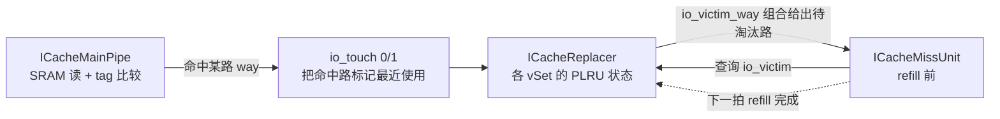
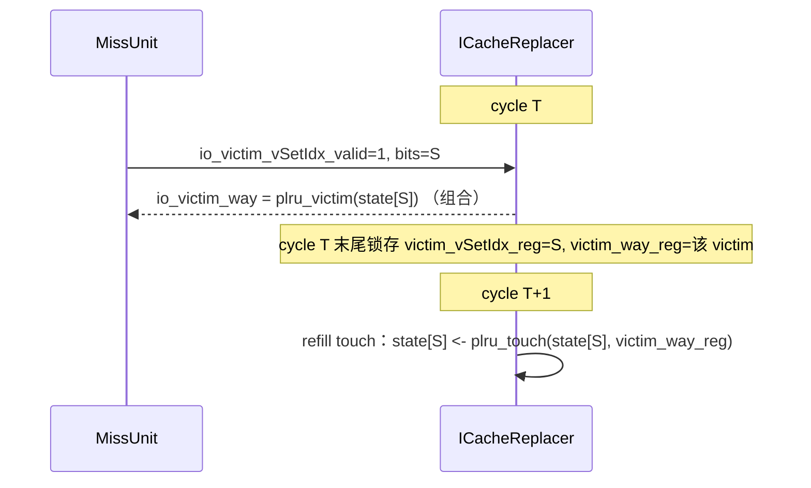

# ICacheReplacer —— 指令缓存路替换器（树形伪 LRU，学习文档）

| | |
|---|---|
| 手写 SV | `rtl/frontend/ICacheReplacer.sv`（`xs_ICacheReplacer_core`）+ `rtl/frontend/ICacheReplacer_wrapper.sv`（golden 同名 `ICacheReplacer`） |
| 算法同源 | `rtl/common/PlruReplacer.sv`（`xs_PlruReplacer`，rocket-chip PseudoLRU），本模块复用其 victim/touch 纯函数思路 |
| Scala 来源 | `src/main/scala/xiangshan/frontend/icache/ICache.scala` 中的 `ICacheReplacer`（用 `SetAssocReplacer` / `ReplacementPolicy.fromString("plru", ...)`） |
| 规模 | 256 个虚 set（vSet）× 4 路，每 set 3 位 PLRU 状态；按 vSetIdx[0] 分 2 bank |
| 验证状态 | UT ✅（20000 拍随机向量，checks=19999 errors=0，多 seed）/ FM ✅（SUCCEEDED） |
| 重写标准 | 符合 `docs/REWRITE_STYLE.md`：纯函数 + genvar + 数组取代 golden 的 7058 行展平，无生成痕迹 |

---

## 1. 它在 ICache 里的位置

ICache 是 **4 路组相联**：取指虚地址映射到一个 vSet，该 vSet 的 4 路里若有一路 tag 命中
即 hit，否则 miss。miss 时要向 L2 发 refill，并在本 vSet 里**淘汰一路**给新数据腾位置。
"淘汰哪一路"由本模块（替换器）决定，它只维护替换状态，不碰数据/tag 本身。



- **命中 touch（io_touch_0 / io_touch_1）**：MainPipe 命中后，把命中路喂回替换器，
  使其变"最近使用"，避免被很快淘汰。一次取指请求可横跨**相邻两个 vSet**（取指块
  跨越 cacheline 边界），所以有两条 touch 通道，分别落到相邻的偶 / 奇 vSet。
- **victim 查询（io_victim）**：MissUnit 在 refill 前用 `io_victim_vSetIdx_bits` 查该
  vSet 当前应淘汰的路，`io_victim_way` **当拍组合**给出。
- **延迟 refill touch**：refill 把数据填进 victim 路后，该路立即成为最近使用。硬件做法
  是：victim 查询有效的**下一拍**，自动把上一拍查询的 (vSet, victim_way) 当成一次
  touch 写回（见 §4）。这样不需要外部再补一条 touch。

---

## 2. 替换算法：4 路树形伪 LRU（PseudoLRU）

每个 vSet 用 `NUM_WAYS-1 = 3` 位状态描述一棵二叉树：

```
              state[2]  (根)
             /          \
        低半边           高半边
       state[0]         state[1]
       /     \          /     \
     way0    way1     way2    way3
```

- 节点值 = "下次应往哪半边淘汰"：`1` 指高编号半边，`0` 指低编号半边。
- **victim**（选淘汰路）：从根开始沿置位指示的半边逐级下行。
  `victim = {state[2], state[2] ? state[1] : state[0]}`。
- **touch(way)**（标记最近使用）：沿被访问路的树路径，把每个经过的节点翻成**指向另一半边**
  （刚访问的半边最不该被淘汰）：
  - 根 `<- ~way[1]`
  - way 在高半边（way[1]=1）：高子树根 `<- ~way[0]`，低子树根保持；
  - way 在低半边（way[1]=0）：低子树根 `<- ~way[0]`，高子树根保持。

状态编码与 rocket-chip `PseudoLRU` **逐位一致**——这是与 golden 等价的根基。代码里就是两个
纯函数 `plru_victim(state)` / `plru_touch(state, way)`，与 `rtl/common/PlruReplacer.sv` 同源
（那里是参数化任意 2 的幂路数，本模块固定 4 路把树展开成显式三元，更直观）。

---

## 3. 分体（banking）：256 vSet 拆 2 bank

256 个 vSet 按 **vSetIdx 最低位** 拆成两组各 128 的物理状态阵列：

| bank | 选中条件 | 状态阵列 | golden 对应寄存器 |
|------|----------|----------|-------------------|
| 0 | vSetIdx[0]=0（偶） | `plru_state[0][0..127]` | `state_vec_0 .. state_vec_127` |
| 1 | vSetIdx[0]=1（奇） | `plru_state[1][0..127]` | `state_vec_1_0 .. state_vec_1_127` |

bank 内组号 = `vSetIdx[7:1]`（7 位）。两 bank 物理独立，所以**同一拍**可以一条 touch 打
bank0、另一条 touch 打 bank1，互不阻塞——这正对应取指跨边界落在相邻偶/奇组的常见情形。

**touch 路由（非对称，务必注意）**：bank b 用**端口 b 自身**的地址 bit0 当选择子：

```
bank0 选择子 = io_touch_0_bits_vSetIdx[0]   // 0→用 touch0，1→用 touch1
bank1 选择子 = io_touch_1_bits_vSetIdx[0]   // 0→用 touch0，1→用 touch1
```

不是简单的"地址匹配 bank"。正常用例下两条 touch 指向相邻偶/奇组，恰好分别落到 bank0/bank1，
此选择子在该前提下等价于按地址归 bank；但激励完全随机时两者有别，故 UT 双向覆盖了它
（手写核与 golden 逐位实现了同一非对称选择，FM 也据此通过）。

---

## 4. 时序：victim 查询 → 下一拍 refill touch



- `victim_vSetIdx_reg` / `victim_way_reg`：带异步复位，仅当 `io_victim_vSetIdx_valid` 时更新，
  锁存"上一拍查询的组号"和"上一拍组合给出的 victim 路"。
- `refill_touch_valid_reg`：无复位的 1 拍延迟（对齐 golden 用 `always @(posedge clock)` 而非
  带复位块驱动该 valid），表示"上一拍有过 victim 查询"，触发本拍的 refill touch。

### 同拍多次 touch 的折叠语义（最关键、最易错的点）

某个 vSet 在同一拍可能**同时**收到"命中 touch"和"refill touch"。rocket-chip 的
`ReplacementPolicy` 语义是把同拍多次 touch **按顺序依次折叠**（fold），不是二选一：

```
s = current_state
if (命中 touch 有效) s = plru_touch(s, 命中 way)   // 先折叠命中
if (refill touch 有效) s = plru_touch(s, refill way) // 再在其上折叠 refill
next_state = s
```

refill 在后，故根位由 refill way 决定，而 refill 未触及的另一半子树位**保留命中 touch 的
结果**。只命中其一时退化为单次 `plru_touch`；都没有则状态保持。golden 把这写成
`refill = plru_touch( (命中有效 ? 命中后低位 : 原低位) , refill_way )` 的嵌套三元——
等价但晦涩；手写核用顺序 if 折叠表达，可读且与之逐位一致。

> 这正是初版重写最初出错（10/19999 拍 victim 不符）的原因：当时按"refill 优先、二选一"
> 处理，丢掉了"命中 touch 已改的另一半子树位"。改为顺序折叠后 UT 全过、FM 通过。

---

## 5. 接口表

| 端口 | 方向 | 位宽 | 含义 |
|------|------|------|------|
| `clock` / `reset` | in | 1 | 时钟 / 异步复位（状态清零） |
| `io_touch_0_valid` | in | 1 | 命中 touch 通道 0 有效 |
| `io_touch_0_bits_vSetIdx` | in | 8 | 通道 0 命中的 vSet |
| `io_touch_0_bits_way` | in | 2 | 通道 0 命中的路 |
| `io_touch_1_valid` | in | 1 | 命中 touch 通道 1 有效 |
| `io_touch_1_bits_vSetIdx` | in | 8 | 通道 1 命中的 vSet |
| `io_touch_1_bits_way` | in | 2 | 通道 1 命中的路 |
| `io_victim_vSetIdx_valid` | in | 1 | victim 查询有效（触发下一拍 refill touch） |
| `io_victim_vSetIdx_bits` | in | 8 | 待查询的 vSet |
| `io_victim_way` | out | 2 | 该 vSet 当前应淘汰的路（组合） |

参数：`NUM_SETS=256`、`NUM_WAYS=4`（→ `SET_W=8`、`WAY_W=2`、`STATE_W=3`、`NUM_BANKS=2`、
`BANK_SETS=128`、`BSET_W=7`）。

---

## 6. 可读化：用纯函数 + genvar 取代 7058 行展平

golden（firtool 输出）把**每个 set 的 PLRU 状态机**完全展平：256 个 `state_vec_*` 寄存器、
每个 set 一段 `set_touch_ways_*` 选择 wire + 一段嵌套三元更新表达式，外加 `_GEN_*`/`_T_*`
临时名和随机初始化样板，共 7058 行。

手写核把它压到 **~196 行**，关键手法：

1. **PLRU 算法→两个纯函数** `plru_victim` / `plru_touch`，集中表达树编码与 touch 翻转，
   256 个 set 复用同一份逻辑。
2. **状态→二维数组** `plru_state[NUM_BANKS][BANK_SETS]`，用 `genvar` 双重 `for` 铺开
   2×128 个 `always_ff`，取代 256 段手写更新。
3. **touch 路由 / refill 延迟→数组化的 always_comb**，用领域命名（`bank_touch_*`、
   `bank_refill_*`、`victim_way_reg`）取代 `touch_ways_0_0_bits` 一类展平名。
4. **同拍多 touch→顺序 if 折叠**，取代 golden 的嵌套三元，直接对应算法语义。

wrapper（`ICacheReplacer_wrapper.sv`）是机械端口适配层：golden 同名扁平端口直连可读核
（核端口本就采用 golden 扁平命名），仅供 FM 与结构替换使用。

---

## 7. 验证

- **UT**（`verif/ut/ICacheReplacer/`）：golden `ICacheReplacer` 与 `ICacheReplacer_xs`（核包装）
  双例化，每拍随机驱动两条 touch（一半周期模拟取指跨边界相邻偶/奇组、一半完全独立随机以
  覆盖非对称 bank 路由与同组冲突）+ 随机 victim 查询（偏置小地址以提高与 touch 同组命中
  概率，覆盖同拍折叠），逐拍比对 `io_victim_way`。结果：**checks=19999 / errors=0**，
  多 seed（1/2/7/42/999）均 PASSED。
- **FM**（`make fm`）：签名分析证等价，**Verification SUCCEEDED**。
- **可读性 grep**：核内 `RANDOMIZE|SYNTHESIS|_GEN_|_T_[0-9]` 命中 0。

复跑：
```bash
cd verif/ut/ICacheReplacer
make compile && make run   # 期望 TEST PASSED, errors=0
make fm                    # 期望 FM SUCCEEDED
```
