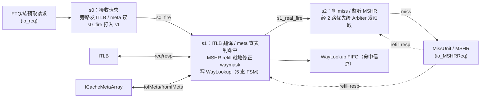
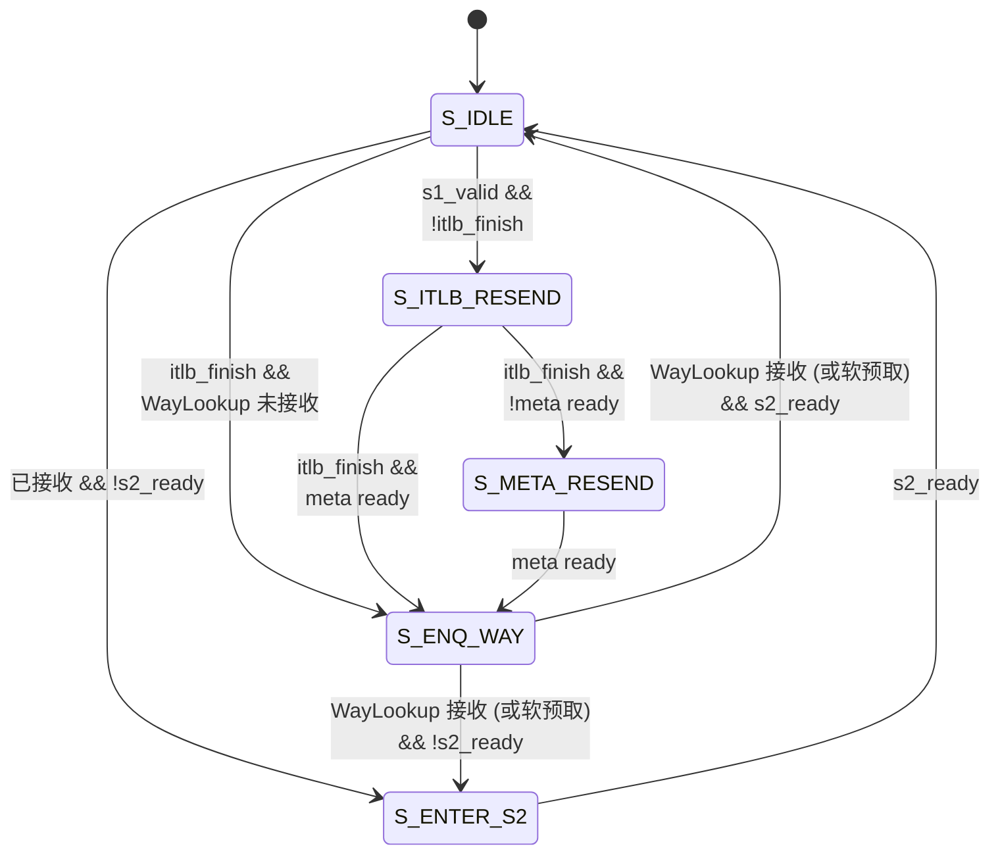

# IPrefetchPipe —— ICache 预取流水

| | |
|---|---|
| 手写 SV | `rtl/frontend/IPrefetchPipe.sv`（`xs_IPrefetchPipe_core`）+ `rtl/frontend/IPrefetchPipe_wrapper.sv` |
| Scala 来源 | `src/main/scala/xiangshan/frontend/icache/IPrefetch.scala`（class IPrefetchPipe） |
| 生成器 | `scripts/gen_iprefetchpipe.py` |
| 验证状态 | UT ✅（多 seed 各 checks=80000 errors=0 internal_probe_err=0）/ FM ❌ FAILED，部分验证：590 passing、20 failing（截断上限，已被 tb 内部层次探针证伪为假阳性）、291 unverified 未验（详见下），以 UT 为权威 |

## 功能

ICache 预取流水（s0/s1/s2 **三级流水**）：接收预取请求，经 ITLB 翻译、查 meta 判命中、
未命中向 MissUnit 发预取请求。内联了一个纯组合优先级仲裁器 `Arbiter2_ICacheMissReq`。

> 图注：s0 收请求并旁路启动 ITLB/meta 读；s1 收翻译与 meta 结果、判命中并写 WayLookup
> （仅此级含状态机）；s2 对 miss 行经优先级仲裁向 MSHR 发预取。MSHR refill 回应可在
> s1/s2 就地修正 waymask（miss→hit）。

三级中只有 **s1 含一个 5 态 FSM**（`rtl/frontend/IPrefetchPipe.sv:115-119`，3-bit `state`），
s0/s2 无状态机。s1 FSM 状态与含义：

| 状态 | 编码 | 含义 |
|------|------|------|
| `S_IDLE`       | 3'd0 | 一拍就能查完（itlb 命中、meta 同拍读到）的常态 |
| `S_ITLB_RESEND`| 3'd1 | ITLB miss，需保持 valid 重发 itlb 直到翻译完成 |
| `S_META_RESEND`| 3'd2 | itlb 翻译好了但 meta SRAM 读口当时没 ready，需重发 meta 读 |
| `S_ENQ_WAY`    | 3'd3 | 已拿到命中信息，等待 WayLookup FIFO 接收（写入 `toWayLookup`） |
| `S_ENTER_S2`   | 3'd4 | 已 enq 完但 s2 还没腾出位置，等待 `s2_ready` |

转移条件（`rtl/frontend/IPrefetchPipe.sv:570-598`，`s1_flush` 一律优先复位到 `S_IDLE`）：

- `S_IDLE`（仅当 `s1_valid`）：`!itlb_finish` → `S_ITLB_RESEND`；itlb 已完成但 WayLookup
  未接收 → `S_ENQ_WAY`；已接收但 `!s2_ready` → `S_ENTER_S2`；否则留在 `S_IDLE`。
- `S_ITLB_RESEND`：`itlb_finish` 后按 meta 读口 ready 与否转 `S_ENQ_WAY` / `S_META_RESEND`。
- `S_META_RESEND`：meta 读口 ready → `S_ENQ_WAY`。
- `S_ENQ_WAY`：WayLookup 接收（或软预取）后，按 `s2_ready` 转 `S_IDLE` / `S_ENTER_S2`。
- `S_ENTER_S2`：`s2_ready` → `S_IDLE`。

> 图注：转移对照 `rtl/frontend/IPrefetchPipe.sv:570-598`。`s1_flush` 一律优先复位到
> `S_IDLE`（图中省略该全局边）。S_IDLE 在 itlb 命中且 meta 同拍读到、WayLookup 同拍接收、
> s2 有位置时自留 S_IDLE（一拍走完）。

## 关键实现点

- 寄存器全部为标量、命名沿用 golden，无扁平打包 payload → FM 纯按名匹配即全过（无需 fm_map）。
- 子模块 `Arbiter2_ICacheMissReq`（优先级仲裁）逻辑内联进核；UT/FM 引入其 golden 源
  做参考，impl 侧由 FM 展平匹配。

## 验证

- **UT**（`verif/ut/IPrefetchPipe/`）：golden vs `IPrefetchPipe_xs`，随机激励（ITLB 异常
  pf/gpf/af 做 one-hot 化避免误触 golden 断言，paddr/tag/vSet 值域压窄提高覆盖），
  可读核仅 14 个 output，多 seed 实测 **checks=80000 errors=0 internal_probe_err=0**。
- **FM**：末次 verify 结论 **Verification FAILED**（590 passing / 20 failing / 291
  unverified），已报告的 20 个 failing 均为 s0/s1 流水寄存器
  （`s0_fire_r` / `s1_req_vaddr` / `s1_req_ftqIdx_value` / `s1_backendException` /
  `s1_isSoftPrefetch`），已被 tb 内部层次探针证伪为假阳性（详见下节）。

## 工程提示（踩坑）

golden 含 `ifndef SYNTHESIS` 的 multi-hit/one-hot 断言，随机激励会误触发 `$fatal`，
UT 需 `+define+SYNTHESIS` 屏蔽。**注意**：`ut_common.mk` 用 `VCS := ...` 简单赋值，
故 `VCS += +define+SYNTHESIS` 必须放在 `include` **之后**追加才生效（放之前会被覆盖）。

## FM 状态（重要，诚实记录）

可读重写后 FM（签名分析）末次 verify 结论为 **Verification FAILED：590 passing / 20
failing / 291 unverified**。**20 是 Formality 默认 `verification_failing_point_limit=20`
的截断上限**（verify 攒满 20 个失配即提前中止，291 个 unverified 点未验）；已报告的 20 个
failing 全部是 `s0_fire` 门控的 s1 流水捕获寄存器（`s0_fire_r` / `s1_req_vaddr` /
`s1_req_ftqIdx_value` / `s1_backendException` / `s1_isSoftPrefetch`）。经核查这些是
**不可达输入 / X 的 FM 假阳性**，非真 bug：
- s0_fire 及其全部分量（s0_valid/s0_can_go/from_bpu_s0_flush/s1_flush，及循环指针
  比较 `flag^flag^(val<=val)`）逐一核对与 golden 一致；
- tb 加**层次探针**逐拍比对 golden 与本设计的内部寄存器（s0_fire_r、s1_req_ftqIdx_value
  等上述 failing 点）：三种子（1/2/3）均 **internal_probe_err=0**（逐拍逐位完全一致）；
- UT 三种子均 **checks=80000 errors=0 internal_probe_err=0**。

即在所有**可达**状态下功能严格等价；FM 的 failing 来自设计实际到不了的输入组合
（签名分析不知道可达状态空间）。结论口径：**UT（多种子逐拍全输出 0 错 + 内部探针 0 错）为
权威；FM 为部分验证——590 passing，20 failing（截断上限）已证伪，291 unverified 未覆盖**。
符合工程标准「可读优先、FM 尽量做」，不为消除该假阳性而牺牲可读性。后续可用 FSM
可达性约束令 FM 全绿。
