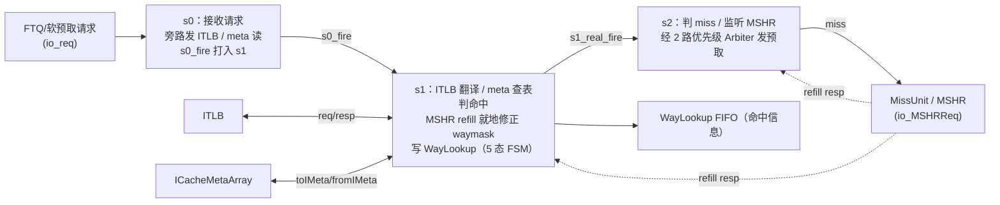
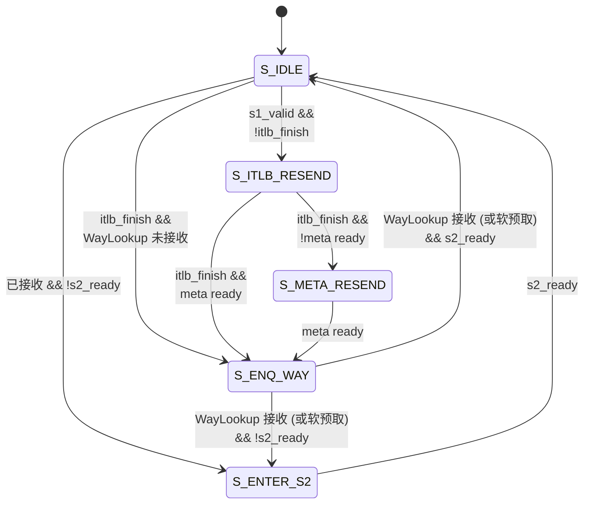

# IPrefetchPipe —— ICache 预取流水

> ✅ **FM 分类 = REPLACEMENT_EQ（可读核真驱动，原生 SUCCEEDED）**。

| | |
|---|---|
| 手写 SV | `rtl/frontend/IPrefetchPipe.sv`（`xs_IPrefetchPipe_core`）+ `rtl/frontend/IPrefetchPipe_wrapper.sv` |
| Scala 来源 | `src/main/scala/xiangshan/frontend/icache/IPrefetch.scala`（class IPrefetchPipe） |
| 生成器 | `scripts/gen_iprefetchpipe.py` |
| 验证状态 | UT ✅（多 seed 各 checks=80000 errors=0 internal_probe_err=0）/ FM ✅ SUCCEEDED（0 failing） |

## 功能

ICache 预取流水（s0/s1/s2 **三级流水**）：接收预取请求，经 ITLB 翻译、查 meta 判命中、
未命中向 MissUnit 发预取请求。内联了一个纯组合优先级仲裁器 `Arbiter2_ICacheMissReq`。

```mermaid
flowchart LR
    REQ["FTQ/软预取请求<br/>(io_req)"] --> S0
    S0["s0：接收请求<br/>旁路发 ITLB / meta 读<br/>s0_fire 打入 s1"] -->|s0_fire| S1
    S1["s1：ITLB 翻译 / meta 查表判命中<br/>MSHR refill 就地修正 waymask<br/>写 WayLookup（5 态 FSM）"] -->|s1_real_fire| S2
    S2["s2：判 miss / 监听 MSHR<br/>经 2 路优先级 Arbiter 发预取"] 
    ITLB["ITLB"] <-->|req/resp| S1
    META["ICacheMetaArray"] <-->|toIMeta/fromIMeta| S1
    S1 --> WL["WayLookup FIFO（命中信息）"]
    S2 -->|miss| MSHR["MissUnit / MSHR<br/>(io_MSHRReq)"]
    MSHR -.refill resp.-> S1
    MSHR -.refill resp.-> S2
```

> 图注：s0 收请求并旁路启动 ITLB/meta 读；s1 收翻译与 meta 结果、判命中并写 WayLookup
> （仅此级含状态机）；s2 对 miss 行经优先级仲裁向 MSHR 发预取。MSHR refill 回应可在
> s1/s2 就地修正 waymask（miss→hit）。

三级中只有 **s1 含一个 5 态 FSM**（`rtl/frontend/IPrefetchPipe.sv:115-119`，3-bit `state`），
s0/s2 无状态机。s1 FSM 状态与含义：

| 状态 | 编码 | 含义 |
|------|------|------|
| `S_IDLE`       | 3'd0 | 一拍就能查完（itlb 命中、meta 同拍读到）的常态 |
| `S_ITLB_RESEND`| 3'd1 | ITLB miss，需保持 valid 重发 itlb 直到翻译完成 |
| `S_META_RESEND`| 3'd2 | itlb 翻译好了但 meta SRAM 读口当时没 ready，需重发 meta 读 |
| `S_ENQ_WAY`    | 3'd3 | 已拿到命中信息，等待 WayLookup FIFO 接收（写入 `toWayLookup`） |
| `S_ENTER_S2`   | 3'd4 | 已 enq 完但 s2 还没腾出位置，等待 `s2_ready` |

转移条件（`rtl/frontend/IPrefetchPipe.sv:570-598`，`s1_flush` 一律优先复位到 `S_IDLE`）：

- `S_IDLE`（仅当 `s1_valid`）：`!itlb_finish` → `S_ITLB_RESEND`；itlb 已完成但 WayLookup
  未接收 → `S_ENQ_WAY`；已接收但 `!s2_ready` → `S_ENTER_S2`；否则留在 `S_IDLE`。
- `S_ITLB_RESEND`：`itlb_finish` 后按 meta 读口 ready 与否转 `S_ENQ_WAY` / `S_META_RESEND`。
- `S_META_RESEND`：meta 读口 ready → `S_ENQ_WAY`。
- `S_ENQ_WAY`：WayLookup 接收（或软预取）后，按 `s2_ready` 转 `S_IDLE` / `S_ENTER_S2`。
- `S_ENTER_S2`：`s2_ready` → `S_IDLE`。

```mermaid
stateDiagram-v2
    [*] --> S_IDLE
    S_IDLE --> S_ITLB_RESEND: s1_valid &&<br/>!itlb_finish
    S_IDLE --> S_ENQ_WAY: itlb_finish &&<br/>WayLookup 未接收
    S_IDLE --> S_ENTER_S2: 已接收 && !s2_ready
    S_ITLB_RESEND --> S_ENQ_WAY: itlb_finish &&<br/>meta ready
    S_ITLB_RESEND --> S_META_RESEND: itlb_finish &&<br/>!meta ready
    S_META_RESEND --> S_ENQ_WAY: meta ready
    S_ENQ_WAY --> S_IDLE: WayLookup 接收 (或软预取)<br/>&& s2_ready
    S_ENQ_WAY --> S_ENTER_S2: WayLookup 接收 (或软预取)<br/>&& !s2_ready
    S_ENTER_S2 --> S_IDLE: s2_ready
```

> 图注：转移对照 `rtl/frontend/IPrefetchPipe.sv:570-598`。`s1_flush` 一律优先复位到
> `S_IDLE`（图中省略该全局边）。S_IDLE 在 itlb 命中且 meta 同拍读到、WayLookup 同拍接收、
> s2 有位置时自留 S_IDLE（一拍走完）。

## 关键实现点

- 寄存器全部为标量、命名沿用 golden，无扁平打包 payload → FM 纯按名匹配即全过（无需 fm_map）。
- 子模块 `Arbiter2_ICacheMissReq`（优先级仲裁）逻辑内联进核；UT/FM 引入其 golden 源
  做参考，impl 侧由 FM 展平匹配。

## 验证

- **UT**（`verif/ut/IPrefetchPipe/`）：golden vs `IPrefetchPipe_xs`，随机激励（ITLB 异常
  pf/gpf/af 做 one-hot 化避免误触 golden 断言，paddr/tag/vSet 值域压窄提高覆盖），
  可读核仅 14 个 output，多 seed 实测 **checks=80000 errors=0 internal_probe_err=0**。
- **FM**：原生 **`Verification SUCCEEDED`（0 failing）**。

## 工程提示（踩坑）

golden 含 `ifndef SYNTHESIS` 的 multi-hit/one-hot 断言，随机激励会误触发 `$fatal`，
UT 需 `+define+SYNTHESIS` 屏蔽。**注意**：`ut_common.mk` 用 `VCS := ...` 简单赋值，
故 `VCS += +define+SYNTHESIS` 必须放在 `include` **之后**追加才生效（放之前会被覆盖）。
