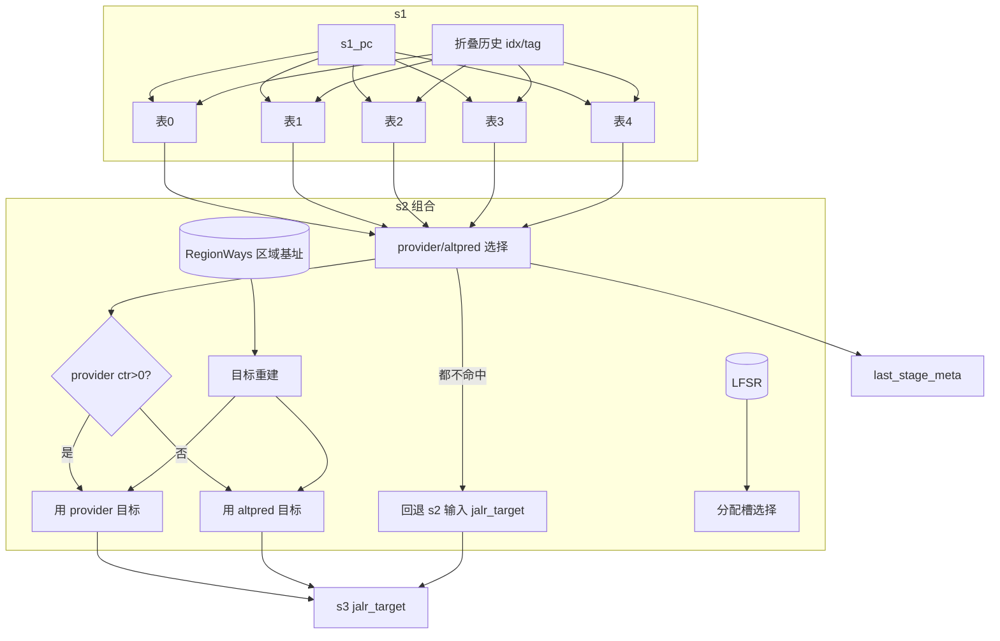

# ITTage —— ITTAGE 间接跳转目标预测器「顶层」

> 可读核：`rtl/frontend/ITTage.sv`（`xs_ITTage_core`）
> golden 同名 wrapper：`rtl/frontend/ITTage_wrapper.sv`
> 验证：`verif/ut/ITTage/`（UT 双例化逐拍比对 + Formality 等价）
> 生成器：`scripts/gen_ittage.py`（wrapper / _xs / tb 三件套）
> 单条表：见 `docs/frontend/ITTageTable.md`

---

## 1. 它在前端 BPU 的位置：把 N 张几何历史表组合成间接跳转目标预测器

香山方向预测主力是 TAGE-SC-L；**间接跳转**（jalr / 虚函数派发 / switch 跳转表）的
**目标地址**则由 **ITTAGE**（Indirect Target TAgged GEometric history length）预测。
同一条间接跳转在不同调用上下文会跳到不同目标，必须用**全局历史**区分。

ITTAGE 顶层 = N 张带 tag 的几何历史长度标签表（本工程 N=5，`ITTageTable_*`，已单独验证）
+ 一张区域基址表（`RegionWays`）+ 一个分配随机数发生器（`MaxPeriodFibonacciLFSR`）。
**本模块（ITTage 顶层）不含任何 SRAM / 折叠历史**——那些都在每张 `ITTageTable` 内部；
本模块只做**表间组合**：

```
完整 ITTAGE：
  s1: 5 张表并行收 req（pc + 折叠历史）→ 表内读 SRAM
  s2: 5 张表给 resp（valid/ctr/u/target_offset）
      ├─ provider 选择：命中且历史最长的表  → 给目标
      ├─ altpred  选择：命中且历史次长的表  → provider 的「备胎」
      ├─ 目标重建：target_offset(区内偏移) + RegionWays 区域基址 → 50 位目标
      └─ 分配槽：在「比 provider 更长 且 useful=0」的表里用 LFSR 随机挑一张
  s3: 输出 jalr_target；元信息打包进 last_stage_meta 带去提交侧
  commit: 据 meta 回读，更新各表 ctr/useful，或分配新条目
```



---

## 2. provider / altpred 选择

「表序号越大 = 全局历史越长」。在 s2，5 张表里：
- **provider** = 命中的表中序号最大者（历史最长，最可信）；
- **altpred**  = 命中的表中序号次大者（历史次长，作 provider 的回退）。

最终预测目标：
```
provider ctr != 0（置信够）          → 用 provider 目标
provider ctr == 0（置信耗尽）且有 altpred → 用 altpred 目标
都不命中                              → 回退 s2 输入的 jalr_target（dup3）
```

> golden 用分治的 `selectedInfo`（先在 {表4,表3}、{表2}、{表1,表0} 三组里各选 first/second，
> 再合并）实现这个「最高/次高命中」。可读核直接用**从高序号往低扫描**的循环表达同一选择
> （第一张命中作 provider、第二张作 altpred），UT + FM 已证两者逐位等价。
>
> **一个 FM 等价细节**：当**没有任何表命中**时，`provider_ctr / provider_u / altProvider_ctr`
> 这些字段是功能上的 don't-care，但 golden 的优先级 Mux 会**兜底到表 0 的 resp 值**。
> 为使 `last_stage_meta` 逐位等价，可读核在扫描循环里把这三个字段初始化为表 0 的值
> （而非 0）。同理 `provider_target / altprovider_target` 无命中时兜底到表 0 的重建目标。

---

## 3. 目标重建与 RegionWays（区域基址表）

表条目只存 **20 位区内 offset + 4 位 pointer + 1 位 usePCRegion**，省面积。完整 50 位目标 =
**30 位区域基址 ++ 20 位 offset**。区域基址来自一张 16 项小 CAM `RegionWays`：

| 字段 | 含义 |
|---|---|
| `offset` (20) | 目标的区内偏移，直接做目标低 20 位 |
| `pointer` (4) | RegionWays 下标，反查 30 位区域基址 |
| `usePCRegion` (1) | =1 时区域基址直接取「当前 s2_pc 所在区」，连查都不必 |

目标重建（每张表一份）：
```
region = (RegionWays 命中 && !usePCRegion) ? RegionWays 查到的 region : s2_pc[49:20]
target = {region, offset}
```

`RegionWays` 的口（本核引出、wrapper 例化黑盒）：
- **预测读口** `io_req_pointer_t`：各表把 pointer 送进去反查 hit/region。
  （wrapper 里**直连各表→RegionWays**，不经核——保持与 golden 同构的黑盒驱动路径，让 FM 黑盒
  引脚能逐位配对；核另从各表 resp_ptr 取值做重建。）
- **更新读口** `io_update_region_0/1`：用 meta 里 provider/altProvider 目标高位查 pointer/hit
  （更新各表的 old_target 用）。
- **写口** `io_write_*`：真实目标不在 PC 区时，把目标高位写进区域表，拿回分配的 pointer。

---

## 4. 分配（alloc）与 useful 老化

### 4.1 分配槽选择（s2）

provider 预测错时需要给 ITTAGE「补一条更长历史的条目」。候选表 = 「序号比 provider 大
（历史更长）且 本拍 resp 既未命中又 useful=0（空位）」的表：

```
allocatable[t] = (t > provider) & ~resp_valid[t] & ~resp_u[t]
masked[t]      = allocatable[t] & LFSR_out[t]          // 与随机位相与
alloc_idx      = masked 非空 ? masked 最低位 : allocatable 最低位
alloc_valid    = allocatable 非空
```

> golden 用 `(1<<provider)` 派生的位掩码 + `_GEN_75/_GEN_76` 表达；可读核用「`t > provider`」
> 直述。allocatable / masked / alloc_idx 都用 `[NUM_TBL-1:0]` 向量 + 纯函数 `lowest_set`。

### 4.2 commit 侧的分配决策

```
provider_hit_target_satlow = provider 命中真目标 且 ctr==0  // 旧目标置信耗尽，按需重训
need_train  = update_valid & mispred & ~provider_hit_target_satlow
do_alloc    = need_train & meta.allocate_valid             // s2 当年找到过可分配槽
alloc_to[t] = do_alloc & (meta.allocate_bits == t)
```

### 4.3 useful 老化 tick

`tick_ctr`（8 位）调节 useful 老化节奏：
```
每次 need_train：有可分配槽(allocate_valid) → tick 递减（表还有空位，少老化）
                无可分配槽               → tick 递增（表满了，催促老化）
tick 饱和(全 1) → 下拍给所有表发 reset_u（逐表清 useful），并清零 tick
```

---

## 5. 更新（commit）路径——两拍

| 拍 | 做什么 |
|---|---|
| `io_update_valid` 当拍 | 寄存 update 请求；解包 `meta`（取出当年预测的 provider/altProvider 序号、ctr、target、allocate 等快照）→ `upd_* / um_*`；`u_valid <= io_update_valid` |
| 下一拍 | 据 meta 算「更新哪几张表（`update_mask`）、各表写什么」，寄一拍后送进表 |

**本次 commit 是否真要更新 ITTAGE**（`update_valid`）：tailSlot 是有效 jalr（非 ret、非
sharing）、本块确实跳了、cfi 命中 jalr 槽、非强偏置。

**每张表的写掩码** `update_mask[t]`：
```
update_mask[t] = alloc_to[t]                              // 被分配
               | (upd_prov & (is_provider[t]             // 作 provider 被更新
                            | (upd_alt & is_altpred[t]))) // 或作 altpred 被更新
其中 upd_prov = update_valid & meta.provider_valid
     upd_alt  = meta.altProvider_valid & meta.provider_ctr==0 & mispred
```

**每张表写什么**（被 `update_mask[t]` 命中才打入）：
- `correct` = 本表是 provider 时取「provider 是否猜对」，否则 0（当 altpred 训练）；
- `alloc`   = `alloc_to[t]`；
- `oldCtr`  = provider 表用 `providerCtr`，altpred 表用 `altProviderCtr`；
- 新目标    = 真实目标低 20 位 + RegionWays 写回 pointer + usePCRegion；
- 旧目标    = provider 表用 providerTarget/查 pointer_0/hit_0，altpred 表用 altProviderTarget/_1；
- `u`       = 被分配时不写 useful，否则写 `update_u_value`；
- `uValid`  = 被分配 或 (本表是 provider 且 upd_prov)。

**useful 写值**：
```
update_u_value = altDiffers ? (provider 是否猜对) : 旧 useful
```
即「provider 与 altpred 目标不同时，按 provider 是否纠正了 altpred 来定 useful」。

---

## 6. last_stage_meta 打包

s3 把预测元信息打包进 `last_stage_meta`（516 位，高位补 0），commit 时回读：

| 位 | 字段 |
|---|---|
| [181] | provider_valid |
| [180:178] | provider 表序号 |
| [177] | altProvider_valid |
| [176:174] | altProvider 表序号 |
| [173] | altDiffers（provider 与 altpred 目标不同） |
| [172] | providerU |
| [171:170] | providerCtr |
| [169:168] | altProviderCtr |
| [167] | allocate_valid |
| [166:164] | allocate 表序号 |
| [163:114] | providerTarget（50 位） |
| [113:64] | altProviderTarget（50 位） |
| [63:0] | pred_cycle（调试戳，自由计数） |

---

## 7. 4 份 dup 与旁路透传

BPU 把同一预测复制成 4 份（dup 0..3）喂给下游不同消费者，各自有独立 `fire`。`s3_tageTarget`
有 4 个 dup 寄存器，**值都来自同一份 s2 组合，仅 fire 使能不同**。故核用长度 4 的数组
`s1_pc_dup / s3_tage_target_dup` 按各自 fire 推进。

ITTAGE **只改 s3 的 jalr_target**；s2/s3 的其余 full_pred 字段、`last_stage_ftb_entry`、
`last_stage_spec_info` 对本预测器都是**纯旁路**，由 wrapper 把 `io_in` 原样接到 `io_out`
（与本核无关，故不进核）。

---

## 8. 分层结构：核 vs wrapper

5 张表 / RegionWays / LFSR 都是 firtool 单态化命名的 golden 黑盒。可读核 `xs_ITTage_core`
把它们的端口**全部引出**（`tbl_* / rt_* / lfsr_*`），由 golden 同名 wrapper（`ITTage`）例化
正确命名的子模块并对接。核只含纯组合/时序功能逻辑，最易读；wrapper 是机械端口适配层
（生成器 `scripts/gen_ittage.py` 产出，含 492 个扁平端口的连线 + 旁路透传）。

| 子模块 | 作用 | FM 处理 |
|---|---|---|
| `ITTageTable` / `_1`..`_4` | 5 张几何历史标签表 | 两侧同名黑盒 |
| `RegionWays` | 16 项区域基址 CAM | 两侧同名黑盒 |
| `MaxPeriodFibonacciLFSR` | 分配随机数（取低 5 位） | 两侧同名黑盒 |

---

## 9. 验证结果

### UT（VCS，golden ITTage vs `ITTage_xs` 双例化，随机激励逐拍比对全部输出）

```
cd verif/ut/ITTage && make compile && make run
→ checks=60000 errors=0  TEST PASSED
```

两侧共用同名子模块（5 表 + RegionWays + LFSR + 内层 SRAM/WrBypass/MBIST 全链），每拍比对
全部 181 个输出端口（s3 jalr_target × 4 dup、last_stage_meta、s2/s3 旁路、DFT bore 等）。
tb 比对用 `!$isunknown(golden)` 跳过 golden 内层 SRAM 未写项的 X。

### Formality（ref=golden ITTage / impl=可读核 + wrapper）

```
make fm
→ FM_RESULT: Verification SUCCEEDED for ITTage
→ 8749 passing compare points, 0 failing
```

- 子模块（`ITTageTable_*` / `RegionWays` / `MaxPeriodFibonacciLFSR`）在两侧均作**同名黑盒**
  （`hdlin_unresolved_modules=black_box`，FM_REF_DEPS 不列其源码），不参与内部等价比对。
- RegionWays 的 `io_req_pointer` 在 wrapper 里**直连各表**（与 golden 同构），使黑盒引脚能
  逐位配对——否则经核中转会令这些 BBPin 无法匹配。
- 8 个 unmatched reference 点是 golden 的 `s2_pc_dup_s2_pc_seg_1_value_reg`（仅
  `ifndef SYNTHESIS` 的 pc-modified 断言用，不驱动任何输出的 unread 寄存器），核不实现，
  FM 仍判 SUCCEEDED。

### 可读性 grep

```
grep -E "RANDOMIZE|SYNTHESIS|_GEN_|_T_[0-9]"  核（非注释）→ 0 命中
```

无 firtool 生成痕迹；provider/altpred 选择用扫描循环、分配/更新用 `[NUM_TBL]` 向量 + 纯函数、
meta 打包按位注明含义、4 dup 用数组 + for、丰富中文注释讲「为什么」。

---

## 10. 复跑命令

```bash
# 重新生成 wrapper / _xs / tb（改了核端口后）
python3 scripts/gen_ittage.py
# UT
cd verif/ut/ITTage && make compile && make run
# FM
make fm
```

---

## 11. 踩坑记录

- **变量下标触 FMR_ELAB-147**：`region_target[provider_idx]` / `tbl_resp_ctr[provider_idx]`
  这类「array[3 位变量]」索引（值域 0..7 越过 5 元素数组）会被 Formality 当 error 中止读 impl。
  改为在扫描循环里随选中同步赋值，既避免越界索引，又精确复刻 golden 兜底语义。
- **meta 字段无命中兜底**：`provider_ctr/u/altProvider_ctr/target` 无命中时是 don't-care，
  但 golden 的优先级 Mux 兜底到表 0；为 meta 逐位等价，可读核也兜底到表 0（见 §2）。
- **黑盒引脚 FM 配对**：子模块当黑盒时，其引脚是 FM 比对点。RegionWays 的 pointer 输入必须
  在 wrapper 里**直连各表**（与 golden 同构），否则经核中转会令 20 个 BBPin 无法匹配（见 §9）。
- **SYNTHESIS**：golden 含 `ifndef SYNTHESIS` 断言 + 随机初始化；UT 编译加
  `+define+SYNTHESIS` 关掉，使两侧从复位态出发。
