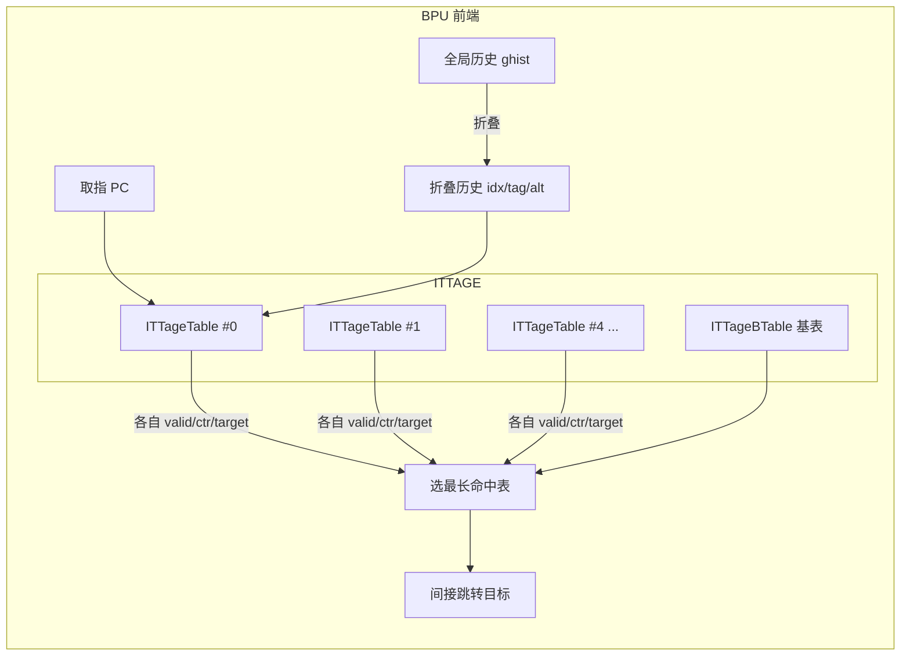
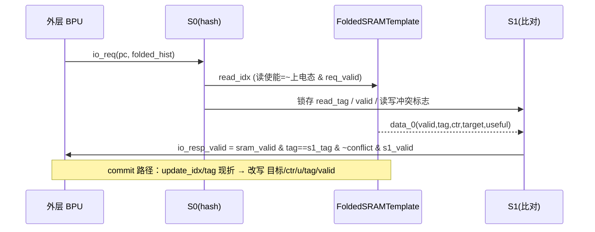

# ITTageTable —— ITTAGE 间接跳转目标预测器的「单条几何历史长度标签表」

> 可读核：`rtl/frontend/ITTageTable.sv`（`xs_ITTageTable_core` + `xs_MbistPipeIttage_core`）
> golden 同名 wrapper：`rtl/frontend/ITTageTable_wrapper.sv`（5 变体）
> 验证：`verif/ut/ITTageTable/`（UT 双例化逐拍比对 + Formality 等价）
> 生成器：`scripts/gen_ittagetable_wrappers.py`（wrapper / _xs / tb 三件套）

---

## 1. 它在前端 BPU 的位置：ITTAGE = "间接跳转版的 TAGE"

香山的方向预测主力是 **TAGE-SC-L**；间接跳转（jalr / 虚函数派发 / switch 跳转表）的目标
则由 **ITTAGE**（Indirect Target TAgged GEometric history length）预测。两者结构同构：

- 普通 TAGE 的标签表（`TageTable`）每条目存「方向位 ctr」，回答 *taken / not-taken*；
- ITTAGE 的标签表（**本模块 `ITTageTable`**）每条目存「**跳转目标的压缩编码**」，回答
  *这条间接跳转这次会跳到哪个地址*。

间接跳转的难点：同一条指令在不同调用上下文会跳到不同目标，必须用**全局历史**区分。
ITTAGE 因此沿用 TAGE 的「几何递增历史长度 + 折叠历史索引 + tag 校验」机制：

```
完整 ITTAGE = 1 个基预测器(ITTageBTable) + N 张带 tag 的标签表(本模块)
N 张表用几何递增的全局历史长度各自索引并行查询，
"命中且历史最长" 的表作 provider 给出目标；都不命中则回退基表。
```

本工程 **N=5**（5 个参数化实例，历史长度量级递增，见 §6 变体表）。



---

## 2. 一条目存什么 —— 与方向版 TAGE 的根本区别

每个条目（FoldedSRAMTemplate 一行的 `data_0`）：

| 字段 | 宽 | 含义 |
|---|---|---|
| `valid` | 1 | 条目有效 |
| `tag` | 9 | pc⊕折叠历史 的校验位；命中 = 读出 tag == 查询 tag & valid |
| `ctr` | 2 | **置信/替换**计数器（不是方向！）见下 |
| `target_offset.offset` | 20 | 目标地址的区内偏移 |
| `target_offset.pointer` | 4 | 指向某个区域基址（region table 下标） |
| `target_offset.usePCRegion` | 1 | =1 时区域基址取「当前 PC 所在区」 |
| `useful` | 1 | 有用位（另存一份，老化用） |

**与方向版 TAGE 的区别**：条目存的是「**目标**」而非「方向位」。目标用
「区域基址表 + 区内偏移」压缩 50 位 VAddr：`pointer` 选基址、`offset` 给区内偏移、
`usePCRegion=1` 表示基址取当前 PC 区。本表只负责**存取**这一编码，解码在 ITTAGE 顶层做。

**ctr 是置信度不是方向**：预测正确→朝 3 饱和增、错→朝 0 减；分配新条目置弱态 2。
ctr 越高说明该目标越稳定，外层据此决定信不信本表、替换时优先淘汰谁。

---

## 3. 关键设计点

### 3.1 折叠历史索引 / tag（FoldedHistory）

用「最长 N 拍全局历史」索引一张行数有限的表，直接取低位会丢信息。折叠历史把
`HIST_LEN` 位历史按目标宽度 `L` 切成 `ceil(HIST_LEN/L)` 个 chunk **逐块异或**压成 `L` 位，
既保留全部历史影响又恰好填满索引/tag 宽度。本核需三份：

- `idx 折叠历史`（宽 `IDX_W`）：`idx = pc[IDX_W:1] ^ idx_fh`
- `tag 折叠历史`（宽 `TAG_W=9`）：参与 tag
- `alt 折叠历史`（宽 `ALT_W`）：**左移 1 位**再参与 tag，让 tag 更分散、降低别名

```
tag = pc[IDX_W+TAG_W : IDX_W+1] ^ tag_fh ^ (alt_fh << 1)
```

**读路径(req)** 直接吃外层算好的折叠历史端口（`io_req_idx_fh / tag_fh / alt_fh`）；
**更新路径(update)** 只拿到「原始全局历史 `io_update_ghist`」，需在核内用 `fold_hist()`
现折。两者算法一致（外层有 GHistDiff 断言保证读路径折叠历史 == 现折结果）。

> 实现要点（一个真实踩过的坑）：`fold_hist` 的累加器位宽必须取 `max(IDX_W, TAG_W)`。
> var0/var1 的 `IDX_W=8 < TAG_W=9`，若累加器只有 8 位，则取 `upd_tag_fh[8]` 会越界读 X，
> 经 `update_tag` 污染 SRAM 写数据，最终在 MBIST 读回路径上暴露为 X。核里用
> `localparam FOLD_W = (IDX_W>TAG_W)?IDX_W:TAG_W` 统一累加器宽度解决。

### 3.2 ctr 置信计数 与「目标何时换新」

```
ctr_update:  alloc          → 2（弱态）
             已满(3)且对     → 保持 3
             已空(0)且错     → 保持 0
             否则            → 对 +1 / 错 -1
```

更新时是否把条目里的目标换成本次 commit 的新目标，由 `write_new_target` 决定：

```
write_new_target = io_update_alloc | (old_ctr == 0)
```

即「分配」或「旧目标置信已耗尽(ctr=0，屡屡预测错)」才允许新目标顶替旧目标；
否则保留旧目标（`io_update_old_target_offset_*`）。避免一次偶发 misprediction
就冲掉一个总体准确的目标。

### 3.3 useful 位老化扫描（reset_u）

`needReset` 置位后，在「无读请求 且 无正常更新」的空闲拍逐行扫描清 useful，
`resetSet` 是扫描行计数器；扫满（全 1）时本拍自动清 `needReset`。
SRAM 写的列写掩码 `bitmask`（38 位）三态：

| 场景 | bitmask | 含义 |
|---|---|---|
| `uValid & valid` | `0x3FFFFFFFFF` | 写全部列（含 useful 列） |
| 仅 `valid` | `0x3FFFFFFFFE` | 写条目主体，保留 useful 列 |
| 老化扫描 | `{37'h0, useful_can_reset}` | 只写 useful 那一列 |

### 3.4 单口 SRAM / 上电复位 / 读写冲突

条目存一张**单口** FoldedSRAMTemplate（读写同口）：
- **上电复位**：SRAM 首次 ready 前拉低 `io_req_ready` 挡住 BPU 流水（单口 SRAM 的
  `r_ready := !wen` 不能直接当 req_ready，需 `power_on_reset` 单独锁存）。
- **读写同拍冲突**：req 与 update 同拍命中同口，则该次读出作废
  （`s1_read_write_conflict` 打一拍后清 `io_resp_valid`）。

### 3.5 写旁路 WrBypass

ctr 在单口 SRAM 里写后下一拍才能读回。连续 commit 同一行时若每次都用
`io_update_oldCtr`（更早预测快照）会丢掉刚写进去的增量。故配一个 WrBypass 小缓存暂存
最近写过的 ctr，更新取 `old_ctr` 时优先用命中值，未命中才退回 `io_update_oldCtr`。
`io_wen` 用 `io_update_valid`（不依赖会随上电态变 X 的信号，避免 X 经写使能传播污染）。

### 3.6 数据流（流水时序）



---

## 4. 分层结构：为什么核不直接例化 SRAM/WrBypass/MBIST

5 个变体不仅参数不同，所用子模块的**模块名也不同**（firtool 单态化命名）：

| 子模块 | var0 | var1 | var2 | var3 | var4 |
|---|---|---|---|---|---|
| 条目 SRAM | FoldedSRAMTemplate_21 | _21 | _23 | _23 | _23 |
| WrBypass | WrBypass_41 | _41 | _43 | _43 | _43 |
| MBIST 流水 | MbistPipeIttage | _1 | _2 | _3 | _4 |

SystemVerilog 无法「按参数选模块名」。故可读核 `xs_ITTageTable_core` 把这三类子模块的
端口**全部引出**，由 golden 同名 **wrapper** 按变体例化正确命名的黑盒并对接。核因此只含
「纯功能逻辑」，最易读；wrapper 是机械适配层（由生成器产出）。

- `FoldedSRAMTemplate_21/_23`：已验证黑盒（`rtl/common/FoldedSRAMTemplate_variants.sv`，
  内层 Splitted→SRAMTemplate→`sram_array_1p128x76m1s1h0l1b_bp_ittage` 共享同一 76×128 宏）。
- `WrBypass_41/_43`：golden 黑盒（仅 idx 位宽不同：8 / 9 位）。
- MBIST：可读核 `xs_MbistPipeIttage_core`（参数化 1/2 个 SRAM bore 口 + array ID）。

### MBIST（DFT 链路，纯测试基础设施，与预测功能无关）

测试模式下把 BPU 顶层广播的 mbist 总线一拍寄存后转发给本表 SRAM 的 bore 口，并把 SRAM
读回数据送回总线。只在被本表 array ID 选中或 "all" 广播（doSpread）时才真正驱动 SRAM。
两类拓扑：

- `N_SRAM=1`（var0/1，SRAM 单 bore 口）：一个 array ID。
- `N_SRAM=2`（var2/3/4，SRAM 双 bore 口）：两个相邻 array ID，各自独立 selected/doSpread；
  `mbist_outdata = 各口选中数据或合`。

array ID：var0=`0x46` var1=`0x47` var2=`0x48/49` var3=`0x4A/4B` var4=`0x4C/4D`。

---

## 5. 接口表（核 `xs_ITTageTable_core`，对功能而非 DFT）

| 方向 | 信号 | 说明 |
|---|---|---|
| out | `io_req_ready` | 上电完成后才拉高 |
| in | `io_req_valid` / `io_req_bits_pc` | 预测请求 |
| in | `io_req_idx_fh / tag_fh / alt_fh` | 读侧折叠历史（外层算好） |
| out | `io_resp_valid` | s1 命中 |
| out | `io_resp_bits_ctr / u` | 置信计数 / 有用位 |
| out | `io_resp_bits_target_offset_{offset,pointer,usePCRegion}` | 目标编码 |
| in | `io_update_pc / ghist` | commit 的 PC 与原始全局历史（现折用） |
| in | `io_update_valid / correct / alloc` | 更新有效 / 旧目标是否对 / 是否分配 |
| in | `io_update_oldCtr` | 预测时快照旧 ctr（WrBypass 未命中时用） |
| in | `io_update_uValid / u / reset_u` | 更新 useful / 新值 / 启动老化扫描 |
| in | `io_update_target_offset_*` | 本次 commit 新目标 |
| in | `io_update_old_target_offset_*` | 条目里旧目标（保留用） |
| —— | `sram_*` / `wrbp_*` | 与 wrapper 内黑盒对接（SRAM 读写口 / WrBypass） |

---

## 6. 5 变体差异表

所有变体：`TAG_W=9`、`CTR_W=2`、目标编码 20+4+1、单 way、同一 76×128 SRAM 宏。
仅折叠历史几何（历史长度与折叠方式）与表深不同：

| golden 名 | IDX_W / 行数 | idx_fh 宽 | tag_fh 宽 | alt_fh 宽 | IDX/TAG/ALT 历史长 | SRAM | WrBypass | MBIST id |
|---|---|---|---|---|---|---|---|---|
| `ITTageTable`   | 8 / 256 | 4 | 4 | 4 | 4 / 4 / 4    | _21 | _41 | 0x46 |
| `ITTageTable_1` | 8 / 256 | 8 | 8 | 8 | 8 / 8 / 8    | _21 | _41 | 0x47 |
| `ITTageTable_2` | 9 / 512 | 9 | 9 | 8 | 13 / 13 / 13 | _23 | _43 | 0x48/49 |
| `ITTageTable_3` | 9 / 512 | 9 | 9 | 8 | 16 / 16 / 16 | _23 | _43 | 0x4A/4B |
| `ITTageTable_4` | 9 / 512 | 9 | 9 | 8 | 32 / 32 / 32 | _23 | _43 | 0x4C/4D |

> 折叠历史宽度 = `min(历史长, 目标宽度)`：var0/1 历史短(4/8) < idx/tag 宽，故只异或低几位；
> var2-4 历史长，折叠后填满 9 位 idx / 9 位 tag（alt 折到 8 位）。
> 这些几何由生成器 `VARIANTS` 表参数化驱动同一可读核 `xs_ITTageTable_core`。

---

## 7. 验证结果

### UT（VCS，golden vs `_xs` 双例化，随机激励逐拍比对全部输出）

```
cd verif/ut/ITTageTable && make compile && make run
→ checks=180020 errors=0  TEST PASSED
```

5 变体同跑，每拍比对全部 output（含 `io_resp_*`、目标编码、MBIST `bore_outdata`）。

### Formality（每变体 ref=golden / impl=可读核+wrapper）

```
make fm
→ ITTageTable / _1 / _2 / _3 / _4 均 Verification SUCCEEDED
```

- SRAM(`FoldedSRAMTemplate_21/_23`)、WrBypass(`_41/_43`) 在两侧均作**同名黑盒**
  （`hdlin_unresolved_modules=black_box`），不参与内部存储等价比对。
- MBIST 流水在 ref 侧也展开（`FM_REF_DEPS_* = MbistPipeIttage*.sv`），与 impl 侧可读
  `xs_MbistPipeIttage_core` 由签名分析 + 寄存器配对验证逻辑等价。
- 0 failing compare points（var0：601 passing；含 200 DFF + 107 port + 294 BBPin）。

### 可读性 grep

```
grep -E "RANDOMIZE|SYNTHESIS\b|_GEN_|_T_[0-9]"  核+wrapper → 0 命中
```

无 firtool 生成痕迹；条目用 typedef 风格命名、折叠历史/ctr 用纯函数、
MBIST 多口用数组 + for、丰富中文注释讲「为什么」。

---

## 8. 复跑命令

```bash
# 重新生成 wrapper / _xs / tb（改了核参数表后）
python3 scripts/gen_ittagetable_wrappers.py
# UT
cd verif/ut/ITTageTable && make compile && make run
# FM（5 变体）
make fm
```
