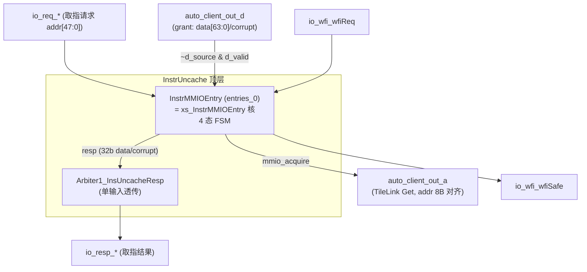
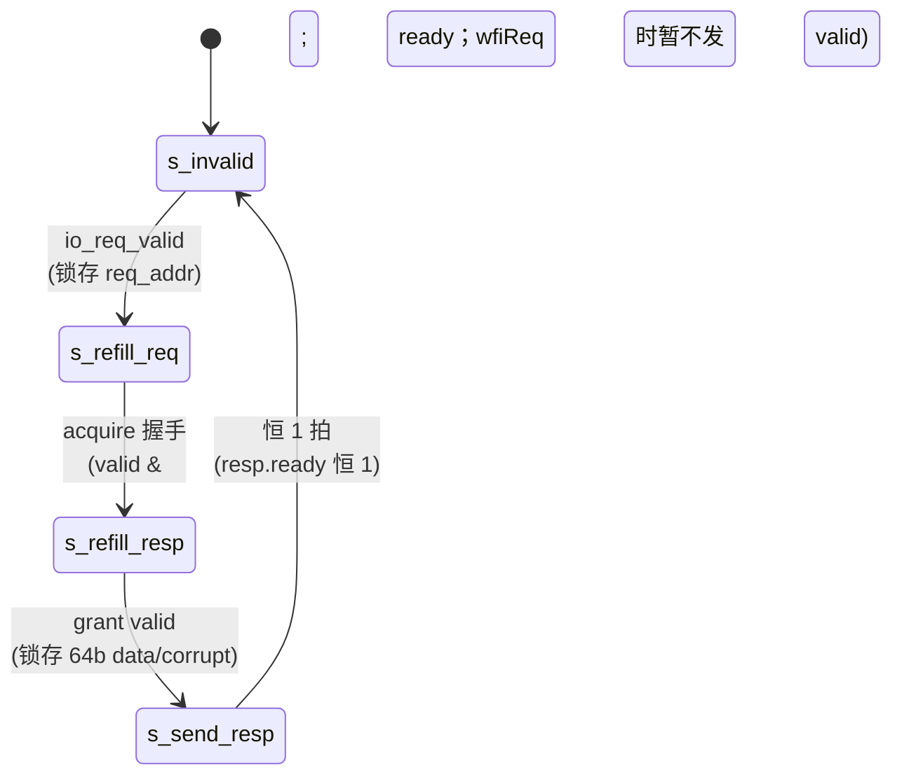

# InstrUncache —— MMIO 取指（非缓存）

| | |
|---|---|
| 手写 SV | `rtl/frontend/InstrMMIOEntry.sv`（`xs_InstrMMIOEntry`）+ `rtl/frontend/InstrUncache_variants.sv`（InstrMMIOEntry / Arbiter1_InsUncacheResp / InstrUncache 三个 golden 同名模块） |
| Scala 来源 | `src/main/scala/xiangshan/frontend/icache/InstrUncache.scala` |
| 验证状态 | UT ✅（InstrMMIOEntry 6 万拍 0 错）/ FM ✅（3 模块全 SUCCEEDED） |

## 功能

对落在 MMIO 区间的取指请求，经 TileLink 向 L2/外设发 Get 取回指令（不进 ICache）。
KunminghuV2 配置 nMMIOs=1，故顶层就是「单 InstrMMIOEntry + 透传响应仲裁 + TileLink
A/D 路由」，真正逻辑在 InstrMMIOEntry 的 4 态 FSM。

### 结构图（顶层 + TileLink 通道）

顶层 `InstrUncache` 把 entry 的 `mmio_acquire` 接到 TL A 通道、`auto_client_out_d`（仅 source==0）
接回 entry 的 grant，响应经 1 输入 Arbiter 透传。对应 `InstrUncache_variants.sv:55-100`。

*图注：单 entry，source 恒 0，故 grant 命中条件为 `~auto_client_out_d_bits_source & auto_client_out_d_valid`（`InstrUncache_variants.sv:86`）；64→32 位选择在 entry 内按 pc[2:1] 完成。*

## InstrMMIOEntry FSM（核心）

| 状态 | 行为 |
|------|------|
| s_invalid | `io_req_ready=1`，收到 req 锁存地址 → s_refill_req |
| s_refill_req | 发 TileLink Get（地址按 mmioBusBytes=8 对齐）；wfiReq 时暂不发；acquire 握手 → s_refill_resp |
| s_refill_resp | 收 grant（恒 ready），锁存 64-bit 数据/corrupt → s_send_resp |
| s_send_resp | 输出 resp（恒 valid，下游恒 ready，1 拍）→ s_invalid |

状态机图（`state`，对应 `InstrMMIOEntry.sv:80-90`）：

*图注：`io_req_ready`=（state==s_invalid）、`io_mmio_acquire_valid`=（state==s_refill_req 且 ~wfiReq）、`io_resp_valid`=（state==s_send_resp）；`wfiSafe`=非 s_refill_resp，即只要无在途 L2 响应就安全进 wfi（`InstrMMIOEntry.sv:53-59`）。*

- `wfiSafe = 非 s_refill_resp`（无在途 L2 响应即可进 wfi）
- 取指数据按 `pc[2:1]` 从 64-bit 总线选 32 位（maxInstrLen=32）
- 本配置 flush 被绑 0、id 恒 0、resp.ready 恒 1（均被 firtool DCE，golden 无对应端口）

## 顶层 InstrUncache（结构层）

单 entry：req/resp 直连；`mmio_acquire→auto_client_out_a`；`auto_client_out_d`（仅
source==0 时）→ entry grant；响应经 1 输入 Arbiter 透传。

## 验证

- **UT**：golden `InstrMMIOEntry` vs `InstrMMIOEntry_xs`，随机驱动 req/acquire/grant/wfi
  各通道，逐拍比对全部输出，6 万拍 0 错。
- **FM**：InstrMMIOEntry、Arbiter1_InsUncacheResp、InstrUncache 三模块全 SUCCEEDED。
  注：req_addr 的条件更新需从 `unique case` 内拆为独立 `always_ff`（对齐 golden 结构）
  才能通过 FM——放在 case 内会令 FM 对部分位判不等价（UT 不暴露，FM 兜底）。
