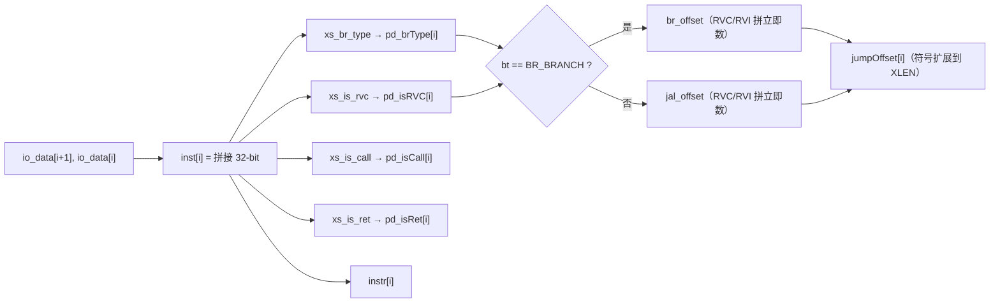
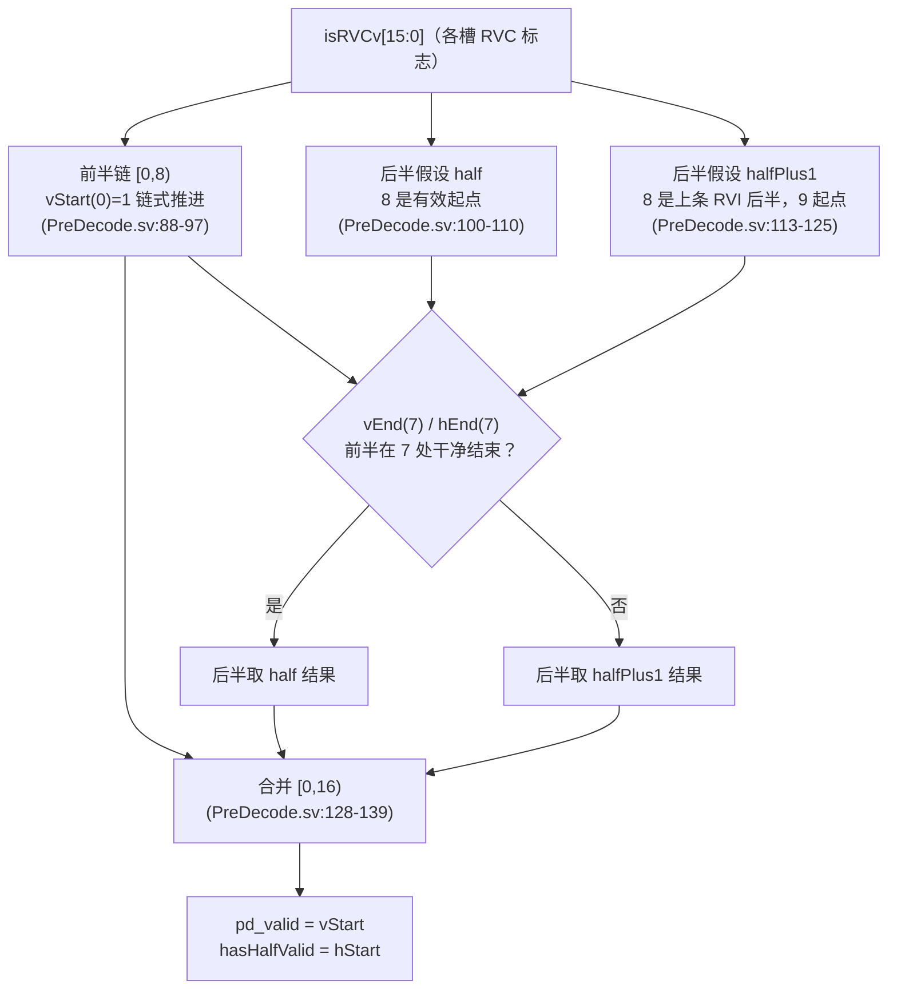

# PreDecode —— 取指包预解码

| | |
|---|---|
| 手写 SV | `rtl/frontend/PreDecode.sv`（`xs_PreDecode_core`）+ `rtl/frontend/PreDecode_wrapper.sv` |
| Scala 来源 | `src/main/scala/xiangshan/frontend/PreDecode.scala`（class PreDecode） |
| 生成器 | `scripts/gen_predecode.py`（解析 golden 端口生成 wrapper+_xs+tb） |
| 验证状态 | UT ✅（20 万随机向量 0 错）/ FM ✅（SUCCEEDED） |

## 1. 功能概述

IFU 取指后对一个取指包做**预解码**（纯组合）。取指包 = `PredictWidth+1`(=17) 个
16-bit 半字。对每个半字地址 i（i=0..15）：

- 取该位置 32-bit 指令 `inst[i] = {data[i+1], data[i]}`
- 判 RVC（`inst[1:0]≠2'b11`）
- 译分支类型（notCFI/branch/jal/jalr）、isCall、isRet
- 算 jal/branch 的符号扩展跳转偏移
- 用两段式 RVC/RVI 边界检测，得到每个位置是否为「有效指令起点」（valid）以及
  half-valid（跨包 last-half 匹配用）

输出供后续流水（IFU/FTQ/IBuffer）使用。本模块**纯组合无状态**，golden 的
clock/reset/io_in_valid 仅曾用于断言，综合版已裁剪（wrapper 接受但忽略）。

### 1.1 单槽组合通路（`g_dec`，i=0..15）

每个半字位置 i 取 `{data[i+1],data[i]}` 拼成 32-bit 指令，并行译出该槽各字段
（`rtl/frontend/PreDecode.sv:65-78`）。valid/hasHalfValid 不在此处产生——来自后续的边界检测。

> 图注：PW=16 个槽各跑一份上图（genvar 并行）。分支译码函数与 [F3Predecoder](F3Predecoder.md)
> 共享 `xs_predecode_pkg`。

## 2. 分支类型译码（HasPdConst.brInfo + PreDecodeInst.brTable）

| 指令 | 匹配（inst 位段） | brType |
|------|------|------|
| C.EBREAK | `[15:13]=100, [11:2]=0, [1:0]=10` | notCFI（优先级最高） |
| C.J | `[15:13]=101, [1:0]=01` | jal |
| C.JR/C.JALR | `[15:13]=100, [6:2]=0, [1:0]=10` | jalr |
| C.BEQZ/BNEZ | `[15:14]=11, [1:0]=01` | branch |
| JAL | `[6:0]=1101111` | jal |
| JALR | `[14:12]=000, [6:0]=1100111` | jalr |
| BRANCH | `[6:0]=1100011` | branch |

C.EBREAK 是 C.JR 的特例，必须优先判为 notCFI（手写用优先级 if 链实现）。

- `isCall = (jal&&!RVC || jalr) && isLink(rd)`，`rd = RVC ? {0,inst[12]} : inst[11:7]`
- `isRet  = jalr && isLink(rs) && !isCall`，`rs = RVC ? (jal?0:inst[11:7]) : inst[19:15]`
- `isLink(r) = (r==1)||(r==5)`（x1/x5 为链接寄存器）

跳转偏移：jal/branch 各有 RVC/RVI 两种立即数拼法，符号扩展到 XLEN(64)。
`jumpOffset = isBr ? br_offset : jal_offset`。

## 3. 两段式有效边界检测（关键）

RVC 使指令边界依赖前一条指令长度，形成长链。为改善时序，在取指包中点(HALF=8)打断：

- **前半 [0,8)**：链式推导。`vStart(i)=i==0?1:vEnd(i-1)`；
  `vEnd(i)=vStart(i)&isRVC(i) | ~vStart(i)`。h_ 版同理但 `hStart(0)=0`。
- **后半 [8,16)** 同时算两种假设：
  - **half**：假设 8 是有效起点（`vStart_half(8)=1` 链式）；
  - **halfPlus1**：假设 8 是上一条 RVI 的后半、9 才是起点
    （`vStart_hp1(8)=0, vEnd_hp1(8)=1`，从 9 链式）。
- **合并**：后半按前半是否在 7 处干净结束选假设：
  `vStart(i) = vEnd(7) ? vStart_half(i) : vStart_hp1(i)`（h_ 用 hEnd(7)）。

> 图注：两段式在中点(HALF=8)打断 RVC 边界长链——前半链式直推，后半同时算两种起点假设，
> 最后按前半结束状态二选一，缩短关键路径。每段拆到独立 `always_comb`、用运行标量推进，
> 避免 Formality FMR_VLOG-929。

手写实现要点（为通过 Formality 严格 RTL 解释）：各链用**运行标量**推进而非读写同一
数组，并拆分到多个 `always_comb` 块，块间互不读写——避免 FMR_VLOG-929
（always_comb 内读写同数组）被判错。

## 4. 验证

- **UT**（`verif/ut/PreDecode/`）：golden `PreDecode` vs 手写 `PreDecode_xs`，20 万组
  随机指令数据，逐拍比对全部 125 个输出端口；`make run` 0 错误。
- **FM**（`make fm`）：SUCCEEDED。偏移用显式符号位复制避免 signed/unsigned 转换告警。

> 注：firtool 裁掉了恒定输出端口（pd_0_valid 恒 1、hasHalfValid_0/1 等），wrapper
> 按 golden 实际端口连接，核内部仍算全 16 宽。
>
> **端口命名约定**：本文用 golden 的扁平名（如 `pd_0_valid`、`pd_<i>_brType`）描述各槽信号；
> **可读核 `xs_PreDecode_core` 的对应端口是按槽打包的向量**——`pd_valid`/`pd_isRVC`/`pd_isCall`/
> `pd_isRet`/`hasHalfValid` 均为 `[PW-1:0]`，`pd_brType` 为 `[PW-1:0][1:0]`，`instr` 为
> `[PW-1:0][31:0]`，`jumpOffset` 为 `[PW-1:0][XLEN-1:0]`（`rtl/frontend/PreDecode.sv:27-34`）。
> golden 扁平名与核打包向量的展开/裁剪由 wrapper 完成。
