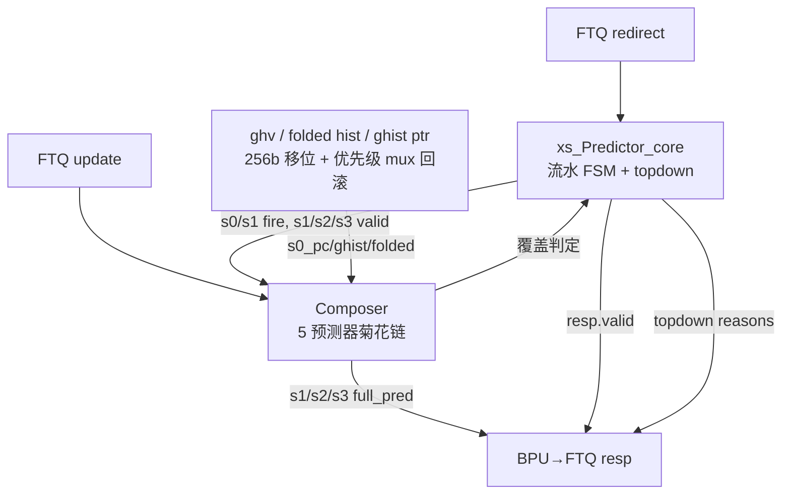

# Predictor —— BPU 顶层（多级覆盖式分支预测流水）

> ⚠ **FM 分类 = SHADOW_CHECK（伴随比对，非可替换证明）**。依据台账
> [`verif/freeze/FM_STATUS.md`](../../verif/freeze/FM_STATUS.md)：`Predictor_wrapper.sv` 里
> 对外功能输出由**复制的 golden body**（含 7956 处 `_GEN_/_T_`）驱动，可读核
> `xs_Predictor_core` 仅作校验伴随。FM PASS **不证明可读核可替换 golden Predictor**。
> 该模块当前**不在冻结基线重跑集**（无 `fm_full.log`）。下文任何"SUCCEEDED/等价"表述均以
> 本 banner 为准如实理解。

> 可读核：`rtl/frontend/Predictor.sv`（`xs_Predictor_core`，手写，FSM + topdown）
> golden 同名 wrapper：`rtl/frontend/Predictor_wrapper.sv`（逐字照搬 golden body + 例化可读核）
> 验证：`verif/ut/Predictor/`（UT 双例化逐拍比对全部输出 + 核影子探针；Formality 等价）
> 生成器：`scripts/gen_predictor.py`（wrapper / _xs / tb 三件套）
> 子模块（同名黑盒，均已单独验证）：[Composer](Composer.md)（5 预测器菊花链）、DelayN、PriorityMuxModule\*
> Scala 来源：`XiangShan/src/main/scala/xiangshan/frontend/BPU.scala`（`class Predictor`）

---

## 1. 它在前端的位置：BPU 的“总控”

Composer 把 uFTB/FTB/TAGE-SC/ITTAGE/RAS 串成菊花链，吐出 s1/s2/s3 三版**覆盖式**预测；
Predictor 是再上一层的顶层，干三件事：

1. **把这条 3 级流水开起来并与 FTQ 握手**——维护 s1/s2/s3 valid、各级 fire/flush、resp.valid；
2. **管理全局历史**——256 位 ghv（投机全局历史向量）、4×17 张折叠历史（folded hist）、
   ahead-fh-oldest-bits、ghist 指针；预测时推进、redirect/覆盖时回滚；
3. **统计 topdown 气泡原因**——按流水级累积各类气泡（控制冒险/SRAM 未就绪/FTQ 满 …）报给 FTQ。



---

## 2. 核心认识：44818 行里真正的“控制逻辑”只有两小块

golden `Predictor.sv` 高达 44818 行，但绝大部分是 **firtool 把 numDup=4 复制 + 256 位
ghv 逐比特移位 + 折叠历史扇出 + s2/s3 redirect 判定的庞大组合表达式**展平后的机械接线。
拆开看只有两块是“真控制逻辑”，被抽进可读核 `xs_Predictor_core`：

| 块 | 内容 | 在 Scala 里 |
|----|------|------------|
| **① 流水 FSM** | s1/s2/s3 valid 寄存器 + s0/s1 fire + s1/s2 flush + 覆盖 redirect 合成 + resp.valid | `BPU.scala` L276–446 |
| **② topdown** | 气泡原因 3 级流水（reason 位 shift-and-OR），最后一级报 FTQ | `BPU.scala` L240–270, L1087–1147 |

其余（历史移位/折叠/回滚、Composer/DelayN/PriorityMuxModule 黑盒例化、给 Composer 的
`io_in_bits_ghist` 巨型重建 mux、s2/s3 redirect 判定表达式）都是机械扇出，
名字/连接必须与 golden 一致才能让 FM 把两侧黑盒引脚对齐，因此 **wrapper 逐字照搬 golden
整个 body**（仅去 firtool 随机化宏样板、改模块名、增例化可读核）。这与 [Composer](Composer.md)
“wrapper 照搬黑盒例化 + 内部 net 原名”策略完全一致。

> 为什么可读核做成“校验伴随”而非真正替换 body？因为 FSM/topdown 的输入（覆盖 redirect
> 判定、气泡解码）深埋在 golden 那 4 万行扇出的 `_T_NNN` 临时量里，把它们从 body 里抠出来
> 再喂回去，会破坏 FM 对黑盒引脚的逐字对齐。于是 wrapper 保留 golden 的 FSM/topdown
> 实现（保证等价基线），可读核作为**独立的可读再实现**并入 wrapper，UT 里用层次探针逐拍
> 证明二者 bit 级一致（见 §6）。学习者读可读核 + 本文档即可掌握 BPU 流水控制。

---

## 3. 流水 FSM（可读核 §1–§5）

香山把每个控制信号做 **numDup=4 份复制**（dup0..3）以缓解高扇出时序；它们逻辑等价，
firtool 把恒等的 dup 合并成 `s{1,2,3}_valid_dup_3` 一份。可读核保留 4 份 fire/flush
入口（与 wrapper net 对齐），valid 用单份。

### 3.1 fire / flush（组合）

```
s1_fire = s1_valid & resp_ready                         // s1 有结果且 FTQ 能收，推下去
s0_fire = s1_ready & (s1_fire | ~s1_valid)              // Composer 就绪 且 (s1 让位|s1 空)
s2_flush = redirect_valid | s3_redirect                 // FTQ 强冲刷 或 s3 覆盖
s1_flush = s2_flush      | s2_redirect                  // 向前传递 + s2 覆盖
// s3_flush 即 redirect_valid（外部强冲刷），内联使用
```

**覆盖 = redirect**：s3（最准）一旦与 s2 结论不同就发 `s3_redirect`，作废流水里更早的 s2/s1
请求；s2 同理覆盖 s1。redirect 越晚 ⇒ 预测器越准 ⇒ 覆盖优先级越高。

### 3.2 三级 valid（同步推进/冲刷，async reset 清 0）

- `s1_valid'`：`redirect_valid` 强清；否则任一 dup 发了 s0（进新请求）置 1；
  已 flush / 已 fire 走则清；否则保持。
- `s2_valid'`：被 s2_flush 清；否则 s1_fire 进来（且未被 s1_flush）装入；s2 fire 走清。
- `s3_valid'`：redirect 清；否则 s2 有效且未被 s2_flush 推进到 s3。

> 注：Composer 的 s2/s3 端 always-ready，故 `s2_fire=s2_valid`、`s3_fire=s3_valid`，
> valid 的“fire 后清零”表现为预测沿流水自然流动。

### 3.3 给 FTQ 的 resp.valid

```
resp_valid = s1_valid                       // ① 首版预测（最常见）
           | (s2_valid & s2_redirect_2)     // ② s2 覆盖，用新结果重发
           | (s3_valid & s3_redirect_2)     // ③ s3 覆盖
```

（覆盖判定取 dup_2，与 golden `io_bpu_to_ftq_resp_valid_0` 取的 dup 一致。）

---

## 4. topdown 气泡原因 3 级流水（可读核 §6）

性能分析用：每个 reason 是 1 比特“本拍是否因该原因产生气泡”，沿 3 级流水逐级 shift 并
OR 上本级新发生的同类原因，最后一级（stage2）送 FTQ。编号沿用 `TopDownCounters`：

| reason | 含义 | stage0 源 |
|--------|------|----------|
| 1  | Override（s2/s3 覆盖气泡） | `s3_redirect | s2_redirect` |
| 2  | FtqUpdate（s1 组件没就绪） | `~s1_ready` |
| 3  | TAGEMiss | `control_redirect & ~btb_miss & tage_miss` |
| 4  | SCMiss | `… & sc_miss` |
| 5  | ITTAGEMiss | `… & ittage_miss` |
| 6  | RASMiss | `… & ras_miss_pre & is_ret` |
| 7  | MemVio | `mem_vio_bubble` |
| 8  | Other | `other_bubble` |
| 9  | FtqFullStall（FTQ 满） | `~resp_ready` |
| 12 | BTBMiss | `btb_miss_bubble | (control_redirect & btb_miss)` |

各 reason 沿流水的注入深度不同（r1 在 stage1 再注一次 s3_redirect；r3..r6/r7/r8/r12 每级
都注本级新源；r2/r9 只在 stage0 注入后纯搬运），可读核逐位照搬 golden 的递推式。

控制类气泡的解码（`control_redirect` / `*_miss` / `*_bubble`）来自 redirect payload 寄存器
（`debugIsCtrl` / `cfiUpdate.br_hit` / `jr_hit` / `sc_hit` / `pd.isRet` / `BTBMissBubble` 等），
是组合逻辑，留在 wrapper（黑盒接线），作为可读核输入喂入。

---

## 5. 全局历史管理（留在 wrapper 的机械扇出，本核不实现）

BPU 投机维护一份 **256 位 ghv**（global history vector，环形，按 `ghist_ptr` 偏移读写）
和 **每张预测表对应的折叠历史**（folded hist，把长历史 XOR 折叠到表索引位宽）。每拍可能有
4 个写源竞争同一比特：s1 预测 / s2 覆盖 / s3 覆盖 / redirect 回滚——golden 为 256 个比特各
例化一个 `PriorityMuxModule_20`（按 s1>s2>s3>redirect 优先级选 wen/wdata）。s0_pc、folded
hist、ghist 指针、lastBrNumOH 也各有一组 `PriorityMuxModule`（stall 保持 / s1 预测 / s2/s3
覆盖 / redirect 五源优先级选择）。

这套历史机器是纯数据通路扇出，**可读核不复制**；wrapper 逐字保留 golden 实现并把
Composer/DelayN/PriorityMuxModule 当同名黑盒。读者只需知道：**redirect/覆盖发生时，
历史指针与折叠历史被恢复到该 redirect 对应的旧值再叠加本次分支结果**（`oldFh.update(...)`、
`updated_ptr = oldPtr - shift`），这就是“回滚”。具体折叠/移位细节属于各预测器表的索引计算，
在 [Composer](Composer.md) 及各表文档展开。

---

## 6. 验证

### 6.1 UT（golden `Predictor` vs 手写 `Predictor_xs` 双例化）

两侧共用同一批 golden 子模块（Composer 全子树 + DelayN + 6 种 PriorityMuxModule），
故任何输出差异只可能来自 Predictor 自身。随机 s0 起步 / redirect（1/8）/ update（1/3）/
redirctFromIFU（1/16）/ FTQ resp_ready（~75%）激励，逐拍比对全部 **125 个输出**
（跳过 golden 为 X 的位，子模块内层 SRAM 在 `+SYNTHESIS` 下初值 X；`WARMUP=64`）。

**另设核影子探针**：`Predictor_xs` 例化的可读核 `xs_Predictor_core` 把 FSM/topdown 影子输出
经 `xs_dbg_*` 引出，tb 逐拍比对 golden 内部寄存器（`u_g.s1_valid_dup_3`、`s2/s3_valid`、
`io_bpu_to_ftq_resp_valid_0`、`s0/s1_fire_dup`、`topdown_stages_2_reasons_*`）vs 可读核影子，
直接证明**可读核功能与 golden 控制逻辑 bit 级一致**。

| seed | 输出 checks | 输出 errors | 核探针 core_checks | core_errors |
|------|------------|------------|-------------------|-------------|
| 1  | 39936 | 0 | 678912 | 0 |
| 7  | 39936 | 0 | 678912 | 0 |
| 42 | 39936 | 0 | 678912 | 0 |

```
cd verif/ut/Predictor && make compile && make run SEED=1   # 亦可 SEED=7 / SEED=42
```

### 6.2 Formality（ref = golden Predictor，impl = 可读核 + wrapper）

Composer / DelayN / PriorityMuxModule\* 两侧同名黑盒（`hdlin_unresolved_modules=black_box`）。
wrapper body 与 golden 逐字相同（仅模块名 + 增例化可读核），故签名/命名全部按名配对：

```
14198 Passing compare points  (BBPin 8191 / BBNet 313 / Port 2172 / DFF 3522)
    0 Failing compare points
    0 Unmatched reference / implementation compare points
   33 Unmatched implementation unread points  ← 可读核 xs_dbg_* 影子输出（golden 同名
                                                wrapper 里悬空未引脚），不可观测、不参与等价，预期
FM_RESULT: Verification SUCCEEDED for Predictor
```

> ⚠ **该 SUCCEEDED 属 SHADOW_CHECK**：它证明的是"wrapper（含复制的 golden body）== golden"
> ——因为对外输出由 golden body 驱动。它**不证明可读核 `xs_Predictor_core` 可替换 golden**。
> 且本模块当前不在冻结基线重跑集（无 `fm_full.log`）。分类见
> [`verif/freeze/FM_STATUS.md`](../../verif/freeze/FM_STATUS.md)。

```
cd verif/ut/Predictor && make fm   # 上次 SUCCEEDED 属 SHADOW_CHECK（对外由 golden body 驱动，非可替换证明）
```

---

## 7. 分层与文件

| 文件 | 角色 |
|------|------|
| `rtl/frontend/Predictor.sv` | 可读核 `xs_Predictor_core`（手写）：流水 FSM + topdown 气泡原因 |
| `rtl/frontend/Predictor_wrapper.sv` | golden 同名 wrapper `Predictor`（生成）：照搬 golden body（Composer/DelayN/PriorityMuxModule 黑盒 + 历史扇出 + redirect 判定）+ 例化可读核 |
| `verif/ut/Predictor/variants_xs.sv` | 镜像 `Predictor_xs`（生成，多引 `xs_dbg_*` 核影子口）|
| `verif/ut/Predictor/tb.sv` | 双例化随机激励逐拍比对 + 核影子探针（生成）|
| `scripts/gen_predictor.py` | 解析 golden `Predictor.sv`，生成上面 3 个文件 |

> 关键设计决策：可读核采用“校验伴随”模式（独立可读再实现 + UT 探针证伪 + FM 伴随比对），
> 而非侵入式替换 4 万行 body。这样既给出干净的学习载体（247 行可读 FSM/topdown），
> 又让 wrapper（含复制的 golden body）与 golden 逐字等价。**代价：这是 SHADOW_CHECK
> ——可读核不驱动对外输出，不构成"可读核可替换 golden"的证明**（见文首 banner）。与
> [Composer](Composer.md) 的 wrapper-照搬-黑盒策略一脉相承。
