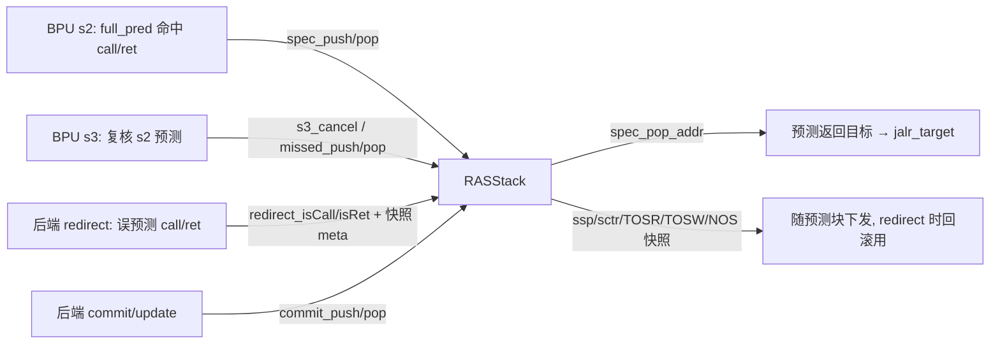
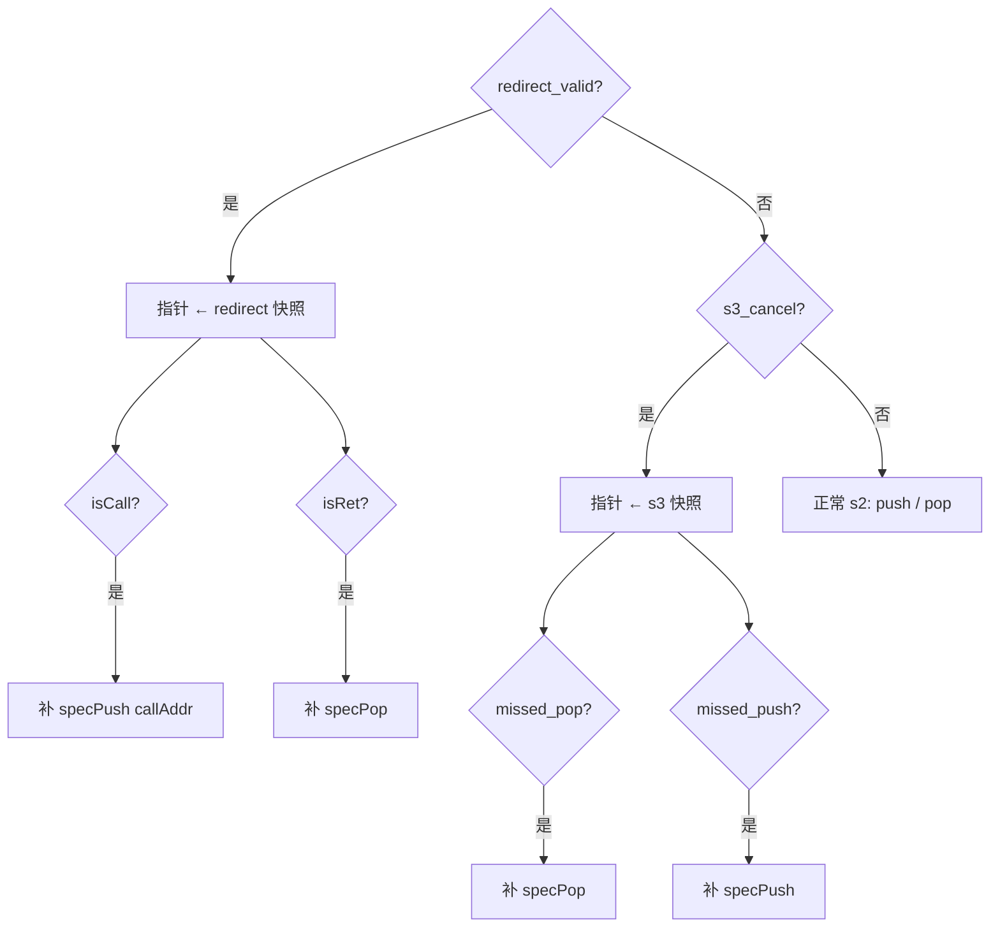

# RAS —— 返回地址栈预测器（学习文档）

| | |
|---|---|
| 手写 SV | `rtl/frontend/RAS.sv`（`xs_RASStack` + `xs_ras_pkg`）+ `rtl/frontend/RAS_wrapper.sv` |
| 共享类型 | `xs_ras_pkg`（`ras_entry_t` / `ras_ptr_t` + 环形指针/比较/距离 纯函数） |
| Scala 来源 | `src/main/scala/xiangshan/frontend/newRAS.scala`（`class RAS` 内部 `class RASStack`） |
| 验证状态 | UT ✅（6 万拍 ×4 seed，0 错）/ FM ✅（SUCCEEDED，3018 比对点全过） |
| 重写范围 | 本次重写 **RASStack**（栈核心）；外层 `RAS`（s2/s3 流水识别 call/ret、pc dup debug、passthrough）属薄包装，未纳入 |

> **重写范围说明**：golden 的 `RAS` 顶层把整个 BPU 预测块 bundle 原样透传，真正的
> 有状态算法全在子模块 `RASStack` 里（双栈、循环指针、push/pop、重定向恢复）。本工程
> 聚焦最有学习价值、最复杂的 `RASStack`，golden 同名对照件为 `golden/chisel-rtl/RASStack.sv`。

---

## 1. RAS 是什么 / 它在前端的位置

RAS（Return Address Stack）是 BPU 里专门预测**函数返回（`ret`）目标地址**的预测器。
调用约定保证「`call` 之后必然返回到 call 的下一条指令」，于是维护一个栈：

- 取指流水识别到一个 **taken 的 call** → **push** 它的返回地址（= call 落地址，RVI call 再 +2）；
- 识别到一个 **taken 的 ret** → **pop** 栈顶，作为预测的返回目标（写进 `jalr_target`）。



---

## 2. 核心思想：投机栈 + 提交栈（为什么要两套）

预测发生在取指阶段（s2/s3），此时分支是否真 taken 尚未确认。若预测错了（s3 自纠、后端
redirect），已经做过的 push/pop 必须能**回滚**。RAS 因此把栈分两层：

| 栈 | 容量 | 角色 | 更新时机 |
|----|------|------|----------|
| **投机栈** `spec_queue` + `spec_nos` | 32（环形） | 在途（已预测未提交）的 push 记录 | s2/s3 预测时 |
| **提交栈** `commit_stack` | 16 | 真值（已确认） | 后端 commit 时 |

### 投机栈是「持久栈（persistent stack）」
关键设计：**pop 不抹除数据，只移动读指针 `TOSR`**。每个投机项额外记一个 `NOS`
（next-on-stack，即它压栈前的栈顶位置），存在 `spec_nos[]` 里。pop 时让 `TOSR ← NOS`，
逻辑栈顶顺着 NOS 链往下走；数据原地保留。

> 这就是双栈能**廉价回滚**的根源：redirect 只要把几个指针写回快照值即可恢复整个逻辑栈，
> 无需搬运任何数据。代价是要为每项多存一个 NOS 指针。

### 五个指针 + 两个计数（务必理解）

| 名称 | 宽度 | 含义 |
|------|------|------|
| `TOSW` | {flag,5b} | top-of-spec-**write**：下一个要写入的投机槽（环形写指针） |
| `TOSR` | {flag,5b} | top-of-spec-**read**：当前**逻辑栈顶**所在的投机槽（环形读指针） |
| `NOS`  | {flag,5b} | 栈顶项的「下一项位置」（= `spec_nos[TOSR]` 或旁路值），pop 时 `TOSR←NOS` |
| `BOS`  | {flag,5b} | bottom-of-spec：已提交边界。`< BOS` 的在途项已落入提交栈 |
| `ssp`  | 4b | 投机栈**逻辑深度**指针（指向 commit_stack，作回落取数用） |
| `sctr` | 3b | 投机栈**顶项的重复计数**（见 §3 ctr） |
| `nsp`  | 4b | 提交栈指针 |

环形指针 `{flag, value}`：`value` 在 0..31 间回绕，回绕时翻 `flag`，用于区分「写绕一圈追上读」
与「空」。比较用 `is_before(a,b) = (a.flag^b.flag) ^ (a.value<b.value)`（即 `CircularQueuePtr.<`）。

### 栈顶在哪：`tosr_in_range`
逻辑栈顶数据可能在投机栈，也可能已退到提交栈：

```
tosr_in_range(TOSR) = !is_before(TOSR, BOS) && is_before(TOSR, TOSW)   // TOSR ∈ [BOS, TOSW)
栈顶 entry = tosr_in_range ? spec_queue[TOSR] : commit_stack[ssp]      // getTop
```

---

## 3. ctr：尾递归 / 重复返回地址压缩

连续 call 到**同一返回地址**（循环里反复调用同一函数、自递归等）**不分配新槽**，而是把
栈顶 entry 的 `ctr +1`（饱和到 `CTR_MAX=7`）。对应 pop 时先 `ctr-1`，`ctr` 到 0 才真正退栈。

```
push(addr): if (栈顶.retAddr==addr && sctr<7)  sctr++          // 压缩
            else                               ssp++, sctr=0   // 新地址，进一层
pop()     : if (sctr>0)                        sctr--          // 同层退一次
            else                               ssp--, sctr=下一层的ctr
```

这样有限栈深也能容纳很深的同地址嵌套，避免溢出丢预测。提交栈侧由 `nsp` + 各项 `ctr` 做同样压缩。

---

## 4. 三个恢复入口（优先级与时序）

```
优先级:  redirect(后端重定向)  >  s3_cancel(s2/s3 不一致自纠)  >  正常 s2 push/pop
```

`redirect` / `s3_cancel` 都携带一份**快照 meta**（push 当时记录的 `ssp/sctr/TOSR/TOSW/NOS`）。
恢复流程：**先把指针写回快照，再按需补做一次 push 或 pop**。



### ⚠ last-connect 语义（最易写错、UT/FM 的硬骨头）
Scala 里 `specPush` 与 `specPop` 是两个**独立 `when`**（不是互斥 `elsewhen`），可能同拍都触发：

- **正常路径**：`when(push){specPush}` 再 `when(pop){specPop}` → **pop 后写、局部覆盖 push**。
- **redirect**：`when(isCall){specPush}` 再 `when(isRet){specPop}` → 同上，pop 覆盖。
- **s3_cancel**：`when(missed_pop){specPop}` 再 `when(missed_push){specPush}` → **push 后写、覆盖 pop**。

「局部覆盖」的关键：`specPush`/`specPop` 各自**只在特定分支写某个寄存器**。例如尾递归 push
**不写 `ssp`**（只 `+ctr`）、`sctr>0` 的 pop **不写 `ssp`**、栈空的 pop **不写 `TOSR`**。
两者同拍时，未被后者写的寄存器要保留前者结果。手写实现因此给 `calc_push`/`calc_pop` 各加了
**写使能** `ssp_we`/`tosr_we`，在 `always_ff` 里按 `if(we) reg<=...` 局部覆盖——这是与 golden
逐位等价的核心（见 `rtl/frontend/RAS.sv` §「投机指针更新」）。

### 时序旁路：`writeBypass` 与 `timingTop`
`spec_queue` 是寄存器堆：s2 决定 push 但要到 s3 才真正写入（`realPush`）。为让「下一拍栈顶
预测地址」及时可用：
- `writeBypassEntry/Nos`：旁路本拍刚算出的 push entry，供同拍 `getTop`/`getTopNos` 直接使用；
- `timingTop`：**提前一拍**按相同优先级算好「下一拍逻辑栈顶 retAddr」，寄存后作为 `spec_pop_addr` 输出。

---

## 5. 提交栈维护（commit 路径）

后端 commit 一个 call/ret 时更新 `commit_stack` / `nsp` / `BOS`：
- **commit push**：`ctr<7 && 栈顶地址==push地址` → `++ctr`；否则 `++nsp` 写新项。`BOS ← commit_meta_TOSW`。
- **commit pop**：`ctr>0` → `--ctr`；否则 `--nsp`。
- **容错**：若 `commit_meta_ssp != nsp`，强制 `nsp ← commit_meta_ssp`（避免一次错位永久跑偏）。
- **BOS 推进**：非 push 拍若 `distance(commit_meta_TOSW, BOS) > 2` 则 `BOS--`（golden 在此处另有
  仅仿真的 `$fatal` 越界断言，UT 用 `+define+SYNTHESIS` 关闭）。

`spec_near_overflow`：`distance(TOSW, BOS) > RasSpecSize-2(=30)` 时置位，外层据此反压上游停止 push。

---

## 6. 可读重写要点（对照学习）

- 用 `ras_entry_t{retAddr,ctr}`、`ras_ptr_t{flag,value}` **struct** + 数组 `spec_queue[32]`/
  `spec_nos[32]`/`commit_stack[16]`，取代 golden 的 96+ 个展平标量（`spec_queue_31_retAddr` …）。
- 环形指针算术、`is_before`、`distance`、`tosr_in_range` 抽成 `xs_ras_pkg` 里的**纯函数**，
  复用且语义自明。`distance` 严格保留 Chisel「flag 相同时 5 位减法」语义（非法 meta 下才与
  6 位减法不同——这是 FM 抓到、随机 UT 也能触发的角落，详见代码注释）。
- `specPush`/`specPop` 各写成「下一拍目标值」纯函数 `calc_push`/`calc_pop`，再在统一的指针
  `always_ff` 里按 redirect>s3_cancel>正常 的优先级、配合 `ssp_we`/`tosr_we` 写使能选用——
  直接对应 Scala 的两个 `when` last-connect 语义。
- `spec_queue`/`spec_nos`/`commit_stack` 用 **genvar generate** 逐槽 `always_ff` + index 比较写入
  （与 golden 结构一致，便于 FM 签名分析）。
- **FM 友好**：所有读栈数组/旁路寄存器的函数都改为**纯函数（读入经实参传入）**，数组索引在
  调用处的 `always_comb` 内完成——避免 `FMR_VLOG-091`（function 读非局部变量）。

---

## 7. 验证

### UT
golden `RASStack` vs 手写 `RASStack_xs`（经 `RAS_wrapper` 暴露 golden 扁平端口）双例化，
随机激励逐拍比对全部 10 个输出（`spec_pop_addr` / `ssp` / `sctr` / `TOSR{flag,value}` /
`TOSW{...}` / `NOS{...}` / `spec_near_overflow`）。每例 6 万拍，跳过复位后 8 拍 warmup
（golden 同步无复位流水寄存器复位期保持随机初值）。**seed 1/2/7/42 均 `errors=0, checks=59992`**。
激励生成见 `verif/ut/RAS/gen_tb.py`（地址压到 0..15 以覆盖尾递归 ctr 路径；指针/深度全范围随机）。

调试中靠 tb 层次探针逐拍比对内部寄存器，定位并修复了 4 个真实等价缺陷（均为本手写实现 bug，
非 golden 问题）：
1. `distance` flag 相同分支须用 5 位减法（非法 meta 下与 6 位不同）；
2. redirect 的 isCall/isRet 非互斥，须 push 后 pop（last-connect）；
3. 正常/恢复路径 push 与 pop 同拍时须用 `ssp_we`/`tosr_we` 局部覆盖，而非整组覆盖；
4. `realWriteEntry_next` 的写使能是「裸 `redirect_isCall`」而非 `redirect_valid && isCall`。

### FM
`fm_eq.tcl` 签名分析：**SUCCEEDED**，3018 个比对点全部 passing（0 failing，
0 unmatched reference/implementation compare points）。可读结构与命名和 golden 完全不同，
靠签名分析 + 输出等价证明，**不靠抄 golden 命名**。
