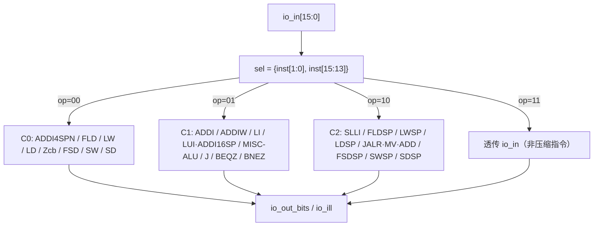

# RVCExpander —— RVC 压缩指令展开器（16 位 → 32 位）

| | |
|---|---|
| 手写 SV | `rtl/frontend/RVCExpander.sv`（`xs_RVCExpander_core`）+ `rtl/frontend/rvc_expander_pkg.sv` + `rtl/frontend/RVCExpander_wrapper.sv` |
| golden 来源 | `golden/chisel-rtl/RVCExpander.sv`（rocket-chip `RVCDecoder`，RV64GC + Zcb） |
| 验证状态 | UT ✅（穷举低 16 位 × fsIsOff + 20 万随机，共 331072 拍 0 错）/ FM ✅（SUCCEEDED，33/33 等价） |

## 1. 背景：为什么需要 RVC 展开

RISC-V 的 **C 扩展**（Compressed）把高频指令压缩成 16 位编码，以提升代码密度
（典型可省 25%~30% 代码体积）。但后端译码器只想面对**一种**统一的 32 位格式。
于是在取指级（IFU 译码前）放一个**纯组合**的展开器：把 16 位 RVC 指令"还原"成
功能等价的 32 位标准指令，再交给后端。这个模块就是 `RVCExpander`。

它是无状态的组合逻辑——给定 16 位输入（外加一个浮点状态位），直接产出 32 位结果
与一个"非法"标志，没有任何时序/寄存器。

## 2. 接口

| 端口 | 方向 | 位宽 | 含义 |
|------|------|------|------|
| `io_in` | in | 32 | 取指拿到的指令。低 16 位是待展开的 RVC；若本来就是 32 位指令（`io_in[1:0]==2'b11`）则高 16 位也有效，原样透传 |
| `io_fsIsOff` | in | 1 | 浮点单元状态关闭（`mstatus.FS==Off`）。此时浮点 load/store 类 RVC 视为非法 |
| `io_out_bits` | out | 32 | 展开后的 32 位标准指令 |
| `io_ill` | out | 1 | 该 RVC 是否非法（保留编码 / FS 关时的浮点 / 寄存器约束违例等） |

## 3. RVC 编码结构：象限（quadrant）与 funct3

RVC 用最低 2 位 `inst[1:0]`（称 **op** / quadrant）区分压缩象限，`inst[1:0]==2'b11`
表示**非压缩**（本就是 32 位）：

| op (`inst[1:0]`) | 象限 | 主要内容 |
|---|---|---|
| `00` | **C0** | 受限寄存器（x8..x15）的 load/store + ADDI4SPN |
| `01` | **C1** | 立即数运算、控制流（J/BEQZ/BNEZ）、LUI/ADDI16SP |
| `10` | **C2** | 栈相对 load/store、SLLI、JR/JALR/MV/ADD/EBREAK |
| `11` | —  | 非压缩指令，原样透传 |

每个象限内再用 `funct3 = inst[15:13]` 细分。因此本设计用
**`sel = {op[1:0], funct3[2:0]}`** 这 5 位作为一级选择子（共 32 项，对应
`rvc_expander_pkg::rvc_sel_e` 枚举），一个 `case` 分派到各指令类。



## 4. 各指令类映射表

下表给出 `sel`（=`{op,funct3}`）、对应 RVC 指令、展开成的 32 位标准指令。
受限寄存器写法：`rs1'/rd' = {2'b01, inst[9:7]}`（=x8..x15），`rs2'/rd'' = {2'b01, inst[4:2]}`。

### C0（op=00）

| sel | RVC | 展开为 | 备注 |
|---|---|---|---|
| 0x00 | C.ADDI4SPN | `addi rd', sp, imm` | imm 为 sp 相对无符号字节偏移；imm 全 0 是保留→opcode 退化为非法 |
| 0x01 | C.FLD | `fld rd', off(rs1')` | FS 关→非法 |
| 0x02 | C.LW | `lw rd', off(rs1')` | |
| 0x03 | C.LD | `ld rd', off(rs1')` | |
| 0x04 | Zcb 窄访存 | `lbu/lh/lhu/sb/sh` | 由 `inst[11:10]` 细分；`inst[6]` 区分 LH/LHU |
| 0x05 | C.FSD | `fsd rs2', off(rs1')` | FS 关→非法 |
| 0x06 | C.SW | `sw rs2', off(rs1')` | |
| 0x07 | C.SD | `sd rs2', off(rs1')` | |

### C1（op=01）

| sel | RVC | 展开为 | 备注 |
|---|---|---|---|
| 0x08 | C.ADDI / C.NOP | `addi rd, rd, imm6` | rd==0（NOP/hint）→直接给 `0x13`（标准 nop） |
| 0x09 | C.ADDIW | `addiw rd, rd, imm6` | rd==0 保留→opcode 退化为非法 |
| 0x0A | C.LI | `addi rd, x0, imm6` | |
| 0x0B | C.LUI / C.ADDI16SP | `lui rd, imm` 或 `addi sp, sp, imm16` | rd==2→ADDI16SP，否则 LUI；imm6 全 0 保留（LUI→opcode 0x3F，ADDI16SP→非法）；另有 rd==1&imm==0 特例直接给 nop |
| 0x0C | MISC-ALU | `srli/srai/andi`(I 型) 或 `sub/xor/or/and/subw/addw`(R 型) 或 Zbb 单操作数组 | 见 §5 |
| 0x0D | C.J | `jal x0, off` | 11 位符号偏移 ×2 |
| 0x0E | C.BEQZ | `beq rs1', x0, off` | 8 位符号偏移 ×2 |
| 0x0F | C.BNEZ | `bne rs1', x0, off` | |

### C2（op=10）

| sel | RVC | 展开为 | 备注 |
|---|---|---|---|
| 0x10 | C.SLLI | `slli rd, rd, shamt6` | |
| 0x11 | C.FLDSP | `fld rd, off(sp)` | FS 关→非法 |
| 0x12 | C.LWSP | `lw rd, off(sp)` | rd==0 保留→opcode 退化为非法 |
| 0x13 | C.LDSP | `ld rd, off(sp)` | rd==0 保留→opcode 退化为非法 |
| 0x14 | C.JR/JALR/MV/ADD/EBREAK | 见 §6 | 由 `inst[12]`、rs2、rd 细分 |
| 0x15 | C.FSDSP | `fsd rs2, off(sp)` | FS 关→非法 |
| 0x16 | C.SWSP | `sw rs2, off(sp)` | |
| 0x17 | C.SDSP | `sd rs2, off(sp)` | |

> 注意：栈相对 **load**（LWSP/LDSP/FLDSP）与 **store**（SWSP/SDSP/FSDSP）的偏移
> 取自指令里**不同的位域**——load 的偏移在 `inst[12]/[6:2]`，store 的偏移在
> `inst[12]/[11:7]`（因为 store 的 `inst[6:2]` 要用作 rs2）。这是手写时最易写错的点，
> 代码里以 `imm_lwsp/imm_ldsp` 与 `imm_swsp/imm_sdsp` 分别命名注释。

## 5. MISC-ALU（sel=0x0C）子译码

`inst[11:10]` 选大类：

| inst[11:10] | 类别 | 展开 |
|---|---|---|
| 00 | C.SRLI | `srli rs1', rs1', shamt6`（I 型移位，funct7=0） |
| 01 | C.SRAI | `srai rs1', rs1', shamt6`（I 型移位，imm[10]=1→算术右移） |
| 10 | C.ANDI | `andi rs1', rs1', imm6` |
| 11 | R 型 / Zbb 单操作数组 | 见下 |

`inst[11:10]==11` 时再由 `idx = {inst[12], inst[6:5]}` 选：

| idx | 指令 | opcode | 说明 |
|---|---|---|---|
| 0 | C.SUB | OP | `sub rs1', rs1', rs2'` |
| 1 | C.XOR | OP | |
| 2 | C.OR  | OP | |
| 3 | C.AND | OP | |
| 4 | C.SUBW | OP32 | RV64 *W |
| 5 | C.ADDW | OP32 | |
| 6 | 保留 | OP | R 型形态保留项 |
| 7 | **Zbb 单操作数组** | — | 由 `inst[4:2]` 再选 ZEXT.B / SEXT.B / ZEXT.H / SEXT.H / ZEXT.W / NOT（6,7 保留→展开成 0） |

R 型的寄存器约定：`rd=rs1=rs1'`（x8+inst[9:7]），`rs2=rs2'`（x8+inst[4:2]）。

## 6. C.JR/JALR/MV/ADD/EBREAK（sel=0x14）

由 `inst[12]`、rs2(`inst[6:2]`)、rd(`inst[11:7]`) 三者细分：

| inst[12] | rs2 | rd | RVC | 展开为 |
|---|---|---|---|---|
| 0 | ≠0 | — | C.MV | `addi rd, rs2, 0`（注意 golden 用 ADDI 形而非 `add rd,x0,rs2`） |
| 0 | 0 | ≠0 | C.JR | `jalr x0, 0(rd)` |
| 0 | 0 | 0 | 保留 | opcode 退化为非法 |
| 1 | ≠0 | — | C.ADD | `add rd, rd, rs2` |
| 1 | 0 | ≠0 | C.JALR | `jalr ra, 0(rd)` |
| 1 | 0 | 0 | C.EBREAK | `0x00100073` |

## 7. 非法判定 io_ill

`io_ill` 按 `sel` 逐类给出，与 golden 取反结构等价。几条规律：

- **恒合法**：op=11（透传）、C2 的 SWSP/SDSP/FSDSP（idx 0x16/0x17/0x15 中 0x16/0x17）以及绝大多数算术/分支类。
- **浮点类**（FLD/FSD/FLDSP/FSDSP，sel=0x01/0x05/0x11/0x15）：`io_fsIsOff` 为真即非法。
- **寄存器约束**：栈相对 load `rd==0`（LWSP/LDSP）、ADDIW `rd==0`、ADDI4SPN 立即数全 0、
  C.JR `inst[12:2]==0`、LUI/ADDI16SP 立即数全 0 等保留编码→非法。
- **保留组合**：Zcb（sel=0x04）`inst[12] | (inst[11]&inst[10]&inst[6])`；
  MISC-ALU 的 Zbb 保留项 `(&inst[12:10]) & (&inst[6:3])`。

非法时，输出指令的 opcode 通常已被设成 `7'h1F`/`7'h3F` 等"注定触发非法指令异常"的编码，
`io_ill` 再单独把这一信息显式标出，供后端处理。

## 8. 实现要点（可读重写）

- **结构**：用 `rvc_sel_e` 枚举 + `case` 一级分派；复杂分支（MISC-ALU / JALR-MV /
  Zcb / LUI-ADDI16SP）抽成**纯函数**，函数内用 RISC-V 标准格式组装器
  `rv_r/rv_i/rv_s/rv_b/rv_u/rv_j`（见 `rvc_expander_pkg`）按各域语义拼指令，
  取代 golden 的裸位拼接。
- **立即数**：每个指令类的 RVC 立即数按规范的位排布拼成标准格式立即数，命名+注释
  说明物理含义（字节/字/双字偏移、是否符号扩展）。
- **纯函数纪律**：所有子函数仅依赖入参 `inst`，不读非局部信号——满足 Formality
  对 function 的纯性要求（否则报 FMR_VLOG-091，导致 impl 读入失败）。
- **wrapper**：`RVCExpander`（golden 同名）是机械直通包装，仅供 FM/ST 对接；UT 直接
  双例化 golden `RVCExpander` 与可读核 `xs_RVCExpander_core` 比对。

## 9. 验证

- **UT**（`verif/ut/RVCExpander/`）：纯组合输入空间小，做近乎穷举——
  穷举低 16 位（0..65535）× `fsIsOff∈{0,1}`、高 16 位随机（覆盖透传路径），
  再补 20 万纯随机 32 位向量。逐拍比对 `io_out_bits` 与 `io_ill`。
  结果：**checks=331072, errors=0, TEST PASSED**。
- **FM**（`make fm`）：可读核 + wrapper 对 golden `RVCExpander` 做签名/名字等价。
  结果：**33 个 compare point 全部 equivalent，0 unmatched，Verification SUCCEEDED**。

复跑：

```bash
cd verif/ut/RVCExpander
make compile && make run    # 期望 TEST PASSED
make fm                     # 期望 FM_RESULT: Verification SUCCEEDED
```
