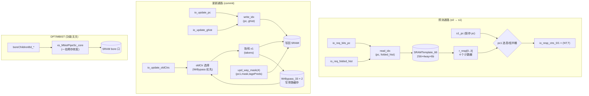

# SCTable —— SC（Statistical Corrector，统计校正预测器）的一张计数表

> 对应 Chisel：`xiangshan.frontend.SCTable`（`SC.scala`）
> 可读重写：`rtl/frontend/SCTable.sv`（核 `xs_SCTable_core` + DFT 流水 `xs_MbistPipeSc_core`）
> 包装层：`rtl/frontend/SCTable_wrapper.sv`（golden 同名 `SCTable/_1/_2/_3`）

---

## 1. SC 在 TAGE-SC 中的角色

香山的主方向预测器是 **TAGE-SC-L**。其中：

- **TAGE**：多张带 tag 的预测表，用饱和计数器给出分支「方向 + 置信度」。它对大多数分支
  很准，但对某些**弱偏置 / 受长历史影响**的分支会偶尔过度自信地给错方向。
- **SC（本模块所属）**：一组**无 tag**、用**带符号饱和计数器**累加统计量的表，对 TAGE 的
  方向做**置信校正**。SC 顶层把若干张 SCTable 在命中行读出的计数器**按权重求和**，与一个
  自适应阈值比较；若总和足够强地**反对** TAGE 的方向，就**翻转**最终预测。

一张 `SCTable` 的职责很轻量，只负责「按 (PC, 历史) 存取一组计数器」：

```
预测 (s0→s1)：  (PC, 折叠历史) ── 索引 ──▶ 读出该行 4 个 6-bit 计数器
                                          └─ 按 pc[1] 选出本块这 2 条分支用的桶 → io_resp_ctrs

更新 (commit)： (PC, 全局历史) ── 索引 ──▶ 对被更新分支对应的那个计数器做带符号饱和 ±1
                                          （新值写回 SRAM，并存入 WrBypass 供下次旁路）
```

SC 学的是**条件统计量**：「在 TAGE 给出某方向的前提下，真实方向偏向哪边」。

---

## 2. 表结构：一行 4 个计数器，按 (分支位置, TAGE 方向) 编址

一张 SCTable 存在一个 **双口 SRAM**（`SRAMTemplate_66`：256 行 × 4 way × 6 bit）里。
**一行 = 4 个 6-bit 计数器**，4 个 way 的语义是 `{分支在块内高/低半, TAGE 当时的方向}`：

| way | 含义 | 符号常量 |
|-----|------|----------|
| way0 | 低半分支(pc[1]=0), TAGE = not-taken | `W_LO_NT` |
| way1 | 低半分支(pc[1]=0), TAGE = taken     | `W_LO_T`  |
| way2 | 高半分支(pc[1]=1), TAGE = not-taken | `W_HI_NT` |
| way3 | 高半分支(pc[1]=1), TAGE = taken     | `W_HI_T`  |

- **为什么按 TAGE 方向分桶**：SC 要为 TAGE 的两种判断各留一个计数器，才能学到条件统计量。
- **为什么按高/低半分桶**：一个取指块最多含 2 条条件分支（`pc[1]=0/1` 两个 2 字节槽），
  两条分支各自独立统计。预测时一次读出全部 4 个，s1 再用 `pc[1]` 选出本块这 2 条用的桶。

### 计数器编码：6-bit 带符号饱和

计数器是补码风格的有符号数，范围 `[0x20(最负) .. 0x1F(最正)]`：

- `taken` → +1（推向更正），封顶在 `0x1F`；
- `not-taken` → −1（推向更负），封底在 `0x20`。

最高位（bit5）即「方向倾向」，绝对值即「置信强度」，正好供 SC 顶层加权求和。

---

## 3. 索引：读用折叠历史快照，写现场折叠重算（4 个变体的差异所在）

行地址（8 bit → 256 行）由 PC 低位与**折叠后的全局历史**异或得到。SC 有 4 张表，使用
不同长度的历史与折叠方式，firtool 据此单态化出 `SCTable/_1/_2/_3`。本核用参数
`IDX_SCHEME` 选择，逻辑其余部分完全共享：

| 变体 | IDX_SCHEME | 读 setIdx | 写 setIdx | MBIST array |
|------|-----------|-----------|-----------|-------------|
| `SCTable`   | 0 | `pc[8:1]`（无历史） | `pc[8:1]` | 0x42 |
| `SCTable_1` | 1 | `{pc[8:5], pc[4:1] ^ fh[3:0]}` | `{pc[8:5], pc[4:1] ^ ghist[3:0]}` | 0x43 |
| `SCTable_2` | 2 | `pc[8:1] ^ fh[7:0]` | `pc[8:1] ^ {ghist[7:2], ghist[1:0]^ghist[9:8]}` | 0x44 |
| `SCTable_3` | 3 | `pc[8:1] ^ fh[7:0]` | `pc[8:1] ^ ghist[7:0] ^ ghist[15:8]` | 0x45 |

- **读侧**直接用预测流水送来的**折叠历史快照** `io_req_folded_hist`（已在上游折好）。
- **更新侧**拿不到当初的折叠快照，故用 `io_update_ghist`（原始全局历史）**现场按同样规则
  折叠**。变体 2/3 的折叠长度（11/16）大于 8，所以折叠时有「分段异或」把多位压成 8 位
  （变体 2 还有一处 `ghist[1:0]^ghist[9:8]` 的自异或对折）。

---

## 4. 更新规则与写旁路 WrBypass

### 更新数据流

```
io_update_pc[1] ─┐
io_update_mask_* ┼─▶ way 掩码(4) ── 选中本次要写的那个计数器
io_update_tagePreds_* ┘

oldCtr ── 取旧计数器：优先 WrBypass 命中值，未命中退回 io_update_oldCtrs
            │
            ▼
        饱和 ±1（按 io_update_takens_*）
            │
            ├──▶ 写回 SRAM（同半区两 way 写同值，由 way 掩码选其一）
            └──▶ 存入 WrBypass（下次同行更新可旁路）
```

两条逻辑分支（`io_*_0` / `io_*_1`）的**物理半区**由 `pc[1]` 决定：分支 0 落在 `pc[1]`
指示的半区，分支 1 落在相反半区。再叠加各自 TAGE 方向选 NT/T 桶，得到 4-bit `upd_way_mask`。

### WrBypass：消除「连续更新同一行」的写后读冒险

计数表存在 SRAM 里，**写入要下一拍才能读回**。SC 对同一 PC 行可能连续 commit，若每次都读
`io_update_oldCtrs`（来自更早的预测快照）会**丢掉刚写进去的增量**。故为每条逻辑分支配一个
**WrBypass**（`WrBypass_33`：16 项 × 2 way × 6 bit 的小缓存），暂存最近写过的行的新计数值：

- 取 `oldCtr` 时：若 WrBypass **命中该行且选中桶 valid**，用旁路值；否则退回 `io_update_oldCtrs`。
- 写 SRAM 的同时把新值写入 WrBypass。

实例 0 缓存逻辑分支 0 写的行，实例 1 缓存逻辑分支 1。每个实例的两 way 对应该分支落点半区
的 (NT 桶, T 桶)。

> **重写关键点（也是 UT 抓到的一个真实 bug）**：旧计数器的「旁路 vs 退回」选择最初写成了
> 一个**读非局部 `wrbp_*` 数组的 function**，在仿真里出现求值顺序/X 解析问题，导致即使
> WrBypass 未命中也错误地取到了旁路桶的旧值。改写成与 golden 同构的**纯组合 wire 表达式**
> 后 UT 全过（也更利于 FM 签名分析、规避 FMR_VLOG-091）。

---

## 5. 数据流总览（mermaid）



---

## 6. 接口（golden 扁平端口，4 变体共享，差异见 §3）

| 端口 | 方向 | 位宽 | 含义 |
|------|------|------|------|
| `io_req_valid` | in | 1 | 预测请求有效（驱动 SRAM 读 + 锁存 s1_pc） |
| `io_req_bits_pc` | in | 50 | 取指 PC |
| `io_req_bits_folded_hist_*` | in | 4/8 | 读侧折叠历史（仅 _1/_2/_3） |
| `io_resp_ctrs_0_0/0_1` | out | 6 | 逻辑分支 0 的 (NT 桶, T 桶) 计数器 |
| `io_resp_ctrs_1_0/1_1` | out | 6 | 逻辑分支 1 的 (NT 桶, T 桶) 计数器 |
| `io_update_pc` | in | 50 | 更新 PC |
| `io_update_ghist` | in | 256 | 更新侧原始全局历史（仅 _1/_2/_3，现场折叠） |
| `io_update_mask_0/1` | in | 1 | 两条逻辑分支各自是否更新 |
| `io_update_oldCtrs_0/1` | in | 6 | 预测时快照的旧计数器（WrBypass 未命中时用） |
| `io_update_tagePreds_0/1` | in | 1 | 该分支 TAGE 当时的方向（选 way） |
| `io_update_takens_0/1` | in | 1 | 该分支本次真实方向（饱和增减） |
| `boreChildrenBd_bore_*` | in/out | — | MBIST 旁路总线（DFT，功能无关） |
| `sigFromSrams_bore_*` | in | 1 | SRAM DFT 时钟控制（透传 SRAM 黑盒） |

子模块（均为已各自验证通过的可信件，本核直接例化）：
- `SRAMTemplate_66`：双口计数表 SRAM（`rtl/common/SRAMTemplate_2p_variants.sv`）。
- `WrBypass_33` × 2：写旁路（`rtl/frontend/WrBypass_variants.sv`）。
- `xs_MbistPipeSc_core`：MBIST 流水寄存（本文件内，4 变体仅差 array ID 常量 → 参数化）。

---

## 7. 验证结果

### UT（VCS，golden vs 可读重写双例化，逐拍比对全部输出）

- 4 个变体各双例化 golden 与 `_xs`，灌同一套随机激励 60000 拍。
- 激励覆盖：随机 PC/历史/oldCtrs（偏向饱和边界）/TAGE 方向/真实方向、连续命中同一
  `update_pc`（制造 WrBypass 写后读）、随机 MBIST 通道。
- 读/写互斥以避开 golden SRAM 的「同址读写冲突」运行时断言（真实设计预测与提交不同拍）。

```
=== SCTable UT done: checks=1439976 errors=0 ===
TEST PASSED
```

> **checks = 1,439,976，errors = 0**（每拍比对 24 个输出 × 4 变体）。

### FM（Formality 签名分析等价）

每个变体 ref = golden 变体及其子模块依赖，impl = 可读核 + 包装层 + 重写子模块；
厂商 SRAM 宏 `array_ext` 当黑盒。

| 变体 | 结果 | 配对 compare points |
|------|------|---------------------|
| `SCTable`   | **SUCCEEDED** | 439 by name + 575 by signature |
| `SCTable_1` | **SUCCEEDED** | 439 + 575 |
| `SCTable_2` | **SUCCEEDED** | 439 + 575 |
| `SCTable_3` | **SUCCEEDED** | 439 + 575 |

```
FM_RESULT: Verification SUCCEEDED for SCTable
FM_RESULT: Verification SUCCEEDED for SCTable_1
FM_RESULT: Verification SUCCEEDED for SCTable_2
FM_RESULT: Verification SUCCEEDED for SCTable_3
```

### 复跑

```bash
cd verif/ut/SCTable
make compile && make run     # 期望 TEST PASSED
make fm                      # 每变体期望 FM_RESULT: Verification SUCCEEDED
```
