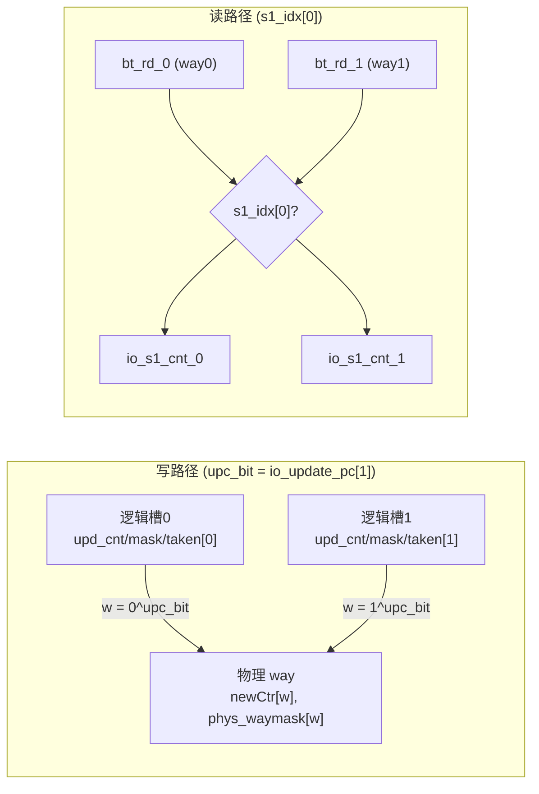

# TageBTable —— TAGE 的基预测器（bimodal base table）

| | |
|---|---|
| 手写 SV | `rtl/frontend/TageBTable.sv`（可读 `TageBTable`，golden 同名即 impl） |
| Scala 来源 | `xiangshan/frontend/Tage.scala`（class TageBTable） |
| 依赖 | [FoldedSRAMTemplate_20](../common/FoldedSRAMTemplate.md)（存储）、WrBypass_32（写旁路，均当黑盒） |
| 验证 | UT ✅ 37804 拍 0 错 / FM ✅ SUCCEEDED |

## 1. 它是什么

TAGE = **1 个基预测器 + N 张标签表**（[TageTable](TageTable.md)）。基预测器就是 TageBTable：
一张按 PC 直接索引的 **2bit 饱和计数器表**，给出"默认方向"。当所有 TageTable 都不命中时，
TAGE 回退用基预测器的方向（altpred）。它是 TAGE 里最简单、最先给出结果的一层。

## 2. 结构

下图为 TageBTable 内部主要子块与数据通路（信号名对应 `TageBTable.sv`）：

```mermaid
flowchart TB
  REQ["io_req_bits(PC)<br/>io_req_valid"] --> RIDX["r_idx = PC[11:1]"]
  RIDX --> SRAM[("FoldedSRAMTemplate_20<br/>bt: 2048×2way×2bit")]
  RIDX -.s1锁存.-> S1IDX["s1_idx"]

  RST["doing_reset / resetRow<br/>(上电逐行写 2'b10)"] --> SRAM
  RST --> RDY["io_req_ready = ~doing_reset"]

  UPD["io_update_*<br/>(pc/cnt/takens/mask)"] --> NEW["按物理way算 newCtr<br/>sat_update(oldCtr,taken)"]
  WB["WrBypass_32<br/>(缓存最近写ctr)"] -->|wb_hit→oldCtr| NEW
  NEW --> WB
  NEW --> SRAM

  SRAM --> RD["bt_rd_0 / bt_rd_1"]
  S1IDX -->|s1_idx[0] 反交织| MUX["按 PC[1] 反映射"]
  RD --> MUX
  MUX --> OUT["io_s1_cnt_0 / io_s1_cnt_1"]
```

图注：基预测器只有一张 2bit 计数器 SRAM；读路径 `r_idx → SRAM → 按 s1_idx[0] 反交织 → s1_cnt`；写路径 `update → newCtr（旧值优先取 WrBypass）→ SRAM`；上电期 `doing_reset` 占用写口逐行清初值并压低 `io_req_ready`。

- **容量**：2048 行 × 2 way × 2bit。一次预测取一行的 2 个计数器，对应一个取指块里 2 个分支槽。
- **索引**：`idx = PC[11:1]`（11 位 = 2048 行）。读延迟 1 拍 → 读索引寄存成 `s1_idx`。
- **2bit 饱和计数**：taken 则 +1（封顶 3），not-taken 则 -1（封底 0），最高位即方向预测。
  上电清零把所有行写成 `2'b10`（弱 taken）作为初值。

## 3. 关键设计点

### 3.1 分支槽 ↔ 物理 way 交织（按 PC[1]）

为减少相邻取指块的别名冲突，**逻辑分支槽**到**物理 way** 的映射随 PC[1] 翻转：

```
物理 way w  ←→  逻辑分支槽 (w ^ pc_bit)        // pc_bit = PC[1]
```

- 读出：`s1_cnt_0 = s1_idx[0] ? rd1 : rd0`，`s1_cnt_1 = s1_idx[0] ? rd0 : rd1`。
- 写入：way `w` 的新计数取自逻辑槽 `w^pc_bit` 的 commit 数据；写掩码 `waymask[w]=update_mask[w^pc_bit]`。

下图展示「逻辑分支槽 ↔ 物理 way」按 `pc_bit=PC[1]` 翻转的交织（左：写路径按 `upc_bit` 入 way；右：读路径按 `s1_idx[0]` 反映射回槽）：



图注：`pc_bit` 为 0 时槽与 way 一一对应，为 1 时两者互换；WrBypass 按**逻辑槽**存取，故 `io_write_data_0/1` 在入旁路前也先经同样的交织（`upc_bit ? newCtr[1] : newCtr[0]`）。

可读实现用一个 `genvar w` 循环统一表达这条交织规则（golden 是手工展开的 Mux/位拼接）。

### 3.2 写旁路 WrBypass

更新与"再读/再更新"可能撞在同一行同一拍（SRAM 1 拍延迟）。WrBypass 缓存最近写入的计数值，
使计算 `newCtr` 时所用的"旧值 oldCtr"优先取旁路里的最新值，否则取 commit 传入的 `update_cnt`。
WrBypass 按**逻辑分支槽**存取，故读写两侧都要经过上面的交织。

## 4. 验证

- **UT**：golden `TageBTable` vs `TageBTable_xs` 双例化，两者共用 golden 子模块
  （FoldedSRAMTemplate_20 / WrBypass_32），故比对的是 TageBTable 层逻辑（索引、交织、
  饱和计数更新、写旁路接线、上电清零）。随机交错预测请求与更新，WARMUP>2048 等清零完成，
  逐拍比对 `io_req_ready / s1_cnt_0/1 / 两套 bore_rdata`。37804 拍 0 错。
- **FM**：子模块靠 `hdlin_unresolved_modules=black_box` 当黑盒，只比 TageBTable 自身逻辑。SUCCEEDED。
- 编译带 `+define+SYNTHESIS` 关掉 golden 内层 `ifndef SYNTHESIS` 的读写同址断言与随机初始化。

> **调试记录**：首版把 `phys_waymask_arr` 误声明为 2bit/元素，拼接后截断导致 way1 写掩码恒 0
> （内存发散）。用层次探针对比 `u_g.bt` vs `u_i.bt` 写口，定位到首处 waymask 差异后修正为 1bit/元素。
