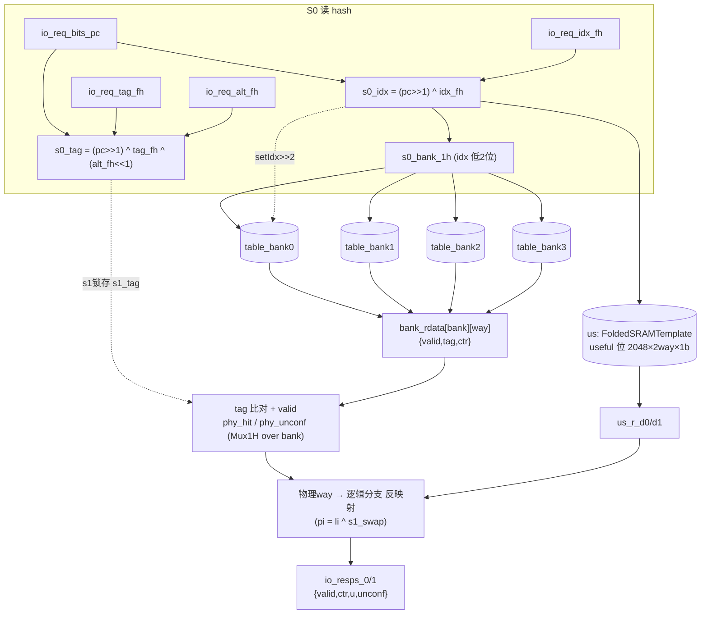
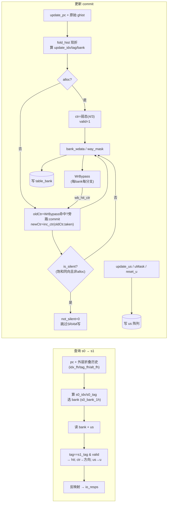

# TageTable —— TAGE 方向预测器的「单条几何历史长度标签表」

| | |
|---|---|
| 手写 SV | `rtl/frontend/TageTable.sv`（可读核 `xs_TageTable_core`）+ `TageTable_wrapper.sv`（4 变体 golden 同名 wrapper） |
| 生成器 | `scripts/gen_tagetable_wrappers.py`（解析 golden 端口自动生成 wrapper/_xs/tb） |
| Scala 来源 | `xiangshan/frontend/Tage.scala`（class TageTable） |
| 依赖 | FoldedSRAMTemplate(us) / FoldedSRAMTemplate_1(×4 bank) / WrBypass（均当已验证黑盒） |
| 验证 | UT ✅ 158416 拍 0 错（4 变体）/ FM ✅ 4 变体全 SUCCEEDED |

## 1. 它是什么

TAGE = **1 个基预测器([TageBTable](TageBTable.md)) + N 张标签表(TageTable)**。本模块是其中*一张*
标签表。N 张表用**几何递增**的全局历史长度（本设计 8/13/32/119 拍）各自索引：历史越长越能
捕捉远距离相关性。预测时所有表并行查询，外层 Tage 选「命中且历史最长」的表作 provider；
都不命中则回退基预测器(altpred)。

## 1.1 内部结构

下图为单张 TageTable 的内部子块与阵列组成（信号名对应 `TageTable.sv` `xs_TageTable_core`）：

图注：一张表 = useful 位阵列 `us` + 4 个条目 bank（按 idx 低 2 位分流，单口省功耗）+ 折叠历史算 idx/tag + 命中比较；条目结构 `{valid,tag,ctr}` 与 `u` 分开存。读出经物理/逻辑 way 反映射后给每条逻辑分支一份响应。

## 2. 一条目存什么

条目 = `{valid, tag(8位), ctr(3位饱和)}`，另存一份 `u`(useful) 位。
- **tag**：pc 与折叠历史异或得到的校验位。命中 = `(读出tag==查询tag) & valid`。
- **ctr**：3 位饱和计数，最高位即方向；中点值 3/4 称 `unconf`（弱置信，新分配条目）。
- **u**：本表命中且预测对、而 altpred 会错时置 1；分配新条目只挑 u=0 空槽；u 周期性老化清零。

## 3. 关键技巧

下图对比查询（s0→s1）与更新（commit）两条数据流，重点是更新路径要现折历史、查 WrBypass、判 silent：

图注：查询直接吃外层算好的折叠历史；更新拿原始 ghist 在核内 `fold_hist` 现折。更新时 `oldCtr` 优先取 WrBypass 最近写值，分配条目直接置弱态 ctr；`is_silent`（饱和后同向且非分配）时静默跳过 SRAM 写以省功耗。useful 位走单独的 `us` 写口（含 `reset_u` 老化）。

### 3.1 折叠历史索引（FoldedHistory）
用「最长 119 拍历史」索引 2048 entry 的表，直接取低位会丢信息。折叠历史把 HIST_LEN 位历史
按目标宽度 L 切 chunk 逐块异或压成 L 位。本模块需三份：`idx_fh`(宽 min(IDX_W,HIST_LEN))、
`tag_fh`(min(HIST_LEN,TAG_LEN))、`alt_fh`(min(HIST_LEN,TAG_LEN-1))。
读路径直接吃外层算好的折叠历史端口；更新路径拿原始全局历史，核内现折。
`idx = (pc>>1 ^ idx_fh)`，`tag = (pc>>1 ^ tag_fh ^ (alt_fh<<1))`。

### 3.2 分 bank + 物理/逻辑 way 重排
逻辑 2048 行 × 2 way，物理按 idx 低 2 位拆 4 bank（各 512 行，单口 SRAM 省功耗）。
两条分支(numBr=2)按 unhashed_idx 低位异或映射到物理 way（读出再反映射回逻辑分支）。

### 3.3 silent update + 写旁路(WrBypass)
更新不会真改 ctr（饱和后同向且非分配）则「静默」不写 SRAM。连续两次更新同行间隔短于
SRAM 写-读延迟，故每 bank 每分支挂一个 WrBypass 缓存最近写的 ctr，更新时优先读旁路最新值。

## 4. 4 变体

4 张表只差全局历史长度 `HIST_LEN`（8/13/32/119），其余完全相同；HIST_LEN 决定三份折叠历史
端口位宽。核参数化 HIST_LEN，wrapper 传不同值并把 golden 的 `folded_hist_hist_N` 按位宽路由到
idx_fh/tag_fh/alt_fh（见 `gen_tagetable_wrappers.py` 的 VARIANTS 表）。

## 5. 验证

- **UT**：golden 4 变体 vs `_xs` 双例化，两侧共用 golden 子模块（Folded SRAM/WrBypass），故比对的是
  TageTable 层逻辑（折叠历史、索引/tag、bank 路由、way 重排、silent update、读响应合成）。
  随机交错 req/update，逐拍比对 io_resps + bore_rdata，158416 拍 0 错。tb 用 `!$isunknown(golden)`
  跳过 golden 未写项的 X 不可达态。
- **FM**：子模块靠 `hdlin_unresolved_modules=black_box` 当黑盒，只比 TageTable 自身逻辑。4 变体 SUCCEEDED。

> **调试记录（3 处真 bug，可读重写易踩）**：
> 1. **VCS `function automatic` + genvar 实参在 generate 连续赋值里被整体判 X**：`lgc_taken(gp)` 等
>    返回值即便实参是编译期常量也变 X → 污染写使能 → SRAM 从不写入（核写 0 次 vs golden 186 次）。
>    修法：删掉这些函数，generate 内直接内联三元（`gp` 为 genvar 字面量、swap 为 1 位信号）。
> 2. **hit/unconf 必须「先逐 bank 算布尔再 Mux1H-OR」**：tag 比对、is_unconf 是非线性运算，
>    「先 Mux1H 合并 entry 再比对」≠「先比对再合并」，FM 在多热/全零 bank 选择下判不等价
>    （ctr/u 是线性取值故 Mux1H 数据仍等价、UT 测不出，FM 抓到）。
> 3. **`array[gp ^ swap]` 用 32 位异或索引 2 元数组**触发 Formality FMR-ELAB-147 致 impl 建模失败；
>    改用 1 位索引（`logic idx = gp[0]^swap`）。
