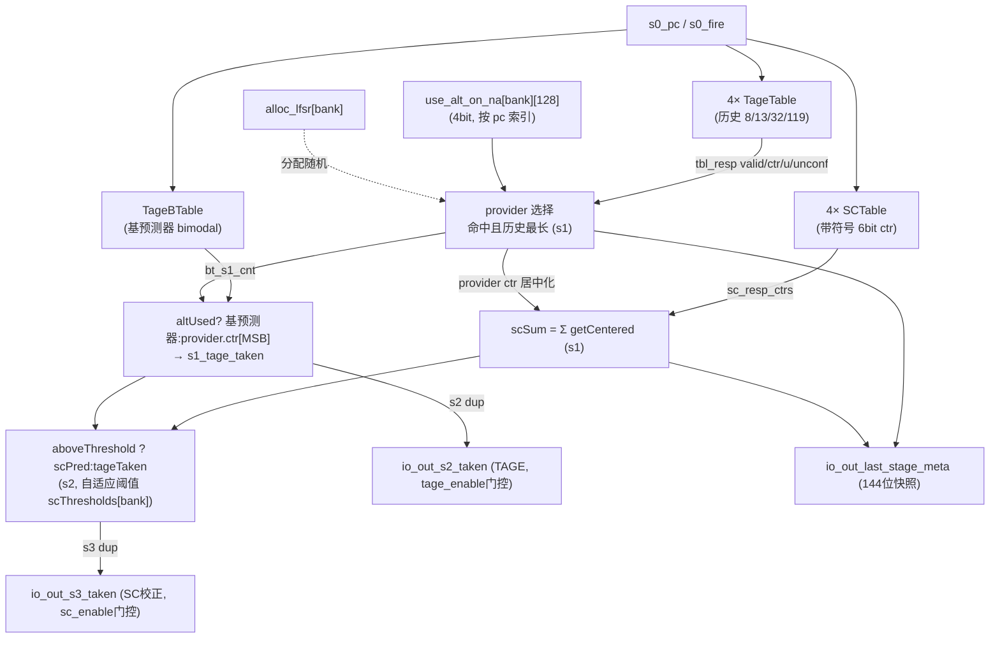
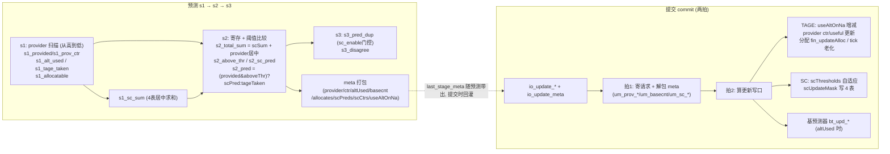
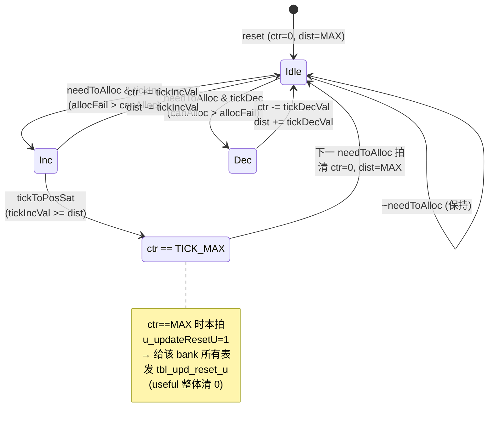

# Tage_SC —— TAGE-SC 分支方向预测器顶层（学习文档）

| | |
|---|---|
| 手写 SV | `rtl/frontend/Tage_SC.sv`（`xs_Tage_SC_core`）+ `rtl/frontend/Tage_SC_wrapper.sv`（golden 同名 `Tage_SC`） |
| Scala 来源 | `src/main/scala/xiangshan/frontend/Tage.scala` / `SC.scala` |
| 子模块（黑盒） | `TageTable_*`（4 张带 tag 的几何历史 TAGE 表，历史长度 **8 / 13 / 32 / 119**，见 `rtl/frontend/Tage_SC.sv:10`）、`TageBTable`（双口基预测器 bimodal）、`SCTable_*`（4 张统计校正表）、`MaxPeriodFibonacciLFSR`（分配随机）等 |
| 验证状态 | UT ✅（每种子 6 万拍随机，seed 1/7/42 全 0 错，`btu_err=0`）/ FM ❌ **FAILED**，部分验证：9249 passing、20 failing（截断上限，全为 `bt_upd_*`，已证假阳性，见 §5）、2852 unverified 未验，以 UT 为权威 |
| 重写标准 | 符合 `docs/REWRITE_STYLE.md`（struct/数组/genvar/纯函数/中文注释，0 生成痕迹：`RANDOMIZE|SYNTHESIS|_GEN_|_T_[0-9]` grep 计数 = 0） |

---

## 1. 角色与三级流水

TAGE-SC 是 BPU 的主方向预测器，对每个取指块的 2 个分支槽（bank 0/1）给出 taken/not-taken：

- **s1**：用折叠历史索引 4 张 `TageTable` + 基预测器 `TageBTable`，扫出 provider（命中里历史最长的表），
  合成 `s1_tageTaken = altUsed ? base_cnt[1] : provider.ctr[MSB]`。同拍读 4 张 `SCTable` 求 scSum。
- **s2**：寄存 provider/base/scSum；做阈值比较（`aboveThreshold`），得 `s2_pred = (provided & 超阈值) ? SC方向 : TAGE方向`。
- **s3**：按 `io_s2_fire[d]` 逐 dup 寄存 `s2_pred` 输出 `io_out_s3_taken`；`sc_enable` 门控。

`s2_taken`/`s3_taken` 各有 4 份 dup，分别由各自的 `io_s1_fire[d]` / `io_s2_fire[d]` 使能寄存。

下图为 Tage_SC 顶层组成（子表为黑盒，本核做表间组合；信号名对应 `Tage_SC.sv`）：



图注：4 张 TageTable 出 provider、基预测器 TageBTable 出 altpred、4 张 SCTable 出统计校正和；本核串起 `provider 选择 → TAGE 方向 → SC 求和 → 阈值校正` 三步，并把预测快照打进 meta 供提交侧更新。

---

## 2. 核心机制（预测 + 更新）

> 下面按数据流补全 TAGE-SC 的核心算法，RTL 依据见 `rtl/frontend/Tage_SC.sv` 文件头注释
> （§预测 / §更新）及对应行号。

下图把预测三级流水（s1→s2→s3）与提交更新两拍并排，箭头对应主要中间信号：



图注：左半为预测路径（provider 选择 → SC 求和 → 阈值校正 → 三级 dup 输出），右半为提交路径（解包 meta → 更新 useAltOnNa/provider/分配/tick/阈值/SC 表/基预测器）。两者通过 `last_stage_meta` 把预测时刻的快照带到提交时刻闭环。

### 2.1 provider / altpred 选择与 useAltOnNa
- **provider**：命中（tag 匹配）的 TAGE 表里**历史最长**者（序号最大）。本核从高序号往低扫描，
  golden 用 reverse PriorityMux（line ~216）。
- **unconf（弱置信）**：provider 的 `ctr` 处于中点（3 或 4，3bit 计数器），表示新分配、尚未稳定的条目。
- **useAltOnNa**：一张按 pc 索引的计数表 `use_alt_on_na[bank][128]`（4bit，初值中点 8）。其最高位决定
  「provider 弱置信时是否改用 altpred（基预测器方向）」。提交侧在 provider 弱置信、且 altpred 与
  provider 方向不同时，按猜对/猜错饱和增减该计数（`rtl/frontend/Tage_SC.sv:207~211`）。
- **altUsed** = 无 provider，或（provider 弱置信 且 useAltOnNa 决策位=1）。
  `tageTaken = altUsed ? 基预测器方向 : provider.ctr[MSB]`。

### 2.2 SC 求和与自适应阈值 scThresholds
- s1 各 SCTable 给 ctr，s2 加上 provider 的「居中化」ctr 得 `totalSum`，`scPred = totalSum >= 0`。
- **aboveThreshold**：`|totalSum 偏移量|` 是否超过自适应阈值 `scThresholds[bank]`。
  `scThresholds` 每 bank 一份：`ctr`（5bit，初值 neutral=16）+ `thres`（8bit，初值 6），
  useThreshold 值域 6..31（`rtl/frontend/Tage_SC.sv:332`，初值见 line 856 `8'd6`）。
- **最终方向**：`s2_pred = (有 provider 且超阈值) ? scPred : tageTaken`——SC 仅在足够置信时才翻转 TAGE。
- **阈值自适应更新**（提交侧）：当 `scPred != tagePred` 且 `|totalSum|` 落在 `[thres-4, thres-2]`
  窗口内时触发 `scThresholds.update`（`rtl/frontend/Tage_SC.sv:793,836-837`）；写 SC 表条件为
  `scPred != taken` 或 `~sumAboveThreshold`（line 794,838）。

### 2.3 分配（allocate）与 tick 老化

`bankTickCtrs` 的老化是一个饱和计数状态机（每 bank 一份，仅在 `needToAlloc` 拍推进，RTL `Tage_SC.sv:887~921`）：



图注：分配失败多于成功（`allocFail > canAlloc`）则 tick 增、反之减；增到饱和（`ctr==TICK_MAX`）即触发 `reset_u` 把该 bank 各表 useful 位整体老化清零，随后复位计数器。这是防止表项长期占位无法回收的机制。

- **allocatableSlots**：命中失败、`useful=0`、且历史比 provider 更长的表的 one-hot 集合（line ~229）；
  用 `MaxPeriodFibonacciLFSR` 随机从中选一张分配新条目。
- **tick 老化**：mispred 时按 tick 计数器（`bankTickCtrs` / `bankTickCtrDistanceToTops`）节奏择机分配；
  当 tick 饱和（`TICK_MAX`）时给该 bank 所有表发 `tbl_upd_reset_u`（`rtl/frontend/Tage_SC.sv:45-46,127`），
  把 useful 位整体清 0（防止表项长期占位无法回收）。

### 2.4 last-stage meta 位域打包（144 位）
预测时把当年的 provider/ctr/altUsed/basecnt/allocates/scPreds/scCtrs/useAltOnNa 快照打包进
`io_out_last_stage_meta`，提交时原样解包用于更新。位域布局（`rtl/frontend/Tage_SC.sv:499-526`）：

| 位 | 字段 |
|----|------|
| `[143]/[140]` | provider valid（bank1/bank0）|
| `[142:141]/[139:138]` | provider 表序号（bank1/0）|
| `[137:135]/[133:131]` | provider ctr（bank1/0）|
| `[134]/[130]` | provider useful（bank1/0）|
| `[129]/[128]` | altUsed（bank1/0）|
| `[127:126]/[125:124]` | basecnt（bank1/0）|
| `[123:120]/[119:116]` | allocate one-hot（bank1/0）|
| `[115]/[114]` | scPred（bank1/0）|
| `[113:66]` | scCtrs（bank1 表3..0、bank0 表3..0，各 6bit）|
| `[65:2]` | 预测时刻 cycle（perf/调试）|
| `[1]/[0]` | useAltOnNa 决策位（bank1/0）|

---

## 3. 关键修复 —— 选桶必须用三元 mux，不能用变量下标取数组

### 现象
seed 7 在 cycle ≈14920（time 149204000）偶发：`io_out_s3_full_pred_*_br_taken_mask_1 g=1 i=x`，
四个 dup 同时 X，UT 报 10 个真错；seed 1 偶然不触发。

### 根因（X 链与 golden 的语义差）
- s2 的「选择桶」`s2_choose = s2_tageTaken(dup3)`。在 `TageBTable` 上电 `doing_reset` 窗口（约前 2048 拍）
  逐行清 SRAM，未清行读出 `bt_s1_cnt` 为 **X**；当某拍 `prov=0 / altUsed=1` 时
  `s1_tageTaken[1] = bt_s1_cnt[1][1] = X`，被某 dup 的 `io_s1_fire` 捕进 `s2_tageTaken_dup[3][1]`，
  该 dup 此后久不再 fire → X 一直保留到 cycle14920 才被选出。**golden 同样把这个 X 寄进了
  `s2_tageTakens_dup_3_1`（实测 `dup3tk1 g=x i=x`，两边都是 X）。**
- 真正的分歧在「拿 choose 选桶」这一步：
  - 错误写法（本核原代码）：`s2_above_thr[b][s2_choose[b]]` / `s2_sc_pred[b][s2_choose[b]]` —— 用
    **变量下标取数组**。SystemVerilog 里 `array[X]` **恒为 X**，即使两个桶取值完全相同。
  - golden 写法：`s2_choose ? bucket1 : bucket0` 三元 mux。SV 的 X-optimism 规定 `(X ? a : b)` 在
    `a===b` 时**收敛为定值**。所以当两桶相等（这里都对应同一个定值方向）时 golden 得到 `1`，而本核得到 `X`。

即：bug 不是 X 的来源（X 来源与 golden 一致、不可避免），而是**消费 X 的方式**与 golden 不等价。

### 改动（`rtl/frontend/Tage_SC.sv`）
把 s2_pred / disagree 以及 meta 的 scPreds/scCtrs 选桶，全部从「array[choose]」改成三元 mux：

```systemverilog
// s2_pred 路径
sel_choose    = s2_tage_taken_dup[3][b];
sel_above_thr = sel_choose ? s2_above_thr[b][1] : s2_above_thr[b][0];
sel_sc_pred   = sel_choose ? s2_sc_pred[b][1]   : s2_sc_pred[b][0];
s2_pred[b]    = (s2_provided[b] & sel_above_thr) ? sel_sc_pred : s2_tage_taken_dup[3][b];
s2_disagree[b]= s2_provided[b] & sel_above_thr & (s2_tage_taken_dup[3][b] != sel_sc_pred);

// meta 路径（对应 golden  r_4_* <= s2_tageTakens_dup_3 ? ctrs_1 : ctrs_0）
m_sc_preds[b] <= s2_choose[b] ? s2_sc_pred[b][1] : s2_sc_pred[b][0];
m_sc_ctrs[b][t] <= s2_choose[b] ? s2_sc_resps[b][t][1] : s2_sc_resps[b][t][0];
```

对照 golden 依据：`s2_pred(_1)`（line 1772/1774）、`_GEN_81/82/94/95`（阈值/SC 方向三元）、
`r_4_0 <= s2_tageTakens_dup_3_0 ? ...ctrs_0_1 : ...ctrs_0_0`（line 2068）、
`resp_meta_scMeta_scPreds_*_r <= _GEN_82/_GEN_95`（line 2067/2075）。

逻辑功能在 choose 为定值时**完全不变**；仅在 choose=X 且两桶相等时与 golden 一致地收敛为定值。

---

## 4. UT 结果

| seed | checks | errors | btu_err |
|---|---|---|---|
| 1 | 60000 | 0 | 0 |
| 7 | 60000 | 0 | 0 |
| 42 | 60000 | 0 | 0 |

`make run`（seed 1）`=== UT PASSED ===`。

---

## 5. FM 结果与 `bt_upd_*` 假阳性说明

`make fm` 的 ref/impl 顶层等价比对**末次 verify 结论为 Verification FAILED**：
**9249 passing / 20 failing / 2852 unverified**。已报告的 **20 个 failing compare points
全部是 `u_core/bt_upd_*` 寄存器**（`bt_upd_mask[1]`、`bt_upd_pc[*]`、`bt_upd_cnt[*]`）。
注意 **20 是 Formality 默认 `verification_failing_point_limit=20` 的截断上限**——verify
攒满 20 个失配即提前中止，"全部是 bt_upd_*"只对已判的这 20 点成立，另有 2852 个
unverified 点未验。

这些是**已证假阳性**：FM 比的是「送进黑盒 `TageBTable` 更新口的寄存器位」，而 golden 把
`pc/cnt` **无条件**寄存、本核在 `mask=0` 时不写这些位，于是寄存器值在 `mask=0` 的拍上不同——
但 `mask=0` 时 `TageBTable` 根本不写 SRAM，这些位是 don't-care，**在所有可达态下对功能等价**。

为佐证，tb 末尾加了 `btu_err` 自检（逐拍比两个 `bt` 实例的更新口）：
**mask 恒比；任一 bank mask=1 时 pc 恒比；该 bank mask=1 时其 cnt/takens 恒比**。
三种子运行 `btu_err=0`，证明真正进基预测器 SRAM 的更新行为完全等价。结论：**UT（多种子
逐拍 0 错 + `btu_err=0` 自检）为权威；FM 为部分验证**——9249 passing，已报告的 20 个
`bt_upd_*` failing 为编码差异导致的假阳性（**不为其改逻辑**），2852 unverified 未覆盖。

> 复现自检：`cd verif/ut/Tage_SC && make simv && ./simv +ntb_random_seed=7`，看输出 `btu_err=0`。
