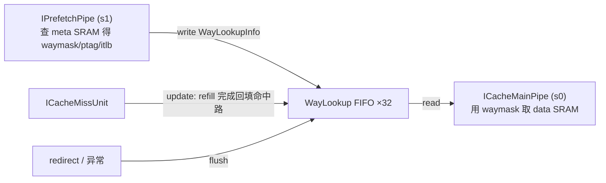

# WayLookup —— ICache way 查询结果缓冲（学习文档）

| | |
|---|---|
| 手写 SV | `rtl/frontend/WayLookup.sv`（`xs_WayLookup` + `xs_waylookup_pkg`）+ `rtl/frontend/WayLookup_wrapper.sv` |
| Scala 来源 | `src/main/scala/xiangshan/frontend/icache/WayLookup.scala` |
| 验证状态 | UT ✅（60000 拍随机，checks=60000 / errors=0）/ FM ✅（SUCCEEDED，3633 passing，0 failing，0 unmatched） |
| 重写标准 | 符合 `docs/REWRITE_STYLE.md`（struct/数组/enum 风格、注释讲"为什么"、无生成痕迹） |

## 1. 它在前端的位置

WayLookup 是 **IPrefetch 与 MainPipe 之间的解耦 FIFO**。IPrefetch 在 s1 级查完 ICache
meta SRAM，知道「这次取指跨的两条 cacheline 各命中哪一路」，把这份 way 查询结果压入
WayLookup；MainPipe 较晚才来取，用 waymask 直接定位 data SRAM 的路，省去重复查 meta。
两条流水节奏不同（IPrefetch 常领先），深 32 的 FIFO 吸收这段错拍。

## 2. 数据结构（见 `xs_waylookup_pkg`）

一次取指跨 `PortNumber=2` 条 cacheline，故每个 FIFO entry 含 2 个端口：

| 字段（每端口） | 宽 | 含义 |
|------|----|------|
| `vSetIdx` | 8 | 虚拟组索引 |
| `waymask` | 4 | 命中路 one-hot（**全 0 = miss**） |
| `ptag` | 36 | 物理 tag |
| `itlb_exception` | 2 | iTLB 例外类型（gpf=2） |
| `itlb_pbmt` | 2 | 页内存属性 |
| `meta_codes` | 1 | meta ECC（命中路 ptag 的奇偶校验 `^ptag`） |

用 `way_lookup_port_t` / `way_lookup_entry_t`（`port[2]` 数组）/ `way_lookup_gpf_t` 三个
`struct packed` 表达，取代 golden 的 384 个展平标量（`entries_17_itlb_pbmt_1` 之类）。

## 3. 三种访问与机制

### write（← IPrefetch，Decoupled）
压入队尾。`write.ready = !full && !gpf_stall`。fire 时整项写入 `entries[writePtr]`，
写指针 +1（绕回翻 flag）。

### read（→ MainPipe，Decoupled）
取队头。`read.valid = !empty || write.valid`。关键优化——**空队列旁路**：
`can_bypass = empty && write.valid` 时，直接把本拍 write 透传到 read（含其 gpf），
省一拍延迟（时序较紧的一条路径）。非旁路时输出 `entries[readPtr]`。

### update（← MissUnit，Valid）
refill 完成一条 cacheline 后，**同时扫描 FIFO 内所有 32×2 个端口**，就地修正命中状态
（`update.valid && !corrupt` 且 `vSetIdx` 相同为前提）：

| 条件 | 动作 | 含义 |
|------|------|------|
| `ptag` 也相同 | `waymask ← update.waymask`；`meta_codes ← ^ptag` | 当初 miss 的 line 现被 refill：**miss→hit** |
| 否则 `update.waymask == 本项 waymask` | `waymask ← 0` | 本项记的命中路被本次 refill 覆盖：**hit→miss** |

> meta_codes 重算用**本项已存的 ptag**（此时与 update 的 ptag 相等）而非 update 的 ptag，
> 是为更好的时序（注释见 Scala L131-132）。

### gpf 旁路（面积优化的精髓）

guest page fault 的 `gpaddr` 宽 56 bit。若每个 entry 都存，面积大。设计利用一个性质：
**itlb 报 gpf 后一定紧跟 flush**，所以整个 FIFO 被 flush 前最多只会有一个 gpf。于是把
gpf 从 entry 拆出，**全局只存一份** `gpf_entry`（+ `gpfPtr` 记它属于哪一项）：

- write 的项带 gpf 例外 → 登记 `gpf_entry`、`gpfPtr=writePtr`、置 valid（若该 write 同拍被旁路读走则不置）。
- read 到 `gpfPtr==readPtr`（`gpf_hit`）→ 输出这份 gpf，并在 fire 时清 valid。
- 因只有一份，未读走前要 `gpf_stall` 反压 write，避免覆盖。
- flush 清 valid（无需复位 gpfPtr，valid 已兜底）。

优先级细节：同拍 write-登记 **覆盖** read-清除（对应 Scala L181 覆盖 L161）——代码里
gpf 那段 `always_ff` 把 write 分支放在 read 分支之后实现该覆盖。

### 环形指针
`readPtr/writePtr = {flag, value[4:0]}`。`empty` = 两指针全等；`full` = value 相等而 flag
相反。flush 时两指针清零。

## 4. 可读重写要点（对照学习）

- **struct + 数组**：`way_lookup_entry_t.port[2]` 表达双端口，`entries[32]` 表达 FIFO；
  端口逻辑用 `genvar gp` 展开，FIFO 用 `genvar gi` 展开——取代 golden 几百行展平标量和
  `_GEN_0.._GEN_10` 的 32 选 1 大 mux 拼接。
- **纯函数**：`get_phy_tag_from_blk`（blkPaddr→ptag）、`encode_meta_ecc`（^ptag）抽到 pkg。
- **按访问分节**：read / 指针 / entries 写回 / gpf 维护各成一节，标题注释讲意图。
- **寄存器拆分**：waymask、meta_codes、其余字段分三个独立 `always_ff`，对应 golden 里
  「write 优先、否则 update」的 per-field 行为，也利于 FM 签名分析配对。
- wrapper（`WayLookup`）/ 变体（`WayLookup_xs`）仅做 struct↔golden 扁平端口的机械打包。

## 5. 验证

- **UT**：golden `WayLookup` vs `WayLookup_xs`（经 wrapper 暴露扁平端口）双例化，60000 拍
  随机激励（含 flush 1/64、读 2/3、写 3/4、update 1/2，地址/way 故意压窄以制造 update 命中、
  ptag 撞 tag），逐拍比对全部 16 个输出 → **checks=60000 / errors=0**。
- **FM**：`fm_shell` 签名分析。**SUCCEEDED**——3633 passing compare points
  （241 by name + 3392 by signature analysis），0 failing，0 unmatched。可读结构与 golden
  完全不同（struct vs 展平、genvar vs 手工展开），但功能严格等价，不靠抄命名。
- golden 含 `ifndef SYNTHESIS` 随机初始化/断言，UT/FM 均 `+define+SYNTHESIS` 关掉。
