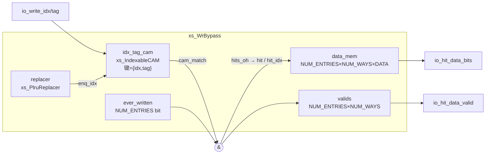

# WrBypass —— 写旁路缓冲

| | |
|---|---|
| 手写 SV | `rtl/frontend/WrBypass.sv`（`xs_WrBypass`）+ `rtl/frontend/WrBypass_variants.sv` |
| Scala 来源 | `src/main/scala/xiangshan/frontend/WrBypass.scala` |
| 依赖 | [xs_IndexableCAM](../common/IndexableCAM.md)、[xs_PlruReplacer](../common/PlruReplacer.md) |
| 验证状态 | UT ✅（5 变体双例化 25 万拍随机比对）/ FM ✅（5 变体全部 SUCCEEDED） |

## 1. 功能概述

分支预测器各表（TAGE / SC / ITTAGE / FTB 等）更新 SRAM 时存在多拍写延迟。若同一
索引在短窗口内被连续更新（热点分支），后一次更新需要在前一次尚未写入 SRAM 时就读到
其最新值。WrBypass 缓存最近写入的 `(idx[, tag]) → data` 映射：每次写请求同时作为
查询，命中则给出上次写入的各路数据及其有效位，供更新逻辑合并；未命中则按 PLRU 占用
一个旧条目记录本次写入。

## 2. 参数

| 参数 | 含义 | 约束 |
|------|------|------|
| `NUM_ENTRIES` | 缓冲条目数 | 2 的幂（PLRU 树要求） |
| `IDX_WIDTH` | 索引位宽 | >0 |
| `NUM_WAYS` | 每条目路数 | ≥1 |
| `TAG_WIDTH` | tag 位宽 | 0 表示无 tag（查询键仅 idx） |
| `DATA_WIDTH` | 每路数据位宽 | >0 |

## 3. 接口

时钟 `clock`，异步高有效复位 `reset`。

| 信号 | 方向 | 位宽 | 说明 |
|------|------|------|------|
| `io_wen` | in | 1 | 写请求有效（同时触发查询与 PLRU touch） |
| `io_write_idx` | in | IDX_WIDTH | 写索引 |
| `io_write_tag` | in | max(TAG_WIDTH,1) | 写 tag；`TAG_WIDTH=0` 时接 `'0` |
| `io_write_data` | in | NUM_WAYS×DATA_WIDTH | 各路写数据 |
| `io_write_way_mask` | in | NUM_WAYS | 路写掩码；单路时接 `1'b1` |
| `io_hit` | out | 1 | 查询命中（组合输出） |
| `io_hit_data_valid` | out | NUM_WAYS | 命中条目各路数据有效 |
| `io_hit_data_bits` | out | NUM_WAYS×DATA_WIDTH | 命中条目各路数据 |

所有输出为组合逻辑，是对当拍 `io_write_idx/tag` 的查询结果；上游在发出写请求的
同一拍即可拿到旁路数据。

## 4. 内部结构

- **idx_tag_cam**：全相联 CAM，条目内容不复位，由 `ever_written` 屏蔽上电假命中。
- **hits_oh**：`cam_match & ever_written`，至多一位有效（同一键只占一个条目），
  one-hot 编码得 `hit_idx`。
- **replacer**：条目级树形 PLRU。data_mem 一次只写一个条目，按路独立替换没有意义，
  因此所有路共用一个替换器；每个写请求 touch 实际使用的条目（命中→`hit_idx`，
  未命中→`enq_idx`）。

## 5. 行为

每个 `io_wen` 有效拍：

| 情形 | 动作 |
|------|------|
| 命中 | `data_mem[hit_idx]` 按 `way_mask` 写入；被写的路 `valids` 置 1；PLRU touch `hit_idx` |
| 未命中 | 占用 `enq_idx`（PLRU 给出）：CAM 写入新键，`data_mem[enq_idx]` 按掩码写入，整条目 `valids` 重置为掩码值（掩码外的路标记无效），`ever_written` 置位；PLRU touch `enq_idx` |

注意：未命中占用旧条目时**不保留**旧数据的有效位——掩码外的路 `valids=0`，
即旁路只对"本条目被占用以来写过的路"给出有效数据。

## 6. V2R2 单态化变体（KunminghuV2Config）

| golden 模块 | 条目 | idx | 路×宽 | 掩码 | 备注 |
|------|------|-----|-------|------|------|
| `WrBypass` | 8 | 9b | 1×3b | 无 | |
| `WrBypass_32` | 8 | 11b | 2×2b | 有 | |
| `WrBypass_33` | 16 | 8b | 2×6b | 有 | |
| `WrBypass_41` | 4 | 8b | 1×2b | 无 | `io_hit_data_0_valid` 被 firtool 裁剪 |
| `WrBypass_43` | 4 | 9b | 1×2b | 无 | 同上 |

V2R2 配置下没有使用 tag 的变体；`TAG_WIDTH>0` 路径按 Scala 语义实现，但目前无
golden 可对比，标记为未验证。

## 7. 验证

- **UT**（`verif/ut/WrBypass/`）：5 个变体 golden/手写双例化，随机激励（索引压缩在
  4×条目数值域内保证命中率，way 掩码全随机含全 0），中途打一次异步复位；
  `make run` 25 万次比对 0 错误，每变体命中 1.2 万次以上。
- **FM**（`make fm`）：5 个变体对 golden 同名顶层全部 Verification SUCCEEDED。
  依赖 `scripts/fm_eq.tcl` 的展平名↔数组名自动配对（详见该脚本注释）。
