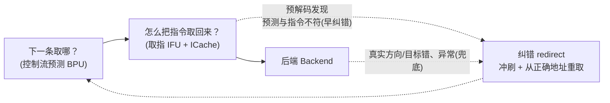
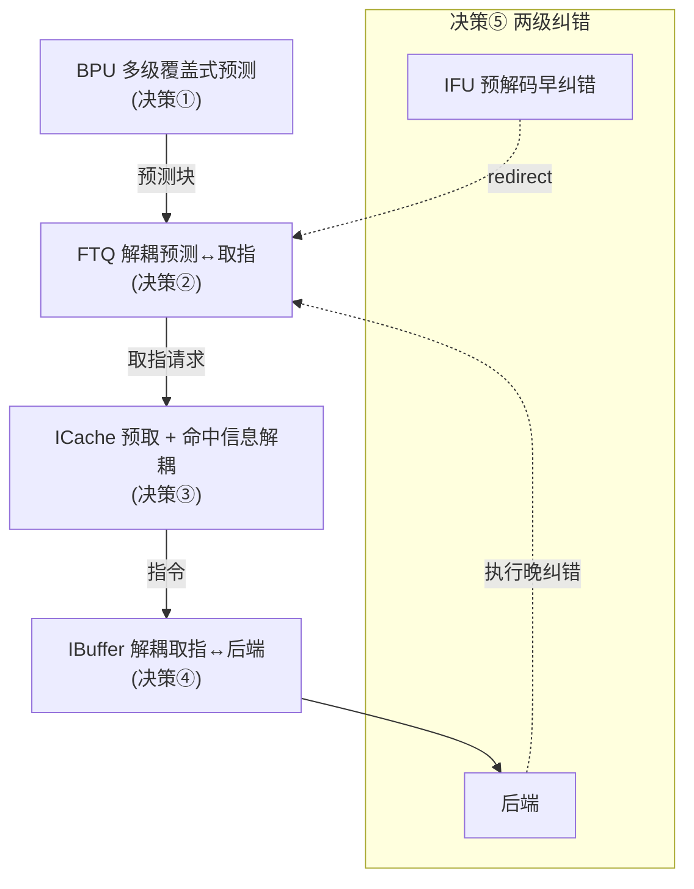
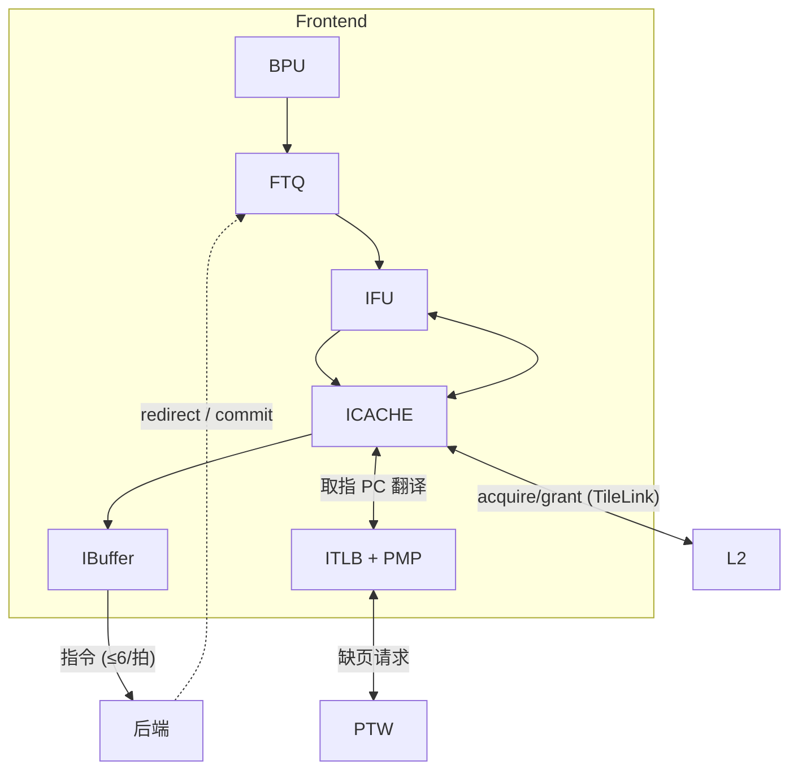

# 前端需求与设计目标 —— 为什么前端要长成这样

> 本文是香山 V2R2（昆明湖）前端的**背景/原理文档**之一，讲"前端要解决什么问题、由问题
> 推出哪些设计目标、再由目标推出哪些关键架构决策"，为阅读各模块**实现文档**先建立认知。
> 它不重复逐模块实现细节（那是各模块文档的事），只回答 **why**。
> 读完本文后，建议按 [FRONTEND_OVERVIEW](0-FRONTEND_OVERVIEW.md) 的脉络深入，并配合另外
> 四篇原理文档：[BPU_PRINCIPLES](2-BPU_PRINCIPLES.md)、[ICACHE_FETCH_PRINCIPLES](3-ICACHE_FETCH_PRINCIPLES.md)、
> [CONTROL_FLOW_AND_TIMING](4-CONTROL_FLOW_AND_TIMING.md)、[DATA_STRUCTURES](5-DATA_STRUCTURES.md)。

## 1. 前端在整核中的角色：指令供给侧

一个乱序超标量核可以粗分为两侧：**前端**负责"把要执行的指令源源不断取回来"，**后端**
负责"把取回来的指令译码、重命名、调度、执行、提交"。两者之间是一份隐式**契约**：

> **前端向后端持续提供一条稳定、高带宽、尽量正确的指令流。**

拆开看，这份契约有四个关键词，恰好对应前端的全部设计压力：

- **持续**：后端的执行宽度很大，一旦前端断流，后端再强也只能空转。前端必须每拍都有指令
  可供，哪怕取指 miss、哪怕分支结果未知，也要靠预测和缓冲把"断流"藏起来。
- **稳定**：供给节奏要平滑。取指天然是突发的（一次取回一大块、miss 时长时间没有），后端
  消费节奏也会波动（译码可能被阻塞）。前端要用队列/缓冲把两端的节奏差吸收掉。
- **高带宽**：现代核一拍要喂给后端多条指令。前端的取指宽度必须匹配后端的消费宽度，否则
  带宽就卡在前端。
- **尽量正确**：指令流是**沿着预测的控制流**取的。预测错了，取回来的全是废指令，必须冲刷
  重取。所以"尽量正确"不仅是精度问题，更直接决定了有多少取指带宽不被浪费。

前端把这份契约落成两个核心动作 + 一条兜底回路：

1. **下一条取哪？** —— 分支预测（[Predictor](../Predictor.md) / [Composer](../Composer.md) 一族）：
   在还不知道分支真实方向/目标时，先猜控制流走向，给出连续取指地址。
2. **怎么取回来？** —— 取指（[NewIFU](../NewIFU.md) + [ICache](../ICache.md)）：按预测地址从指令
   缓存取回、预解码、排入缓冲。
3. **猜错了怎么办？** —— 纠错（redirect），分两级：IFU 预解码发现「预测与实际指令不符」时
   立刻早纠错，后端执行/提交后再兜底纠正真实方向/目标错误与异常；冲刷错误路径、从正确地址
   重取（见 §4.5）。

## 2. 核心挑战：前端为什么不好做

前端的全部复杂度，根源是它必须同时对抗四个互相纠缠的物理/语义难题。

### 2.1 控制流不确定

程序里大量是分支、跳转、调用、返回。它们的去向要么依赖运行期数据（条件分支的方向、间接
跳转 `jalr` 的目标），要么依赖调用栈（函数返回 `ret`）。**取指必须先于执行**，所以在分支
真正算出结果之前，前端只能"猜"。猜的质量直接决定带宽利用率——这是堆预测器的根本动机
（见 §3.2、§4.1）。

理解"为什么要堆这么多种预测器"，关键是把每一次控制转移拆成两个**正交**的问题：**方向
（taken?）**——这次到底跳不跳；**目标（去哪?）**——如果跳，下一条取指地址是多少。不同控
制流类型，这两轴的难度天差地别，这正是要分头攻克的根因：

- **条件分支**（RVI 的 `BEQ/BNE/BLT/BGE/BLTU/BGEU` 与 RVC 的 `C.BEQZ/C.BNEZ`，见
  [PreDecode](../PreDecode.md) 的分支译码）：**只需猜方向**。它是"直接分支"——目标 = PC + 符号
  扩展立即数，编译期就定死、运行期不变，预测时由 FTB/uFTB 的分支槽（brSlot）把目标压缩存下、
  取指时重建（见 [FTB](../FTB.md) 与 [DATA_STRUCTURES](5-DATA_STRUCTURES.md) 的目标压缩编码）。所以
  真正要"猜"的只有方向，这正是 TAGE 那一轴：它只输出 taken/not-taken——taken 走 brSlot 的目标、
  not-taken 走顺序落点（fall-through）。
- **直接跳转/调用** `jal`：**两轴都不用猜**。必跳（方向定），目标同样是 PC + 立即数（编译期定死）。
- **间接跳转** `jalr`：方向定（必跳），但**目标是寄存器的运行期值**，随上下文变化、难猜——这
  一轴交给 [ITTage](../ITTage.md)。
- **返回** `ret`：方向定，目标是"最近一次调用的返回地址"，呈强栈结构——这一轴交给 [RAS](../RAS.md)。

正因为"方向"与"目标"这两轴在不同控制流上各有各的难处，香山才用**多个各有所长的预测器、按
这两轴分头攻克**，而不是一个万能预测器。

### 2.2 存储延迟

指令存在多级存储里。L1 ICache 命中要几拍，miss 要去 L2 甚至更远，延迟可达几十上百拍。
如果"取指 miss 才被动去取"，每次 miss 都是一个大气泡。所以前端必须**提前预取**、必须能
**并发处理多个在途 miss**，把存储延迟尽量藏在预测流水之后（见 §4.3）。

### 2.3 指令变长（RV64GC + RVC）

RISC-V 的 C 扩展让指令长度可变：普通指令 4 字节，压缩指令（RVC）2 字节，且可任意混排。
带来两个直接麻烦：

- **指令边界不固定**：一段取回来的字节流，必须从头逐个判断"这是 2 字节还是 4 字节"，才能
  切出指令。这是一条**串行依赖链**，是预解码的关键路径（见 [PreDecode](../PreDecode.md) 的两段式边界检测）。
- **指令可能跨块边界**：一条 4 字节指令的前半在本取指块末、后半在下一块首（lastHalf），
  必须跨拍拼接（见 [NewIFU](../NewIFU.md) §3.2）。

这也解释了前端一个看似矛盾的数字：一个预测块最多 **16 条**指令（`PredictWidth=16`），却覆盖
最长 **34 字节 = 17 个 16-bit 半字**——16 条 RVC 各占 1 个半字，再加末尾可能有一条跨块 RVI
的前半，多出 1 个半字（见 [NewIFU](../NewIFU.md) §2 的辨析）。

### 2.4 误预测代价

预测错了，沿错误路径取回、甚至已进入后端的指令全部作废，要冲刷流水、回滚投机状态、从
正确地址重取。错得越晚（越深入流水），代价越大。这逼出两个设计取向：**尽量预测准**（把误
预测次数压低），以及**尽量早纠错**（把每次误预测的代价压低）——后者正是"两级纠错"的由来
（见 §4.5）。

## 3. 设计目标（尽量量化）

由上述挑战，前端定下四类可量化或可论证的目标。

### 3.1 取指带宽

目标：**一拍提供一整块、最多 16 条指令**。

- 预测窗口 `PredictWidth = 16`：BPU 每拍产出一个"预测块"，覆盖最多 16 条指令、最长 34 字节
  （17 个半字）的连续取指区间。
- 取指流水（[NewIFU](../NewIFU.md) f0–f3）按 16 个槽并行切指令、并行预解码。
- 一个预测块允许跨 2 条 cacheline（ICache 双 bank / doubleline），使一块不被 cacheline
  边界硬切断，保住带宽。

带宽不仅看"一拍能取多少"，更看"有多少拍能持续取"。所以带宽目标和下面的精度、缓冲目标
是一体的：预测越准、缓冲越足，有效带宽越高。

### 3.2 预测精度对 IPC 的杠杆

目标：**把误预测率压到极低，哪怕为此付出可观面积**。

为什么值得堆这么多预测器？因为误预测代价随流水深度放大：一次条件分支误预测，要冲刷整条
前端 + 部分后端、回滚投机历史、重新取指译码，损失常达十几到几十拍。流水越深、窗口越宽，
单次误预测损失越大，于是**每提升一点点预测精度，IPC 的边际收益都很高**——这正是堆预测器
在面积/功耗上"划算"的根本原因。香山因此用一整套**多级覆盖式**预测器，各打一类控制流：

| 预测器 | 主攻 | 关键规模（本实现） |
|--------|------|------|
| uFTB（[FauFTB](../FauFTB.md)） | s1 当拍最快出结果 | 全相联微 FTB，32 路 |
| [FTB](../FTB.md) | 容量大的取指目标缓冲 | 4 路 × 512 组；条目最多 2 条件分支槽 + 1 tailSlot |
| TAGE（[Tage_SC](../Tage_SC.md)） | 条件分支方向（主预测器） | 4 张几何历史表，历史长度 8/13/32/119 |
| TageBTable | 基础双峰（bimodal）兜底 | 见 [TageBTable](../TageBTable.md) |
| SC（[SCTable](../SCTable.md)） | 统计校正 TAGE | 见 [Tage_SC](../Tage_SC.md) |
| [ITTage](../ITTage.md) | 间接跳转 `jalr` 目标 | 5 张表 |
| [RAS](../RAS.md) | 返回 `ret` 目标 | 投机栈 32 + 提交栈 16 |

照 §2.1 的「方向 vs 目标」两轴看这张表就一目了然：**方向**类是 TAGE / SC / TageBTable（只判
taken/not-taken）；**目标**类是 [ITTage](../ITTage.md)（攻 `jalr` 目标）与 [RAS](../RAS.md)（攻 `ret`
目标）；uFTB / FTB 则**两者都管**——既缓存取指块内分支的目标，又给方向（uFTB 每分支自带饱和
计数器、FTB 提供分支槽与 fall-through）。

> 各预测器如何分工、如何"菊花链"组合、如何按级覆盖，见 [BPU_PRINCIPLES](2-BPU_PRINCIPLES.md)
> 与 [Composer](../Composer.md)；条目压缩编码、几何历史折叠等数据结构见 [DATA_STRUCTURES](5-DATA_STRUCTURES.md)。

### 3.3 低纠错延迟

目标：**误预测尽量早被发现并冲刷**，让单次误预测的损失最小。

香山设两级纠错（见 §4.5）：IFU 在预解码后（f3）就能发现一类"预测与实际指令不符"的错误并
立刻 redirect，不必等到后端执行；后端执行后再兜底纠正真实方向/目标错误。"早纠错"省下的，
正是错误路径在后端继续走下去的那些拍。

### 3.4 时序收敛

目标：**关键路径放得进时钟周期**。

前端的关键路径几乎都和 **SRAM 访问**绑定：预测器的标签表、ICache 的 meta/data 阵列都是同步
SRAM，"发地址→下一拍出数据"本身就占掉大半个周期，留给后续组合逻辑的余量很小。应对手段
贯穿整个前端：

- **分多级流水**：BPU 分 s1/s2/s3，ICache 分 s0/s1/s2，IFU 分 f0–f3，把"发 SRAM 地址"和"用
  SRAM 数据"放到不同拍。
- **解耦**：用队列把上下游隔开（FTQ、WayLookup、IBuffer），各自按自己的时序节奏走，避免长
  组合链跨越多个功能块。
- **提前一拍 + 旁路**：取指 PC 在关键路径上，FTQ 用"下一拍指针"提前给 PC 存储发读地址，并对
  刚入队即被取的块走 bypass，规避"先写存储再读出"的气泡（见 [Ftq](../Ftq.md) §5）。
- **高扇出隔离 / dup 复制**：把高扇出控制信号多打几拍或复制多份（如 BPU 的 numDup=4、FTQ 的
  copied 扇出），降低长线负载（见 [Predictor](../Predictor.md)、[Frontend](../Frontend.md) §4.A）。

> 各级流水的逐拍时序、信号如何跨级对齐，集中在 [CONTROL_FLOW_AND_TIMING](4-CONTROL_FLOW_AND_TIMING.md)。

## 4. 由目标推出的五个关键设计决策

下面五条是前端架构的总纲。这里只点明"为什么这么决策、解决前面哪个问题"，具体实现指向
对应模块文档与原理篇。

### 4.1 决策①：多级覆盖式分支预测

**解决**：控制流不确定（§2.1）+ 误预测的高杠杆（§3.2）+ 时序收敛（§3.4）。

单个预测器无法同时做到"快"和"准"：快的（小表、全相联）当拍就能出结果但精度有限，准的（大
表、长历史、统计校正）要多拍。香山的取舍是**两者都要、分级覆盖**：地址一产生，最快的 uFTB
在 **s1** 当拍先出结果让取指立刻动；容量大的 FTB 在 **s2**、TAGE-SC/ITTAGE 在 **s3** 随后几拍
给出更准的预测，一旦与前级结论不同就**覆盖**（发 redirect 作废更早的预测）。这样既不牺牲取
指立即启动（隐藏延迟），又拿到高精度（压低误预测）。各预测器由 [Composer](../Composer.md) 串成
菊花链组合，顶层 [Predictor](../Predictor.md) 管这条 s1/s2/s3 三级流水的握手与覆盖。

> 详见 [BPU_PRINCIPLES](2-BPU_PRINCIPLES.md)。

### 4.2 决策②：FTQ 解耦"预测"与"取指"

**解决**：节奏不匹配（§1 稳定）+ 纠错枢纽（§3.3）+ 时序解耦（§3.4）。

BPU 产预测块的节奏和 IFU 取指的节奏并不一致（预测可能领先、取指可能因 miss 落后）。在两者
之间放一个 **64 项环形队列 [Ftq](../Ftq.md)**（`FtqSize=64`，指针 `ftqPtr={flag,6bit}`）把它们解
耦：BPU 只管往队尾写预测块，IFU 只管从队列按序取。FTQ 还顺势成为**纠错枢纽与训练回路起
点**——redirect 在这里冲刷指针、commit 在这里把真实结果经 [FTBEntryGen](../FTBEntryGen.md) 回送
训练各预测器。它是前端最大最复杂的模块，正因为它扛着"解耦 + 纠错 + 训练"三重职责。

> 详见 [Ftq](../Ftq.md) 与 [CONTROL_FLOW_AND_TIMING](4-CONTROL_FLOW_AND_TIMING.md)。

### 4.3 决策③：ICache 预取 + 命中信息解耦

**解决**：存储延迟（§2.2）+ 时序收敛（§3.4）。

ICache 是 **4 路组相联 × 256 组、行宽 64B（512 bit）** 的 L1，data 切 8 bank，主流水可跨 2 条
line（doubleline）。两个解耦手段对付存储延迟：

- **预取与命中信息解耦**：[IPrefetchPipe](../IPrefetchPipe.md) 跑在前面，先查 meta 算出"命中哪一
  路"存进 [WayLookup](../WayLookup.md) FIFO；[ICacheMainPipe](../ICacheMainPipe.md) 真取指时直接用这
  份 waymask 去读 data，**不必重复查 meta**，缩短主流水关键路径，也让预取提前把 miss 暴露出来。
- **多在途 miss 并发**：[ICacheMissUnit](../ICacheMissUnit.md) 有 **14 个 MSHR**（4 取指 + 10 预
  取），可同时登记多条在途 miss、去重合并，向 L2 并发取行，把存储延迟摊开而非串行等待。

> 详见 [ICACHE_FETCH_PRINCIPLES](3-ICACHE_FETCH_PRINCIPLES.md) 与 [ICache](../ICache.md)。

### 4.4 决策④：IBuffer 解耦"取指"与"后端"

**解决**：节奏不匹配（§1 稳定、高带宽）。

取指是突发的（一拍来一大块、miss 时长时间没有），后端译码消费是另一种节奏（一拍最多收
`DecodeWidth=6` 条、还可能被阻塞）。在两者之间放 **48 项环形 FIFO [IBuffer](../IBuffer.md)**
（`IBufSize=48`，6 bank × 8 项）：取指快时暂存、译码快时连续供给，隐藏取指延迟、平滑前端流
水。它一拍最多入队 16 条（匹配 `PredictWidth`）、出队 6 条（匹配后端），用裸寄存器 + 两级
bank 选择来满足"多写口多读口"的端口压力（SRAM 给不了这么多端口）。

> 详见 [IBuffer](../IBuffer.md)。

### 4.5 决策⑤：两级纠错（IFU 早纠错 + 后端晚纠错）

**解决**：误预测代价（§2.4）+ 低纠错延迟（§3.3）。

不是所有预测错都要等后端执行才知道。香山分两级纠错：

- **IFU 预解码早纠错**：[NewIFU](../NewIFU.md) 在 f3 拿到真实指令信息后，用 PredChecker 比对 BPU
  预测与实际（如把非分支预测成 taken、范围/目标对不上），不符就立刻 redirect。这类错在取指
  阶段就能发现，**不必走完后端**，省下错误路径深入流水的代价。
- **后端执行晚纠错**：条件分支真实方向、`jalr`/`ret` 真实目标只有执行才知道。后端发现误预测
  或异常时，经 redirect 路由进 FTQ 冲刷重取，是最终兜底。

两级各管一类错、各在能发现它的最早时机出手，整体把误预测的平均代价压到最低。

> 两类 redirect 如何在 FTQ 冲刷指针、如何回滚 BPU 投机历史，见 [CONTROL_FLOW_AND_TIMING](4-CONTROL_FLOW_AND_TIMING.md)。

## 5. 边界与约束

前端不是孤立的，它在固定的接口和物理约束下工作。

### 5.1 外部接口

- **与后端**：经 [IBuffer](../IBuffer.md) 一拍最多送 6 条指令（`io_backend_cfVec`）；后端回送
  redirect（误预测/异常）与 commit（提交真实结果，用于训练），均路由进 FTQ
  （见 [Frontend](../Frontend.md) §3）。
- **与 L2（TileLink）**：取指 miss 时 [ICacheMissUnit](../ICacheMissUnit.md) 经 TileLink client
  口向 L2 发 acquire / 收 grant 回行。
- **与 iTLB / PMP / PTW**：取指虚地址要经 **ITLB** 翻译成物理地址、再经 **PMP**（顶层有 5 个
  PMPChecker 口）做权限检查；ITLB miss 经 PTWFilter/Repeater 向 **PTW** 发缺页请求
  （见 [Frontend](../Frontend.md) §2）。这些子系统由 Frontend 顶层组装。
- **MMIO 取指**：非缓存区不可投机、不可乱序，走单独的 [InstrUncache](../InstrUncache.md) +
  IFU 的串行状态机，逐条取、等 RoB 提交才继续（见 [NewIFU](../NewIFU.md) §3.4）。

### 5.2 物理约束

- **SRAM 时序**：预测器表与 ICache meta/data 都是同步 SRAM，是关键路径来源——这是分多级、解
  耦、提前发地址等一切时序手段的根因（§3.4）。
- **面积 / 功耗**：预测器越大越准但越费面积/功耗。设计上用压缩编码（FTB 条目只存目标低位 +
  高位状态、ITTAGE 用区域基址表压目标）、折叠历史（长历史 XOR 折叠到表索引位宽）、表间共享
  等手段在精度与面积间取平衡（见 [DATA_STRUCTURES](5-DATA_STRUCTURES.md)）。
- **端口压力**：多读多写的结构（IBuffer、FTQ 的 PC 存储）要么用裸寄存器 + 巧妙选择逻辑，要么
  把逻辑存储拆到多块物理 SRAM，以满足端口数（见 [IBuffer](../IBuffer.md) §2、[Ftq](../Ftq.md) §4）。

## 6. 阅读地图

本文（需求与目标）是四篇原理文档的"总纲"。建议路径：

1. **建立全局**：[FRONTEND_OVERVIEW](0-FRONTEND_OVERVIEW.md)（模块清单 + 数据流 + 推荐读码顺序）。
2. **本文**：REQUIREMENTS.md —— 为什么前端这么设计（你在这）。
3. **三条主线的原理**：
   - 分支预测：[BPU_PRINCIPLES](2-BPU_PRINCIPLES.md) —— 多级覆盖、各预测器分工、历史与训练。
   - 取指与缓存：[ICACHE_FETCH_PRINCIPLES](3-ICACHE_FETCH_PRINCIPLES.md) —— 预取/命中解耦、
     miss 处理、IFU 取指流水与预解码。
   - 控制流与时序：[CONTROL_FLOW_AND_TIMING](4-CONTROL_FLOW_AND_TIMING.md) —— 多级流水如何咬合、
     redirect/commit 如何冲刷与训练、各级解耦缓冲。
4. **横切的数据结构**：[DATA_STRUCTURES](5-DATA_STRUCTURES.md) —— FTB 条目编码、折叠历史、
   循环队列指针、压缩目标等贯穿全前端的表示。
5. **逐模块实现**：按 OVERVIEW §5 的推荐顺序读 `docs/frontend/*.md`，从 [PreDecode](../PreDecode.md)
   入门，到 [Frontend](../Frontend.md) 顶层收尾。

> 一句话总结：前端的全部复杂度，都是为了在"控制流不确定 + 存储有延迟 + 指令变长 + 误预测
> 昂贵"这四重压力下，仍能向后端**持续、稳定、高带宽、尽量正确**地供指令。后面每一篇、每一个
> 模块，都是这句契约的展开。
