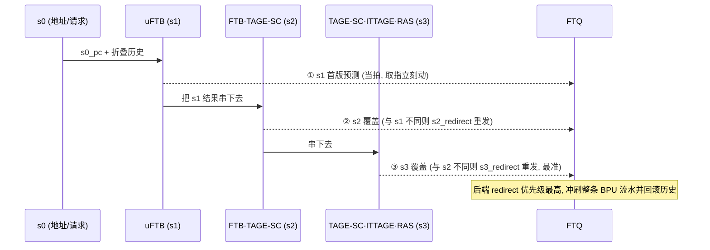
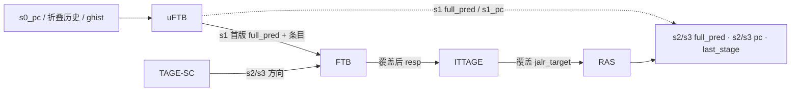

# BPU 分支预测原理

本篇是香山 V2R2 昆明湖前端 BPU 的**背景/原理文档**：讲「为什么这么设计、各预测器如何协同」，不重复逐模块端口与实现细节。实现细节请看各模块设计文档（如 [Tage_SC](../Tage_SC.md)、[RAS](../RAS.md)），总览见 [FRONTEND_OVERVIEW](0-FRONTEND_OVERVIEW.md)，姊妹篇见 [REQUIREMENTS](1-REQUIREMENTS.md) / [CONTROL_FLOW_AND_TIMING](4-CONTROL_FLOW_AND_TIMING.md) / [DATA_STRUCTURES](5-DATA_STRUCTURES.md)。

---

## 1. 为什么要分支预测

现代乱序处理器的流水线很深、取指带宽很宽。流水线只有在「知道下一条该取哪里」时才能持续喂指令；可是程序里大约每 5～8 条指令就有一条控制流指令（条件分支、跳转、调用、返回），它们的真实去向往往要到流水线很后段（执行/访存）才算得出来。

如果取指器每遇到一条分支就停下来等结果，流水线立刻饿死。出路只有一个：**在取指阶段就猜**——猜这一段里有没有分支、猜它跳不跳、猜跳到哪。猜对，流水线零气泡地往前走；猜错，要把已经投机取入、译码、甚至执行的错误路径指令全部冲刷（flush），从正确目标重新取指。

所以分支预测是一场「精度 vs 惩罚」的博弈：

- **预测错误的惩罚**很重——深流水的冲刷意味着十几个周期的有效工作被丢弃。
- 因此哪怕把准确率从 95% 再往 99% 推进一点点，收益都巨大。这正是 BPU 要堆叠多个、越来越复杂的预测器去逼近极限精度的根本动机。

香山 BPU 同时还有第二重压力：**取指要立刻拿到「下一个地址」**。即便最准的预测器要好几拍才出结果，取指也不能干等。这就引出了香山的核心设计取舍——多级覆盖式预测（见 §3）。

---

## 2. 核心抽象：「预测块」

### 2.1 为什么按块预测而非按指令

朴素的 BTB/BHT 思路是「为每条分支指令存一条预测」。但宽取指一拍要送进十几条指令，逐条查预测器既慢又费。香山改用**预测块（prediction block）**这一更粗的粒度:

> 一次预测描述「从某个起点开始的一段连续取指」，这段一直延伸到**取满 PredictWidth=16 条指令**，或**遇到第一个被预测 taken 的分支**为止。预测器一次回答两件事:
> 1. **fall-through 地址**——如果这段里没有 taken 分支，顺序执行会落到的下一块起点；
> 2. **末端控制流去向**——这段里第一个 taken 分支/跳转跳到哪。

按块预测让一次查表覆盖一整段取指，匹配宽取指带宽；同时它天然地把「这段内部的多个分支」压缩成「最多关心头两个分支 + 一个块尾跳转」（见下），大幅压缩存储。

### 2.2 一个块的控制流：fall-through + 分支去向

一个预测块最多记录 **NUM_BR=2 个条件分支槽 + 1 个 tailSlot（块尾跳转）**：

- **brSlot（slot0）**：块内第 1 个条件分支；
- **tailSlot（slot1）**：块尾跳转 `jal/jalr/call/ret`，也可被「共享（sharing）」当作第 2 个条件分支；
- **fall-through**：用 `pftAddr + carry` 紧凑编码顺序落点；
- `isCall/isRet/isJalr`、`strong_bias` 等标志描述块尾跳转类型与置信。

注意槽位是按**位置**切的、不是按类型切的：无条件转移（`jal/jalr/call/ret`）一旦执行到就必然 taken、必然落在块尾，所以整块至多一个、统一占 `tailSlot`（用 `isJalr/isCall/isRet` 区分，默认即 `jal`）；条件分支可以不跳而继续，因此独占 `brSlot` 并最多记两个。这也是为什么槽位是「1 brSlot + 1 tailSlot」而非「每类分支一个槽」。

这套结构就是 **FTB 条目（FTBEntry）**。目标地址不存完整 50 位，而用「低位 lower + 2 位 tarStat（高位相对当前 PC 高位 FIT/OVF/UDF）」压缩，取出时用 PC 高位 ±1 重建。条目字段、目标压缩编码的精确定义见 [DATA_STRUCTURES](5-DATA_STRUCTURES.md) 与 [FTBEntryGen](../FTBEntryGen.md)。

理解一点很关键：**FTB 条目只描述「块的形状」（哪有分支、目标/落点在哪），不描述「这次跳不跳」**。「跳不跳」（方向）由 TAGE-SC 给，「间接跳转跳到哪」由 ITTAGE 给，「ret 回哪」由 RAS 给。各预测器各管一摊，再合成出完整的块预测——这就是下面要讲的协同。

---

## 3. 多级覆盖式预测思想

### 3.1 为什么是多个预测器而不是一个

§1 末尾的两重压力——「取指要立刻动」与「预测要尽量准」——是矛盾的：最快的预测器（纯寄存器、当拍出结果）必然容量小、精度有限；最准的预测器（大 SRAM、长历史、多表求和）必然要好几拍才出结果。单一预测器无法同时满足。

香山的答案是 **多级覆盖式（overriding）预测**：让多个预测器以不同延迟、不同精度并行工作，**先用最快的让取指动起来，后到的更准结果再覆盖（override）前面的**。

BPU 流水分三级覆盖窗口 **s1 / s2 / s3**（s0 负责产生地址与请求）:

| 级 | 谁在这一级出/覆盖 | 特点 |
|----|------------------|------|
| **s1** | uFTB（FauFTB）当拍给出第一版完整预测 | 全寄存器、零气泡，取指立刻拿到下一地址 |
| **s2** | FTB（大容量）覆盖条目/目标；TAGE-SC 开始覆盖方向 | 读过 SRAM，更全、更准 |
| **s3** | TAGE-SC 终判方向；ITTAGE 覆盖 jalr 目标；RAS 覆盖 ret 目标 | 最长历史 + 统计校正，最准 |

**后级越准，覆盖优先级越高**。一旦某后级结论与流水里更早的预测不同，就发一次内部重定向（redirect）作废前面的请求，用新结果重发给 FTQ。这是延迟与精度的折中：用「先出一个够快、八成对的预测」换取取指零等待，再用「随后一两拍纠正掉那两成错误」换取高精度——错误覆盖发生在流水线内部，惩罚远小于把错误指令送到执行段才发现。

### 3.2 多级覆盖时序

`resp.valid = s1_valid | (s2_valid & s2_redirect) | (s3_valid & s3_redirect)`——FTQ 在 s1 拿首版，在 s2/s3 各拿一次「若发生覆盖才重发」的修正版。覆盖判定与各级 valid/flush 的精确合成见 [Predictor](../Predictor.md) §3 与 [CONTROL_FLOW_AND_TIMING](4-CONTROL_FLOW_AND_TIMING.md)。

---

## 4. 各预测器原理

### 4.1 FTB / uFTB —— 取指目标缓冲

FTB（Fetch Target Buffer）回答「这一取指块里有没有控制流指令、跳到哪、顺序落到哪」，即缓存块的形状（FTB 条目）。它是覆盖链里**容量最大、命中率最高**的目标来源。

香山把它拆成快慢两层，正是 §3 取舍的直接体现：

- **uFTB（[FauFTB](../FauFTB.md)）**：`numWays=32` 路**全相联微型** FTB，纯寄存器实现、无 SRAM 读延迟，s1 **当拍**就能并行比 32 路 tag、Mux1H 出第一版完整预测。容量小但全相联，任意 PC 都能落到任意一路，小表也有高利用率。每路每分支自带 2-bit 饱和计数器直接给方向，所以 uFTB 一家就能在 s1 给出「目标 + taken + fall-through」的完整块预测——这是取指零气泡的关键。
- **FTB（[FTB](../FTB.md) / [FTBBank](../FTBBank.md)）**：`numEntries=2048`，4 路 × 512 组**组相联 SRAM**，容量大得多、命中率更高，但要 s1 发起 SRAM 读、s2 才拿到条目。它在 s2/s3 覆盖 uFTB 的条目与目标。

二者**条目同构**（同一个 `ftb_entry_t`），所以 uFTB 命中的条目能直接透传给 FTB 复用。当 FTB 连续多拍发现自己与 uFTB 给的条目完全一致时，会临时**关闭 FTB 读以省功耗**（直接采信 uFTB），遇到 false_hit 或 IFU 重定向再重开（[FTB](../FTB.md) §4）。

### 4.2 TAGE —— 几何历史长度标签预测（方向主力）

FTB 知道「这里有个条件分支」，但不知道「这次跳不跳」。方向预测的主力是 **TAGE**（TAgged GEometric history length）。

核心难题：分支方向与「最近的分支历史」强相关，但**不同分支需要的历史长度天差地别**——有的只看最近几次，有的要看上百次才能区分上下文。TAGE 的精妙之处在于**同时押多个历史长度，自动选最合适的那个**：

- TAGE = **1 张基预测器（[TageBTable](../TageBTable.md)）+ 4 张带 tag 的标签表（[TageTable](../TageTable.md)）**。4 张表用**几何递增**的全局历史长度 **8 / 13 / 32 / 119** 各自索引。历史越长越能捕捉远距离相关性，几何递增让短中长历史都有覆盖。
- 每个条目存 `{valid, tag(8b), ctr(3b 饱和)}`：tag 是 pc 与折叠历史异或出的校验位，命中 = tag 匹配且 valid；ctr 最高位即方向。
- **选最长命中作 provider**：预测时 4 张表并行查，取**命中且历史最长**的表作 provider 给方向。历史越长、命中说明越「专门」，越可信。
- **altpred 兜底**：provider 的 ctr 处于中点（弱置信，多为新分配条目）时，由一张 `useAltOnNa` 计数表决定是否改用 altpred（次长命中表 / 基预测器的方向）——避免相信一个还没学稳的条目。
- **useful 位 + 分配 + 老化**：标签表满了如何取舍？每条目有个 `useful` 位标记「本表纠正过更短历史的错误」。分配新条目只挑「历史比 provider 更长、当前未命中、useful=0」的空位，并用 LFSR 随机选一张，避免抖动。mispred 时按 tick 计数器节奏择机分配；tick 饱和时给该 bank 所有表整体清 useful——**老化**让长期占位却无用的条目能被回收。

为什么这套机制能逼近高精度：它本质上是「让每个分支自动落到恰好够用的历史长度上」——简单分支用短历史的小表（省资源、学得快），上下文敏感分支被分配到长历史的表（高分辨）。tag 校验 + 最长命中 + altpred + useful 老化，共同保证「既用得上长历史，又不被长历史的稀疏命中拖累」。

### 4.3 SC —— 统计校正

TAGE 对大多数分支很准，但对某些**弱偏置 / 受多种历史综合影响**的分支会偶尔过度自信地给错方向。**SC（Statistical Corrector，[SCTable](../SCTable.md)）**专门校正这类情况。

- SC 是一组**无 tag**、用**带符号 6-bit 饱和计数器**的表（4 张，不同历史长度），思路类似感知机：把各表在命中行读出的计数器**按权重求和**得 `totalSum`，符号即 SC 倾向的方向。
- SC 学的是**条件统计量**：「在 TAGE 给出某方向的前提下，真实方向偏向哪边」——所以计数器按 `(分支位置, TAGE 当时方向)` 分桶。
- **只在足够置信时才翻转 TAGE**：把 `|totalSum|` 与一个**自适应阈值** `scThresholds` 比较，只有超阈值（SC 足够强地反对 TAGE）才用 SC 方向覆盖 TAGE，否则保留 TAGE。阈值会按「SC 与 TAGE 分歧但落在边界窗口」自适应增减，避免 SC 过度或不足地干预。

`tageTaken`（TAGE 含 altpred 兜底后的方向）与 SC 校正在 s2 合成出 `s2_pred`，s3 输出最终方向（[Tage_SC](../Tage_SC.md) §2）。TAGE 给「主判 + 置信」，SC 给「置信不足时的统计纠偏」，二者叠加是当代最强方向预测器之一。

### 4.4 ITTAGE —— 间接跳转目标预测

条件分支只有「跳/不跳」两种去向，FTB 就能记住目标。但**间接跳转（jalr：虚函数派发、switch 跳转表、函数指针调用）的目标是变的**——同一条指令在不同上下文跳到不同地址。这里要预测的不是「方向」而是「**目标地址**」，且必须用**全局历史**区分上下文。

**ITTAGE（Indirect Target TAgged GEometric history length，[ITTage](../ITTage.md) / [ITTageTable](../ITTageTable.md)）**把 TAGE 的机制搬到目标预测上：

- 同样是**几何历史 + tag + 最长命中 provider + altpred**，本工程用 **5 张表**（[ITTageTable](../ITTageTable.md) 历史长度量级递增 4 / 8 / 13 / 16 / 32）。
- 区别在条目存的是**目标的压缩编码**（20 位区内 offset + 4 位区域基址指针 + 1 位 usePCRegion），而非方向位。完整 50 位目标 = 区域基址表查到的 30 位基址 ++ 20 位 offset。
- 条目的 ctr 在这里是**置信/替换计数**而非方向：旧目标屡屡预测对则增、错则减；只有分配或 ctr 耗尽（旧目标置信归零）才允许新目标顶替旧目标——避免一次偶发误预测就冲掉一个总体准确的目标。

ITTAGE 只负责覆盖 s3 的 `jalr_target`，方向仍由 TAGE-SC 决定。把间接目标单独用一个 TAGE 风格的预测器，是因为「目标随上下文变化」与「方向随历史变化」是同一类问题，长历史 + tag 同样能逼近高精度。

### 4.5 RAS —— 返回地址栈

函数返回（`ret`）的目标几乎总是「最近一次 `call` 的下一条指令」。这种**严格 LIFO 配对**用 ITTAGE 那种历史表预测既浪费又不准，用一个**栈**反而精确：taken 的 call → push 返回地址；taken 的 ret → pop 栈顶作为预测目标。

难点在于：**预测发生在取指阶段，此时分支是否真 taken 尚未确认**。若 s3 自纠或后端 redirect 发现 call/ret 预测错了，已经做过的 push/pop 必须能回滚。香山 RAS（[RAS](../RAS.md)）因此用**双栈 + 指针快照**：

- **投机栈** `spec_queue`（32 项，环形）：在途（已预测未提交）的 push 记录，s2/s3 预测时更新。它是「持久栈」——**pop 不抹数据，只移动读指针 TOSR**，每项额外存一个 NOS（next-on-stack）指针，pop 时 `TOSR ← NOS` 顺链下行。这样 redirect 只需把几个指针写回**预测时随块下发的快照值**，就能瞬间恢复整个逻辑栈，无需搬运数据。
- **提交栈** `commit_stack`（16 项）：后端 commit 确认后才更新的真值，在投机栈被冲偏时充当兜底基线。
- **ctr 压缩**：连续 call 到同一返回地址（循环里反复调用、自递归）不分配新槽，只把栈顶 ctr+1（pop 时先减 ctr），让有限栈深也能容纳很深的同地址嵌套。

恢复优先级 `redirect > s3_cancel > 正常 s2 push/pop`。spec/commit 双栈 + 五指针正是为「投机预测必须可廉价回滚」这个约束量身设计的（[RAS](../RAS.md) §2–§4）。

### 4.6 TageBTable —— 基础双峰

[TageBTable](../TageBTable.md) 是 TAGE 的基预测器：一张按 PC 直接索引的 **2-bit 饱和计数器表**（2048 行 × 2 way），给出与历史无关的「默认方向」。当所有带 tag 的 TageTable 都不命中时，TAGE 回退用它的方向（altpred）。它最简单、最先出结果，是整个方向预测的基线保底——保证哪怕没有任何历史命中，也有一个比随机好的方向。

---

## 5. 协同：Composer 菊花链 + Predictor 三级流水

### 5.1 Composer：把预测器串成覆盖链

容易误会的一点：**覆盖逻辑不在 Composer 里，而下沉到了每个预测器内部**。每个预测器都有一对 `resp_in`（吃上一级结果）/ `resp`（吐覆盖后结果）端口；[Composer](../Composer.md) 只是把它们按固定顺序串成**菊花链**，覆盖在链上一级级自然发生。它本身只产出三件小事：perf 计数对齐、meta 拼接、`s1_ready` 相与。

怎么看这张图（呼应本节开头「覆盖发生在各预测器内部」）：

- **实线 = resp 菊花链**：每个预测器吃上一级的 `resp_in`，只在自己负责的字段上覆盖，再把**整包** full_pred 往下传。箭头上的标签就是「这一段覆盖/补充了什么」——所以一个预测请求是被链上各级**逐字段改写**、而非各算各的再投票。
- **链序是 `uFTB → FTB(+TAGE) → ITTAGE → RAS`**：注意 **TAGE-SC 不是独立一环**，它和 FTB 同属 **s2 那一簇**——FTB 在 s2 给条目/目标/fall-through，TAGE-SC 把**方向**覆盖进同一包结果，所以图里画成「TAGE-SC → FTB」（方向汇入 FTB 这个节点），而不是排在 FTB 后面。
- **虚线 = uFTB 的 s1 旁路**：s1 输出必须当拍就绪（零气泡取指，§3.1），等不及走完整条链，所以链首 uFTB 的 s1 full_pred / s1_pc **直接旁路**驱动顶层 s1 输出；只有 s2/s3 输出才流过整条链、由链尾 RAS 驱动。
- **每段覆盖了什么**：FTB 覆盖条目/目标/fall-through（s2）、TAGE-SC 覆盖方向（s2/s3）、ITTAGE 覆盖 `jalr_target`（s3）、RAS 覆盖 `ret` 目标（s3、链尾）。越靠链尾的预测器级数越高、越准，优先级也越高。

链首 **uFTB** 在 s1 直接驱动顶层的 s1 输出；链尾 **RAS** 把已被层层覆盖的 s2/s3 full_pred、last_stage 直接驱动到顶层。各预测器在各自的覆盖窗口（uFTB→s1、FTB/TAGE→s2、ITTAGE/RAS/TAGE→s3）修改流经链上的预测。4 个 `DelayN` 把 ctrl 使能延迟对齐到各预测器所在的流水级。

### 5.2 串联 meta 与历史

菊花链同时串两样**跨越「预测→提交」的状态**：

- **meta（516 bit）**：每个预测器把「本次预测的内部快照」（provider 序号、ctr、altUsed、scCtrs、分配槽、RAS 指针快照…）打包进自己那段 meta，Composer 按固定布局拼成一个 516 位大 meta 随预测块写回 FTQ。布局（高→低）：

  | 位段 | 宽度 | 字段 |
  |---|---|---|
  | `[515:409]` | 107 | 0 填充 |
  | `[408:403]` | 6 | uFTB |
  | `[402:259]` | 144 | TAGE |
  | `[258:192]` | 67 | FTB |
  | `[191:10]` | 182 | ITTAGE |
  | `[9:0]` | 10 | RAS |

  各段 6+144+67+182+10 = 409，高位补 107 个 0 填满 516。commit 训练时上层按完全相同的偏移把 meta 拆回、分发给各预测器——这是「预测时记下当时怎么判的，提交时才知道判得对不对」的训练闭环载体。

- **全局历史**：BPU 投机维护一份 **256 位 ghv（全局历史向量）** + 各表对应的折叠历史（folded history，把长历史 XOR 折叠到表索引位宽）。预测时随分支结果推进；**redirect/覆盖时回滚**到该 redirect 对应的旧值再叠加本次结果。历史是各预测器索引/tag 的输入，回滚正确性直接决定后续预测的正确性（[Predictor](../Predictor.md) §5）。

### 5.3 Predictor：三级流水与冲刷

[Predictor](../Predictor.md) 是 Composer 之上的顶层，把这条三级覆盖流水真正「开起来」：维护 s1/s2/s3 的 valid、各级 fire/flush、给 FTQ 的 resp.valid；管理 256 位 ghv 与折叠历史的推进/回滚；统计 topdown 气泡原因报给 FTQ。它对外提供两个接口：向 FTQ 的**预测接口**（三级覆盖式 resp）和 FTQ 回来的 **update 接口**。冲刷优先级：后端 redirect（最高，冲刷整条流水 + 回滚历史）> s3 覆盖 > s2 覆盖。

---

## 6. 训练回路简述

预测器要靠真实结果学习，否则准确率不会提升。香山的训练回路是：

1. **预测时**：各预测器把当时的判断快照打包进 meta，随预测块经 Composer → FTQ 一路带下去（§5.2）。
2. **执行/提交时**：FTQ 拿到该块的真实结果（实际 taken、实际目标、是否误预测），调用 [FTBEntryGen](../FTBEntryGen.md) 生成要写回的新 FTB 条目，并通过 update 接口连同原 meta 回送 BPU。
3. **训练谁、训练什么**（commit 真实结果按 meta 解包分发）：
   - **uFTB / FTB**：写回新条目（命中改写 / 未命中分配），更新方向饱和计数与 PLRU；
   - **TAGE**：按真实方向更新 provider 的 ctr 与 useful、自适应 useAltOnNa；mispred 时择机分配更长历史的条目、按 tick 老化；
   - **SC**：按真实方向带符号增减命中桶计数，自适应调 scThresholds；
   - **ITTAGE**：按真实目标更新 provider/altpred 的 ctr、useful，必要时分配/换新目标；
   - **RAS**：更新提交栈与 nsp、推进 BOS，必要时用 commit_meta 纠偏投机栈。

何时 update、各信号的精确时序与冲刷交互见 [CONTROL_FLOW_AND_TIMING](4-CONTROL_FLOW_AND_TIMING.md)；各表更新规则的细节见对应模块文档。

---

> 小结：BPU 用「预测块」这一粗粒度抽象匹配宽取指，用「多级覆盖」化解「要快」与「要准」的矛盾，用一组各司其职的预测器（FTB/uFTB 记块形状、TAGE-SC 判方向、ITTAGE 猜间接目标、RAS 配对返回）逼近高精度，再靠 Composer 菊花链把它们的覆盖、meta、历史串成一体，由 Predictor 三级流水驱动、commit 真值闭环训练。
