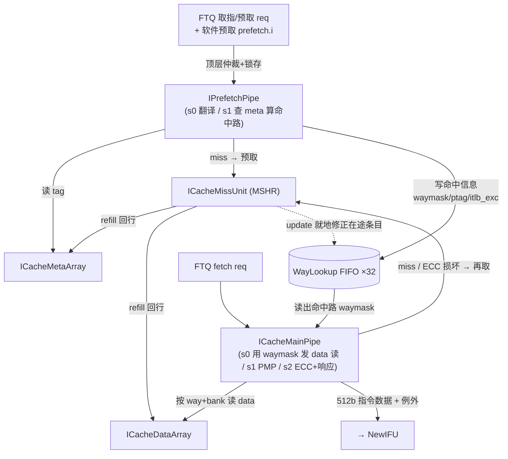
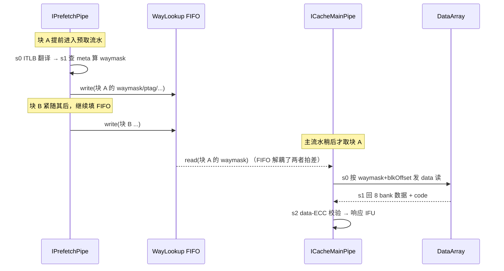

# 取指与指令缓存原理 —— 香山 V2R2（昆明湖）前端

> 这是一篇**背景/原理**文档：讲香山前端取指通路「为什么这么设计、各模块如何协同」，
> 不重复逐模块的端口与实现细节。每个模块的具体实现见同目录下的设计文档（文中按需链接），
> 全局结构先读总览 [FRONTEND_OVERVIEW](0-FRONTEND_OVERVIEW.md)。姊妹篇：
> [REQUIREMENTS](1-REQUIREMENTS.md)（需求与约束）、
> [CONTROL_FLOW_AND_TIMING](4-CONTROL_FLOW_AND_TIMING.md)（控制流与时序，预测校验细节在此展开）。

---

## 1. 取指要解决的问题

后端是一条贪婪的流水：它每拍都想吃进若干条已译码指令。前端取指的职责，就是**按 BPU
预测出来的控制流，把指令字节从内存层级搬到后端门口**，并且要做到足够快、足够稳。具体面对
五个并存的难点：

1. **按预测地址取，而非顺序取**。取指不是"PC+4 往下读"，而是跟着分支预测器（BPU/FTQ）给的
   预测块走——一个预测块（fetch block）覆盖一段直到下一个预测 taken 分支为止的连续地址。
   取指必须随时被重定向（预测错、异常）冲刷重来。
2. **高带宽**。一拍要供给后端多条指令，所以一次取指要并行拿回一整段而不是一条。
3. **变长指令（RVC）**。RISC-V 的 C 扩展让指令有 2 字节和 4 字节两种长度，**指令边界在
   取回字节之前无法确定**——这是取指最根本的麻烦，后面几节几乎都是它的衍生。
4. **跨 cacheline / 跨页**。一段连续取指窗口可能从某条 cacheline 中间开始，一直延伸到下一条
   cacheline（甚至下一页），数据通路必须能把两条 line 拼起来。
5. **容忍 miss**。L1 ICache 总会 miss。取指不能因为一次 miss 就停摆，要能把 miss 处理与
   命中取指在时间上重叠（预取、MSHR、流水解耦）来隐藏延迟。

下面按"带宽与对齐 → 缓存组织 → 解耦取数 → miss 处理 → ECC/MMIO → IFU 串联"展开，
说明实现里每个结构是为回应上述哪个难点而存在。

---

## 2. 取指带宽与对齐：变长指令带来的两段式

### 2.1 一个预测块有多宽

前端的取指粒度是**预测块**，宽度参数 `PredictWidth = 16`（`rtl/frontend/NewIFU.sv:42`）。
它有两个不同口径，初看像矛盾，其实描述的是不同对象：

- **指令槽数 = 16**：一个预测块最多容纳 16 条指令，即 16 个潜在指令起点 / 16 个 cut 槽。
- **字节范围 = 34B = 17 个 16-bit 半字**：16 条全 RVC 的指令各占 1 个半字（共 16 个），
  末尾还可能挂着一条**跨块 RVI 指令的前半**（多 1 个半字），故覆盖 `PredictWidth+1 = 17`
  个半字 = 34 字节。

所以同一个块，"能放几条指令"是 16，"覆盖多少字节"是 17 个半字。预解码模块
[PreDecode](../PreDecode.md) 的输入正是这 17 个半字。

### 2.2 为什么必须先取回、再确定边界

因为 RVC，**第 i 个半字是不是一条指令的起点，取决于它前面那条指令有多长**——而长度要看
那条指令的低 2 位（`inst[1:0]==2'b11` 才是 32 位 RVI，否则 16 位 RVC）。这形成一条
"边界依赖前序长度"的链：拿不到字节就算不出真实指令边界、更算不出分支信息。

这就是为什么取指通路里**必须有预解码**：ICache 只管把对齐到 cacheline 的字节段搬回来，
真正"这段字节里哪些位置是指令、哪条是分支、跳哪去"要等数据回来后由 PreDecode 现算。
为缩短关键路径，PreDecode 把边界检测做成**两段式**——在预测块中点（HALF=8）打断那条长链：
前半 [0,8) 链式推导，后半 [8,16) 同时算"8 是起点"和"8 是上一条 RVI 后半、9 才是起点"两种
假设，最后按前半是否在第 7 个半字处"干净结束"来二选一。这样把一条 16 长的串行链砍成两条
8 长的并行链，时序更好。（细节见 [PreDecode](../PreDecode.md) §3。）

### 2.3 跨块的半条指令

一条 32 位 RVI 可能骑在两个预测块边界上：前半在本块末尾、后半在下一块开头。IFU 用
`lastHalf` 机制把这"半条"寄存到下一块拼接（见 [NewIFU](../NewIFU.md) §3.2）。这是变长指令在
**块间**留下的尾巴，与块内的两段式边界检测是同一问题的两个层面。

---

## 3. ICache 的组织：为什么是 4 路 × 256 组 × 64B，且 meta/data 分离

ICache 是一个 **4 路组相联、256 组、cacheline 64B(512bit)** 的 L1 指令缓存
（见 [ICache](../ICache.md)、[ICacheMetaArray](../ICacheMetaArray.md)）。

- **组相联**回应"高命中率 vs 可实现"的折中：直接映射冲突多，全相联比较代价高，4 路是
  指令访问局部性下常见的甜点。命中判定就是：虚地址映射到某个组（256 组，`vSetIdx` 8 位），
  在该组的 4 路里逐路比物理 tag + valid，命中则得到命中路的 one-hot `waymask`。
- **64B line** 对应一次 L2 refill 的粒度，也匹配取指窗口的连续性。

ICache 把一条 line 的存储拆成两类阵列，分开存是关键的实现取舍：

| 阵列 | 存什么 | 介质 | 为什么这样 |
|------|--------|------|-----------|
| [ICacheMetaArray](../ICacheMetaArray.md) | tag(36b)+ECC(1b) 与 valid(1b) | tag/ECC 用面积高效的 SRAM；valid 用模块内 FF 阵列 | tag 量大、宽，用 1 端口 SRAM 省面积；valid 量小但要支持"按组按路 flush""整体 flushAll""refill 随机置位""复位清零"等灵活更新，FF 阵列才做得到、且复位即清零（冷启动全无效）|
| [ICacheDataArray](../ICacheDataArray.md) | 指令字节 + data-ECC | 32 块单口 SRAM（4 路 × 8 bank，每块深 256、宽 65b）| 只在确定命中路之后才需要，且数据量大 |

**meta 与 data 分离**的好处不止省面积——它让"判断命中在哪一路"和"读出指令数据"成为两件
可以**在时间上错开**的事。这正是下一节解耦设计的物理基础：先用小而快的 meta 算出命中路，
再用命中路精确地只读 data 的那一路，避免 4 路 data 全读再选（省功耗、缩路径）。

data 阵列内部又把 64B line 横切成 `ICacheDataBanks = 8` 个 bank（每 bank 8B）。按 bank
组织，是为了让一次取指能**并行访问多个连续 bank**，并支持跨行拼接（见 §4.2）。

---

## 4. 设计精髓：预取 → WayLookup → 主流水 的解耦

这是整个 ICache 子系统最值得理解的设计。一句话：**把"查 meta 算命中路"从取指主路径里搬走、
提前异步地做掉，结果存进一个 FIFO，主流水真正取数据时直接查表拿命中路，不必自己再查 meta。**

### 4.1 三个角色

- [IPrefetchPipe](../IPrefetchPipe.md)（预取流水，s0/s1/s2 三级）：跑在前面。它对每个取指块做
  ITLB 翻译 + 读 MetaArray 比 tag，**算出这块跨的两条 cacheline 各命中哪一路**
  （`waymask`、`ptag`、ITLB 例外等），写进 WayLookup；顺手把 miss 的块向 MissUnit 发预取。
- [WayLookup](../WayLookup.md)（深 32 的 FIFO）：预取流水（写端）与主流水（读端）之间的
  **解耦缓冲**。每个 entry 含 2 个端口（一次取指跨 `PortNumber=2` 条 line），存
  {vSetIdx, waymask, ptag, itlb_exception, itlb_pbmt, meta_codes}。
- [ICacheMainPipe](../ICacheMainPipe.md)（主流水，s0/s1/s2 三级）：真正取指时从 WayLookup 读出
  这块的 `waymask`，**直接拿命中路去读 DataArray**，不再查 meta；自己负责 PMP、ECC 校验、
  miss 再取、最后响应 IFU。

### 4.2 为什么这么做

- **隐藏延迟**。查 meta + ITLB 翻译有延迟。让预取流水提前把这件事做完存进 FIFO，主流水
  来取时这份结果已经备好，主路径只剩"读 data"，更短更快。
- **省去重复查 meta**。如果主流水自己查 meta，那预取和主流水会各查一遍同一条 line 的 meta。
  解耦后 meta 只查一次（预取查），结果复用，省了 meta 读口压力。
- **两条流水节奏不同、互不阻塞**。预取常领先于主流水若干拍，深 32 的 FIFO 吸收这段错拍——
  预取快时多压几项，主流水忙时慢慢取，谁都不必等谁。
- **data 按命中路 + bank 精确读**。主流水拿到 `waymask` 后，结合取指偏移 `blkOffset` 算出
  `masks[way][bank]`：哪些 (路, bank) 真正要读。一次取指要读固定个数的连续 bank，这段
  bank 可能从一条 line 中部开始、跨入下一条 line——按 bank 粒度组织数据，让
  "line0 的高 bank + line1 的低 bank"能无缝拼成连续 512bit（见 [ICacheDataArray](../ICacheDataArray.md) §3）。

### 4.3 refill 时就地修正在途条目

WayLookup 里存的是"查 meta 当时"的命中信息，可能在它躺在 FIFO 里等待期间被 refill 改变。
所以 [ICacheMissUnit](../ICacheMissUnit.md) 在一条 line refill 完成时，经 `update` 通道**同时扫描
FIFO 内全部 32×2 个端口**，就地修正：当初 miss 的 line 现被填上 → miss→hit（写新 waymask）；
某项记的命中路恰被这次 refill 覆盖 → hit→miss（waymask 清 0）。这样主流水读到的永远是最新
命中信息，不会拿着过期的路去读 data（见 [WayLookup](../WayLookup.md) §3 update）。

### 4.4 解耦数据流图

### 4.5 解耦时序示意

预取流水领先、WayLookup 吸收错拍、主流水稍后取用同一块的命中信息：

> WayLookup 还有一个面积优化值得一提：guest page fault 的 `gpaddr` 宽 56b，若每个 entry 都
> 存太占面积。设计利用"ITLB 报 gpf 后必紧跟 flush"这一性质——整个 FIFO 被 flush 前最多只有
> 一个 gpf，于是 gpf 全局只存一份（见 [WayLookup](../WayLookup.md) §3 gpf 旁路）。这是"用语义约束
> 换面积"的典型手法。

---

## 5. miss 处理：为什么取指与预取 MSHR 分开

L1 总会 miss。miss 处理交给 [ICacheMissUnit](../ICacheMissUnit.md)，核心数据结构是 **MSHR**
（Miss Status Holding Register，在途 miss 的状态寄存器）。本单元共
**`nFetchMshr=4` + `nPrefetchMshr=10` = 14** 个 MSHR，下标 0..13 **直接当 TileLink source id**
——L2 的 grant 回来时带回 source，据此找回是哪条 MSHR、回填到哪。

### 5.1 为什么 fetch 与 prefetch MSHR 分区、且 fetch 优先

- **来源不同、紧迫性不同**。fetch miss 是后端正等着的关键路径，prefetch miss 是投机性的
  提前量。分区（fetch 占 `[0..3]`、prefetch 占 `[4..13]`）保证大量预取不会把取指 MSHR
  占满而饿死真正的取指。
- **发射时 fetch 优先**。两级仲裁：prefetch 内部按入队先后（priorityFIFO）选队头，再与 4 个
  fetch MSHR 经 fixed-priority 仲裁，**fetch 永远优先**向 L2 发 acquire。
- **flush 范围也因此不同**（关键设计点）：重定向冲刷 `io_flush` **只作废 10 个 prefetch MSHR**，
  fetch MSHR 不响应——因为取指 miss 已在途，结果仍要回填，否则重定向后会对同一行反复 miss。
  只有 `fence.i` 才作废全部 14 个。

### 5.2 去重与回填

- **入站去重（lookUp）**：新 req 进 MSHR 前，先与 14 个有效 MSHR 比 `{blkPaddr,vSetIdx}`，
  若已有在途 MSHR 命中同一条 line，就不新开、直接吞掉该 req。预取若撞上本拍 fetch 的同一条
  line，也让位给更急的 fetch。这避免对同一条 line 重复发 TileLink 事务。
- **向 L2 取（TileLink）**：被选中的 MSHR 发 `Get`，地址块对齐，source = MSHR 下标。
  一条 cacheline = `blockBits=512`，总线一拍 `beatBits=256`，故 `refillCycles=2` 个 beat
  拼成 512bit。
- **回填**：收完最后 beat，回收对应 MSHR、把数据写回 meta/data SRAM、回送 MainPipe，并经顶层
  `update` 修正 WayLookup（§4.3）。回填目标路 = acquire 发射当拍从 [ICacheReplacer](../ICacheReplacer.md)
  锁存的 victim way。

### 5.3 替换：树形伪 LRU

miss 要在命中组里淘汰一路腾位置。[ICacheReplacer](../ICacheReplacer.md) 用 **4 路树形伪 LRU**
（每组 3 位状态，与 rocket-chip PseudoLRU 逐位一致）：命中后 MainPipe 经 touch 把命中路标为
最近使用；refill 前 MissUnit 查 victim 得到待淘汰路；refill 完成的下一拍自动把 victim 路
也 touch 成最近使用。256 组按 `vSetIdx[0]` 分 2 bank，使取指跨边界落在相邻偶/奇组的两条
touch 能同拍并行更新，互不阻塞。

### 5.4 容错：ECC 损坏走 refetch 而非异常

meta/data 的 ECC 校验若发现损坏，**不直接报异常**，而是 flush 掉 metaArray 对应项 + 向 L2
再取一遍来自动修复。只有 L2 也返回 corrupt（`l2_corrupt`）才升级为 access fault。这让单/多 bit
软错误能透明恢复，是"容忍 miss"思路的延伸——把"坏数据"当成"另一种 miss"来处理
（见 [ICacheMainPipe](../ICacheMainPipe.md) §4）。

---

## 6. ECC 控制与 MMIO 取指

### 6.1 ECC 与可靠性测试（ICacheCtrlUnit）

meta/data SRAM 都带 1-bit 奇偶 ECC（`code = (^data) ^ poison`）。为了在硅后/仿真里验证
"检错-纠错-上报"整条通路是否真的工作，需要能**主动注入 ECC 错误**。
[ICacheCtrlUnit](../ICacheCtrlUnit.md) 就是这个旁路单元：M 模式软件通过一条 TileLink-UL 寄存器
总线，开关 ECC、指定注入地址、触发注入。注入时它会读 meta 选中命中路，给该路写一条
`poison=1` 的表项——SRAM 写通路按 poison 故意翻坏校验位，于是下次正常读到该 line 时 ECC
就报错，正好检验上游的纠错路径。注入期间它会**抢占 Meta/DataArray 的读写口**（顶层
`cu_injecting` 选择），与常态的 refill/prefetch 互斥。这是"测试基础设施"而非取指功能路径，
平时不参与取指。

### 6.2 MMIO 取指为何串行、不缓存（InstrUncache）

落在 MMIO（非缓存）区间的取指**不进 ICache**，而是经 [InstrUncache](../InstrUncache.md) 向
L2/外设单独发 TileLink Get。MMIO 取指有两个硬约束决定了它必须特殊处理：

- **不可缓存**：MMIO 读可能有副作用（读寄存器即改变设备状态），缓存它没有意义且会出错，
  所以每个 MMIO 块只取、只放 1 条指令，绝不进 cache。
- **不可投机、不可乱序，必须串行**：正因为有副作用，取下一条 MMIO 指令前必须确认当前这条
  真正提交（不会被异常冲刷）。所以 IFU 用一个 11 态 FSM（`M_IDLE..M_COMMITED`）串行地走完
  `InstrUncache → iTLB → PMP → 重发 → 等 RoB 提交` 这条外部握手链，与正常流水互斥
  （见 [NewIFU](../NewIFU.md) §3.4）。`M_WAIT_COMMIT` 等 RoB 提交才放行下一条，正是为副作用兜底。

---

## 7. IFU 如何把这些串起来

[NewIFU](../NewIFU.md) 是取指主控，用一条 **f0 → f1 → f2 → f3 (+wb)** 流水把上述部件串成
"从发请求到送 IBuffer"的完整通路：

| 级 | 做什么 | 关联部件 |
|----|--------|---------|
| **f0** | 接 FTQ 取指请求，算取指起止，向 ICache 发请求 | → ICache 子系统（§3~§5）|
| **f1** | 算各指令槽 PC（高位用 `pc_high` / `pc_high_plus1` 两份按进位选，避免每槽全宽加法）、准备 cut | — |
| **f2** | 收 ICache 响应数据，cut 出 16 个取指槽的原始指令；处理 MMIO 取指 | ← ICacheMainPipe 响应 / InstrUncache |
| **f3** | 预解码 + RVC 展开 + F3 分支预译码 + 预测校验 + 送 IBuffer + 发 redirect | [PreDecode](../PreDecode.md) / [RVCExpander](../RVCExpander.md) / [F3Predecoder](../F3Predecoder.md) |

f3 是变长指令处理的汇集点，三个译码部件各司其职：

- [PreDecode](../PreDecode.md)（f2 初解、f3 用）：从未对齐的半字流做 RVC 判定、两段式指令边界
  检测、分支类型译码与跳转偏移计算，给出每槽初步 `pd`。
- [F3Predecoder](../F3Predecoder.md)：为缩短 f2 关键路径，**分支类型/isCall/isRet 的产生被延后到
  f3** 重算并覆盖 f2 的对应字段（isRVC 仍取 f2 结果）。它输入已对齐的 32 位指令，只做分支译码
  这一子集，与 PreDecode 复用同一份分支译码语义（`xs_predecode_pkg`，单一来源）。
- [RVCExpander](../RVCExpander.md)：把 16 位 RVC 还原成功能等价的 32 位标准指令，让后端只面对
  一种统一格式（纯组合，RV64GC+Zcb）。

**预测校验在 f3 发生**：f3 拿到真实分支信息后，用 PredChecker 把 BPU 的预测（方向/目标/范围）
与实际指令比对，不符就发 redirect 让 FTQ 重取——这是前端"先投机预测、再用真实指令纠错"
闭环的纠错端。这一环的具体比对逻辑与时序（fixedRange/fixedTaken/fixedMissPred 等）属于控制流
与时序范畴，详见 [CONTROL_FLOW_AND_TIMING](4-CONTROL_FLOW_AND_TIMING.md)。

---

## 8. 小结：各模块如何回应取指难题

| 难题（§1） | 主要由谁回应 |
|-----------|-------------|
| 按预测地址取、可被冲刷 | NewIFU f0 接 FTQ；flush/redirect 贯穿各级与 MSHR |
| 高带宽 | 一次取 17 半字窗口；DataArray 8 bank 并行读 |
| 变长指令（RVC） | PreDecode 两段式边界检测 + RVCExpander 展开 + lastHalf 跨块拼接 |
| 跨 cacheline | 双端口 meta、bankSel/lineSel 跨行拼接 512bit |
| 容忍 miss | 预取/WayLookup/主流水解耦隐藏延迟；MSHR 分区 + 去重；ECC 损坏走 refetch |

把这些串起来看：BPU 给方向，IPrefetchPipe 提前查表把命中路喂进 WayLookup，ICacheMainPipe
顺着命中路快速取数据、miss 交给 MissUnit 异步补，NewIFU 收回数据后用 PreDecode/F3Predecoder/
RVCExpander 把变长字节切成定长指令、与预测对照纠错，最终排进 IBuffer 喂给后端。每一处结构
都对应着 §1 五个难题中的某一个或几个，没有为通用性而设的冗余。
