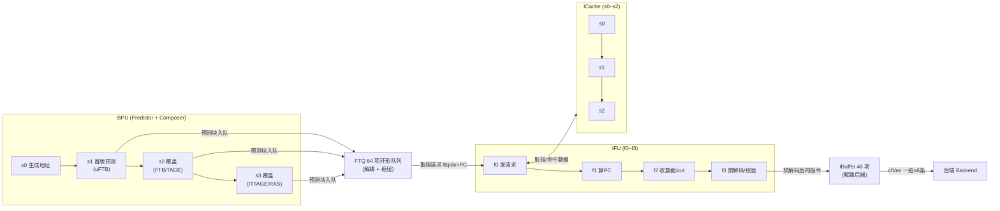
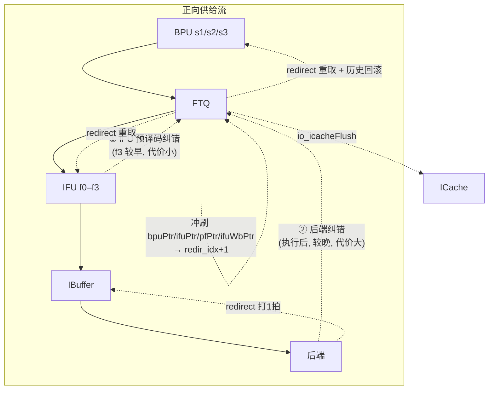
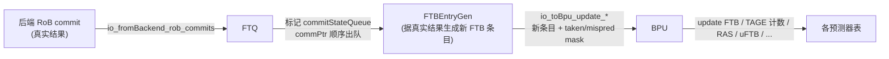
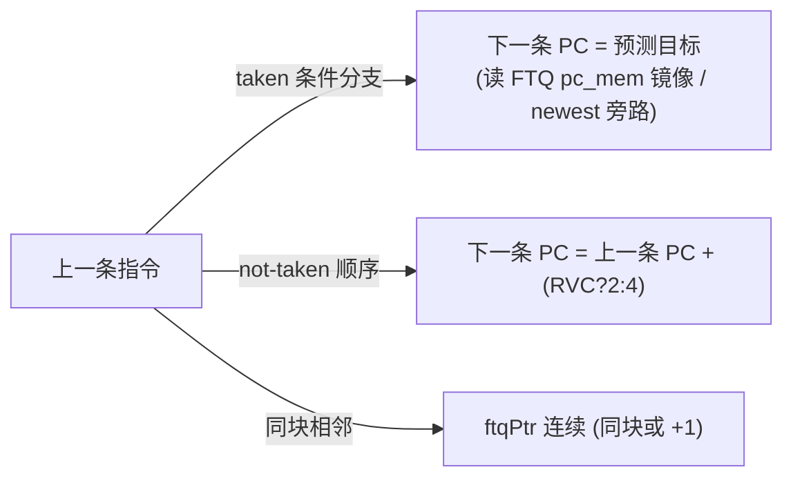

# 控制流回路与流水时序 —— 香山 V2R2 前端如何拼成一台机器

> 本文讲**全局协同与时序**：BPU / FTQ / IFU / ICache / IBuffer / 后端这些模块如何在时间轴上接力，
> 数据流与控制流如何在模块之间流动，以及三条回路（正向供给、纠错、训练）各自的路径与代价。
> **不重复单模块实现细节**——每个模块的微架构见各自文档：[Predictor](../Predictor.md)、[Ftq](../Ftq.md)、
> [NewIFU](../NewIFU.md)、[Frontend](../Frontend.md)；先建立全局认知请读总览 [FRONTEND_OVERVIEW](0-FRONTEND_OVERVIEW.md)，
> 预测器原理见 [BPU_PRINCIPLES](2-BPU_PRINCIPLES.md)，取指与缓存见 [ICACHE_FETCH_PRINCIPLES](3-ICACHE_FETCH_PRINCIPLES.md)，
> 共享数据结构（FTQ 项 / 指针 / FTB 条目）见 [DATA_STRUCTURES](5-DATA_STRUCTURES.md)。

前端的本质是一条**带反馈的投机流水线**：BPU 不停地猜下一段取哪，FTQ 把这些猜测排队、IFU 据此取指，
而当猜错或后端发现异常时，要冲刷错误路径、从正确地址重来。把这些模块拼成"一台机器"，关键就在于
理解 **一条正向流 + 两级纠错回路 + 一条训练回路**，以及 **FTQ 作为枢纽** 如何让这些回路共存而互不阻塞。

---

## 1. 全景：模块如何在时间轴上接力

各流水级（与共享事实卡一致；具体级内做什么见各模块文档）：

- **BPU**：`s0` 产生取指地址/请求 → `s1`/`s2`/`s3` 三级**覆盖式**预测（s1 最快，s2/s3 更准并可覆盖更早结果）。
- **ICache**：`s0`/`s1`/`s2` 主流水（查 meta → 取 data → 响应 IFU）。
- **IFU（NewIFU）**：`f0`（接 FTQ 请求、发 ICache 请求）/ `f1`（算各槽 PC）/ `f2`（收 ICache 数据、cut 指令）/
  `f3`（预解码 + RVC 展开 + 预测校验 + 送 IBuffer + 发 redirect），随后 `wb` 把预解码结果写回 FTQ。

要点：**BPU 与 IFU 不直接握手**——它们分别以自己的节奏推进，中间隔着 FTQ；**IFU 与后端也不直接握手**——
中间隔着 IBuffer。两个解耦缓冲（FTQ、IBuffer）让"猜得快"的 BPU、"取得有快有慢"的 ICache、"消费有阻塞"的后端
能各自流动，把彼此的气泡互相隐藏。

---

## 2. 正向供给流：从 s0 到指令进 IBuffer

一段指令从"决定取哪"到"进入后端可见的缓冲"，要走过下面这条接力链（每段都是带 valid/ready 的解耦握手，
任一下游不收，气泡向上回传）：

1. **BPU s0→s1→s3，预测块入队 FTQ**：BPU 每拍在 s0 产生一个起始 PC，经三级预测得到一个**预测块**
   （一段连续取指区间 + 末尾控制流去向）。s1 当拍即可给出第一版预测让取指尽快动起来，s2/s3 随后几拍
   若结论不同则**覆盖**（详见 §3.2 与 §5）。FTQ 用 `selectedResp` 按 s3>s2>s1 选最终入队结果，
   入队推进尾指针 `bpuPtr`（s2/s3 覆盖时 `bpuPtr` 回退到被覆盖块）。
2. **FTQ→IFU 取指请求**：FTQ 按取指头指针 `ifuPtr` 把队头块的 PC 发给 IFU 的取指请求口。
   为切关键路径，FTQ 的 PC 元信息**提前一拍**用"下一拍指针"去读 `ftq_pc_mem`（同步读 1 拍延迟），
   并对"刚由 BPU 写入、马上要被取"的块走 **bypass 旁路**，避免"先写存储再读出"的气泡（见 [Ftq](../Ftq.md) §5、
   [FtqPcMemWrapper](../FtqPcMemWrapper.md)）。
3. **IFU f0→ICache 取指**：IFU 在 f0 接请求、向 ICache 发取指；ICache `s0/s1/s2` 查 meta、取 data、
   返回数据；命中直接返回，未命中由 MissUnit 向 L2 取行（refill）。预取流水还会提前一拍以预取头指针 `pfPtr`
   把块发给 ICache 预取（取指与缓存细节见 [ICACHE_FETCH_PRINCIPLES](3-ICACHE_FETCH_PRINCIPLES.md)）。
4. **IFU f1→f3 预解码、送 IBuffer**：IFU 在 f1 算各槽 PC、f2 收数据并 cut 出取指槽、f3 做预解码 + RVC 展开
   + 预测校验，把指令排入 IBuffer。IBuffer 一次最多写入一个预测窗口（`PredictWidth=16`），由 `enqEnable` 掩码决定。
5. **IFU wb→FTQ 写回**：f3 之后 IFU 把预解码结果（brMask/jmpInfo/rvcMask 等）写回 FTQ 的 `ftq_pd_mem`，
   推进写回头指针 `ifuWbPtr`，并与预测时的 FTB 条目比对检测 **false-hit**。
6. **IBuffer→后端**：IBuffer 把暂存的指令以每拍最多 `DecodeWidth=6` 条供给后端译码。

**为什么要这两个解耦点**：

- **FTQ 解耦 BPU 与 IFU 的节奏**：BPU 一拍产一个预测块、节奏稳定；IFU 取指会因 ICache miss、跨 cacheline、
  MMIO 串行化等长短不一地停顿。若两者直连，任一方停顿都会立刻拖住另一方。FTQ 作为 64 项缓冲让 BPU 继续往前猜、
  IFU 慢慢消费，把取指延迟藏起来。
- **IBuffer 解耦 IFU 与后端**：取指可能突发（一拍来 16 条），译码可能阻塞（rename/dispatch 满）。IBuffer
  这个 48 项环形 FIFO 在取指快时暂存、译码快时连续供给，平滑前端到后端的吞吐差。

---

## 3. 三条回路

把上面的正向流放到顶部，前端真正复杂的地方在于叠加在它上面的两条反馈回路——纠错与训练。

### 3.1 正向供给流（上）

即 §2 的链路：`BPU(s1/s2/s3) → FTQ → IFU(f0–f3) ↔ ICache(s0–s2) → IBuffer → 后端`。
正常无误预测时只有这条流在跑，FTQ 各指针单调向前推进。

### 3.2 纠错回路（redirect）：两级纠错

预测会出错。香山用**两级 redirect**在不同时间点纠错，一早一晚，代价不同。两级都做同一件事的"骨架"：
**冲刷 FTQ 错误路径上的项，把取指相关指针回退到正确处，令 BPU/IFU 从正确地址重取**；区别在触发点、
冲刷范围与代价（气泡数）。

**① IFU 预译码纠错（早，代价小）**

- **在哪触发**：IFU 的 **f3** 级。预解码拿到真实分支信息后，用 PredChecker 比对 BPU 预测（方向/目标/范围）
  与实际指令；不符（如把一条非分支预测成 taken、目标算错、范围越界）时 IFU 发 redirect。详见 [NewIFU](../NewIFU.md) §3.3。
- **冲刷什么 / 从何处重取**：redirect 携带出错块的 ftqIdx 与 offset。FTQ 把 `ifuPtr/pfPtr/ifuWbPtr/bpuPtr`
  统一回到 `redir_idx + 1`（即"出错块之后"），并标记 `commitStateQueue` 把该块内被冲掉的槽置 flushed/empty；
  同时该项的 `cfiIndex`/`update_target`/`newest_entry` 被修正成真实结果（IFU-redirect 写 target 时对 **ret**
  指令用 RAS topAddr 替换，对应 golden 的 `ifuRedirectToBpu_target`）。BPU 随后从正确地址重新预测。
- **代价小的原因**：错误在指令**刚取回、还没进后端执行**时就被发现，只丢弃前端流水里那几拍取来的错误指令
  （f3 后还没进 IBuffer 被后端消费）。具体气泡拍数取决于预测与预译码之间的级差，**定性上是"几拍"量级**；
  具体见 [NewIFU](../NewIFU.md)、[Ftq](../Ftq.md)。

**② 后端纠错（晚，代价大）**

- **在哪触发**：后端**执行之后**。分支真实方向/目标与预测不符，或发现异常/访存违例时，后端经
  `io_fromBackend_redirect` 把 redirect（含 ftqIdx/offset/level/真实 target、以及 isCtrl/isMemVio 标志）送进 FTQ。
- **冲刷什么 / 从何处重取**：与 IFU-redirect 走同一套 FTQ 冲刷骨架（`ifuPtr/pfPtr/ifuWbPtr` 回到 `redir_idx+1`，
  `bpuPtr` 回到 `redir_idx+1`，标记 `commitStateQueue`），但**优先级更高**——FTQ 用 PriorityMux：
  `backendRedirect > fromIfuRedirect`（`rtl/frontend/Ftq.sv:1488-1495`）。`level` 区分 flushItself / flushAfter，
  决定出错槽本身是否一并冲刷。Frontend 顶层还把后端 redirect **打 1 拍**送 IBuffer 冲刷（区分控制流/访存违例两标志，
  以便正确回收 RAS、做统计；见 [Frontend](../Frontend.md) §4.A）。同时 FTQ 拉高 `io_icacheFlush` 冲刷 ICache 在途请求。
- **代价大的原因**：错误指令已经流过整条前端、进了后端流水甚至执行了一段，冲刷要丢弃的工作远多于 f3 纠错；
  且 BPU 的全局历史/折叠历史要回滚到该 redirect 对应的旧值再叠加真实结果（见 §5）。这是延迟最长、代价最大的一级。

**为什么要"两级"**：后端纠错虽然最终一定能纠正所有误预测，但代价最大。把"预解码就能发现的错"
（预测与指令本身明显矛盾，无需执行就知道错）提前到 f3 纠正，能在错误指令进入后端前就掐断错误路径，
省下大量后端冲刷代价。两级互补：f3 兜住"看指令就知道错"的，后端兜住"必须执行才知道错"的（方向/目标真值）。

### 3.3 训练回路（update）：commit → FTQ → 各预测器

预测要越来越准，得用真实执行结果训练预测器。这条回路从后端提交开始：

- **路径**：后端 RoB 逐条把提交信息送进 FTQ，FTQ 在 `commitStateQueue` 里把对应槽标 `committed`，
  提交头指针 `commPtr` 顺序出队（`robCommPtr` 跟踪 RoB 已提交位置）。当一个 FTQ 项的指令全部提交后，
  FTQ 据真实结果（命中/误预测/实际目标）经 `FTBEntryGen` 编码成要写回 FTB 的新条目（含 br/tail slot、
  压缩目标、strong_bias），连同 taken/mispred mask 经 `io_toBpu_update_*` 喂回 BPU；BPU 据此 update
  FTB 条目、TAGE 计数、RAS、uFTB 等。各预测器的 update 算法见 [BPU_PRINCIPLES](2-BPU_PRINCIPLES.md) 与各表文档。
- **时机**：update 发生在**提交时**（结果已确定、不再投机），所以训练用的是确定值，不会被冲刷污染——
  这也是为什么 update 走 commit 路径而非预测路径。FTQ 内部有 `bpu_ftb_update_stall` 小状态机协调 update 写回节奏。

---

## 4. FTQ 作为枢纽

把上面三条回路叠在一起就能看出：**它们都穿过 FTQ**。FTQ 不只是个队列，它是前端的中枢，
承担四件互相关联的事（实现细节见 [Ftq](../Ftq.md)）：

1. **解耦 BPU 与 IFU 的节奏**（§2）——BPU 入队、IFU 出队，各跑各的。
2. **承载纠错**——两级 redirect 都冲刷它、回退它的指针、修正它存的 cfiIndex/target。
3. **承载训练**——commit 在它这里落地，update 从它这里（经 FTBEntryGen）出发。
4. **存 PC 供重取**——它通过 `FtqPcMemWrapper` 多读口存着每个在飞预测块的 startAddr/目标/分支信息；
   redirect 后要从正确地址重取，正是靠读出这些存下来的 PC（见 [FtqPcMemWrapper](../FtqPcMemWrapper.md)）。

**指针体系如何协同与回退**：FTQ 是 64 项环形队列，所有指针都是 `CircularQueuePtr` = `{flag(1), value(6)}`，
flag 区分绕回（队列空/满、先后/距离比较都靠它）。正向时各指针单调推进、彼此保持 `bpuPtr ≥ ifuPtr/pfPtr ≥
ifuWbPtr ≥ commPtr` 的偏序：

| 指针 | 角色 | 正向推进 | 回退/回拉时机 |
|------|------|----------|---------------|
| `bpuPtr` | 入队尾 | enq fire +1 | s2/s3 覆盖回退到被覆盖块；redirect 回到 `redir_idx+1` |
| `ifuPtr`(+1/+2) | 取指头 | toIfu fire +1 | s2/s3 覆盖时**选择性回拉**；redirect 回到 `redir_idx+1` |
| `pfPtr`(+1) | 预取头 | toPrefetch fire +1 | 同 ifuPtr |
| `ifuWbPtr` | 写回头 | pdWb +1 | redirect 回退 |
| `commPtr`(+1) | 提交头（出队） | canMoveCommPtr +1 | 不回退（已提交不可撤） |
| `robCommPtr` | RoB 已提交位置 | 选最新有效 rob commit 的 ftqIdx | — |

回退的关键在 **谁该被回拉**：s2/s3 覆盖一个较早的块时，只有"已经超过该块"的 `ifuPtr/pfPtr` 才需回拉到覆盖点，
判据是 `!isBefore(ptr, idx)`，golden 展开为 `ptr.flag ^ idx.flag ^ (ptr.value >= idx.value)`，FTQ 以纯函数
`ptr_recover` 严格照此实现（`rtl/frontend/Ftq.sv:612`）。这里有个绕回陷阱：朴素的 `~isBefore` 在"异 flag 且
value 相等"处与 golden 反号，会让指针 flag 在绕回一拍后错位（数千拍后偶发失配）——这是本重写踩过并修正的坑
（见 [Ftq](../Ftq.md) §3、§7.1）。redirect（两级）则不分青红皂白把所有取指相关指针统一拉到 `redir_idx+1`，
优先级最高，覆盖 s2/s3 回拉（`rtl/frontend/Ftq.sv:1530-1538`）。

---

## 5. 状态维护与恢复：全局历史 / 折叠历史的回滚

BPU 的预测准确性高度依赖**历史**：TAGE/SC/ITTAGE 都用很长的分支历史索引各自的表。BPU 因此投机地维护：

- 一份 **256 位全局历史向量 ghv**（环形，按 `ghist_ptr` 偏移读写）；
- 每张预测表对应的**折叠历史 folded hist**（把长历史 XOR 折叠到表索引位宽）；
- ahead-fh-oldest-bits、ghist 指针等配套状态。

**为什么要维护**：预测是投机的——s1 给出预测时，更早分支的真实结果还没回来。BPU 必须用"截至当前的投机历史"
去索引各表，所以每拍都要把本次预测的分支结果推进进历史。每个比特可能有 4 个写源竞争（s1 预测 / s2 覆盖 /
s3 覆盖 / redirect 回滚），golden 为 256 比特各例化一个优先级 mux 按 `s1 > s2 > s3 > redirect` 选写。

**误预测时如何回滚**：一旦发生覆盖（s2/s3）或 redirect，沿错误路径推进的历史就是错的，必须恢复。
做法是把历史指针与折叠历史**恢复到该 redirect/覆盖对应的旧值，再叠加本次（正确的）分支结果**
（概念上 `updated_ptr = oldPtr - shift`、`oldFh.update(...)`）。这就是"回滚"。回滚正确与否直接决定
后续预测是否基于正确历史——是 BPU 预测正确性的关键。这套历史机器是纯数据通路扇出，实现保留在 BPU 的
wrapper 里、可读核不复制（见 [Predictor](../Predictor.md) §5）；折叠/索引细节属各预测器表，见 [BPU_PRINCIPLES](2-BPU_PRINCIPLES.md)。

> 注意区分两层"恢复"：**FTQ 指针回退**（§4，恢复"取到哪了"）与 **BPU 历史回滚**（本节，恢复"基于什么历史预测"）。
> 一次 redirect 同时触发两者：FTQ 把取指指针拉回正确块，BPU 把历史拉回正确点，二者配合才能从正确地址、
> 基于正确历史重新预测。

---

## 6. PC 连续性：Frontend 顶层的校验

把这么多模块、这么多回路拼起来，怎么知道"机器"确实自洽？前端**总顶层 Frontend** 里有一段**纯校验**逻辑
（不驱动任何对外功能输出）——跨取指块的 **PC 连续性一致性检查器**，是顶层唯一一段非平凡逻辑（见 [Frontend](../Frontend.md) §4.B）。

**它在检查什么**：指令离开 IBuffer 送往后端时（lane0..5 顺序排列），验证取指语义自洽——下一条指令的 PC
必须等于"上一条按其类型/预测推出的应有 PC"：

任一不符即触发断言。其意义在于：PC 连续性是 BPU→FTQ→IFU 整条链路正确性的**端到端不变量**——
如果 BPU 预测、FTQ 排队、IFU 取指/预解码这条链有任何环节出 bug（比如指针回退算错、目标算错、跨块拼接错），
最终都会表现为送给后端的指令流 PC 不连续。这段检查器因此是验证全局协同正确性的一道总闸。
它需要跨块状态（一个取指块的最后一条指令，其"下一条"在下一拍才出 IBuffer），故 latch 住块尾那条的
taken/not-taken、ftqPtr、PC、是否 RVC，下一拍再比；taken 目标的应有 PC 通过 FTQ `pc_mem` 的 64 项镜像
`checkPcMem` 按"目标块 ftqPtr+1"索引读出（块内 taken 目标走 newest 旁路规避写后读冒险，跨块版本直接读镜像，
具体边界见 [Frontend](../Frontend.md) §4.B）。

---

## 7. 一句话总结

前端 = **一条正向投机供给流**（BPU→FTQ→IFU↔ICache→IBuffer→后端，靠 FTQ 与 IBuffer 两个解耦缓冲互相隐藏气泡）
+ **两级纠错回路**（IFU f3 预译码纠错"早而轻"、后端纠错"晚而重"，都穿过 FTQ 冲刷重取，互补覆盖所有误预测）
+ **一条训练回路**（commit→FTQ→FTBEntryGen→各预测器 update，用确定的真实结果让预测越来越准）。
**FTQ 是这三条回路的共同枢纽**，**历史回滚**保证回路收敛到正确预测，**PC 连续性校验**则是整机协同正确的端到端不变量。
各模块"是什么、怎么实现"见 [Predictor](../Predictor.md) / [Ftq](../Ftq.md) / [NewIFU](../NewIFU.md) / [Frontend](../Frontend.md) 及
[FRONTEND_OVERVIEW](0-FRONTEND_OVERVIEW.md)。
