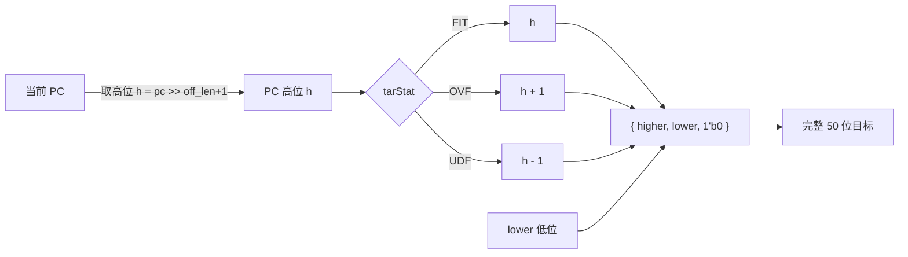
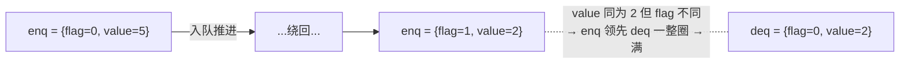

# 关键数据结构与编码 —— 前端跨模块的"通用语言"

> 本篇是香山 V2R2 昆明湖**前端**的背景/原理文档，讲**跨模块复用的关键数据结构与编码思想**：
> FTB 条目、折叠历史、CircularQueuePtr、预测 meta，以及饱和计数器/PLRU/ECC 这几个通用小结构。
> 这些结构在 BPU、FTQ、各预测器之间反复出现——读懂它们的"为什么这样编码"，才读得懂多个模块；
> 集中讲一次，省得在每个模块文档里重复。逐位实现细节以 `rtl/frontend/*_pkg.sv` 与各模块文档为准。
>
> 配套阅读：总览 [FRONTEND_OVERVIEW](0-FRONTEND_OVERVIEW.md)、姊妹篇 [BPU_PRINCIPLES](2-BPU_PRINCIPLES.md)
> / [CONTROL_FLOW_AND_TIMING](4-CONTROL_FLOW_AND_TIMING.md)。

---

## 1. 为什么要单独讲这些结构

香山前端是多模块协作的流水：BPU 出预测、FTQ 缓冲并纠错、IFU 取指预解码、提交时回放训练。
模块之间传递的不是裸地址和裸标志，而是几种被**精心压缩/编码**过的数据结构。它们的设计目标高度一致：

- **省 SRAM 面积**：BPU 表项数以万计，每一位的代价都被放大成千上万倍，所以宁可加一点重建逻辑也要压位宽。
- **缩关键路径**：长全局历史、完整地址的处理放在时序关键路径上代价高，于是预先折叠/预算。
- **可回放**：预测和训练相隔几十拍，需要一个能"带着走、原样回来"的随行元信息。

下面五节分别讲这几种"通用语言"。

---

## 2. FTB 条目编码（`ftb_pkg`）

源文件：`rtl/frontend/ftb_pkg.sv`（`ftb_slot_t` / `ftb_entry_t` + 目标编解码纯函数）。
被 [FauFTB](../FauFTB.md)、[FTB](../FTB.md)、[FTBEntryGen](../FTBEntryGen.md)、[Ftq](../Ftq.md) **共用同一份类型定义**，
避免类型在各模块分叉。

### 2.1 一个条目描述"一个取指块的控制流"

一个 FTB 条目刻画一段取指块（fetch block，最多 `PredictWidth=16` 条指令）里的控制流指令（CFI）
及其去向。一个块最多记录 `numBr=2` 个分支，用两个 slot + 几个标志表达：

| 字段 | 含义 |
|------|------|
| `brSlot`（slot0） | 第 1 个条件分支：块内 `offset` + 压缩目标 |
| `tailSlot`（slot1） | 块尾跳转 / 最后一个分支；可被"共享(`sharing`)"为第 2 个条件分支 |
| `pftAddr` / `carry` | fall-through 地址（顺序执行落到的下一块起点）的低位 + 进位 |
| `isCall` / `isRet` / `isJalr` | 块尾跳转的类型 |
| `last_may_be_rvi_call` | 块尾可能是横跨块边界的 RVI call（影响 fall-through 计算） |
| `strong_bias[2]` | 每个分支的"强偏置"——高方向置信，影响预测器是否更新 |

为什么是"两个槽 + 一个可共享的尾槽"？因为一个 16 条指令的块里条件分支不多，
绝大多数块 0～2 个分支就够覆盖；当块里恰好有 2 个条件分支、且没有独立的尾部跳转时，
就让 `tailSlot` 通过 `sharing=1` "兼职"第 2 个条件分支，省下再开一个槽的存储。

### 2.2 目标地址压缩：lower + tarStat

完整虚地址 `VADDR_BITS=50` 位。若每个 slot 都存完整目标，FTB 这种万级条目的 SRAM 面积会爆。
关键观察是：**一个 FTB 项服务的分支，目标多落在邻近地址**——和当前块的 PC 高位通常相同，
最多差一个块边界。于是 slot 不存完整目标，只存两样东西：

- `lower`：目标地址的**低位**。br 槽用 `BR_OFF_LEN=12` 位、tail 槽用 `JMP_OFF_LEN=20` 位
  （结构里 `lower` 统一按最大宽度 20 位声明，br 只用低 12 位、高位为 0）。
- `tarStat`：2 位，描述目标**高位相对当前 PC 高位**的状态：

| `tarStat` | 编码 | 含义 |
|---|---|---|
| `TAR_FIT` | `2'd0` | 目标高位 == PC 高位（最常见） |
| `TAR_OVF` | `2'd1` | 目标高位 = PC 高位 + 1（目标在更高的块） |
| `TAR_UDF` | `2'd2` | 目标高位 = PC 高位 − 1（目标在更低的块） |

取出时由 `get_target(pc, lower, tarStat, off_len)` 用 PC 的高位 `±tarStat` 重建完整 50 位目标。
等价于"高位用差分、低位直存"——把 50 位目标压到 `lower + 2 位`，省下大量 SRAM。



> **角落**：`get_target` 严格按 Chisel 的 `Mux1H` one-hot 语义实现——三个 `tarStat` 取值是三选一；
> 当 `tarStat` 为非法值（如 `2'b11`）时三项全不选，高位取 0。这是 FM 抓到、随机 UT 难覆盖的
> 边角，重建函数照此实现以保等价（见 [FTBEntryGen](../FTBEntryGen.md) §2）。
>
> **共享槽的"有效低位宽"**：`tailSlot` 若被共享为条件分支，其目标按 br 的 12 位低位宽
> （`eff_len(sharing, off_len)`）；否则按 tail 的 20 位。共享时目标也是邻近的条件分支目标，12 位够用。

### 2.3 fall-through 的编码

fall-through 是"块里没跳/跳之后顺序落到的下一块起点"。它也不存完整地址，而是存
`pftAddr`（块内 offset 低位，`OFFSET_W=4` 位）+ `carry`（是否跨块进位）；重建时
`{PC高位(carry?+1), pftAddr, 1'b0}`。同样利用"落点离当前块很近"的局部性。
落点非法（早于当前 PC、或超出一个取指块）时各模块会回退成 `pc + 0x20` 并置 `fallThroughErr`
（见 [FTB](../FTB.md) §3）。

### 2.4 一份类型，多处复用

`ftb_pkg` 把 `ftb_slot_t` / `ftb_entry_t` 和编解码纯函数（`calc_tarstat` / `calc_lower` / `get_target`）
集中定义，让四个模块说同一种"条目语言"：

- [FTB](../FTB.md) / FTBBank：预测读出条目后解码目标；更新时写回。
- [FauFTB](../FauFTB.md)：S1 零气泡微 FTB，用同样的条目格式以便和 FTB 互相覆盖/一致性比较。
- [FTBEntryGen](../FTBEntryGen.md)：提交时把真实结果**编码**成新条目（含压缩目标）。
- [Ftq](../Ftq.md)：缓存预测时的条目，用于 redirect / false-hit 比对，并调用 FTBEntryGen 训练。

---

## 3. 折叠历史（folded history）

被 [Tage_SC](../Tage_SC.md) / [TageTable](../TageTable.md) / [SCTable](../SCTable.md) / [ITTage](../ITTage.md) 复用。

### 3.1 为什么要把长历史"折叠"

TAGE/ITTAGE 这类预测器用**全局分支历史**（GHist）区分上下文。香山的全局历史长达
`HistoryLength=256` 位。但每张表只有几百~两千个 entry，索引位宽 `IDX_W` 不过 9~11 位、tag 也就 8 位左右。
直接拿长历史去索引存在两个问题：

- **位宽对不上**：直接截低位会丢掉远端历史信息，长历史相关性白白浪费。
- **时序/容量**：把长历史塞进索引/tag 计算路径，关键路径长；且历史每拍要"推进/回退"，全宽搬动代价大。

**折叠历史**的做法：把 `HIST_LEN` 位历史按目标宽度 `L` 切成若干 chunk，逐块**异或**压成 `L` 位。
这样既保留了全长历史的信息（每一位都参与了异或），又把宽度压到索引/tag 用得上的尺寸。
索引/tag 最终由 `pc>>1` 与折叠历史异或得到：

```
idx = (pc>>1) ^ idx_fh
tag = (pc>>1) ^ tag_fh ^ (alt_fh << 1)
```

### 3.2 idx_fh / tag_fh / alt_fh 的区别

同一张表需要**三份**不同宽度的折叠历史（见 [TageTable](../TageTable.md) §3.1）：

| 折叠历史 | 折叠目标宽度 | 用途 |
|---|---|---|
| `idx_fh` | `min(IDX_W, HIST_LEN)` | 折成**索引**位宽，定位 entry |
| `tag_fh` | `min(HIST_LEN, TAG_LEN)` | 折成 **tag** 位宽，参与 tag 校验 |
| `alt_fh` | `min(HIST_LEN, TAG_LEN-1)` | 第二份 tag 折叠，左移 1 位再异或进 tag |

为什么 tag 要两份（`tag_fh` + 错位的 `alt_fh`）？单一折叠在某些 PC/历史组合下容易"撞别名"，
用两个不同宽度、再相对错位异或，能打散别名、降低 tag 误命中率。索引只需一份，故只折一个宽度。
读路径直接吃外层算好的折叠历史端口（关键路径上不现折）；更新路径才用原始全局历史核内现折。

### 3.3 几何历史长度 8 / 13 / 32 / 119

TAGE-SC 有 4 张标签表，分别用**几何递增**的历史长度索引：**8 / 13 / 32 / 119** 拍
（见 [Tage_SC](../Tage_SC.md) / [TageTable](../TageTable.md) §1）。意图是用一组表覆盖从近到远的不同相关距离：

- **短历史表（8/13）**：捕捉近距离、强相关的分支模式，命中率高、收敛快。
- **长历史表（32/119）**：捕捉远距离上下文相关（如深层调用、循环外层条件），但占用慢、需要更多训练。

几何（而非线性）递增是经典 TAGE 折中：用较少的表（4 张）在对数尺度上铺开历史长度，
既覆盖很长的历史（119），又不用为每个长度都开一张表。预测时所有表并行查询，
外层选"命中且历史最长"的表作 provider；都不命中则回退基预测器。
ITTAGE 同理用几何历史（本工程 5 张表）做**间接跳转目标**预测（见 [ITTage](../ITTage.md)）。

> 折叠历史是"逻辑深表"压成"物理浅表"思路在历史维度上的对应；存储维度上的同类技巧见
> [../common/FoldedSRAMTemplate](../../common/FoldedSRAMTemplate.md)（把深而窄的逻辑 SRAM 折成浅而宽的物理阵列）。

---

## 4. CircularQueuePtr：`{flag, value}` 环形指针

被 [Ftq](../Ftq.md)（`FtqPtr`，7 位 = `{flag(1), value(6)}`，队列 64 项）等环形队列复用（IBuffer 等同理）。

### 4.1 多一个 flag 位解决"空 / 满 同址"

环形队列的经典难题：当读指针追上写指针时，到底是**空**还是**满**？两种情况下 `value` 都相等，
无法区分。CircularQueuePtr 的办法是在 `log2(深度)` 位的 `value` 之上再加 1 位 `flag`：

- `value`：在 `[0, 深度)` 内循环，是真正的入队下标。
- `flag`：每当 `value` 绕回（从最大值回到 0）就翻转一次，记录"已经绕了奇数还是偶数圈"。

于是 `{flag, value}` 单调递增（在 1 圈尺度内），两个指针即使 `value` 相等，也能靠 `flag` 区分先后。



### 4.2 空 / 满 / 先后 / 距离怎么判

设两个指针 `a`、`b`：

| 判定 | 表达 | 直觉 |
|---|---|---|
| **空** | `a == b`（flag、value 全等） | 同址同圈 |
| **满** | `a.flag != b.flag && a.value == b.value` | 同址但相差整整一圈 |
| **距离** | `a − b`（带 flag 的减法） | 在飞的项数 |
| **先后 isBefore** | 见下 | 谁在前 |

先后比较是最易踩坑的：判断 `ptr` 是否在 `idx` 之前，golden 展开为
`ptr.flag ^ idx.flag ^ (ptr.value >= idx.value)`（见 [Ftq](../Ftq.md) §3）。
这与朴素的 `~isBefore` 在"**异 flag 且 value 相等**"处结果不同——若按朴素式实现，
绕回一拍后指针 flag 会错位，表现为数千拍后偶发的 `ftqIdx_flag` 失配。FTQ 把这套运算收敛成
纯函数（`mk_ptr` / `ptr_add` / `ptr_dist` / `ptr_before` / `ptr_after` / `ptr_full` / `ptr_recover`），
严格照 golden 的展开式实现。

### 4.3 为什么利于误预测回退

误预测时要把多个指针（FTQ 里有 `bpuPtr` / `ifuPtr` / `pfPtr` / `ifuWbPtr` / `commPtr` 等）一起
**回退到** `redir_idx + 1`。有了 `{flag, value}`：

- 回退就是直接把目标 `{flag, value}` 赋给各指针——`flag` 一并带回，绕回关系自然正确，不会"回退后空/满判反"。
- "这个指针该不该回拉"用带 flag 的先后比较（`ptr_recover` / `!isBefore`）判定，跨绕回边界也对。

正因为 `flag` 把"绕了几圈"显式编码进了指针本身，冲刷/回退/重取这些**逆向**操作才能精确、无歧义——
这是 CircularQueuePtr 在纠错枢纽 FTQ 里的核心价值。

---

## 5. 预测 meta（516 bit）

源文件：`rtl/frontend/Composer.sv`（BPU Composer 把各预测器 meta 拼成大 meta）。

### 5.1 为什么要把各预测器 meta 串起来随预测块走

BPU 是多个预测器组合（uFTB / TAGE-SC / FTB / ITTAGE / RAS）。每个预测器在**预测时**都掌握一份
只有它自己看得懂的"我这次是怎么预测的"快照——provider 是哪张表、用的哪个 ctr、是否走了 altpred、
分配了哪个槽、阈值状态……这些信息在**提交训练时**才需要：要更新哪一项、往哪个方向调，全靠它。

但预测和提交相隔几十拍（要等指令真正执行完），中间还要过 FTQ 的环形缓冲。与其让每个预测器
自己存一套"在飞快照"，不如把各预测器的 `last_stage_meta` **按固定布局拼成一个大 meta**，
随预测块一起进 FTQ，提交时**原样回放**、再按同一布局拆回分发给各预测器。这就是 516 位预测 meta 的用途：
一个能"带着走、原样回来"的随行训练上下文。

### 5.2 516 位的布局

Composer 把 5 段有效 meta 从高到低拼接，高位补 0 填满 516（见 `Composer.sv` 第 124~138 行）：

| 段（高 → 低） | 宽度 | 来源 |
|---|---|---|
| 填充（高位补 0） | 107 | — |
| uFTB | 6 | [FauFTB](../FauFTB.md) |
| TAGE-SC | 144 | [Tage_SC](../Tage_SC.md) |
| FTB | 67 | [FTB](../FTB.md) |
| ITTAGE | 182 | [ITTage](../ITTage.md) |
| RAS | 10 | 返回地址栈 |

`6 + 144 + 67 + 182 + 10 = 409`，加 107 位填充 = **516**。
各段内部又是各预测器自定义的子布局，例如：

- TAGE-SC 的 144 位里打包了两个 bank 的 provider valid / 表序号 / ctr / useful、altUsed、basecnt、
  allocate one-hot、scPred、scCtrs，以及调试用 cycle、useAltOnNa 决策位（见 [Tage_SC](../Tage_SC.md) §2.4）。
- ITTAGE 的段里打包 provider/altProvider 的 valid/序号/ctr、altDiffers、allocate、
  以及两个 50 位目标快照等（见 [ITTage](../ITTage.md) §6）。

> **关键约束**：拼接与拆分必须用**完全相同**的位宽和偏移，否则提交侧会把 meta 解错、训练错项。
> 这也是把布局集中在 Composer / 各预测器文档里讲清楚的原因——它是预测器之间隐式的"接线协议"。
> 注意各预测器文档里出现的"516 位 meta"指的是**整块大 meta 的总宽**（高位补 0），而该预测器实际
> 只占其中固定的一段。

---

## 6. 通用小结构速览

这几个是反复出现的"零件"，各占一段。

### 6.1 饱和计数器（方向/置信）

几乎所有预测器的"置信度"都用**饱和计数器**表达：N 位计数，猜对则朝一端加、猜错则朝另一端减，
到边界（全 0 / 全 1）就**饱和不再溢出**。最高位即"方向/倾向"，靠近中点表示"弱置信"。例如：

- TAGE 表条目的 `ctr` 是 3 位饱和计数，最高位即预测方向；中点值 3/4 称 `unconf`（弱置信、新分配、未稳定），
  此时可能改用 altpred（见 [TageTable](../TageTable.md) §2、[Tage_SC](../Tage_SC.md) §2.1）。
- `useAltOnNa`（4 位）、SC 的 `scThresholds.ctr`（5 位）、RAS 的栈项计数等也是同类饱和计数。

饱和计数器在前端没有独立的 common 模块，而是直接内联在各预测器的更新逻辑里（饱和加减是几行组合逻辑）。
"为什么用它"：用少量位表达"有多确信"，并对偶发的反例有**惯性**（一次猜错不立刻翻向），过滤噪声。

### 6.2 PLRU（替换）

组相联结构选"淘汰哪一路"用**树形伪 LRU**（PseudoLRU）：用 `NUM_WAYS−1` 位的二叉树状态近似 LRU，
访问某路时把沿途节点指向"另一半边"，替换时沿树往下走到当前最久未用的路。它比真 LRU 省状态位、
易于做成纯组合选路，精度对预测器够用。详见 [../common/PlruReplacer](../../common/PlruReplacer.md)。

### 6.3 ECC code（meta/data 校验）

容量大的 SRAM 阵列（典型是 ICache 的 meta/data）给存储位附带 **ECC 校验码**：写入时算校验位、
读出时校验，能检出（并按设计纠正）位翻转。前端的 ECC 主要落在 ICache 一侧——
meta 阵列存 `tag/valid/ECC`、由专门的控制单元做 ECC 错误处理/注入（见
[ICacheMetaArray](../ICacheMetaArray.md)、[ICacheCtrlUnit](../ICacheCtrlUnit.md)、总览 [FRONTEND_OVERVIEW](0-FRONTEND_OVERVIEW.md)）。
BPU 的预测表多为"猜错可纠正、不影响正确性"的近似结构，通常不带 ECC——这也是预测存储和缓存存储
在可靠性诉求上的本质区别。

---

## 7. 小结

| 结构 | 编码核心思想 | 主要复用者 |
|---|---|---|
| FTB 条目 | 两槽 + 可共享尾槽；目标用 `lower + tarStat` 差分压缩；fall-through 用 `pftAddr+carry` | FauFTB / FTB / FTBEntryGen / FTQ |
| 折叠历史 | 长全局历史按目标宽度切块异或，压成索引/tag；几何长度 8/13/32/119 铺开相关距离 | Tage_SC / TageTable / SCTable / ITTage |
| CircularQueuePtr | `{flag, value}`，flag 记绕圈以区分空/满、定先后、保回退正确 | FTQ / IBuffer 等 |
| 预测 meta(516b) | 各预测器快照按固定布局拼接随块走，提交时原样回放训练 | BPU Composer ↔ FTQ ↔ 各预测器 |
| 饱和计数器 / PLRU / ECC | 少位表"置信"且有惯性 / 树状近似 LRU 选路 / 大 SRAM 检纠错 | 各预测器 / 组相联表 / ICache |

读懂这五类"通用语言"，再去看 [FTB](../FTB.md)、[FTBEntryGen](../FTBEntryGen.md)、[Tage_SC](../Tage_SC.md)、
[ITTage](../ITTage.md)、[Ftq](../Ftq.md) 等模块文档，就不会被反复出现的压缩编码绊住。
