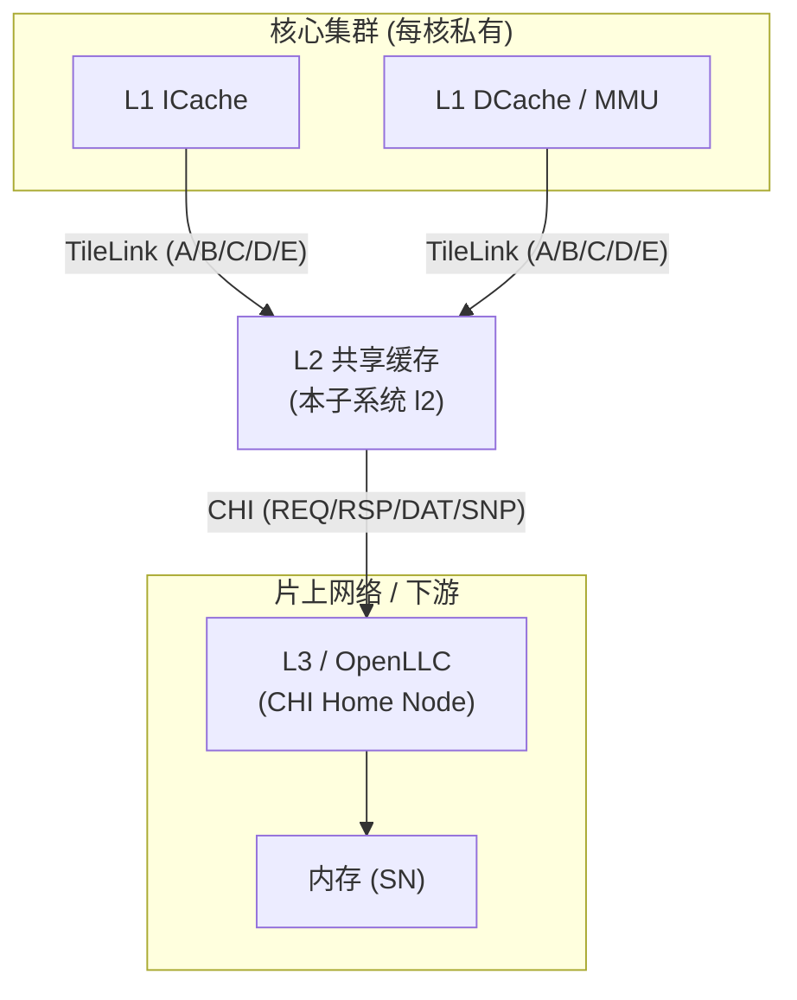
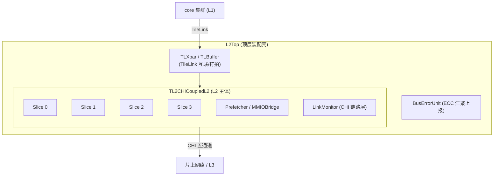
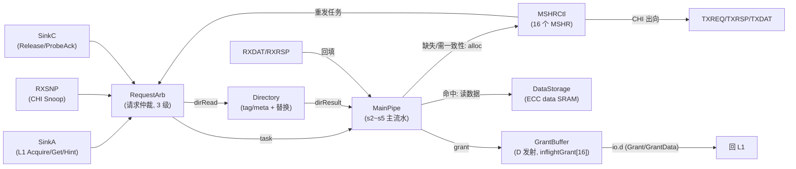

# L2 架构总览

> 本文是香山 V2R2 昆明湖 **L2 共享缓存(l2)** 子系统的**背景/原理**总览:先讲 L2 在片上层次里的位置与职责,再讲它由哪些块组成、请求怎样在其中流动,最后给出**模块清单 + 文档链接 + 建议阅读顺序**。它不重复各模块的端口/实现细节——那些在 `docs/l2/<Module>.md` 逐模块文档里。读模块文档前,先读本目录三篇背景篇(本篇 + `1-*` / `2-*` / `3-*`)建立整体认知。

## 1. L2 在片上层次里是什么

一颗现代多核处理器的片上访存层次,从核到内存大致是:

L2 处在**私有 L1 与 CHI 片上网络之间**,同时扮演两个角色:

- **共享缓存**:比 L1 大、被同一核簇内多个 L1 master(ICache / DCache / MMU 的 PTW / 预取)共享,吸收 L1 miss,减少下探到 L3/内存的次数。
- **一致性中枢**:向上以 **TileLink** 五通道(A/B/C/D/E)跟 L1 维持 MESI 类一致性——通过 B 通道下发 Probe、C 通道回收 ProbeAck/Release、D 通道下发 Grant;向下以 **CHI**(Coherent Hub Interface)接入 SoC 一致性网络,把本地无法满足的请求转成 CHI 事务(Acquire→ReadShared/ReadUnique 等),并处理来自网络的 CHI Snoop(经 RXSNP 进入,由 B 通道向 L1 传播)。

因此 L2 的核心工作可以概括成一句话:**把 L1 的 TileLink 请求,翻译成对本地目录/数据阵列的查询与更新,必要时转成 CHI 事务下探,并在两侧协议之间维持一致性**。

> 协议转换的另一半——L1 侧 TileLink 语义、CHI 侧 REQ/RSP/DAT/SNP 与链路层信用流控——见通道背景篇;本篇只讲整体结构与数据流。

## 2. 顶层组成:从 L2Top 到 slice

L2 子系统是一组自外向内的装配层。**由外到内**看:

- **L2Top**:最外层装配壳。把 CoupledL2 主体与一圈 TileLink 互联器件(TLXbar / TLBuffer / TLLogger)、**BusErrorUnit**(总线错误单元,汇聚 L2 的 ECC error 地址、上报本地中断给 PLIC)、BusPerfMonitor 拼起来,并把 L2 边界(core 侧 TL client 节点、CHI 总线、中断、PTW `l2_tlb_req`、trace、hartId、reset_vector、l2_hint)拉直对外。它自己不含 cache 逻辑,只做互联 + trace 打拍 + 中断/控制量直通。

- **TL2CHICoupledL2**:**L2 cache 的主体**。核心是 **4 个 slice(BANKS=4,按地址 bank 分片)**,每个 slice 是一个 bank 的完整 cache 流水;外围拼上 **Prefetcher**(预取器)、**MMIOBridge**(uncacheable 请求桥,绕过缓存)、CHI 各通道仲裁器(txreq/txrsp/txdat 等)、**LinkMonitor**(CHI 链路层监视:linkactive 握手 / lcredit 信用 / flit)、MBIST 自测分发,以及一段较重的顶层 glue——L2→L1 hint 与各 slice D 通道发射仲裁、Grant 节拍计数、48 路(4 slice × 12 事件)性能计数打拍、l2Miss 汇聚、CHI rx 五通道**按 bank 路由**(依 `txnID[10:9]` / snp `addr[4:3]` 选 bank)、CHI P-Credit 流水。
  - **分片(Slice / bank)的意义**:地址按低位 bank 号散列到 4 个 slice,使 4 条 cache 流水可**并行**服务不同 bank 的请求,提升吞吐、缓解目录/数据阵列端口压力。北侧 `auto_in_0..3` 是 4 个 TileLink client 节点,南侧 `io_chi_*` 是 CHI 五通道。

- **OpenLLC**:与 L2 并列的、**独立的外挂 L3 缓存 IP**(CHI home node/归属节点)。它自成一体:北侧接 core 集群(RN,Request Node),南侧接内存(SN,Subordinate Node);内部同样是 4 个 LLC slice(`Slice_4`,与 L2 的 slice 是**不同模块**)加 RN/SN 交叉开关(RNXbar/SNXbar)、MMIO 分流/合并(MMIODiverger/MMIOMerger)、CHI 链路监视。L2 通过 CHI 与它对接,但 OpenLLC 不在 L2 的装配层次内——本子系统的目录/通道叶子(SubDirectory、各 RX/TX、LCredit 转换器)被 L2 与 OpenLLC 两侧复用,故一并归在 l2 文档里。

## 3. 一个 slice 内部:cache 流水的心脏

单个 slice 才是真正做 cache 命中/缺失判定与一致性状态机的地方。它把请求仲裁、主流水、目录、数据阵列、MSHR、A/C 收 + D 发、CHI 收发六通道、refill/release 缓冲拼成一条流水线:

**数据流(以一次 L1 Acquire 为例):**

1. **入口 + 仲裁**:L1 的 TileLink A 请求进 `SinkA`;`RequestArb` 把 A/B/C/MSHR 重发四类请求按 **C > B > A、MSHR 优先于通道**合流,同拍向 `Directory` 发起目录读(`dirRead_s1`)。
2. **目录查询**:`Directory` 读 tag/meta SRAM,给出命中路/替换路与一致性态(该 bank 的 snoop filter 也在目录里)。
3. **主计算**:`MainPipe`(s2~s5，共 4 级)在 s3 拿到目录结果,判命中/一致性态(INVALID/BRANCH/TRUNK/TIP)→ 派发:
   - **命中且不需升级**:直接读 `DataStorage`,经 s5 发 Grant/GrantData。
   - **缺失 / 需要 T 权限 / 需 probe 上层 / cache alias**:在 s3 向 `MSHRCtl` 分配一个 **MSHR**(每 slice 16 个),由 MSHR 状态机驱动后续多拍事务。
4. **CHI 出向**:MSHR 经 `TXREQ/TXRSP/TXDAT` 把请求/响应/数据组装成 CHI flit 下发;若需先 probe 本地 L1,则经 `SourceB`(B 通道)下发 Probe、`SinkC` 回收 ProbeAck。
5. **回填**:下游数据经 `RXDAT`(CompData)进 refillBuffer、`RXRSP` 进响应通道,回喂 MainPipe 完成填充与目录写回。
6. **回上层**:`GrantBuffer` 把最终 Grant/GrantData 组成 TLBundleD 从 D 通道发回 L1,记 `inflightGrant`,等 L1 的 E 通道 GrantAck 清账;`inflightGrant` 表同时用于阻塞同址 Probe,防 Probe 抢跑未确认的 Grant。

**片外 Snoop(CHI→L1 方向)**对称:CHI Snoop 经 RXSNP 进入,当作 B 通道任务走 RequestArb→MainPipe,按 snoop 类型(SnpToB/SnpToN/SnpOnceX/…)判是否需降级上层 client、是否回数据,响应经 TXRSP/TXDAT 返回网络。

**单态化关键参数(以 slice 0 为准,来自 RTL `MainPipe_1` / `mshr_pkg` / `coupledl2_pkg`):**

| 参数 | 值 |
|------|----|
| bank 数 / slice 实例 | 4(`BANKS=4`) |
| 每 slice 关联度 ways | 8 |
| 每 slice sets | 512 |
| 每 slice MSHR 数 | 16 |
| block 大小 | 64 B(beatSize=2,每 beat 256 bit,GrantData/CHI DAT 两拍) |
| clientBits | 1 |
| 一致性态编码 | INVALID=0 / BRANCH=1 / TRUNK=2 / TIP=3 |

## 4. 模块清单与文档链接

下表为本子系统各模块的**背景定位 + 实现文档链接**。装配层(顶层壳)只做例化/互联/少量 glue;功能叶子承载真实逻辑。

### 装配层(顶层壳)

| 模块 | 角色 | 文档 | RTL |
|------|------|------|-----|
| L2Top | L2 顶层装配壳(CoupledL2 + TileLink 互联 + BEU + PMU) | [../L2Top.md](../L2Top.md) | [../../../rtl/l2/L2Top.sv](../../../rtl/l2/L2Top.sv) |
| TL2CHICoupledL2 | L2 主体(4 slice + 预取 + MMIO 桥 + CHI 仲裁/链路 + glue) | [../TL2CHICoupledL2.md](../TL2CHICoupledL2.md) | [../../../rtl/l2/TL2CHICoupledL2.sv](../../../rtl/l2/TL2CHICoupledL2.sv) |
| Slice | 一个 bank 的完整 cache 流水装配 | [../Slice.md](../Slice.md) | [../../../rtl/l2/Slice.sv](../../../rtl/l2/Slice.sv) |
| OpenLLC | 外挂 L3(CHI home node)装配层 | [../OpenLLC.md](../OpenLLC.md) | [../../../rtl/l2/OpenLLC.sv](../../../rtl/l2/OpenLLC.sv) |

### slice 内功能叶子

| 模块 | 角色 | 文档 | RTL |
|------|------|------|-----|
| RequestArb | 请求仲裁(A/B/C/MSHR 合流,启动目录读,3 级) | [../RequestArb.md](../RequestArb.md) | [../../../rtl/uncore/RequestArb.sv](../../../rtl/uncore/RequestArb.sv) |
| MainPipe | 主流水(s2~s5,命中/一致性判定/派发,数据通路心脏) | [../MainPipe.md](../MainPipe.md) | [../../../rtl/uncore/MainPipe_1.sv](../../../rtl/uncore/MainPipe_1.sv) |
| SubDirectory | 目录子块(self 目录 + snoop filter 的三级流水/选路/替换) | [../SubDirectory.md](../SubDirectory.md) | [../../../rtl/uncore/SubDirectory.sv](../../../rtl/uncore/SubDirectory.sv) |
| GrantBuffer | D 通道发射缓冲(Grant/GrantData/mergeA,inflightGrant,容量反压) | [../GrantBuffer.md](../GrantBuffer.md) | [../../../rtl/uncore/GrantBuffer.sv](../../../rtl/uncore/GrantBuffer.sv) |

### CHI / TileLink 通道适配叶子(L2 与 OpenLLC 两侧复用)

一篇文档统一覆盖 CHI 收发通道、CHI 链路层握手转换、透明监视器等 22 个叶子:

| 模块族 | 角色 | 文档 |
|--------|------|------|
| RXRSP / RXDAT / TXREQ / TXRSP / TXDAT(L2 侧) | CHI 收/发通道 flit 组装拆解 | [../CHIChannels.md](../CHIChannels.md) |
| RXREQ / RXRSP_4 / RXDAT_4 / TXSNP / TXREQ_4 / TXRSP_4 / TXDAT_4(OpenLLC 侧) | 同上,LLC 侧 | [../CHIChannels.md](../CHIChannels.md) |
| Decoupled2LCredit(_1/_2/_5) / LCredit2Decoupled(_1/_8/_10) | CHI 链路层 L-Credit 信用流控握手转换 | [../CHIChannels.md](../CHIChannels.md) |
| CHILogger / TLLogger | CHI / TileLink 透明监视器(综合时纯透传) | [../CHIChannels.md](../CHIChannels.md) |

> RTL 一览:CHI 通道叶子在 [../../../rtl/uncore/](../../../rtl/uncore/)(`RXDAT.sv` / `TXREQ.sv` / `TXDAT.sv` / `LinkMonitor.sv` / `LCredit2Decoupled*.sv` / `Decoupled2LCredit*.sv` 等);目录/流水/MSHR 叶子亦在同目录(`Directory.sv` / `SubDirectory*.sv` / `MSHRCtl.sv` / `MSHR.sv` / `SinkA.sv` / `SinkC.sv` / `SourceB.sv` / `DataStorage`→`L2DataStorage.sv` 等)。RXSNP、MSHRCtl 等尚有逐模块文档待补;以 RTL 为准。

## 5. 建议阅读顺序

1. **本目录背景篇**(先建立认知,再看实现):
   - `0-L2_OVERVIEW.md`(本篇):子系统位置、组成、数据流、模块地图。
   - `1-*` / `2-*` / `3-*`(一致性协议、目录与替换、CHI 通道与流控等背景篇——本目录后续文档)。
2. **装配层**:[../L2Top.md](../L2Top.md) → [../TL2CHICoupledL2.md](../TL2CHICoupledL2.md) → [../Slice.md](../Slice.md),自外向内看清层次与 glue 边界。
3. **slice 内数据通路**:[../RequestArb.md](../RequestArb.md) → [../MainPipe.md](../MainPipe.md) → [../SubDirectory.md](../SubDirectory.md) → [../GrantBuffer.md](../GrantBuffer.md),沿"请求进入→命中判定→目录→回上层"的顺序理解一次请求的全过程。
4. **协议边界**:[../CHIChannels.md](../CHIChannels.md),补齐 CHI 收发与链路层信用流控细节。
5. **相邻子系统**:[../OpenLLC.md](../OpenLLC.md)(下游 L3),以及公共库 [../../common/](../../common/) 里的 SRAM/仲裁器/队列等叶子。
