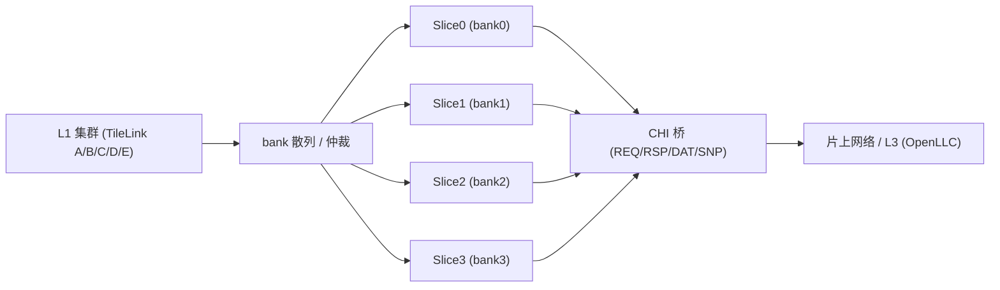
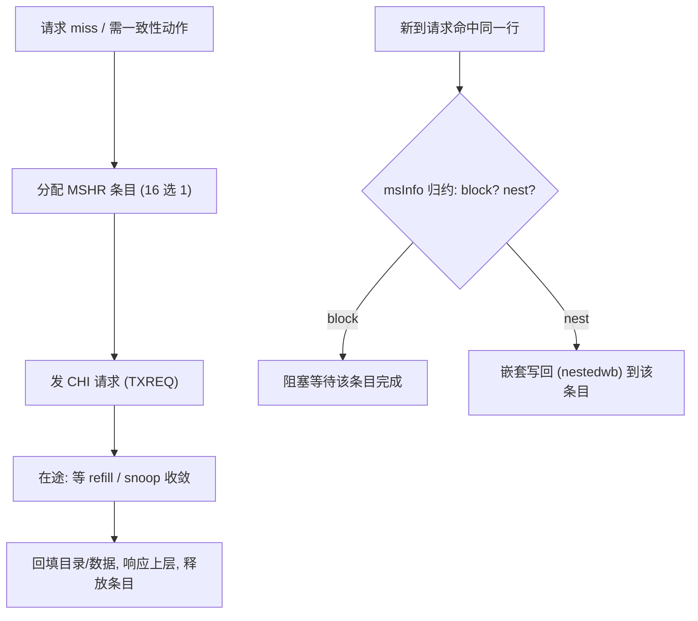

# L2 需求与设计目标

> 本文是香山 V2R2 昆明湖 **L2 共享缓存** 子系统的**背景/原理文档**:讲清 L2「要解决什么问题、为什么这么设计、几个关键决策的取舍」,让读者在翻阅逐模块设计文档([`../TL2CHICoupledL2.md`](../TL2CHICoupledL2.md)、[`../Slice.md`](../Slice.md)、[`../MainPipe.md`](../MainPipe.md) 等)之前先建立整体认知。实现细节(端口、状态机、逐拍时序)以模块文档与本地 RTL([`../../../rtl/l2/`](../../../rtl/l2/))为准,本文不重复。
>
> 姊妹背景文档见同目录 [`0-L2_OVERVIEW.md`](0-L2_OVERVIEW.md)(子系统总览)。

## 1. L2 是什么、在哪一层

L2 是**多核共享的二级缓存**,夹在 L1(每核私有,走 TileLink)与片上互联/L3(走 CHI)之间:

- **北侧对 core 集群**:以 **TileLink** 协议接多个 L1/PTW/ICache client(A/B/C/D/E 五通道)。
- **南侧对片上网络**:以 **CHI** 协议接 home node(本项目里是外挂 L3 [`OpenLLC`](../OpenLLC.md),再到内存)。

因此 L2 天然承担三重职责:

1. **多核共享缓存** —— 为多个 L1 提供更大、共享的一级下游缓存,吸收 L1 miss、减少访存往返。
2. **一致性目录** —— 作为其覆盖范围内的一致性交汇点,记录「哪些 L1 持有哪些行」,据此发起 probe/snoop、维护 MESI/MOESI 风格状态。
3. **协议桥接(TL↔CHI)** —— 把上层 TileLink 的 Acquire/Release/Probe 语义,翻译成下层 CHI 的 REQ/RSP/DAT/SNP 语义,反之亦然。这是 L2 相对纯私有 cache 最特殊的地方。

## 2. 设计目标

| 目标 | 手段(见后文关键决策) |
|------|----------------------|
| **容量与关联度** | 每 bank self cache **8 way × 512 set × 64B 行**(见 [`../MainPipe.md`](../MainPipe.md) 单态化参数),多 bank 叠加总容量 |
| **带宽** | **多 bank / Slice 分片**,请求按地址散列到 4 个并行 slice,聚合带宽 ≈ 4× 单流水 |
| **目录覆盖** | 目录分 **client 目录**(记 L1 持有,支撑向上 probe)+ **self 目录**(记本级 tag/meta),覆盖上下两侧一致性 |
| **非阻塞** | 每 slice **16 个 MSHR**(`NrMSHR=16`/`mshrsAll=16`,见 [`../../../rtl/l2/slice_pkg.sv`](../../../rtl/l2/slice_pkg.sv)),miss/probe/写回并发在途,流水不因一次 miss 停摆 |
| **可扩展互联** | 南侧用 **CHI** + **信用(L-Credit)流控**,与片上 RN/SN Xbar 解耦,链路层独立握手 |
| **一致的数据通路** | 64B 行以 **256b/beat × 2 beat** 传输(`TLDataW=256`),refill/release 各有专用缓冲 |

## 3. 关键决策

### ① Slice 分片提带宽

L2 主体 [`TL2CHICoupledL2`](../TL2CHICoupledL2.md) 里例化 **4 个 [`Slice`](../Slice.md)**(`slices_0..3`,`BANKS=4`,见 [`../../../rtl/l2/coupledl2_pkg.sv`](../../../rtl/l2/coupledl2_pkg.sv))。每个 slice 是**一个 bank 的完整 cache 流水**——自带请求仲裁 [`RequestArb`](../RequestArb.md)、主流水 [`MainPipe`](../MainPipe.md)、目录 `Directory`、数据阵列 `DataStorage`、MSHR 控制 `MSHRCtl`、CHI 收发六通道与 refill/release 缓冲。

- **为什么分片**:单条 cache 流水的目录读口/数据阵列口是带宽瓶颈。把地址空间按低位散列到 4 个 bank,4 条流水物理并行,聚合带宽近 4 倍,且各 bank 目录/数据 SRAM 独立、互不争用。
- **路由如何做**:请求按地址落到 bank;顶层 glue 在若干处按 bank 号做译码/回插——例如 CHI 接收侧按 `txnID[10:9]`(snoop 按 `addr[4:3]`)选 bank,B 通道输出把 bank 号插回地址(`{addr[45:6], 2'h<bank>, addr[5:0]}`)。分片对上层透明:L1 看到的仍是一个 L2。

### ② 目录分 client + self

一致性的核心是「谁持有这行、什么状态」。L2 每 bank 的 `Directory` 维护**两套元数据**:

- **self 目录**:本级 cache 自己的 tag + 一致性态。态编码 2 bit(`INVALID / BRANCH / TRUNK / TIP`,见 [`../MainPipe.md`](../MainPipe.md)),供命中判定与 MESI 状态转换。
- **client 目录**:记录**上层 L1 是否持有该行**(`clientBits=1`)。它使 L2 能在需要独占/替换/被 snoop 时,**向上发 probe** 收回 L1 副本;也用于检测 `cache_alias`(同物理行的不同虚拟别名)。

两者合一,L2 才能同时对**上**(经 client 目录 probe L1)和对**下**(经 self 目录响应 CHI snoop)维护一致性——这是共享 L2 区别于私有 cache 的关键。目录替换采用 DRRIP 类算法(在 coupledL2 `Directory` 内实现)。

> 说明:外挂 L3 [`OpenLLC`](../OpenLLC.md) 也采用「self 目录 + client 目录(snoop filter)」双子目录结构,但那是 CHI home node 侧的独立实现(见 [`../SubDirectory.md`](../SubDirectory.md),self=16 way PLRU、client=10 way random),与本文所述 L2 侧目录是两码事,勿混淆。

### ③ MSHR 处理嵌套(nested)请求

L2 是非阻塞的:一次 miss 分配一个 **MSHR** 条目跟踪其在途生命周期(发 CHI 请求→等 refill→回填目录/数据→响应上层),流水线继续服务后续请求。每 slice **16 个 MSHR** 支持高并发在途。

难点在于**并发请求会相互嵌套/阻塞**:同一 cache 行上,一个在途 acquire 可能撞上一个新到的 snoop,或撞上一个 replace/CMO。L2 用 MSHR 的 `msInfo` 做**嵌套/阻塞归约**:接收侧([`RXSNP`](../CHIChannels.md))与主流水对所有 16 个 MSHR 做 `reqBlock / cmoBlock / replaceBlock / replaceNest` 四类掩码,决定新请求是**阻塞等待**还是**嵌套写回(nestedwb)** 到已有条目上,保证同一行上的多个事务被正确串行化,一致性不被破坏。

### ④ CHI 信用(L-Credit)流控

南侧 CHI 是**信用驱动**的链路:发送方必须先获得对端授予的 L-Credit 才能发一个 flit。这样做的好处是**无阻塞、可组合**——链路层握手与上层流水解耦,便于跨 RN/SN Xbar 扩展。

L2 侧的实现要点:

- **链路层转换**:`Decoupled2LCredit`(发)/ `LCredit2Decoupled`(收)在内部 Decoupled 握手与 CHI L-Credit flit 之间转换,维护信用池、`linkactive` 状态机(`STOP/ACTIVATE/RUN/DEACTIVATE`),由 `LinkMonitor` 监视。
- **在途计数与门限**:发送通道用 `inflightCnt` 跟踪在飞 flit,配合 MSHR 空间门限(如 `noSpaceForMSHRReq`)反压上游,防止溢出。
- **P-Credit(pCrdGrant)**:顶层对 CHI 的 P-Credit 授予单独排队(`pCrdQueue`)与仲裁发射。

细节见 [`../CHIChannels.md`](../CHIChannels.md)。

## 4. 边界:与 L1 和片上网络的接口

L2 的两侧协议不同,边界必须讲清楚:

| 方向 | 协议 | 对端 | 说明 |
|------|------|------|------|
| **北 / 上行** | **TileLink**(A/B/C/D/E) | L1 / PTW / ICache client(`auto_in_0..3`) | Acquire/Get/Hint(A)、Probe(B)、Release/ProbeAck(C)、Grant(D)、GrantAck(E);另有 MMIO(uncacheable)请求桥旁路缓存 |
| **南 / 下行** | **CHI**(REQ/RSP/DAT/SNP + 链路层) | 片上网络的 home node,经 uncore 的 RN/SN Xbar 到 [`OpenLLC`](../OpenLLC.md)/内存 | 由 slice 内的 CHI 六通道 + 顶层链路层完成 TL↔CHI 语义翻译 |

- **对 L1(TileLink)**:L2 是 L1 的下游一致性管理者。L1 miss 走 A 通道 Acquire;L2 需要收回 L1 副本时走 B 通道 Probe;L1 逐出脏行走 C 通道 Release。L2 还会向 L1 发**预取 hint**(`l2_hint`,有效 `sourceId < 0x24`,见 `coupledl2_pkg.sv`)。
- **对片上网络(CHI)**:L2 作为 CHI 的 Request Node(RN),把 self miss 翻译成 CHI 请求发往 home node;并作为被 snoop 对象响应下行 SNP。片上 RN/SN Xbar 与 L3 属于 **uncore 子系统**,见 [`../../uncore/`](../../uncore/) 下相关文档。

顶层装配壳 [`L2Top`](../L2Top.md) 再把 L2 主体与 TileLink 互联器件(xbar/buffer/logger)、总线错误单元(BEU)、性能监视拼成完整子系统,并把中断/PTW/trace/hartId 等控制量拉直对外。

## 5. 从需求到模块:一张对照表

| 需求 | 承载模块 | 文档 |
|------|----------|------|
| L2 整体装配、TL↔CHI 桥、多 bank 阵列 | `TL2CHICoupledL2` | [`../TL2CHICoupledL2.md`](../TL2CHICoupledL2.md) |
| 单 bank 完整 cache 流水 | `Slice` | [`../Slice.md`](../Slice.md) |
| 请求入口仲裁(A/B/C/mshrTask) | `RequestArb` | [`../RequestArb.md`](../RequestArb.md) |
| 命中/一致性/派发主流水 | `MainPipe` | [`../MainPipe.md`](../MainPipe.md) |
| D 通道发射与 sink id 管理 | `GrantBuffer` | [`../GrantBuffer.md`](../GrantBuffer.md) |
| CHI 六通道 + 链路层信用流控 | 各 CHI 叶子 | [`../CHIChannels.md`](../CHIChannels.md) |
| 外挂 L3(CHI home node) | `OpenLLC` | [`../OpenLLC.md`](../OpenLLC.md) |
| L2 子系统顶层壳 | `L2Top` | [`../L2Top.md`](../L2Top.md) |

读完本文,建议接着看总览 [`0-L2_OVERVIEW.md`](0-L2_OVERVIEW.md),再按上表深入各模块。
